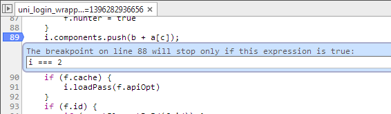
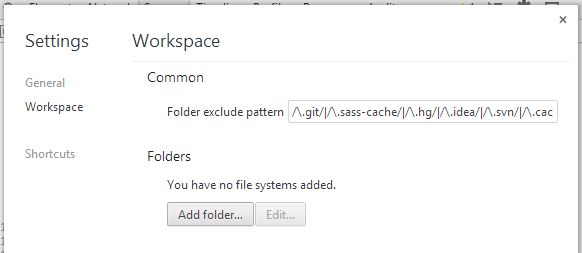
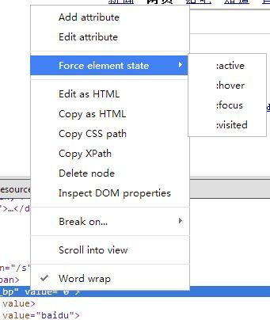
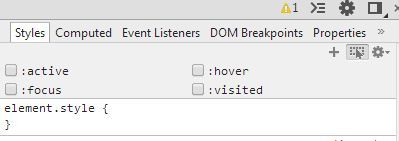

[Google的DevTools文档:](https://developers.google.com/chrome-developer-tools/?hl=zh-cn
)    
https://developers.google.com/chrome-developer-tools/?hl=zh-cn

##在Chrome控制台上比较有趣的命令。
- `$0` 可以在控制台输出在**Elements面板**选中的页面元素；
- `$_` 表示上一次在控制台键入的命令，你也可以用快捷键“上方向键”来达到同样的效果；
- `$x` 可以用xPath的语法来获取页面上的元素；

##sources面板
第一步就是打开Chrome开发工具的sources面板。

快捷键。

- ctrl+o 打开一个js文件 [mac:command+o]
- ctrl+p 同ctrl+o [mac:command+p]
- ctrl+f 查找当前js文件中的关键字 [mac:command+f]
- ctrl+shift+f 全局查找关键字 [mac:command+option+f]
- ctrl+shift+e 在控制台运行当前选中的代码片段 [mac:command+option+e]

###断点
给代码添加断点的方法有两种，在代码中写debugger和在source面板中鼠标单击添加断点。两者的不同点在于：鼠标单击的方式会在代码行数改变的时候无法定位到之前的位置，但可以在调试的过程中删除断点；debugger的方式不会因为代码行数改变而定位不到，但必须要刷新代码才能把断点删掉。

####条件判断
在断点的地方右键，选择“Edit breakpoint”就可以写上你想出现调试的条件表达式。

另外，当你在Chrome开发工具中配置了workspace之后，你就可以直接在source面板上编辑代码并保存代码了，相当方便。当然，这只针对本地开发的代码，对于线上的代码就无能为力了。

##element面板
###Force element state
右键菜单上的“Force element state”这个操作，就是强制设置该元素的状态。状态分为四种，分别是active/hover/focus/visited。强制设置状态在某些情况下比较的有用，例如你想查看某些hover伪类的样式，又例如元素里有隐藏的元素，需要在鼠标hover的时候才出现，但你的鼠标移开的时候hover状态就消失了，强制显示hover状态比较方便你检查元素hover的情况。

另外，在调试的过程中可以给元素添加断点。很神奇吧？现在支持的断点的状态有：元素的子节点结构改变时、元素的属性改变时、元素被删除时。在大型项目中，这一断点比较有意思。大型项目中的HTML结构都比较宏大，而且脚本在改变HTML接口的时候你又难以跟踪元素HTML的状态。使用断点，这些都不是问题。右键菜单中即可把这一功能呼唤出来。

###修改CSS样式
利用elements面板修改CSS样式是很简单的事情，但里面也有一些小窍门可以分享给大家。在CSS样式的属性值上，如果是数字的属性值，则可以通过按上下方向快捷键来给属性值加一，`通过按住shift键的同时按上下方向快捷键，可以给属性值递增十`。

同样，在elements面板的样式区域也可以给元素强制设置状态（active/hover/focus/visited）。做法和原理跟上面说的一样。

