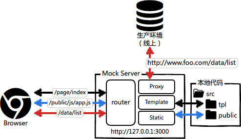

#Mock Server
为了更好的分工合作，让前端能在不依赖后端环境的情况下进行开发，其中一种手段就是为前端开发者提供一个web容器，这个本地环境就是 mock server。

要完整运行前端代码，通常并不需要完整的后端环境，我们只要在mock server中实现以下几点就行了：

1. 能渲染模板
- 实现请求路由映射
- 数据接口代理到生产或者测试环境

接口文档解决方案:

1. [Swagger](http://www.cnblogs.com/whitewolf/p/4686154.html)，写起来太费劲，修改接口的同时还需要修护文档，增加工作量。
- [RAP](http://rap.taobao.org/platform/home.do)，接口书写非常简单，非常容易上手，但没有在线测试接口的功能。
- Postman，测试就是文档，文档就是测试，无需维护成本。缺点是无法精确定义字段用处，只能靠字段名进行推测
- [mockjs](http://mockjs.com/)
