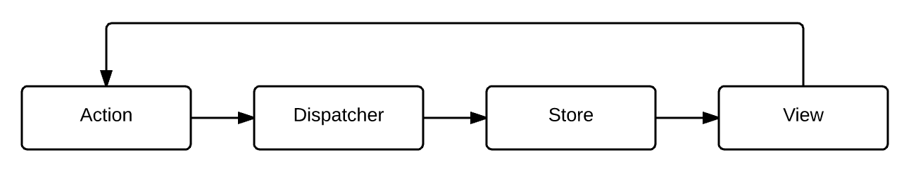

参考：

[Flux 架构入门教程](http://www.ruanyifeng.com/blog/2016/01/flux.html)

[flux github](https://github.com/facebook/flux)

#Flux
简单来说，Flux定义了一种单向数据流的方式，来实现View和Model之间的数据流动。Flux 是一种架构思想，专门解决软件的结构问题。它跟MVC 架构是同一类东西，但是更加简单和清晰。

核心都是单向数据流和单向数据绑定。

单向数据流详细流程：

在Flux中，View完全是Store的展现形式，Store的更新则完全由Action触发。得益于React的View每次更新都是整体刷新的思路，我们可以完全不必关心Store的变化细节，只需要监听Store的onChange事件，每次变化都触发View的re-render。

##基本概念
Flux将一个应用分成四个部分。

- View： 视图层
- Action（动作）：视图层发出的消息（比如mouseClick）
- Dispatcher（派发器）：用来接收Actions、执行回调函数
- Store（数据层）：用来存放应用的状态，一旦发生变动，就提醒Views要更新页面

Flux 的最大特点，就是数据的"单向流动"。

- 用户访问 View
- View 发出用户的 Action
- Dispatcher 收到 Action，要求 Store 进行相应的更新
- Store 更新后，发出一个"change"事件
- View 收到"change"事件后，更新页面

上面过程中，`数据总是"单向流动"，任何相邻的部分都不会发生数据的"双向流动"。`这保证了流程的清晰。

##Action
每个Action都是一个对象，包含一个actionType属性（说明动作的类型）和一些其他属性（用来传递数据）。

##Dispatcher
Dispatcher 的作用是将 Action 派发到 Store、。你可以把它看作一个路由器，负责在 View 和 Store 之间，建立 Action 的正确传递路线。注意，`Dispatcher 只能有一个，而且是全局的。`

Facebook官方的 [Dispatcher 实现](https://github.com/facebook/flux)输出一个类，你要写一个[AppDispatcher.js](https://github.com/ruanyf/extremely-simple-flux-demo/blob/master/dispatcher/AppDispatcher.js)，生成 Dispatcher 实例。

    // dispatcher/AppDispatcher.js
    var Dispatcher = require('flux').Dispatcher;
    module.exports = new Dispatcher();

AppDispatcher.register()方法用来登记各种Action的回调函数。

    // dispatcher/AppDispatcher.js
    var ListStore = require('../stores/ListStore');

    AppDispatcher.register(function (action) {
      switch(action.actionType) {
        case 'ADD_NEW_ITEM':
          ListStore.addNewItemHandler(action.text);
          ListStore.emitChange();
          break;
        default:
          // no op
      }
    })

Dispatcher 只用来派发 Action，不应该有其他逻辑。

##Store
Store 保存整个应用的状态。它的角色有点像 MVC 架构之中的Model 。

由于 Store 需要在变动后向 View 发送"change"事件，因此它必须实现事件接口。

	// stores/ListStore.js
	var EventEmitter = require('events').EventEmitter;
	var assign = require('object-assign');
	
	var ListStore = assign({}, EventEmitter.prototype, {
	  items: [],
	
	  getAll: function () {
	    return this.items;
	  },
	
	  addNewItemHandler: function (text) {
	    this.items.push(text);
	  },
	
	  emitChange: function () {
	    this.emit('change');
	  },
	
	  addChangeListener: function(callback) {
	    this.on('change', callback);
	  },
	
	  removeChangeListener: function(callback) {
	    this.removeListener('change', callback);
	  }
	});

##View和Store
在Flux架构中，View即React的组件，而Store则存储的是应用程序的状态。

>React是完全面向View的解决方案，它提供了一种始终都是整体刷新的思路来构建界面。在React的思路中，UI就是一个状态机，每个确定的状态对应着一个确定的界面。`对于一个小的组件，它的状态可能是在其内部进行维护；而对于多个组件组成的应用程序，如果某些状态需要在组件之间进行共享，则可以将这部分状态放到Store中进行维护`。

在官方提供的TodoMVC例子(https://github.com/facebook/flux/tree/master/examples/flux-todomvc/)中，Store的实现如下：

	var _todos = [];
	var TodoStore = assign({}, EventEmitter.prototype, {
	  /**
	   * Get the entire collection of TODOs.
	   * @return {object}
	   */
	  getAll: function() {
	    return _todos;
	  },
	
	  emitChange: function() {
	    this.emit(CHANGE_EVENT);
	  },
	  
	  addChangeListener: function(callback) {
	    this.on(CHANGE_EVENT, callback);
	  },
	
	  removeChangeListener: function(callback) {
	    this.removeListener(CHANGE_EVENT, callback);
	  }
	});

可以看到，一个Flux的Store就是一个能触发onChange事件的对象，能够让其它对象订阅（addChangeListener）或者取消订阅（removeChangeListener）。同时，它提供了一些API供View来获取自己需要的状态。因此，也可以将Store理解为需要被不同View共享的公用状态。

##Dispatcher，Action
Dispatcher就是负责分发不同的Action。在一个Flux应用中，只有一个中心的Dispatcher，所有的Action都通过它来分发。

典型的，Dispatcher有两个方法：

- dispatch：分发一个Action；
- register：注册一个Action处理函数。

这样，当View接受了一个用户的输入之后，通过Dispatcher来分发一个特定的Action，而对应的Action处理函数会负责去更新Store。因此，通常来说Action的处理函数会和Store放在一起，因为Store的更新都是由Action处理函数来完成的。

在Action处理函数中，不仅对Store进行了更新，还触发了Store的onChange事件，从而让所有监听组件能够得到通知。

通过Dispatcher和Action，实现了从View到Store的数据流，进而实现了整个Flux的单向数据流循环。

Dispatcher是全局唯一的，相当于是所有Action的总hub，而每个Action处理函数都能够收到所有的Action，至于需要对哪些进行处理，则由处理函数自己决定。

##Action Creators
Action Creators即Action的创建者。它们负责去创建具体的Action。一个Action可以由一个界面操作产生，也可以由一个Ajax请求的返回结果产生。为了让这部分逻辑更加清晰，让View更少的去关心数据流的细节，于是有了Action Creators。
