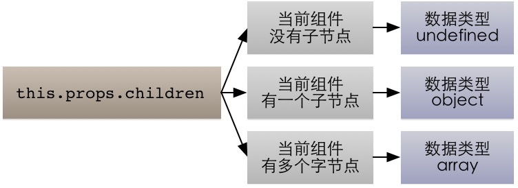

#React
##入门
###HTML模板

	<!DOCTYPE html>
	<html lang="en">
	<head>
	    <meta charset="UTF-8">
	    <title>react html模板</title>
	    <!--react.js 是 React 的核心库-->
	    
	    <!--react-dom.js 是提供与 DOM 相关的功能-->
	    
	    <!--Browser.js 的作用是将 JSX 语法转为 JavaScript 语法，
	    这一步很消耗时间，实际上线的时候，应该将它放到服务器完成。
	        $ babel src --out-dir build
	    上面命令可以将 src 子目录的 js 文件进行语法转换，转码后的文件全部放在 build 子目录。-->
	    
	</head>
	<body>
	

	<!--
	</body>
	</html>

###ReactDOM.render()
ReactDOM.render 是 React 的最基本方法，用于将模板转为 HTML 语言，并插入指定的 DOM 节点。

    ReactDOM.render(
      <h1>Hello, world!</h1>,
      document.getElementById('demo1')
    );

上面代码将一个 h1 标题，插入 example 节点.

###JSX 语法
HTML 语言直接写在 JavaScript 语言之中，不加任何引号，这就是 JSX 的语法，它允许 HTML 与 JavaScript 的混写.

    var names = ['张三', '李四', '王五'];
    ReactDOM.render(
    

    {
        names.map(function (name) {
            return 
 你好, {name}! 
;
        })
    }
    

    ,document.getElementById("demo1"));
	
上面代码体现了 **JSX 的基本语法规则：遇到 HTML 标签（以 `<` 开头），就用 HTML 规则解析；遇到代码块（以 `{` 开头），就用 JavaScript 规则解析。**

JSX 允许直接在模板插入 JavaScript 变量。如果这个变量是一个数组，则会展开这个数组的所有成员.

    var hs=[<h2>你好, 张三!</h2>,<h2>你好, 李四!</h2>];
    ReactDOM.render(
{hs}
,document.getElementById("demo1"));
    
###组件
React 允许将代码封装成组件（component），然后像插入普通 HTML 标签一样，在网页中插入这个组件。**React.createClass 方法就用于生成一个组件类**

    var HelloMessage = React.createClass({
        render: function () {
            return <h2> 你好, {this.props.name}! </h2>;
        }
    });

    ReactDOM.render(<HelloMessage name = "张三" />, document.getElementById("demo1"));	
    
上面代码中，变量 `HelloMessage` 就是一个组件类。模板插入 `<HelloMessage /> `时，会自动生成 `HelloMessage` 的一个实例（**下文的"组件"都指组件类的实例**）。**所有组件类都必须有自己的 `render` 方法，用于输出组件。**

注意，`组件类的第一个字母必须大写，否则会报错`，比如HelloMessage不能写成helloMessage。另外，`组件类只能包含一个顶层标签，否则也会报错`。

####this.props
组件的用法与原生的 HTML 标签完全一致，可以任意加入属性，比如 <HelloMessage name="张三"> ，就是 HelloMessage 组件加入一个 name 属性，值为 张三。组件的属性可以在组件类的 `this.props` 对象上获取，比如 name 属性就可以通过 this.props.name 读取。

**添加组件属性，有一个地方需要注意，就是 `class` 属性需要写成 `className` ，`for` 属性需要写成 `htmlFor` ，这是因为 class 和 for 是 JavaScript 的保留字。**

###this.props.children
**this.props 对象的属性与组件的属性一一对应，但是有一个例外，就是`this.props.children属性。它表示组件的所有子节点`。**

	var NotesList = React.createClass({
	  render: function() {
	    return (
	      <ol>
	      {
	        React.Children.map(this.props.children, function (child) {
	          return <li>{child}</li>;
	        })
	      }
	      </ol>
	    );
	  }
	});
	
	ReactDOM.render(
	  <NotesList>
	    hello
	    world
	  </NotesList>,
	  document.body
	);

**这里需要注意， this.props.children 的值有三种可能：如果当前组件没有子节点，它就是 undefined ;如果有一个子节点，数据类型是 object ；如果有多个子节点，数据类型就是 array 。所以，处理 this.props.children 的时候要小心。**

####React.Children.map
React 提供一个工具方法 React.Children 来处理 this.props.children 。我们可以用 React.Children.map 来遍历子节点，而不用担心 this.props.children 的数据类型是 undefined 还是 object。

###PropTypes
组件的属性可以接受任意值，字符串、对象、函数等等都可以。有时，我们需要一种机制，验证别人使用组件时，提供的参数是否符合要求。

组件类的**PropTypes属性，就是用来验证组件实例的属性是否符合要求**。

    var MyTitle = React.createClass({
      propTypes: {
        title: React.PropTypes.string.isRequired,
      },

      render: function() {
         return <h1> {this.props.title} </h1>;
       }
    });

上面的Mytitle组件有一个title属性。PropTypes 告诉 React，这个 title 属性是必须的，而且它的值必须是字符串。

####getDefaultProps方法
**getDefaultProps 方法可以用来设置组件属性的默认值。**

    var MyTitle = React.createClass({
      getDefaultProps : function () {
        return {
          title : 'Hello World'
        };
      },

      render: function() {
         return <h1> {this.props.title} </h1>;
       }
    });

    ReactDOM.render(
      <MyTitle />,
      document.body
    );

上面代码会输出"Hello World"。
 
###获取真实的DOM节点
`ref` 属性获取组件真实 DOM 的节点。

    var MyComponent = React.createClass({
      handleClick: function() {
        this.refs.myTextInput.focus();
      },
      render: function() {
        return (
          

            <input type="text" ref="myTextInput" />
            <input type="button" value="Focus the text input" onClick={this.handleClick} />
          

        );
      }
    });

    ReactDOM.render(
      <MyComponent />,
      document.getElementById('example')
    );

上面代码中，组件 MyComponent 的子节点有一个文本输入框，用于获取用户的输入。这时就必须获取真实的 DOM 节点，虚拟 DOM 是拿不到用户输入的。为了做到这一点，文本输入框必须有一个 ref 属性，然后 `this.refs.[refName]` 就会返回这个真实的 DOM 节点。

需要注意的是，**由于 this.refs.[refName] 属性获取的是真实 DOM ，所以必须等到虚拟 DOM 插入文档以后，才能使用这个属性，否则会报错。**上面代码中，通过为组件指定 Click 事件的回调函数，确保了只有等到真实 DOM 发生 Click 事件之后，才会读取 this.refs.[refName] 属性。

###this.state
组件免不了要与用户互动，React 的一大创新，就是**将组件看成是一个状态机，一开始有一个初始状态，然后用户互动，导致状态变化，从而触发重新渲染 UI**。

    var LikeButton = React.createClass({
      getInitialState: function() {
        return {liked: false};
      },
      handleClick: function(event) {
        this.setState({liked: !this.state.liked});
      },
      render: function() {
        var text = this.state.liked ? 'like' : 'haven\'t liked';
        return (
          

            You {text} this. Click to toggle.
          

        );
      }
    });

    ReactDOM.render(
      <LikeButton />,
      document.getElementById('example')
    );

上面代码是一个 LikeButton 组件，它的 `getInitialState` 方法用于定义初始状态，也就是一个对象，这个对象可以通过 `this.state属性读取` 。当用户点击组件，导致状态变化，`this.setState方法就修改状态值`，**每次修改以后，自动调用 `this.render` 方法，再次渲染组件**。

> 由于 this.props 和 this.state 都用于描述组件的特性，可能会产生混淆。一个简单的区分方法是，`this.props 表示那些一旦定义，就不再改变的特性，而 this.state 是会随着用户互动而产生变化的特性。` 

> **每一个React组件都有自己的 state，其与 props 的区别在于 `state只存在组件的内部，props 在所有实例中共享。` **

>**this.props任何引用类型的值(如数组，对象),都会在所有实例中共享，而不是每个组件实例拥有单独的副本，所以不要在组件实例中去修改 props，把它当成只读的数据最好。 **

###getInitialState、getDefaultPops方法
getInitialState 和 getDefaultPops 的调用是有区别的，getDefaultPops 是对于`组件类`来说只调用一次，后续该类的应用都不会被调用，而 getInitialState 是对于每个`组件实例`来讲都会调用，并且只调一次。

###组件的生命周期
组件的生命周期分成三个状态：

- Mounting：已插入真实 DOM
- Updating：正在被重新渲染
- Unmounting：已移出真实 DOM

React 为每个状态都提供了两种处理函数，`will 函数在进入状态之前调用`，`did 函数在进入状态之后调用`，三种状态共计五种处理函数。

- componentWillMount()
- componentDidMount()
- componentWillUpdate(object nextProps, object nextState)
- componentDidUpdate(object prevProps, object prevState)
- componentWillUnmount()

此外，React 还提供两种特殊状态的处理函数。

- componentWillReceiveProps(object nextProps)：已加载组件收到新的参数时调用
- shouldComponentUpdate(object nextProps, object nextState)：组件判断是否重新渲染时调用

###Ajax
组件的数据来源，通常是通过 Ajax 请求从服务器获取，可以使用 componentDidMount 方法设置 Ajax 请求，等到请求成功，再用 this.setState 方法重新渲染 UI。

    var UserGist = React.createClass({
      getInitialState: function() {
        return {
          username: '',
          lastGistUrl: ''
        };
      },

      componentDidMount: function() {
        $.get(this.props.source, function(result) {
          var lastGist = result[0];
          if (this.isMounted()) {
            this.setState({
              username: lastGist.owner.login,
              lastGistUrl: lastGist.html_url
            });
          }
        }.bind(this));
      },

      render: function() {
        return (
          

            {this.state.username}'s last gist is
            <a href={this.state.lastGistUrl}>here</a>.
          

        );
      }
    });

    ReactDOM.render(
      <UserGist source="https://api.github.com/users/octocat/gists" />,
      document.body
    );

上面代码使用 jQuery 完成 Ajax 请求，这是为了便于说明。React 本身没有任何依赖，完全可以不用jQuery，而使用其他库。

##详解
组件挂载之后，每次调用setState后都会调用shouldComponentUpdate判断是否需要重新渲染组件。默认返回true，需要重新render。在比较复杂的应用里，有一些数据的改变并不影响界面展示，可以在这里做判断，优化渲染效率。

###在react中，触发render的有4条路径。
**以下假设shouldComponentUpdate都是按照默认返回true的方式。**

- 首次渲染Initial Render
- 调用this.setState （并不是一次setState会触发一次render，React可能会合并操作，再一次性进行render）
- 父组件发生更新（一般就是props发生改变，但是就算props没有改变或者父子组件之间没有数据交换也会触发render）
- 调用this.forceUpdate

###生命周期
一个React组件的生命周期分为三个部分：

- 实例化
- 存在期
- 销毁时

####实例化
当组件在`客户端被`实例化，`第一次`被创建时，以下方法依次被调用：

1. getDefaultProps
- getInitialState
- componentWillMount
- render
- componentDidMount (*注：该方法不会在服务端被渲染的过程中调用*)

#####getDefaultProps
**`对于组件类来说只调用一次，该组件类的所有后续应用`，getDefaultPops 将不会再被调用，其返回的对象可以用于设置默认的 props 值。**

	var Hello = React.creatClass({
	    getDefaultProps: function(){
	        console.log("Hello getDefaultProps");
	    },
	    render: function(){
	        return 
Hello
;
	    }
	});
	
只定义Hello组件类，不进行任何实例化(挂载)，getDefaultProps被调用，且以后不再被调用。

getDefaultProps 设置 props 值：

	var Hello = React.creatClass({
	    getDefaultProps: function(){
	        return {
	            name: 'pomy',
	            git: 'dwqs'
	        }
	    },
	
	    render: function(){
	        return (
	            
Hello,{this.props.name},git username is {this.props.dwqs}

	        )
	    }
	});

	ReactDOM.render(<Hello />, document.body);

也可以在挂载组件的时候设置 props：

	var data = [{title: 'Hello'}];
	<Hello data={data} />

或者调用 setProps （一般不需要调用）来设置其 props：

	var data = [{title: 'Hello'}];
	var Hello = React.render(<Demo />, document.body);
	Hello.setProps({data:data});
	
> 但只能在子组件或组件树上调用 setProps。别调用 this.setProps 或者 直接修改 this.props。将其当做只读数据。

#####getInitialState
对于`组件的每个实例`来说，这个方法的调用**有且只有一次**，用来初始化每个实例的 state，在这个方法里，可以访问组件的 props。每一个React组件都有自己的 state，其与 props 的区别在于 `state只存在组件的内部，props 在所有实例中共享`。

>getInitialState 和 getDefaultPops 的调用是有区别的，getDefaultPops 是对于`组件类`来说只调用一次，后续该类的应用都不会被调用，而 getInitialState 是对于每个`组件实例`来讲都会调用，并且只调一次。

`每次修改 state，都会重新渲染组件，实例化后通过 state 更新组件`，会依次调用下列方法：

1. shouldComponentUpdate(object nextProps, object nextState)
- conponentWillUpdate(object nextProps, object nextState)
- render
- conponentDidUpdate(object prevProps, object prevState)

但是**不要直接修改 this.state，要通过 this.setState 方法来修改**。

#####componentWillMount
>`在首次渲染执行前`立即调用且仅调用一次。`如果在这个方法内部调用 setState 并不会触发重新渲染，这也是在 render 方法调用之前修改 state 的最后一次机会。`

#####render
该方法会`创建一个虚拟DOM`，用来表示组件的输出。对于一个组件来讲，`render方法是唯一一个必需的方法`。render方法需要满足下面几点：

- 只能通过 this.props 和 this.state 访问数据（不能修改）
- 可以返回 null,false 或者任何React组件
- 只能出现一个顶级组件，不能返回一组元素
- 不能改变组件的状态
- 不能修改DOM的输出

**render方法返回的结果并不是真正的DOM元素，而是一个虚拟的表现，类似于一个DOM tree的结构的对象。**react之所以效率高，就是这个原因。

#####componentDidMount
该方法不会在服务端被渲染的过程中调用。`该方法被调用时，已经渲染出真实的 DOM`，可以再该方法中通过 `ReactDOM.findDOMNode(this)` 访问到真实的 DOM。

	var data = [..];
	var comp = React.createClass({
	    render: function(){
	        return <imput .. />
	    },
	    conponentDidMount: function(){
	        $(ReactDOM.findDOMNode(this)).autoComplete({
	            src: data
	        })
	    }
	})

由于组件并不是真实的 DOM 节点，而是存在于内存之中的一种数据结构，叫做虚拟 DOM （virtual DOM）。只有当它插入文档以后，才会变成真实的 DOM 。有时**需要从组件获取真实 DOM 的节点，这时就要用到 ref 属性**：

	var Area = React.createClass({
	    render: function(){
	        ReactDOM.findDOMNode(this); //render调用时，组件未挂载，这里将报错
	        return <canvas ref='mainCanvas'>
	    },
	    componentDidMount: function(){
	        var canvas = ReactDOM.findDOMNode(this.refs.mainCanvas);
	        //这是有效的，可以访问到 Canvas 节点
	    }
	})

*需要注意的是，由于 this.refs.[refName] 属性获取的是真实 DOM ，所以必须等到虚拟 DOM 插入文档以后，才能使用这个属性，否则会报错。*

####存在期
**此时组件已经渲染好并且用户可以与它进行交互**，比如鼠标点击，手指点按，或者其它的一些事件，导致应用状态的改变，你将会看到下面的方法依次被调用

1. componentWillReceiveProps(object nextProps)
- shouldComponentUpdate(object nextProps, object nextState)
- componentWillUpdate(object nextProps, object nextState)
- render
- componentDidUpdate(object prevProps, object prevState)

#####componentWillReceiveProps(nextProps)
`组件的 props 属性可以通过父组件来更改，这时，componentWillReceiveProps 将来被调用。`可以在这个方法里更新 state,以触发 render 方法重新渲染组件。

    var Fruit = React.createClass({
        getDefaultProps: function () {
            return {
                name: "水果",
                number: 0
            };
        },
        componentWillReceiveProps: function (nextProps) {
            console.log(this.props.name+" Fruit componentWillReceiveProps(object nextProps)");
            console.log(nextProps)
        },
        render: function () {
            console.log(this.props.name+" Fruit render()");
            return 
{this.props.name} 共 {this.props.number} 个 
;
        }
    });

    var Basket = React.createClass({
        getInitialState: function () {
            return {
                number:1
            };
        },
        handlerClick:function(){
            this.setState({
                number: this.state.number + 1
            });
        },
        render: function () {
            console.log("Basket render()");
            return (
                

                    <Fruit name="苹果" number={this.state.number}/>
                

            );
        }
    });

    ReactDOM.render(<Basket></Basket>, document.getElementById("demo"));
    
触发点击事件，控制台输出：

	Basket render()
	苹果 Fruit componentWillReceiveProps(object nextProps)
	Object {name: "苹果", number: 2}
	苹果 Fruit render()

#####shouldComponentUpdate(nextProps, nextState)
如果你确定组件的 props 或者 state 的改变不需要重新渲染，可以通过在这个方法里通过返回 false 来阻止组件的重新渲染，返回 `false 则不会执行 render 以及后面的 componentWillUpdate，componentDidUpdate 方法。

>通常不需要使用以避免出现bug。在出现应用的瓶颈时，可通过该方法进行适当的优化。在首次渲染期间或者调用了forceUpdate方法后，该方法不会被调用.

该方法是非必须的，并且大多数情况下没有在开发中使用。

	var Basket = React.createClass({
        getInitialState: function () {
            return {
                number: 1
            };
        },
        shouldComponentUpdate: function (nextProps, nextState) {
            console.log("Basket shouldComponentUpdate");
            return true;//return false 则不更新组件
        },
        handlerClick: function () {
            this.setState({
                number: this.state.number + 1
            });
        },
        componentWillUpdate: function (nextProps, nextState) {
            console.log("Basket componentWillUpdate");
        },
        render: function () {
            console.log("Basket render");
            return 
点击加1: {this.state.number}
;
        },
        componentDidUpdate: function (prevProps, prevState) {
            console.log("Basket componentDidUpdate");
        }
    });

    ReactDOM.render(<Basket></Basket>, document.getElementById("demo"));
    
触发点击事件，控制台输出：
 
	Basket shouldComponentUpdate
	Basket componentWillUpdate
	Basket render
	Basket componentDidUpdate

#####componentWillUpdate(nextProps, nextState)
这个方法和 componentWillMount 类似，在组件接收到了新的 props 或者 state 即将进行重新渲染前，componentWillUpdate(object nextProps, object nextState) 会被调用，`注意不要在此方面里再去更新 props 或者 state`。

#####componentDidUpdate(prevProps, prevState)
这个方法和 componentDidMount 类似，在组件重新被渲染之后，componentDidUpdate(object prevProps, object prevState) 会被调用。`可以在这里访问并修改 DOM。`

####销毁时
#####componentWillUnmount
每当React使用完一个组件，这个组件必须从 DOM 中卸载后被销毁，此时 componentWillUnmout 会被执行，完成所有的清理和销毁工作，`在 conponentDidMount 中添加的任务都需要再该方法中撤销`，如创建的定时器或事件监听器。

当再次装载组件时，以下方法会被依次调用：

1. getInitialState
- componentWillMount
- render
- componentDidMount

 
参考：

[React中文API](http://reactjs.cn/react/docs/getting-started.html)

[React 常用面试题目与分析](http://mp.weixin.qq.com/s?__biz=MzAxODE2MjM1MA==&mid=2651551676&idx=2&sn=b5d36019c22f1d55eb9cb085313321b2&chksm=8025a07db752296b785af57fff026ddfa6161b3b974fe72ea413d5ab64e46afac991b052cdc3&mpshare=1&scene=23&srcid=0204bPDupBXgKEnYSVqQuLhu#rd)

[React Native填坑之旅](http://blog.csdn.net/future_challenger/article/category/6410836)

[React 入门实例教程](http://www.ruanyifeng.com/blog/2015/03/react.html)

[React 技术栈系列教程](http://www.ruanyifeng.com/blog/2016/09/react-technology-stack.html)

[Flux 架构入门教程](http://www.ruanyifeng.com/blog/2016/01/flux.html)

[Redux 入门教程（一）：基本用法](http://www.ruanyifeng.com/blog/2016/09/redux_tutorial_part_one_basic_usages.html)

[Redux 入门教程（二）：中间件与异步操作](http://www.ruanyifeng.com/blog/2016/09/redux_tutorial_part_two_async_operations.html)

[Redux 入门教程（三）：React-Redux 的用法](http://www.ruanyifeng.com/blog/2016/09/redux_tutorial_part_three_react-redux.html)

[深入浅出React（一）：React的设计哲学 - 简单之美](http://www.infoq.com/cn/articles/react-art-of-simplity/)

[深入浅出React（二）：React开发神器Webpack](http://www.infoq.com/cn/articles/react-and-webpack/)

[深入浅出React（三）：理解JSX和组件](http://www.infoq.com/cn/articles/react-jsx-and-component?utm_source=tuicool&utm_medium=referral)

[深入浅出React（四）：虚拟DOM Diff算法解析](http://www.infoq.com/cn/articles/react-dom-diff)

[深入浅出React（五）：使用Flux搭建React应用程序架构](http://www.infoq.com/cn/articles/react-flux)

[React组件生命周期小结](http://www.jianshu.com/p/4784216b8194)