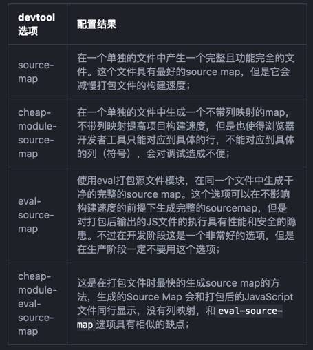
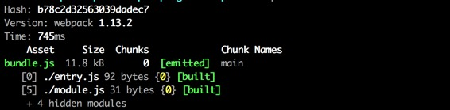
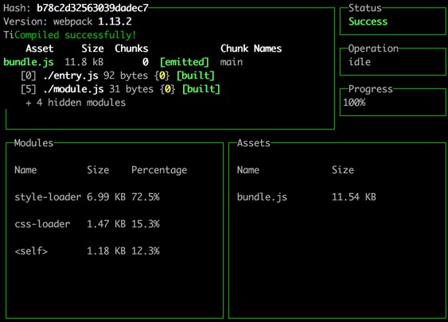

参考:  
 入门Webpack，看这篇就够了:  
 [http://mp.weixin.qq.com/s?__biz=MzA5NTM2MTEzNw==&mid=2736710548&idx=1&sn=b29e4d55d6dd4701d1be4c10efc8bcb4&scene=1&srcid=09013p3rQHqfo17Ysa7WKz78#rd](http://mp.weixin.qq.com/s?__biz=MzA5NTM2MTEzNw==&mid=2736710548&idx=1&sn=b29e4d55d6dd4701d1be4c10efc8bcb4&scene=1&srcid=09013p3rQHqfo17Ysa7WKz78#rd)
 
使用webpack命令行工具:webpack-dashboard:   
[http://yaowenjie.github.io/front-end/using-webpack-dashboard](http://yaowenjie.github.io/front-end/using-webpack-dashboard)

Webpack 中文指南:   
[http://zhaoda.net/webpack-handbook](http://zhaoda.net/webpack-handbook)
 
webpack-dev-server:    
[http://www.cnblogs.com/hhhyaaon/p/5664002.html](http://www.cnblogs.com/hhhyaaon/p/5664002.html)

webpack指南:   
[http://webpack.toobug.net/zh-cn/](http://webpack.toobug.net/zh-cn/)

Webpack 怎么用:   
[https://segmentfault.com/a/1190000002552008](https://segmentfault.com/a/1190000002552008)

Webpack 入门指迷:   
[https://segmentfault.com/a/1190000002551952](https://segmentfault.com/a/1190000002551952)

##Webpack
>Webpack 是一个模块打包器。它将根据模块的依赖关系进行静态分析，然后将这些模块按照指定的规则生成对应的静态资源。

Webpack就是个模块打包工具，将模块及其依赖打包生成静态资源。在Webpack的机制里，所有的资源都是模块(js,css,图片等)，而且可以通过代码分隔(Code Splitting)的方法异步加载，实现性能上的优化。

###解决什么问题?
`文件依赖管理`

如何在一个大规模的代码库中，维护各种模块资源的分割和存放，维护它们之间的依赖关系，并且无缝的将它们整合到一起生成适合浏览器端请求加载的静态资源。

###webpack的工作方式
把你的项目当做一个整体，通过一个给定的主文件（如：index.js），Webpack将从这个文件开始找到你的项目的所有依赖文件，使用loaders处理它们，最后打包为一个浏览器可识别的JavaScript文件。

###Webpack 的特点
- 代码拆分   
	Webpack 有两种组织模块依赖的方式，同步和异步。异步依赖作为分割点，形成一个新的块。在优化了依赖树后，每一个异步区块都作为一个文件被打包。
- Loader    
	Webpack 本身只能处理原生的 JavaScript 模块，但是 loader 转换器可以将各种类型的资源转换成 JavaScript 模块。这样，任何资源都可以成为 Webpack 可以处理的模块。
- 智能解析   
	Webpack 有一个智能解析器，几乎可以处理任何第三方库，无论它们的模块形式是 CommonJS、 AMD 还是普通的 JS 文件。甚至在加载依赖的时候，允许使用动态表达式 require("./templates/" + name + ".jade")。
- 插件系统   
	Webpack 还有一个功能丰富的插件系统。大多数内容功能都是基于这个插件系统运行的，还可以开发和使用开源的 Webpack 插件，来满足各式各样的需求。
- 快速运行   
	Webpack 还有一个功能丰富的插件系统。大多数内容功能都是基于这个插件系统运行的，还可以开发和使用开源的 Webpack 插件，来满足各式各样的需求。

###安装webpack
首先要安装 `Node.js`， Node.js 自带了软件包管理器 npm，Webpack 需要 Node.js v0.6 以上支持。

Webpack可以使用npm安装，新建一个空的练习文件夹（此处命名为webpackSampleProgect），在终端中转到该文件夹后执行下述指令就可以完成安装。

	# 全局安装 
	npm install -g webpack
	
	# 检查是否成功安装webpack
	webpack -h

将 Webpack 安装到项目的依赖中，这样就可以使用项目本地版本的 Webpack。

	# 进入项目目录
	# 确定已经有 package.json，没有就通过 npm init 创建
	# 安装 webpack 依赖
	npm install webpack --save-dev
Webpack 目前有两个主版本，一个是在 master 主干的稳定版，一个是在 webpack-2 分支的测试版，测试版拥有一些实验性功能并且和稳定版不兼容，在正式项目中应该使用稳定版。

	# 查看 webpack 版本信息
	$ npm info webpack
	
	# 安装指定版本的 webpack
	$ npm install webpack@1.13.x --save-dev
	
如果需要使用 Webpack 开发工具，要单独安装：

	npm install webpack-dev-server --save-dev

###使用
首先创建一个静态页面 index.html 和一个 JS 入口文件 entry.js：   
index.html

	<!-- index.html -->
	<html>
	<head>
	  <meta charset="utf-8">
	</head>
	<body>
	  
	</body>
	</html>

entry.js
	
	// entry.js
	document.write('It works.')

然后编译 entry.js 并打包到 bundle.js：

	webpack entry.js bundle.js
	
打包过程会显示日志：
	
	Hash: eab07d91c02f865c05c4
	Version: webpack 1.13.2
	Time: 54ms
	    Asset     Size  Chunks             Chunk Names
	bundle.js  1.42 kB       0  [emitted]  main
	   [0] ./entry.js 28 bytes {0} [built]
	   
接下来添加一个模块 module.js 并修改入口 entry.js：

module.js

	// module.js
	module.exports = 'It works from module.js.'
   
entry.js

	// entry.js
	document.write('It works.')
	document.write(require('./module.js')) // 添加模块

重新打包 webpack entry.js bundle.js 后刷新页面看到变化 It works.It works from module.js.

	Hash: d1795b1d974431ad989d
	Version: webpack 1.13.2
	Time: 73ms
	    Asset     Size  Chunks             Chunk Names
	bundle.js  1.56 kB       0  [emitted]  main
	   [0] ./entry.js 68 bytes {0} [built]
	   [1] ./module.js 31 bytes {0} [built]
	   
Webpack 会分析入口文件，解析包含依赖关系的各个文件。这些文件（模块）都打包到 bundle.js 。**Webpack 会给每个模块分配一个唯一的 id 并通过这个 id 索引和访问模块。**在页面启动时，会先执行 entry.js 中的代码，其它模块会在运行 require 的时候再执行。

###配置文件[webpack.config.js](http://webpack.github.io/docs/configuration.html)
Webpack 在执行的时候，除了在命令行传入参数，还可以通过指定的配置文件来执行。默认情况下，会搜索当前目录的 webpack.config.js 文件，这个文件是一个 node.js 模块，返回一个 json 格式的配置信息对象，或者通过 --config 选项来指定配置文件。

在根目录创建 package.json 来添加 webpack 需要的依赖：

	{
	  "name": "webpack-example",
	  "version": "1.0.0",
	  "description": "A simple webpack example.",
	  "main": "bundle.js",
	  "scripts": {
	    "test": "echo \"Error: no test specified\" && exit 1"
	  },
	  "keywords": [
	    "webpack"
	  ],
	  "author": "veya",
	  "license": "MIT",
	  "devDependencies": {
	    "css-loader": "^0.25.0",
	    "style-loader": "^0.13.1",
	    "webpack": "^1.13.2"
	  }
	}
	
如果没有写入权限，请尝试如下代码更改权限

	chflags -R nouchg .
	sudo chmod  775 package.json
	
然后创建一个配置文件 webpack.config.js：

	//引入webpack
	var webpack = require('webpack');
	
	module.exports = {
	    entry: './entry.js',
	    output: {
	        path: __dirname,
	        filename: 'bundle.js'
	    }
	}

最后命令行运行

	 webpack
	 
####entry配置项
webpack入口文件配置，可支持一个入口文件或多个入口文件 entry: \<string>|\<array>|\<object>

####output配置项
#####output.filename
output.filename指定具体的文件名。

output.filename除了可以指定具体的文件名以外，还可以使用一些占位符，包括：

- name 模块名称
- hash 模块编译后的（整体）Hash值
- chunkhash 分片的Hash值

使用的方式就是在output.filename的中使用[name].js或者my-[name]-[hash].js之类的，一看就明白。

chunkhash的使用：我们一次有可能要打包很多模块，而不止是一个js文件，因此会碰到支持多个入口文件（entry）的情况，每一个入口都需要有自己的名字，具体对应entry的写法而言，有如下几种情况：

	entry:'./example2.1'
	// 或者
	entry:['./example2.1','./example2.2']
	
这种情况下，模块是没有名字的，webpack会使用main作为模块名字，因此像下面这种用数组来指定入口的情况，模块名会重复，而此时webpack会将它们的代码合并打包！

另一种是webpack比较推荐的多入口写法：

	entry:{
	    'example2.1':'example2.1.js',
	    'example2.2':'example2.2.js'
	}
	
这种写法中，名字和模块文件名一一对应，每个模块都有独立的名字。因此这里的[name]可以理解成模块名字。

分片chunk：所谓分片就是指一个入口模块的代码有可能会被分成多个文件，还有一些文件可能是来自模块的公共代码，而不是入口模块。

[hash]和[chunkhash]，一个是指本次打包相关的整体的hash，一个是指分片的hash。

#####output.path
有时候我们希望输出的文件不在当前目录（其实大部分时候都是这样），比如源码在src目录，输出的文件在dist目录，此时就需要用到output.path来指定输出路径。

output.path也可以使用占位符。

	entry:{
	    'example4.1':'src/example4.1'
	},
	otuput:{
	    filename:'[name].js',
	    path:'./dist'
	}

文件会打包到dist/example4.1.js。

如果你的模块是存放在子目录中的，而你又想保持这种目录结构到打包后的dist中，怎么办？

	src/
	    example4.1.js
	    hello/
	        example4.2.js

希望打包之后是这样：

	dist/
	    example4.1.js
	    hello/
	        example4.2.js

这种情况下，子目录并不能由output.path配置而来，而应该将目录写到模块名上，配置文件变成这样：

	entry:{
	    'example4.1':'./src/example4.1',
	    'hello/example4.2':'./src/hello/example4.2'
	},
	output:{
	    filename:'[name].js',
	    path:'./dist'
	}

注意这里的filename一定要包含[name]才行，因为路径信息是带在模块名上的。

#####output.publicPath
这个选项适用于各种非入口文件的场景，包括分片后的文件、loader加载文件时的路径、css中引入的图片资源文件路径等等。

####生成Source Maps
打包后的文件有时候你是不容易找到出错了的地方对应的源代码的位置的，Source Maps就是来帮我们解决这个问题的。 通过简单的配置后，Webpack在打包时可以为我们生成的source maps，这为我们提供了一种对应编译文件和源文件的方法，使得编译后的代码可读性更高，也更容易调试。

在webpack的配置文件中配置source maps，需要配置`devtool`，它有以下四种不同的配置选项，各具优缺点，描述如下：

修改配置文件 webpack.config.js ，添加devtool：

	var Webpack = require('webpack');
	
	module.exports = {
	    devtool: 'source-map',
	    entry: './entry.js',
	    output: {
	        path: __dirname,
	        filename: 'bundle.js'
	    }
	};
	
###编译环境判断
我们需要根据当前的编译环境来选择不同的资源输出方式。编译环境的判断可以通过定义node的script来设置环境变量。在我们项目根目录的package.json文件中，定义：
 
	"scripts": { 
		"dev": "webpack-dev-server", 
		"build": "webpack", 
		"deploy": "set NODE_ENV=production&&webpack -p --progress --colors" 
	}, 
	
这样的话，终端执行"npm run dev" 就相当于执行 "webpack-dev-server"。如果执行"npm run deploy"，那就是编译生产环境，node就会设置环境变量"NODE_ENV"为"production"。然后在webpack的配置文件中，通过"process.env.NODE_ENV"就可以读取到"production"这个值。所以在配置的开头，我们这样定义一个局部变量: 

	var prod = process.env.NODE_ENV === 'production' ? true : false; 

之后在配置文件的最后，根据当前的编译环境，如果是生产环境就配置引用压缩丑化插件"UglifyJsPlugin"，如果是开发环境就配置webpack-dev-server： 

	// 判断开发环境还是生产环境,添加uglify等插件 
	if (process.env.NODE_ENV === 'production') {
		module.exports.plugins = (module.exports.plugins || [])
			.concat([
				new webpack.DefinePlugin({
					__DEV__: JSON.stringify(JSON.parse(process.env.DEBUG || 'false')) 
				}), 
				new webpack.optimize.UglifyJsPlugin({ 
					compress: { warnings: false } 
				}), 
				new webpack.optimize.OccurenceOrderPlugin(), 
			]); 
	} else { 
		module.exports.devtool = 'source-map'; 
		module.exports.devServer = { 
			port: 8080, 
			contentBase: './build', 
			hot: true, 
			historyApiFallback: true, 
			publicPath: "", 
			stats: { 
				colors: true 
			}, 
			plugins: [ new webpack.HotModuleReplacementPlugin() ] 
		}; 
	} 

###Loader
Loader 可以理解为是模块和资源的转换器，由于在webpack里，所有的资源都是模块，不同资源都最终转化成js去处理。针对不同形式的资源采用不同的Loader去编译，这就是Loader的意义。它本身是一个函数，接受源文件作为参数，返回转换的结果。这样，我们就可以通过 require 来加载任何类型的模块或文件。

通过使用不同的loader，webpack通过调用外部的脚本或工具可以对各种各样的格式的文件进行处理。

####loader 特性
- Loader 可以通过管道方式链式调用，每个 loader 可以把资源转换成任意格式并传递给下一个 loader ，但是最后一个 loader 必须返回 JavaScript。
- Loader 可以同步或异步执行。
- Loader 运行在 node.js 环境中，所以可以做任何可能的事情。
- Loader 可以接受参数，以此来传递配置项给 loader。
- Loader 可以通过文件扩展名（或正则表达式）绑定给不同类型的文件。
- Loader 可以通过 npm 发布和安装。
- 除了通过 package.json 的 main 指定，通常的模块也可以导出一个 loader 来使用。
- Loader 可以访问配置。
- 插件可以让 loader 拥有更多特性。
- Loader 可以分发出附加的任意文件。

Loader 本身也是运行在 node.js 环境中的 JavaScript 模块，它通常会返回一个函数。大多数情况下，我们通过 npm 来管理 loader，但是你也可以在项目中自己写 loader 模块。

按照惯例，而非必须，loader 一般以 xxx-loader 的方式命名，xxx 代表了这个 loader 要做的转换功能，比如 json-loader。

在引用 loader 的时候可以使用全名 json-loader，或者使用短名 json。这个命名规则和搜索优先级顺序在 webpack 的 resolveLoader.moduleTemplates api 中定义。

	Default: ["*-webpack-loader", "*-web-loader", "*-loader", "*"]

####loader 配置
Loader 可以在 require() 引用模块的时候添加，也可以在 webpack 全局配置中进行绑定，还可以通过命令行的方式使用。

loaders需要单独安装并且需要在webpack.config.js下的modules关键字下进行配置，loaders的配置选项包括以下几方面：

- test：一个匹配loaders所处理的文件的拓展名的正则表达式（必须）
- loader：loader的名称（必须）
- include/exclude:手动添加必须处理的文件（文件夹）或屏蔽不需要处理的文件（文件夹）（可选）；
- query：为loaders提供额外的设置选项（可选）

####css-loader和style-loader
css-loader使你能够使用类似@import 和 url(...)的方法实现 require()的功能，

style-loader将所有的计算后的样式加入页面中，

二者组合在一起使你能够把样式表嵌入webpack打包后的JS文件中。

我们要在页面中引入一个 CSS 文件 style.css，首页将 style.css 也看成是一个模块，然后用 css-loader 来读取它，再用 style-loader 把它插入到页面中。

	/* style.css */
	body { background: yellow; }

修改 entry.js：

	require("!style!css!./style.css") // 载入 style.css
	document.write('It works.')
	document.write(require('./module.js'))

安装 loader：

	npm install css-loader style-loader

重新编译打包:

	webpack entry.js bundle.js
	
刷新页面，就可以看到黄色的页面背景了。

如果每次 require CSS 文件的时候都要写 loader 前缀，是一件很繁琐的事情。我们可以根据模块类型（扩展名）来自动绑定需要的 loader。

将 entry.js 中的 require("!style!css!./style.css") 修改为 require("./style.css") ，然后执行：

	$ webpack entry.js bundle.js --module-bind 'css=style!css'

	# 有些环境下可能需要使用双引号
	$ webpack entry.js bundle.js --module-bind "css=style!css"

显然，这两种使用 loader 的方式，效果是一样的。

webpack.config.js中配置style loader和css loader:

	var webpack = require('webpack');
	
	module.exports = {
	    entry: './entry.js',
	    output: {
	        path: __dirname,
	        filename: 'bundle.js'
	    },
	    module: {
	        /**
	         * style!css中的感叹号的作用在于使同一文件能够使用不同类型的loader
	         */
	        loaders: [
	            {test: /\.css$/, loader: 'style!css'}
	        ]
	    }
	}

同时简化 entry.js 中的 style.css 加载方式：

	require('./style.css')

命令行运行：

	webpack
	
可以看到 webpack 通过配置文件执行的结果和通过命令行
	
	webpack entry.js bundle.js --module-bind 'css=style!css' 
	
执行的结果是一样的。

#####CSS module
CSS modules 的技术就意在把JS的模块化思想带入CSS中来，通过CSS模块，所有的类名，动画名默认都只作用于当前模块。Webpack从一开始就对CSS模块化提供了支持，在CSS loader中进行配置后，你所需要做的一切就是把”modules“传递都所需要的地方，然后就可以直接把CSS的类名传递到组件的代码中，且这样做只对当前组件有效，不必担心在不同的模块中具有相同的类名可能会造成的问题。

修改webpack.config.js文件:

	var webpack = require('webpack');
	
	module.exports = {
	    entry: './entry.js',
	    output: {
	        path: __dirname,
	        filename: 'bundle.js'
	    },
	    module: {
	        /**
	         * style!css中的感叹号的作用在于使同一文件能够使用不同类型的loader
	         */
	        loaders: [
	            {test: /\.css$/, loader: 'style!css?modules'}
	        ]
	    }
	}
	
修改style.css：

	body {
	    background-color: yellow;
	}
	
	.wrap {
	    width: 200px;
	    height: 50px;
	    border: 1px solid #cccccc;
	    padding: 5px;
	}

修改entry.js文件

	var styles = require("./style.css");
	var datas = require("./datas.json");
	
	document.write("
" + datas.msg + "
 ");

####json-loader
首先安装json loader:

	//安装可以装换JSON的loader 
	npm install --save-dev json-loader
	
其次webpack.config.js中配置json loader:

	var webpack = require('webpack');
	
	module.exports = {
	    entry: './entry.js',
	    output: {
	        path: __dirname,
	        filename: 'bundle.js'
	    },
	    module: {
	        loaders: [
				{test: /\.css$/, loader: 'style!css'},
            	{test: /\.json/, loader: 'json'} //json loader配置
	        ]
	    }
	}
	
创建datas.json文件：

	{
	  "msg": "你好 JSON Loader!"
	}

修改entry.js文件：

	require("./style.css");
	
	var datas = require("./datas.json");
	document.write(datas.msg + " ");
	
	document.write("It works!" + " ");
	document.write(require('./module.js') + " ");
	
命令行运行：

	webpack
	
浏览器打开index.html文件，页面输出：

	你好 JSON Loader!
	It works!
	It is module!
	
####url-loader
安装：
	
	npm install --save-dev url-loader file-loader

注：url-loader, file-loader。两个都必须用上。否则超过大小限制的图片无法生成到目标文件夹中。
	
修改webpack-config.js配置url loader:

	var webpack = require('webpack');
	
	module.exports = {
	    entry: './entry.js',
	    output: {
	        path: __dirname,
	        filename: 'bundle.js'
	    },
	    module: {
	        loaders: [
				{test: /\.css$/, loader: 'style!css'},
            	{test: /\.json/, loader: 'json'},
            	{test: /\.(png|jpg|jpeg|gif)$/, loader: 'url?limit=10000&name=images/[name].[ext]'} //url-loader配置
	        ]
	    }
	}
	
匹配到png或jpg或gif结尾的文件就采用url-loader来做对应的编译。`由于loader都是默认以-loader后缀结尾的，所以可以省略后缀"-loader"，直接写成url。`**问号后面是参数(?limit=10000&name=images/[name].[ext])，表示10000B以下的图片直接压缩成base64编码，超过10000B的图片输出到"images/文件名.拓展名"。**

上面的url loader配置也可以这样写： 

	{ 
		test: /\.(png|jpg|jpeg|gif)$/, 
		loader: 'url-loader', 
		query:{
			limit:'10000',
			name:'images/[name].[ext]' 
		} 
	}

####Babel
Babel其实是一个编译JavaScript的平台，它的强大之处表现在可以通过编译帮你达到以下目的：

- 下一代的JavaScript标准（ES6，ES7），这些标准目前并未被当前的浏览器完全的支持；
- 使用基于JavaScript进行了拓展的语言，比如React的JSX

#####Babel的安装与配置

Babel其实是几个模块化的包，其核心功能位于称为babel-core的npm包中，不过webpack把它们整合在一起使用，但是对于每一个你需要的功能或拓展，你都需要安装单独的包（用得最多的是解析Es6的babel-preset-es2015包和解析JSX的babel-preset-react包）。

我们先来一次性安装这些依赖包

	// npm一次性安装多个依赖模块，模块之间用空格隔开
	npm install --save-dev babel-core babel-loader babel-preset-es2015 babel-preset-react	
	
其次webpack.config.js中配置Babel:

	var webpack = require('webpack');
	
	module.exports = {
	    entry: './entry.js',
	    output: {
	        path: __dirname,
	        filename: 'bundle.js'
	    },
	    module: {
	        loaders: [
				{test: /\.css$/, loader: 'style!css'}, //style css loader配置
            	{test: /\.json/, loader: 'json'}, //json loader配置
            	{test: /\.js$/, loader: "babel", exclude: /node_modules/, query: {presets: ['es2015', 'react']}} //babel loader配置
	        ]
	    }
	}
	

###插件
插件可以完成更多 loader 不能完成的功能。

插件的使用一般是在 webpack 的配置信息 plugins 选项中指定。

Webpack 本身内置了一些常用的插件，还可以通过 npm 安装第三方插件。

####BannerPlugin（内置）
作用是给输出的文件头部添加注释信息。

修改 webpack.config.js，添加 plugins：

	var Webpack = require('webpack');
	
	module.exports = {
	    entry: './entry.js',
	    output: {
	        path: __dirname,
	        filename: 'bundle.js'
	    },
	    module: {
	        loaders: [
	            {test: /\.css$/, loader: 'style!css'}
	        ]
	    },
	    plugins: [
	        new Webpack.BannerPlugin("webpack内置插件BannerPlugin,作用是给文件头部添加注释!")
	    ]
	};
	
然后运行 webpack，打开 bundle.js，可以看到文件头部出现了我们指定的注释信息：

	/*! webpack内置插件BannerPlugin,作用是给文件头部添加注释! */
	/******/ (function(modules) { // webpackBootstrap
	/******/ 	// The module cache
	/******/ 	var installedModules = {};
	// 后面代码省略
	
####CommonsChunkPlugin（内置） 提取代码中的公共模块
Common Chunks 插件的作用就是提取代码中的公共模块，然后将公共模块打包到一个独立的文件中去，以便在其它的入口和模块中使用。

修改 webpack.config.js，添加 plugins：

	var webpack = require('webpack');
	
	module.exports = {
	    entry:{
	        main1:'./main',
	        main2:'./main.2'
	    },
	    output:{
	        filename:'bundle.[name].js'
	    },
	    plugins: [
	    	//参数common.js表示公共模块的文件名，后面的数组元素与entry一一对应，表示要提取这些模块中的公共模块。
	        new  webpack.optimize.CommonsChunkPlugin('common.js', ['main1', 'main2']) 
	    ]
	};

	
####webpack-dashboard
[webpack-dashboard](https://github.com/FormidableLabs/webpack-dashboard)是用于改善开发人员使用webpack时控制台用户体验的一款工具。它摒弃了webpack（尤其是使用webpack-dev-server时）在命令行内诸多杂乱的信息结构，为webpack在命令行上构建了一个一目了然的仪表盘(dashboard)，其中包括构建过程和状态、日志以及涉及的模块列表。有了它，你就可以更加优雅的使用webpack来构建你的代码。

简单地说，webpack-dashboard就是把原先你使用webpack时（特别是使用webpack dev server时）命令行控制台打印的日志：

转换成了这样：

这个dashboard里面按**日志(Log)、状态(Status)、运行(Operation)、过程(Progess)、模块(Modules)、产出(Assets)**这6个部分将信息区分开来。

#####webpack-dashboard安装
使用npm本地安装它到你基于webpack的前端项目上：

	npm install webpack-dashboard --save-dev

#####导入dashboard和其对应的插件
导入dashboard和其对应的插件，并创建一个dashboard的实例：

	var Dashboard = require('webpack-dashboard');
	var DashboardPlugin = require('webpack-dashboard/plugin');
	var dashboard = new Dashboard();
	
#####plugins里面添加DashboardPlugin
在对应的plugins里面添加DashboardPlugin：

	plugins: [
	  new DashboardPlugin(dashboard.setData)
	]
#####webpack.config.js完整代码
	var Webpack = require('webpack');
	
	var Dashboard = require('webpack-dashboard');
	var DashboardPlugin = require('webpack-dashboard/plugin');
	var dashboard = new Dashboard();
	
	module.exports = {
	    entry: './entry.js',
	    output: {
	        path: __dirname,
	        filename: 'bundle.js'
	    },
	    module: {
	        loaders: [
	            {test: /\.css$/, loader: 'style!css'}
	        ]
	    },
	    plugins: [
	        new DashboardPlugin(dashboard.setData)
	    ]
	};
	
###开发环境 webpack-dev-server
当项目逐渐变大，webpack 的编译时间会变长，可以通过参数让编译的输出内容带有**进度(progress)**和**颜色(colors)**。

	webpack --progress --colors

如果不想每次修改模块后都重新编译，那么可以启动监听模式。开启监听模式后，没有变化的模块会在编译后缓存到内存中，而不会每次都被重新编译，所以监听模式的整体速度是很快的。

	webpack --progress --colors --watch

####webpack-dev-server安装
当然，使用 webpack-dev-server 开发服务是一个更好的选择。它将在 localhost:8080 启动一个 express 静态资源 web 服务器，并且会以监听模式自动运行 webpack，在浏览器打开 http://localhost:8080/ 或 http://localhost:8080/webpack-dev-server/ 可以浏览项目中的页面和编译后的资源输出，并且通过一个 socket.io 服务实时监听它们的变化并自动刷新页面。

	# 安装
	npm install webpack-dev-server -g
	
	# 运行
	webpack-dev-server --progress --colors

####webpack-dev-server配置
devServer作为webpack配置选项中的一项，具有以下配置选项，[webpack-dev-server官方文档](https://webpack.github.io/docs/webpack-dev-server.html)

- --content-base <file/directory/url/port>
- --quiet
- --no-info
- --colors 
- --no-colors
- --host <hostname/ip>
- --port <number>
- --inline
- --hot
- --hot --inline
- --lazy
- --https
- --cert, --cacert, --key

修改 webpack.config.js，添加 plugins：

	var Webpack = require('webpack');
	
	module.exports = {
	    entry: './entry.js',
	    output: {
	        path: __dirname,
	        filename: 'bundle.js'
	    },
	    module: {
	        loaders: [
	            {test: /\.css$/, loader: 'style!css'}
	        ]
	    },
	    plugins: [
	        new Webpack.BannerPlugin("webpack内置插件BannerPlugin,作用是给文件头部添加注释!")
	    ],
	    devserver: {
	        contentBase: "./public",
	        port: "8080",
	        colors: true,
	        historyApiFallBack: true,
	        inline: true//,
	        //quiet: true, 如果安装了webpack-dashboard,设置为true 可去掉多余的日志
	    }
	}; 

命令行运行：

	webpack-dev-server
	
输出显示日志：

	http://localhost:8080/webpack-dev-server/
	webpack result is served from /
	content is served from /opt/webpack sample progect/sample1
	Hash: b78c2d32563039dadec7
	Version: webpack 1.13.2
	Time: 818ms
	    Asset     Size  Chunks             Chunk Names
	bundle.js  11.8 kB       0  [emitted]  main
	chunk    {0} bundle.js (main) 9.87 kB [rendered]
	    [0] ./entry.js 92 bytes {0} [built]
	    [1] ./style.css 895 bytes {0} [built]
	    [2] ./~/css-loader!./style.css 192 bytes {0} [built]
	    [3] ./~/css-loader/lib/css-base.js 1.51 kB {0} [built]
	    [4] ./~/style-loader/addStyles.js 7.15 kB {0} [built]
	    [5] ./module.js 31 bytes {0} [built]
	webpack: bundle is now VALID.
	
浏览器打开：[http://localhost:8080/webpack-dev-server/](http://localhost:8080/webpack-dev-server/)

###故障处理 --display-error-details
一般情况下，webpack 如果出问题，会打印一些简单的错误信息，比如模块没有找到。我们还可以通过参数 `--display-error-details` 来打印错误详情。

	webpack --display-error-details
	
Webpack 的配置提供了 `resolve` 和 `resolveLoader` 参数来设置**模块解析的处理细节**，resolve 用来配置`应用层的模块`（要被打包的模块）解析，resolveLoader 用来配置` loader 模块的解析`。

当引入通过 npm 安装的 node.js 模块时，可能出现找不到依赖的错误。Node.js 模块的依赖解析算法很简单，是通过查看模块的每一层父目录中的 node_modules 文件夹来查询依赖的。当出现 Node.js 模块依赖查找失败的时候，可以尝试设置 **resolve.fallback** 和 **resolveLoader.fallback** 来解决问题。

	module.exports = {
	  resolve: { fallback: path.join(__dirname, "node_modules") },
	  resolveLoader: { fallback: path.join(__dirname, "node_modules") }
	};

Webpack 中涉及路径配置最好使用绝对路径，建议通过 path.resolve(\_\_dirname, "app/folder") 或 path.join(\_\_dirname, "app", "folder") 的方式来配置，以兼容 Windows 环境。

###运行命令
	webpack --config XXX.js   //使用另一份配置文件（比如webpack.config2.js）来打包
	webpack --watch   //监听变动并自动打包
	webpack -p    //压缩混淆脚本，这个非常非常重要！
	webpack -d    //生成map映射文件，告知哪些模块被最终打包到哪里了
	
###相关概念
####Chunk
chunk是使用Webpack过程中最重要的几个概念之一。在Webpack打包机制中，编译的文件包括entry（入口，可以是一个或者多个资源合并而成，由html通过script标签引入）和chunk（被entry所依赖的额外的代码块，同样可以包含一个或者多个文件）。从页面加速的角度来讲，我们应该尽可能将所有的js打包到一个bundle.js之中，但是总会有一些功能是使用过程中才会用到的。出于性能优化的需要，对于这部分资源我们可以做成按需加载，通过require.ensure方法实现: 

	require.ensure([], function(require) { 
		var dialog = require('./components/dialog'); 
		// todo ... 
	}); 
	
而固定的公用代码则独立打包到trunk之中。在Webpack的配置中，我们可以通过CommonsChunkPlugin插件对指定的chunks进行公共模块的提取。我们指定好生成文件的名字，以及想抽取哪些入口js文件的公共代码，webpack就会自动帮我们合并好。

	var chunks = Object.keys(entries); 
	plugins: [ 
		new webpack.optimize.CommonsChunkPlugin({ 
			name: 'vendors', // 将公共模块提取，生成名为`vendors`的chunk
			chunks: chunks,
			minChunks: chunks.length // 提取所有entry共同依赖的模块 
		})
	],
####分片
随着项目开发过程中越来越大，我们的代码体积也会越来越大，而将所有的脚本都打包到同一个JS文件中显然会带来性能方面的问题（无法并发，首次加载时间过长等）。

webpack也提供了代码分片机制，使我们能够将代码拆分后进行异步加载。

>值得注意的是，webpack对代码拆分的定位仅仅是为了解决文件过大，无法并发加载，加载时间过长等问题，并不包括公共代码提取和复用的功能。对公共代码的提取将由CommonChunks插件来完成。

要使用webpack的分片功能，`首先需要定义“分割点”，即代码从哪里分割成两个文件`。

#####分割点
**分割点表示代码在此处被分割成两个独立的文件。** 具体的方式有两种。

`使用require.ensure`：

	require.ensure(["module-a", "module-b"], function(require) {
	    var a = require("module-a");
	    // ...
	});

`使用AMD的动态require`：

	require(["module-a", "module-b"], function(a, b) {
	    // ...
	});

上面的例子中，module-a和module-b就会被分割到独立的文件中去，而不会和入口文件打包在同一个文件中。

>TODO：module-a和module-b何时会在同一个文件，何时不会在同一个文件？

#####chunks
example1中使用了require.ensure和AMD动态require两种方式，来建立分割点，代码在此处被分片。

	var a=require('./a');
	a.sayHello();
	
	require.ensure(['./b'], function(require){
	    var b = require('./b');
	    b.sayHello(); 
	});
	
	require(['./c'], function(c){
	    c.sayHello();
	});

打包后的代码：

    bundle.js -> main.js + a.js
    1.bundle.js -> b.js
    2.bundle.js -> c.js

多入口

多入口的情况下：

    入口1 bundle.main1.js -> main.js + a.js
    入口2 bundle.main2.js -> main2.js + a.js
    1.bundle.1.js -> b.js
    2.bundle.2.js -> c.js

可见公共代码a.js并没有被提取出来。

>因此分片只是分片，并没有自动提取公共模块的作用。

###高级
####CommonJS规范
CommonJS 是以在浏览器环境之外构建 JavaScript 生态系统为目标而产生的项目，比如在服务器和桌面环境中。

CommonJS 规范是为了`解决 JavaScript 的作用域问题而定义的模块形式，可以使每个模块在它自身的命名空间中执行`。该规范的主要内容是，模块必须通过 module.exports 导出对外的变量或接口，通过 require() 来导入其他模块的输出到当前模块作用域中。

一个直观的例子：

moduleA.js

	// moduleA.js
	module.exports = function( value ){
	    return value * 2;
	}

moduleB.js

	// moduleB.js
	var multiplyBy2 = require('./moduleA');
	var result = multiplyBy2(4);

>CommonJS 是同步加载模块，但其实也有浏览器端的实现，其原理是现将所有模块都定义好并通过 id 索引，这样就可以方便的在浏览器环境中解析了。

####AMD规范
AMD（异步模块定义）是为浏览器环境设计的，因为 CommonJS 模块系统是同步加载的，当前浏览器环境还没有准备好同步加载模块的条件。

AMD 定义了一套 JavaScript 模块依赖异步加载标准，来解决同步加载的问题。

模块通过 define 函数定义在闭包中，格式如下：

	define(id?: String, dependencies?: String[], factory: Function|Object);

id 是模块的名字，它是可选的参数。

dependencies 指定了所要依赖的模块列表，它是一个数组，也是可选的参数，每个依赖的模块的输出将作为参数一次传入 factory 中。**如果没有指定 dependencies，那么它的默认值是 ["require", "exports", "module"]**。

	define(function(require, exports, module) {}）

factory 是最后一个参数，它包裹了模块的具体实现，它是一个函数或者对象。如果是函数，那么它的返回值就是模块的输出接口或值。

一些用例：

定义一个名为 myModule 的模块，它依赖 jQuery 模块：

	define('myModule', ['jquery'], function($) {
	    // $ 是 jquery 模块的输出
	    $('body').text('hello world');
	});
	
使用

	define(['myModule'], function(myModule) {});

注意：`在 webpack 中，模块名只有局部作用域，在 Require.js 中模块名是全局作用域，可以在全局引用。`

定义一个没有 id 值的匿名模块，通常作为应用的启动函数：

	define(['jquery'], function($) {
	    $('body').text('hello world');
	});

依赖多个模块的定义：

	define(['jquery', './math.js'], function($, math) {
	    // $ 和 math 一次传入 factory
	    $('body').text('hello world');
	});

模块输出：

	define(['jquery'], function($) {
	
	    var HelloWorldize = function(selector){
	        $(selector).text('hello world');
	    };
	
	    // HelloWorldize 是该模块输出的对外接口
	    return HelloWorldize;
	});

在模块定义内部引用依赖：

	define(function(require) {
	    var $ = require('jquery');
	    $('body').text('hello world');
	});

##webpack CLI（Command Line Interface命令行用户界面）

	webpack <entry> <output>
	
说明：

- entry
- output   
	path   
	filename   

一般会将配置项写在同目录的webpack.config.js中，然后执行webpack即可，webpack会从该配置文件中读取参数，此时不需要在命令行中传入任何参数。# 执行时webpack会去寻找当前目录下的webpack.config.js当作配置文件使用
	
	webpack

	# 也可以用参数-c指定配置文件
	webpack -c mycofnig.js
	
配置文件webpack.config.js的写法则是：

	module.exports = {
	    // 配置项
	};
	
值得注意的是，配置文件是一个真正的JS文件，因此配置项只要是一个对象即可，并不要求是JSON。也就意味着你可以使用表达式，也可以进行动态计算，或者甚至使用继承的方式生成配置项。
