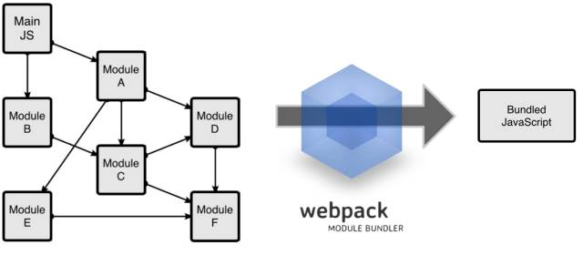

参考:

[http://mp.weixin.qq.com/s?__biz=MzA5NTM2MTEzNw==&mid=2736710548&idx=1&sn=b29e4d55d6dd4701d1be4c10efc8bcb4&scene=1&srcid=09013p3rQHqfo17Ysa7WKz78#rd](http://mp.weixin.qq.com/s?__biz=MzA5NTM2MTEzNw==&mid=2736710548&idx=1&sn=b29e4d55d6dd4701d1be4c10efc8bcb4&scene=1&srcid=09013p3rQHqfo17Ysa7WKz78#rd)

[http://yaowenjie.github.io/front-end/using-webpack-dashboard](http://yaowenjie.github.io/front-end/using-webpack-dashboard)

##Webpack
###解决什么问题?
`文件依赖管理`
###webpack的工作方式
把你的项目当做一个整体，通过一个给定的主文件（如：index.js），Webpack将从这个文件开始找到你的项目的所有依赖文件，使用loaders处理它们，最后打包为一个浏览器可识别的JavaScript文件。

###安装webpack
Webpack可以使用npm安装，新建一个空的练习文件夹（此处命名为webpackSampleProgect），在终端中转到该文件夹后执行下述指令就可以完成安装。

	//全局安装 
	npm install -g webpack
	//安装到你的项目目录 
	npm install --save-dev webpack
	
###配置文件webpack.config.js