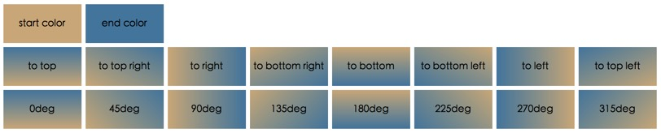
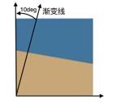
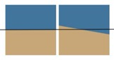

将样式表分解成单独的代码块：

- 第一部分是直接的元素声明。改变body、一些links样式、一些header样式，以及重置窗体的margin和padding等等。
- 在元素声明之后是类声明：一些像错误信息或者callout的东西会放在这里。 
- 最后我开始声明主容器，然后对这个容器里的元素样式进行缩进。

##处理ID、类、选择器和属性。
- 使容器保持最小化
- 使属性保持最少化：
 	
 		如果添加一个CSS属性不是必需的，那么不要添加；如果你不确定为什么要添加一个CSS属性，不要添加；如果你感觉同一个属性添加了很多次，那么把它们找出来处理后只添加一次。
- 使选择器保持最小化
- 使CSS hack保持最少

		除非遇到了已知的已公布的bug，否则不要使用hack。这是一个很重要的要点
- 在敏捷开发中使用CSS常量
- 使用一个通用的命名系统
- 根据class和id的语义适当的为他们命名
- 分类常见的CSS声明选择器
- 将你可能会重复使用很多次某个唯一的属性单独分离出来
- 尽量将id和class的命名持平文档树
- 学会利用CSS级联的特性
- 使用实用标签: \<small>, \<em> 和 \<strong>

##使用简写标记
- 缩写16进制颜色标记
- 根据LoVe/HAte排序法定义伪类链接

		按照“link-visited-hover-active”或者“LVHA”顺序排列
		
- 按照TRouBLed排序法定义元素的margin, padding 或者border : Top, Right, Bottom, Left. 
- 你可以使用 简写属性33

##设置字体
- **在body标签里设置字号为62.5%从而像使用px一样使用EM** 

	字号的默认值是16px; 应用这个规则之后，Em的值大约相当于10px(16 x 62.5% = 10).“我更倾向于在body标签里设置字号为:62.5%。这种方法能够在考虑px时使用em去指定大小，例如，1.3em约等于1.3px。
- 使用通用字符集进行编码
- **使用CSS来切换大写**
	
		h1 { text-transform: uppercase; }
- 用small-caps自动显示文本。 

	font-variant 属性是用来显示小型大写字母文本，这其中所有的小写字母被转化为大写字母，但是所有的小型大写字母下的文本相比其余的文本字号较小。
	
		h1 { font-variant: small-caps; }
- 定义通用字体类型来覆盖通用设置
- **将line-height设置为1.4em – 1.6em** 
		
	“line-height:1.4”为易读的行，合理的行高避免了行超过10个字而过长，而且颜色对比也不会太不明显。比如，对于过亮的CRT显示屏来说，纯黑色在纯白色的背景下往往对比太强烈，因此我尝试运用米白色(#fafafa是一个好的选择)和暗灰色（#333333也不错）。
	
- **设置 html-元素为100.01%**
	
	这个针对字号的奇怪100.01%会对几个浏览器bug进行弥补。首先，设置一个默认的body百分比字号（而不是em）消除了IE/Win系统中的字体缩放比例问题，即使之后在其它元素中设置为em。此外，一些版本的Opera浏览器会设置一个比其他浏览器小的100%的默认字号。另一方面，Safari浏览器却有一个101%字号的问题。目前流行的最佳解决方案是针对这个属性设置为100.01%的值。
	
##调试
- **添加边框以确定容器**。为元素添加一个边框来认清它们，这样有助于识别正常情况下不易察觉的重叠部分或者额外的空白部分

		* { border: 1px solid #f00; }
- **在调试前首先检查封闭的元素**。 “如果你曾经因为只修改了很少的东西就破坏了你优美的宝贝布局而沮丧，那么很可能是因为没有封闭的元素。

##技术性技巧
- 使用 outline: none;来去除链接的虚线

		a:focus { outline: none; }
- 通过CSS创建高度相等的列
- 你可以使CSS垂直对齐。 
	
	“比方说一个导航菜单，高度指定为2em。解决方法：在CSS中将行高设置为与盒子高度相同。 在这种情况下，盒子高度是2em，因此我们可以在CSS规则中设置line-height：2em，那么盒子中的文本将会浮动在中间位置。” 
- 你可以使用伪元素和类来动态生成内容。 
	
	伪类和伪元素可以用来格式化元素，这些元素的信息都是在文档树中无法得到的。例如，没有元素指向一段的第一行或者一个元素文本的第一个字母。你可以使用 :first-child, :hover, :active, :focus, :first-line, :first-letter, :before, :after.
- 你可以隐藏旧浏览器的CSS。 
	
	“从旧的浏览器隐藏CSS文件的一种常用方法是使用 @import的诀窍
	
- **设置宽度或者margin和padding** 
	
	`“我的经验法则是，如果设置了一个宽度，就不设置margin或padding。同样，如果设置了一个margin或padding，就不设置宽度。处理盒模型是就是会有如此的痛苦，特别是当你处理百分比的那种。所以，我设置外部容器的宽度，然后对其中的元素设置margin和padding。如此一来一切都会顺利。” `
	
- 你可以为IE设置条件注释。 

	“IE/Win条件下最安全的处理方式是使用条件注释。使用微软专有的条件注释感觉起来比CSS hack更有前途。你可以利用这个方法为IE/Win设置一个单独的样式表，这个样式表包含所有使其正确运作的必须的规则。”
	
		<!--[if IE]> <link rel="stylesheet" type="text/css" href="ie.css" /> <![endif]-->
		
##闭合浮动元素（或者叫清除浮动）
举个例子：

	
	

	    
<h2>A Column</h2>

	    <h1>Main Content</h1>
	    
Lorem ipsum

	

**由于div是块级元素，即使我们设定了宽度，其后面的内容也只能在下一行中显示，除非我们给它设定一个浮动属性.**

如果**“#inner”**的宽度和高度都比**“#outer”小**，这不会有问题。

但是，如果**“#inner”**的**高度超过**了**“#outer”**，那么的底部就会超出“#outer”的底部。这是因为我们为“#inner”设定了float属性后，它就会脱离的文本流，无论其宽度和高度怎么变化都不会使“#outer”跟随变化。

**解决办法：**

1. 额外标签法

	在内容的末尾增加一个空的标签
	
		  
	或
	
		

	完整代码片段：
	
		
	    
		

	    	
<h2>A Column</h2>

	    	<h1>Main Content</h1>
	    	
Lorem ipsum

	    
	    	

		

- 使用after伪类

	完整代码片段：
	
		
	    
		

		    
<h2>A Column</h2>

		    <h1>Main Content</h1>
		    
Lorem ipsum

		

 
参考：

[http://www.zcfy.cc/article/70-expert-ideas-for-better-css-coding-hackhands-1078.html#17](http://www.zcfy.cc/article/70-expert-ideas-for-better-css-coding-hackhands-1078.html#17)

##浏览器渲染原理
例：

	

	  
	  红色背景是父级
	

	
	.box {
	  display: inline-block;
	  white-space: nowrap;
	  background-color: #cd0000;
	}
	.text {
	  display: inline-block;
	  width: 100%;
	  background-color: #34538b;
	  color: #fff;
	}
首先，先下载文档内容，加载头部的样式资源（如果有），然后按照从上而下，自外而内的顺序渲染DOM内容。套用本例就是，先渲染父元素，后渲染子元素，是有个先后顺序的。因此当渲染到父元素的时候，子元素的width:100%并没有渲染，所以，宽度就是图片加文字内容的宽度；等渲染到文字这个子元素的时候，父元素宽度已经固定，此时的width:100%就是已经固定好的父元素的宽度，宽度不够怎么办？溢出就好了，overflow属性就是为此而生的。

##css3渐变
CSS3 Gradient 分为 linear-gradient（线性渐变）和 radial-gradient（径向渐变）

###线性渐变linear-gradient
语法：

	linear-gradient( [<point> || <angle>,]? <stop>, <stop> [, <stop>]* )
	
参数：共有三个参数

- 第一个参数表示线性渐变的方向（或角度）, 	- to top：设置渐变从下到上。相当于: 0deg
	- to right：设置渐变从左到右。相当于: 90deg
	- to bottom：设置渐变从上到下。相当于: 180deg。这是默认值，等同于留空不写。
	- to left：设置渐变为从右到左。相当于: 270deg
	- to top right：到右上角的渐变。相当于: 45deg	
	- to bottom right：到右下角的渐变。相当于: 135deg
	- to bottom left：到左下角的渐变。相当于: 225deg
	- to top left：到左上角的渐变。相当于: 315deg
	
- 第二个和第三个参数分别是起点颜色和终点颜色。你还可以在它们之间插入更多的参数，表示多种颜色的渐变。

####角度
**角度是指水平线与渐变线之间的角度，以逆时针方向旋转。总之，0deg创建一个从底部到顶部的垂直渐变，当变成90deg时生成一个从左到右的水平渐变。**

