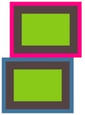
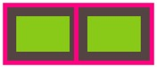
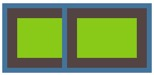
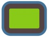
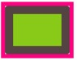
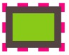
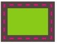

#####DRY: Don't Repeat Yourself.（不要总是用相同代码解决相同问题）
#####KISS: Keep It Simple, Stupid.（让代码简单直接）
#####抽象泄露法则：所有重大的抽象机制在某种程度上都存在泄露的情况。
#####rgba hsla

###背景和边框
#####盒子模型各个部分所处的位置(由上到下)：
- 边框border
- 内容content+内边距padding
- 背景图片background-image
- 背景颜色background-color
- 外边距margin

jQuery方法(width举例)：

- width()
 		
 		width
 		
- innerWidth()   注：相当于原生js的`clientWidth`

		width + padding*2
		
- outerWidth()  注：相当于原生js的`offsetWidth`
		
		width + padding*2 + border*2
		
- outerWidth(true)
	
		width + padding*2 + border*2 + margin*2
		
原始js(width举例)：

- style.width
	
		width //只有内联设置style="width:100px"才有效，css中设置取不到值
	
- clientWidth

		width + padding*2 //可见区域宽
	
- offsetWidth
 
		width + padding*2 + border*2
	
- scrollWidth

		width + padding*2 //正文全文宽
		
####边框：半透明边框（background-clip属性应用）

	background-clip: padding-box;
	
示例：一个容器设置一层白色背景和一道半透明白色边框

	border: 10px solid hsla(0, 0%, 100%, .5);
    background: white;

背景说明：默认情况下, 背景会延伸到边框所在的区域下层，并没有让body的背景 从半透明白色边框处透上来,而是在半透明白色边框处透出了这个容器自己的纯白实色背景,这实际上得到的效果跟纯白实色的边框看起来完全一样。

实现方式：通过 background-clip 属性来调整上述默认行为所带来的不便。这个属性的初始值是border-box,意味着背景会被元素的border box(边框的外沿框)裁切掉。如果不希望背景侵入边框所在的范围,我们要做的就是把它的值设为padding-box,这样浏览器就会用内边距的外沿来把背景裁切掉。

需要代码：

	border: 10px solid hsla(0, 0%, 100%, .5);
    background: white;
    background-clip: padding-box;
    
####边框：多重边框(box-shadow)

	box-shadow: h-shadow v-shadow blur spread color inset;

- h-shadow 	必需。水平阴影的位置。允许负值。（偏移量）
- v-shadow 	必需。垂直阴影的位置。允许负值。（偏移量）
- blur 	    可选。模糊距离。
- spread 	可选。阴影的尺寸。(扩散半径)
- color 	可选。阴影的颜色。
- inset 	可选。将外部阴影 (outset) 改为内部阴影。

注释：   
box-shadow 向框添加一个或多个阴影。该属性是由逗号分隔的阴影列表，每个阴影由 2-4 个长度值、可选的颜色值以及可选的inset关键词来规定。省略长度的值是0。   
box-shadow 是层层叠加的,**第一层投影位于最顶层**,依次类推。

#####示例说明：实现两重边框

######border + outline方式

	height: 40px;
	width: 60px;
	background: yellowgreen;
	border: 10px solid #655;
	outline: 5px solid deeppink;
	
######box-shadow方式

	height: 40px;
	width: 60px;
	background: yellowgreen;
	box-shadow: 0 0 0 10px #655, 0 0 0 15px #58a;

######两种方式对比	
1. **两种方式效果对比**

	
	
	box-shadow方式的content开始位置是outline方式的border位置（水平方向）
- **border + outline方式浮动效果**

	

	float后，第一个框的右边没有right outline，并且`right border`会被第二个框的left outline盖住
- **box-shadow方式浮动效果**

	
	float后，第一个框的右边没有box-shadow效果，并且`content`会被第二个框左box-shadow盖住

- **box-shadow方式不会响应鼠标事件**

		.box {
		    height: 40px;
		    width: 60px;
		    margin: 15px;
		    background: yellowgreen;
		    box-shadow: 0 0 0 10px #655, 0 0 0 15px #58a;
		}
		

		
- **box-shadow + border-radius效果**

	
	
		height: 40px;
	    width: 60px;
	    background: yellowgreen;
	    box-shadow: 0 0 0 10px #655, 0 0 0 15px #58a;
	    border-radius: 3px;
	
	设置border-radius后，box-shadow同样有radius效果

- **border + outline + border-radius效果**

	
	
		height: 40px;
	    width: 60px;
	    background: yellowgreen;
	    border: 10px solid #655;
        outline: 5px solid deeppink;
	    border-radius: 3px;
	
	设置border-radius后，outline不受border-radius影响，即没有radius效果	
- **border + outline方式虚线效果**

	
	
		height: 40px;
		width: 60px;
		background: yellowgreen;
		border: 10px solid #655;
		outline: 5px dashed deeppink;
	
- **border + outline + outline-offset效果**

	
	
		height: 40px;
		width: 60px;
		margin: 15px;
		background: yellowgreen;
		border: 10px solid #655;
		outline: 2px dashed deeppink;
		outline-offset: -6px;
		
	outline-offset属性来`控制它跟元素边缘(border)之间的间距`,可以接受负值。

说明：

1. outline不会影响布局（效果2，可通过margin来额外模拟出outline所需要占据的空间）
2. box-shadow不会影响布局（效果3，可以通过内边距或外边距(这取决于投影是内嵌和还是外扩的)来额外模拟出边框所需要占据的空间）
3. box-shadow创建出的假“边框”出现在元素的外圈。它们`并不会响应鼠标事件`,比如点击，即点击“边框”无效果。如果这一点非常重要,你可以给box-shadow属性加上inset关键字,来使投影绘制在元素的内圈。此时你需要增加额外的内边距来腾出足够的空隙。
4. box-shadow方案`只能模拟实线边框`

####背景：灵活的背景定位
#####background-position扩展
#####background-origin
#####calc()

