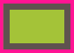

#####DRY: Don't Repeat Yourself.（不要总是用相同代码解决相同问题）
#####KISS: Keep It Simple, Stupid.（让代码简单直接）
#####抽象泄露法则：所有重大的抽象机制在某种程度上都存在泄露的情况。
#####rgba hsla

###背景和边框
#####盒子模型各个部分所处的位置(由上到下)：
- 边框border
- 内容content+内边距padding
- 背景图片background-image
- 背景颜色background-color
- 外边距margin

jQuery方法(width举例)：

- width()
 		
 		width
 		
- innerWidth()   注：相当于原生js的`clientWidth`

		width + padding*2
		
- outerWidth()  注：相当于原生js的`offsetWidth`
		
		width + padding*2 + border*2
		
- outerWidth(true)
	
		width + padding*2 + border*2 + margin*2
		
原始js(width举例)：

- style.width
	
		width //只有内联设置style="width:100px"才有效，css中设置取不到值
	
- clientWidth

		width + padding*2 //可见区域宽
	
- offsetWidth
 
		width + padding*2 + border*2
	
- scrollWidth

		width + padding*2 //正文全文宽
		
####边框：半透明边框（background-clip属性应用）

	background-clip: border-box|padding-box|content-box;
	
- border-box：背景被裁剪到边框盒。
- padding-box：背景被裁剪到内边距框。
- content-box：背景被裁剪到内容框。
	
示例：一个容器设置一层白色背景和一道半透明白色边框

	border: 10px solid hsla(0, 0%, 100%, .5);
    background: white;

背景说明：默认情况下, 背景会延伸到边框所在的区域下层，并没有让body的背景 从半透明白色边框处透上来,而是在半透明白色边框处透出了这个容器自己的纯白实色背景,这实际上得到的效果跟纯白实色的边框看起来完全一样。

实现方式：通过 background-clip 属性来调整上述默认行为所带来的不便。这个属性的初始值是border-box,意味着背景会被元素的border box(边框的外沿框)裁切掉。如果不希望背景侵入边框所在的范围,我们要做的就是把它的值设为padding-box,这样浏览器就会用内边距的外沿来把背景裁切掉。

需要代码：

	border: 10px solid hsla(0, 0%, 100%, .5);
    background: white;
    background-clip: padding-box;
    
####边框：多重边框(box-shadow)

	box-shadow: h-shadow v-shadow blur spread color inset;

- h-shadow 	必需。水平阴影的位置。允许负值。（偏移量）
- v-shadow 	必需。垂直阴影的位置。允许负值。（偏移量）
- blur 	    可选。模糊距离。
- spread 	可选。阴影的尺寸。(扩散半径)
- color 	可选。阴影的颜色。
- inset 	可选。将外部阴影 (outset) 改为内部阴影。

注释：   
box-shadow 向框添加一个或多个阴影。该属性是由逗号分隔的阴影列表，每个阴影由 2-4 个长度值、可选的颜色值以及可选的inset关键词来规定。省略长度的值是0。   
box-shadow 是层层叠加的,**第一层投影位于最顶层**,依次类推。

#####示例说明：实现两重边框

######border + outline方式

	height: 40px;
	width: 60px;
	background: yellowgreen;
	border: 10px solid #655;
	outline: 5px solid deeppink;
	
######box-shadow方式

	height: 40px;
	width: 60px;
	background: yellowgreen;
	box-shadow: 0 0 0 10px #655, 0 0 0 15px #58a;

######两种方式对比	
1. **两种方式效果对比**

	
	
	box-shadow方式的content开始位置是outline方式的border位置（水平方向）
- **border + outline方式浮动效果**

	

	float后，第一个框的右边没有right outline，并且`right border`会被第二个框的left outline盖住
- **box-shadow方式浮动效果**

	
	float后，第一个框的右边没有box-shadow效果，并且`content`会被第二个框左box-shadow盖住

- **box-shadow方式不会响应鼠标事件**

		.box {
		    height: 40px;
		    width: 60px;
		    margin: 15px;
		    background: yellowgreen;
		    box-shadow: 0 0 0 10px #655, 0 0 0 15px #58a;
		}
		

		
- **box-shadow + border-radius效果**

	
	
		height: 40px;
	    width: 60px;
	    background: yellowgreen;
	    box-shadow: 0 0 0 10px #655, 0 0 0 15px #58a;
	    border-radius: 3px;
	
	设置border-radius后，box-shadow同样有radius效果

- **border + outline + border-radius效果**

	
	
		height: 40px;
	    width: 60px;
	    background: yellowgreen;
	    border: 10px solid #655;
        outline: 5px solid deeppink;
	    border-radius: 3px;
	
	设置border-radius后，outline不受border-radius影响，即没有radius效果	
- **border + outline方式虚线效果**

	
	
		height: 40px;
		width: 60px;
		background: yellowgreen;
		border: 10px solid #655;
		outline: 5px dashed deeppink;
	
- **border + outline + outline-offset效果**

	
	
		height: 40px;
		width: 60px;
		margin: 15px;
		background: yellowgreen;
		border: 10px solid #655;
		outline: 2px dashed deeppink;
		outline-offset: -6px;
		
	outline-offset属性来`控制它跟元素边缘(border)之间的间距`,可以接受负值。

说明：

1. outline不会影响布局（效果2，可通过margin来额外模拟出outline所需要占据的空间）
2. box-shadow不会影响布局（效果3，可以通过内边距或外边距(这取决于投影是内嵌和还是外扩的)来额外模拟出边框所需要占据的空间）
3. box-shadow创建出的假“边框”出现在元素的外圈。它们`并不会响应鼠标事件`,比如点击，即点击“边框”无效果。如果这一点非常重要,你可以给box-shadow属性加上inset关键字,来使投影绘制在元素的内圈。此时你需要增加额外的内边距来腾出足够的空隙。
4. box-shadow方案`只能模拟实线边框`

####背景：灵活的背景定位
需求：针对容器某个角对背景图片做偏移定位

**无border**

	max-width: 10em;
	min-height: 5em;
	padding: 5px;
	background: #58a url(../images/css/code-pirate.svg) bottom right no-repeat;
	   
**有border**

	max-width: 10em;
	min-height: 5em;
	padding: 5px;
	background: #58a url(http://csssecrets.io/images/code-pirate.svg) bottom right no-repeat;
	border: 10px solid #655;
	
注：   
`默认情况下,background-position是以padding box为准的,这样边框才不会遮住背景图片。`

#####background-position扩展
css3 允许指定背景图片距离任意角的偏移量，只要在偏移量前面指定关键字。

	padding: 5px;
    background: #58a url(http://csssecrets.io/images/code-pirate.svg) bottom right no-repeat;
    background-position: bottom 5px right 5px;
	
注：由于有些浏览器不支持background-position偏移量，需要进行兼容处理，即将定位值写进background的简写属性，如不指定会出现background-position属性无效，背景图片会紧贴在左上角。

#####background-origin
background-position偏移的方式，代码不够DRY:每次改动内边距的值时,我们都需要在三个地方更新这个值。通过background-origin方式实现等效代码，只需通过padding即可同时改版背景的偏移大小。

	padding: 5px;
	background: #58a url(http://csssecrets.io/images/code-pirate.svg) bottom right no-repeat;
	background-origin: content-box;
	
注：

	background-origin: padding-box|border-box|content-box;
	
- padding-box：背景图像相对于内边距框来定位（默认）。
- border-box：背景图像相对于边框盒来定位。
- content-box：背景图像相对于内容框来定位。

#####calc()
calc() 函数内部的 `-` 和 `+` 运算符的两侧各加一个空白符,否则会产生解析错误!这个规则如此怪异,是为了向前兼容:

	padding: 5px;
	background: #58a url(http://csssecrets.io/images/code-pirate.svg) bottom right no-repeat;
	background-position: calc(100% - 5px) calc(100% - 5px);
	
####边框内圆角
示例：一个容器,只在内侧有圆角,而边框或描边的四个角在外部仍然保持直角的形状。

**两个元素实现方式**

	.box {
	    width: 10em;
	    padding: .8em;
	    background: #655;
	}
	.box div{
	    padding:1em;
	    background: tan;
	    border-radius: .4em;
	}
	
	

	    

	        内边框圆角
	    

	

**如何用一个元素实现方式**

	.box {
	   width: 10em;
	   padding: 1em;
	   background: tan;
	   border-radius: .4em;
	   outline: .8em solid #655;
	   box-shadow: 0 0 0 .2em #655;
	}
	

		内边框圆角
	

	
注：box-shadow 属性指定的扩张值并不一定等于描边的宽度,我们只需要指定一个足够填补“空隙”的扩张值就可以了。事实上,指定一个等于描边宽度的扩张值在某些浏览器中可能会得到渲染异常,因此我推荐一个稍小些的值。

####条纹背景

####自适应椭圆 (border-radius)
- border-radius可以单独指定水平 和垂直半径,只要用一个斜杠(/)分隔这两个值即可。
	
		border-radius: 100px / 75px
		
	

- border-radius它`不仅可以接受长度值,还可以接受百分比值`。这个百分比值会基于元素的尺寸进行解析,即宽度用于水平半径的解析,而高度用于垂直半径的解析。这意味着相同的百分比可能会计算出不同的水平和垂直半径。因此,如果要创建一个自适应的椭圆,我们可以把这两个半径值都 设置为50%:	
		
		border-radius: 50% / 50%
		
- 为所有四个角提供完全不同的水平和垂直半径,方法是在斜杠前指定 1~4 个值,在斜杠后指定另外 1~4 个值。请注 意这两组值是单独展开为四个值的。举例来说,当 border-radius 的值为 10px / 5px 20px时,其效果相当于10px 10px 10px 10px / 5px 20px 5px 20px。

	
	
####平行四边形 (transform：skew(Xdeg))
#####嵌套元素方案
思路：对容器进行skew()变形，再对内容再应用一次反向的skew()变形,从而抵消容器的变形。

- step1

		.box {
            width: 10em;
            height: 4em;
            line-height: 4em;
            text-align: center;
            background: #58a;
            
            transform: skew(-30deg);
        }
		

		    平行四边形
		

		
	
	
	内容也发生了斜向变形
	
- step2

		.box {
            width: 10em;
            height: 4em;
            line-height: 4em;
            text-align: center;
            background: #58a;
            
            transform: skew(-30deg);
        }
        .box > div {
            transform: skew(30deg);
        }	
		

		    

		        平行四边形
		    

		

		
		
	
#####伪元素方案
思路：**把所有样式(背景、边框等)应用到伪元素上,然后再对伪元素进行变形。**因为我们的内容并不是包含在伪元素里的,所以内容并不会受到变形的影响。

- step1:希望伪元素保持良好的灵活性,可以自动继承其宿主元素的尺寸, 甚至当宿主元素的尺寸是由其内容来决定时仍然如此。一个简单的办法是给`宿主元素应用position: relative样式`,并为`伪元素设置position: absolute`,然后再`把所有偏移量设置为零`,以便让它在水平和垂直方向上都被拉伸至宿主元素的尺寸。

		.box {
			position: relative;
			/* 其他的文字颜色、内边距等样式...... */
		} 
	
		.box::before {
			content: '';
			position: absolute;
			top: 0; right: 0; bottom: 0;left: 0;
		}

- step2: 此时,用伪元素生成的方块是重叠在内容之上的,一旦给它设置背景,就会遮住内容。为了修复这个问题,我们可以给`伪元素设置z-index: -1`样式,这样它的堆叠层次就会被推到宿主元素之后。

		.box {
			position: relative;
			/* 其他的文字颜色、内边距等样式...... */
		} 
	
		.box::before {
			content: '';
			position: absolute;
			top: 0; right: 0; bottom: 0;left: 0;
			z-index: -1;
		}

- step3: 最后一步,就是对伪元素设置变形样式。

      	.box {
			position: relative;
			/* 其他的文字颜色、内边距等样式...... */
		} 
	
		.box::before {
			content: ''; /* 用伪元素来生成一个矩形 */ 
			position: absolute;
			top: 0; right: 0; bottom: 0; left: 0; 
			z-index: -1;
			background: #58a;
			transform: skew(45deg);
		}                          

#####扩展：
参考：[http://nicolasgallagher.com/](http://nicolasgallagher.com/)  

伪元素及宿主元素之间的层叠关系：

`由底层到顶层顺序：element>:before>:before[content]>:after>:after[content]`

利用伪元素以及定位属性产生了一个方块, 然后对伪元素设置样式,并将其放置在其宿主元素的下层。

效果案例：

- **变形一个元素而不想变形它的内容**，
- **边框内圆角**，

		.box {
            position: relative;
            width: 10em;
            height: 8em;
            background: tan;
            border-radius: .4em;
        }

        .box::before {
            content: "";
            position: absolute;
            top: 0; right: 0; bottom: 0; left: 0; 
			z-index: -1;
			background: #655;
            outline: 0.4em solid #655;
        }
        

        
- **多重背景**，[multiple-backgrounds-and-borders-with-css2](http://nicolasgallagher.com/multiple-backgrounds-and-borders-with-css2/)

		.silverback {
		    position: relative;
		    z-index: 1;
		    min-width: 200px;
		    min-height: 200px;
		    padding: 120px 200px 50px;
		    background: #d3ff99 url(../images/demo/vines-back.png) -10% 0 repeat-x;
		    text-align: center;
		}
		
		.silverback:before,
		.silverback:after {
		    position: absolute;
		    z-index: -1;
		    top: 0;
		    left: 0;
		    right: 0;
		    bottom: 0;
		    padding-top: 100px;
		}
		
		.silverback:before {
		    content: url(../images/demo/gorilla-1.png);
		    padding-left: 3%;
		    text-align: left;
		    background: transparent url(../images/demo/vines-mid.png) 300% 0 repeat-x;
		}
		
		.silverback:after {
		    content: url(../images/demo/gorilla-2.png);
		    padding-right: 3%;
		    text-align: right;
		    background: transparent url(../images/demo/vines-front.png) 70% 0 repeat-x;
		}
		
		

		    <pre><code>&lt;div class="silverback"&gt;[content]&lt;/div&gt;</code></pre>
		

		
	

- **多重边框**，

		.mulborders {
		  width: 440px;
		  position: relative;
		  z-index: 10;
		  padding: 40px;
		  border: 5px solid #f00;
		  background: #ff9600;
		}
		
		.mulborders:before {
		  content: "";
		  display: block;
		  position: absolute;
		  z-index: -1;
		  top: 5px;
		  left: 5px;
		  right: 5px;
		  bottom: 5px;
		  border: 5px solid #ffea00;
		  background: #4aa929;
		}
		
		.mulborders p:first-child:before {
		  content: "";
		  display: block;
		  position: absolute;
		  z-index: -1;
		  top: 15px;
		  left: 15px;
		  right: 15px;
		  bottom: 15px;
		  border: 5px solid #00b4ff;
		  background: #7200ff;
		}
		
		.mulborders:after {
		  content: "";
		  display: block;
		  position: absolute;
		  z-index: -1;
		  top: 25px;
		  left: 25px;
		  right: 25px;
		  bottom: 25px;
		  border: 5px solid #f000ff;
		  background: #fff;
		}
		
		

		    
A div with at least one child element provides 7 "borders".

		

		
	
	
- **为某一层“背景”单独设置类似opacity这样的属性。**[css-background-image-hacks](http://nicolasgallagher.com/css-background-image-hacks/)

		.jupiter {
		    position: relative;
		    z-index: 1;
		    width: 340px;
		    height: 440px;
		    padding: 20px 280px 20px 20px;
		    margin: 0 auto;
		    color: #fcfcfc;
		    background: #000;
		}
		
		.jupiter::before {
		    content: "";
		    position: absolute;
		    z-index: -1;
		    top: 0;
		    bottom: 0;
		    left: 0;
		    right: 0;
		    background: url(../images/demo/jupiter.jpg) no-repeat;
		    opacity: 0.5;
		}
		.jupiter:hover::before{
		    opacity: 1;
		}
	     
		

		    <pre><code>&lt;div&gt;[content]&lt;/div&gt;</code></pre>
		

		
	
	
		.crop-sprite {
            display: block;
            overflow: hidden;
            width: 260px;
            padding: 10px 20px;
            border: 2px solid #aaa;
            margin: 40px auto 20px;
            font: bold 30px/60px Arial, sans-serif;
            color: #000;
            background: #fefefe;
        }

        .crop-sprite::before {
            content: "";
            float: left;
            width: 60px;
            height: 60px;
            margin: 0 20px 0 0;
            background: url(../images/demo/crop-sprite.png) 0 -60px;
        }

        .crop-sprite:hover::before {
            background-position: -120px -60px;
        }
        
		
text content

		
	

####菱形图片
#####基于变形的方案 (transform:rotate(度数) scale(倍数))
思路：把图片用一个\
包裹起来,然后对其应用相反的rotate()变形样式

- step1
	
        .picture {
            width: 250px;
            height: 250px;
            background: #ccc;
        }
        .picture > img {
            width: 100%;
            height: 100%;
        }
        
        

		    
		

	
	
	
- step2 对div进行rotate旋转变形，图片也跟着一起旋转了

        .picture {
            width: 250px;
            height: 250px;
            background: #ccc;
            transform: rotate(-45deg);
        }
        .picture > img {
            width: 100%;
            height: 100%;
        }
        
        

		    
		

		
	
	
- step3 对图片反向旋转，此时图片内容超出了div容器

        .picture {
            width: 250px;
            height: 250px;
            background: #ccc;
            transform: rotate(-45deg);
        }
        .picture > img {
            width: 100%;
            height: 100%;
            transform: rotate(45deg);
        }
        
        

		    
		

		
	
	
- step4 隐藏超出图片内容，裁成了一个八角形，`问题在于max-width: 100%这条声明。100%会被解析为容器 (.picture)的边长。但是,我们想让图片的宽度与容器的对角线相等,而不是与边长相等。`

        .picture {
            width: 250px;
            height: 250px;
            background: #ccc;
            transform: rotate(-45deg);
            overflow: hidden;
        }
        .picture > img {
            width: 100%;
            height: 100%;
            transform: rotate(45deg);
        }
        
        

		    
		

		
	
	
- step5 根据勾股定理，图片宽度近似为`√2×100%=142%`,此时图片会向右移动

        .picture {
            width: 250px;
            height: 250px;
            background: #ccc;
            transform: rotate(-45deg);
            overflow: hidden;
        }
        .picture > img {
            width: 142%;
            height: 142%;
            transform: rotate(45deg);
        }
        
        

		    
		

		
	
	
- step6 用 `scale()` 变形样式来把这个图片放大

        .picture {
            width: 250px;
            height: 250px;
            background: #ccc;
            transform: rotate(-45deg);
            overflow: hidden;
        }
        .picture > img {
            width: 100%;
            height: 100%;
            transform: rotate(45deg) scale(1.42);
        }
        
        

		    
		

		
	
	
	注：我们希望图片的尺寸属性保留 100% 这个值,这样当浏览器不支持变形样式时仍然可以得到一个合理的布局。   
„ 	通过 scale() 变形样式来缩放图片时,是以它的中心点进行缩放的 (除非我们额外指定了 transform-origin 样式)。通过 width 属性 来放大图片时,只会以它的左上角为原点进行缩放,从而迫使我们动用额外的负外边距来把图片的位置调整回来。

#####裁剪路径方案 （clip-path）
思路：使用 `polygon()`(多边形)函数来指定一个菱形。它允许我们用一系列(以逗号分隔的)坐标点来指定任意的多边形。

	clip-path: polygon(50% 0, 100% 50%, 50% 100%, 0 50%);

- step1 

		.picClipPath {
	        clip-path: polygon(50% 0, 100% 50%, 50% 100%, 0 50%);
	    }
	
			

- step2 加入hover动画效果

        .picClipPath {
            clip-path: polygon(50% 0, 100% 50%, 50% 100%, 0 50%);
            transition: 1s clip-path;
        }
        .picClipPath:hover {
            clip-path: polygon(0 0, 100% 0, 100% 100%, 0 100%);
        }
	
			

####切角效果
#####渐变方案：渐变可以接受一个角度(比如 45deg)作为方向
**一个切角**：只需要`一个线性渐变`就可以达到目标。这个渐变需要`把一个透明色标放在切角处`,然后在相同位置设置另一个色标,并且 把它的颜色设置为我们想要的背景色。假设切角的深度为15px

	.box {
       width: 10em;
       height: 6em;
       background: #58a; /*回退机制*/
       background: linear-gradient(-45deg,transparent 15px,#58a 0);
    }
	

			

**两个切角**：

- 对角切角：一层渐变就可以实现,切角深度为5%
        
		.box {
		    width: 10em;
		    height: 6em;
		}
		.twoDiagonal {
            background: #58a; /*回退机制*/
            background: linear-gradient(-45deg, transparent 5%, #58a 0, #58a 95%, transparent 0);
        }
		

		
	

- 同侧切角：需要使用两层渐变，使用 `background-size` 让每层渐变分别只占据整个元素一半的面积。

		.box {
		    width: 10em;
		    height: 6em;
		}
       .two {
           background: #58a; /*回退机制*/
           background: linear-gradient(-45deg, transparent 15px, #58a 0) right, linear-gradient(45deg, transparent 15px, #655 0) left;
           background-size: 50% 100%;
           background-repeat: no-repeat;
       }
		

		
	
	
**3个切角**：

	.box {
	    width: 10em;
	    height: 6em;
	}
    .three{
        background: #58a; /*回退机制*/
        background: linear-gradient(135deg,transparent 15px, #58a 0) top left/50% 50%,
        linear-gradient(-135deg, transparent 15px, #655 0) top right/50% 100%,
        linear-gradient(45deg, transparent 15px, tan 0) bottom left/50% 50%;
        background-repeat: no-repeat;
    }
    
	

	

	
**4个切角**：

	.box {
	    width: 10em;
	    height: 6em;
	}
	.four{
        background: #58a; /*回退机制*/
        background: linear-gradient(135deg,transparent 15px, #58a 0) top left,
        linear-gradient(-135deg, transparent 15px, #655 0) top right,
        linear-gradient(-45deg, transparent 15px, tan 0) bottom right,
        linear-gradient(45deg, transparent 15px, #fb0 0) bottom left;
        background-size: 50% 50%;
        background-repeat: no-repeat;
    }
    
	

#####弧形切角


		