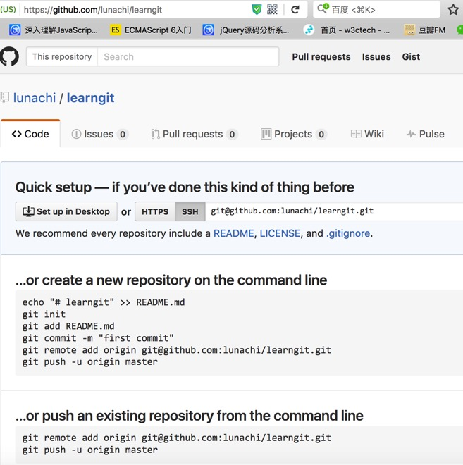
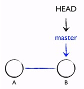
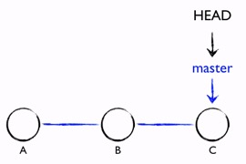
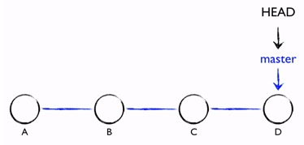

参考：   
廖雪峰Git教程    
[http://www.liaoxuefeng.com/wiki/0013739516305929606dd18361248578c67b8067c8c017b000](http://www.liaoxuefeng.com/wiki/0013739516305929606dd18361248578c67b8067c8c017b000)

mac下gitLab、sourceTree的配合使用    
[http://www.jianshu.com/p/707de2a1046d](http://www.jianshu.com/p/707de2a1046d)

带GPG签名的Git tag     
[http://airk000.github.io/git/2013/09/30/git-tag-with-gpg-key](http://airk000.github.io/git/2013/09/30/git-tag-with-gpg-key)

Git的官方网站：    
[http://git-scm.com](http://git-scm.com)    
[https://git-scm.com/book/zh/v2](https://git-scm.com/book/zh/v2)

#git
Git是分布式版本控制系统。   
分布式版本控制系统根本没有“中央服务器”，每个人的电脑上都是一个完整的版本库，这样，你工作的时候，就不需要联网了，因为版本库就在你自己的电脑上。既然每个人电脑上都有一个完整的版本库，那多个人如何协作呢？比方说你在自己电脑上改了文件A，你的同事也在他的电脑上改了文件A，这时，你们俩之间只需把各自的修改推送给对方，就可以互相看到对方的修改了。
##安装Git
通过homebrew安装Git，具体方法请参考homebrew的文档：[http://brew.sh/](http://brew.sh/)。

安装完成后，还需要最后一步设置，在命令行输入：

	git config --global user.name "Your Name"
	git config --global user.email "email@example.com"

因为Git是分布式版本控制系统，所以，每个机器都必须自报家门：你的名字和Email地址。

注意git config命令的--global参数，用了这个参数，表示你这台机器上所有的Git仓库都会使用这个配置，当然也可以对某个仓库指定不同的用户名和Email地址。
##创建版本库
版本库又名仓库，英文名repository，这个目录里面的所有文件都可以被Git管理起来，每个文件的修改、删除，Git都能跟踪，以便任何时刻都可以追踪历史，或者在将来某个时刻可以“还原”。

- 首先，选择一个合适的地方，创建一个空目录：

		mkdir learngit
		cd learngit
		pwd

	pwd命令用于显示当前目录。

- 第二步，通过git init命令把这个目录变成Git可以管理的仓库：

		git init
		
	Initialized empty Git repository in /opt/learngit/.git/   
	当前目录下多了一个.git的目录，这个目录是Git来跟踪管理版本库的，没事千万不要手动修改这个目录里面的文件，不然改乱了，就把Git仓库给破坏了。   
	如果你没有看到.git目录，那是因为这个目录默认是隐藏的，用`ls -ah`命令就可以看见。

##把文件添加到版本库

- 初始化一个Git仓库，使用`git init`命令。
- 添加文件到Git仓库，分两步：
    - 第一步，使用命令`git add <file>`，注意，可反复多次使用，添加多个文件；
    - 第二步，使用命令`git commit -m '注释'`，完成。
- 要随时掌握工作区的状态，使用`git status`命令。
- 如果git status告诉你有文件被修改过，用`git diff`可以查看修改内容。

##版本回退
- HEAD指向的版本就是当前版本，因此，Git允许我们在版本的历史之间穿梭，使用命令`git reset --hard commit_id`。
    
	Git必须知道当前版本是哪个版本，在Git中，用**HEAD**表示当前版本，也就是最新的提交3628164...882e1e0（注意我的提交ID和你的肯定不一样），上一个版本就是**HEAD^**，上上一个版本就是**HEAD^^**，当然往上100个版本写100个^比较容易数不过来，所以写成**HEAD~100**。
	
- 穿梭前，用`git log`可以查看提交历史，以便确定要回退到哪个版本。

	如果嫌输出信息太多，可以试试加上--pretty=oneline参数：
	
		git log --pretty=oneline
		
- 要重返未来，用`git reflog`查看命令历史，以便确定要回到未来的哪个版本。

##工作区和暂存区
工作区（Working Directory）

版本库（Repository）工作区有一个隐藏目录.git，这个不算工作区，而是Git的版本库。   

Git的版本库里存了很多东西，其中最重要的就是称为stage的暂存区，还有Git自动创建的第一个分支master，以及指向master的一个指针叫HEAD。

我们把文件往Git版本库里添加的时候，是分两步执行的：

- 第一步是用`git add`把文件添加进去，实际上就是把文件修改`添加到暂存区`；
- 第二步是用`git commit`提交更改，实际上就是把`暂存区`的所有内容提交到`当前分支`。

因为创建Git版本库时，`Git自动创建了唯一一个master分支`，所以，现在，git commit就是往master分支上提交更改。

##管理修改
Git跟踪并管理的是修改，而非文件。

git commit只负责**把暂存区的修改提交**。

用`git diff HEAD -- <file>`命令可以查看**工作区和版本库里面最新版本的区别**。

每次修改，如果不add到暂存区，那就不会加入到commit中。

##撤销修改
命令`git checkout -- <file>`意思就是，把\<file>文件在工作区的修改全部撤销，这里有两种情况：

- 一种是\<file>自修改后还没有被放到暂存区，现在，撤销修改就回到和版本库一模一样的状态；
- 一种是\<file>已经添加到暂存区后，又作了修改，现在，撤销修改就回到添加到暂存区后的状态。

总之，就是让这个文件回到**最近一次git commit或git add时的状态**。

`git checkout -- file`命令中的`--`很重要，没有`--`，就变成了“切换到另一个分支”的命令，我们在后面的分支管理中会再次遇到git checkout命令。

Git同样告诉我们，用命令`git reset HEAD file`可以把暂存区的修改撤销掉（unstage），重新放回工作区。

`git reset`命令既可以回退版本，也可以把暂存区的修改回退到工作区。当我们用`HEAD`时，表示最新的版本。

> **总结：**

- 场景1：当你改乱了工作区某个文件的内容，想直接丢弃工作区的修改时，用命令`git checkout -- file`。
- 场景2：当你不但改乱了工作区某个文件的内容，还添加到了暂存区时，想丢弃修改，分两步，第一步用命令`git reset HEAD file`，就回到了场景1，第二步按场景1操作。
- 场景3：已经提交了不合适的修改到版本库时，想要撤销本次提交，`git reset --hard commit_id`，不过前提是没有推送到远程库。

##删除文件
在Git中，删除也是一个修改操作，添加一个新文件test.txt到Git并且提交：

	vi test.txt
	:wq!
	git add test.txt
	git commit -m 'add test.txt'
	
用rm命令删了：

	rm test.txt
	
这个时候，Git知道你删除了文件，因此，工作区和版本库就不一致了，git status命令会立刻告诉你哪些文件被删除了：

	git status
	On branch master
	Changes not staged for commit:
	  (use "git add/rm <file>..." to update what will be committed)
	  (use "git checkout -- <file>..." to discard changes in working directory)
	
		deleted:    test.txt
	
	no changes added to commit (use "git add" and/or "git commit -a")
	
现在你有两个选择，**一是确实要从版本库中删除该文件，那就用命令git rm删掉，并且git commit：**

	git rm test.txt
	git commit -m 'remove test.txt'

现在，文件就从版本库中被删除了。

另一种情况是删错了，因为版本库里还有呢，所以可以很轻松地**把误删的文件恢复到最新版本：**

	git checkout -- test.txt

***git checkout其实是用版本库里的版本替换工作区的版本，无论工作区是修改还是删除，都可以“一键还原”。***

##远程仓库
本地Git仓库和GitHub仓库之间的传输是通过`SSH加密`的.

所以，需要一点设置：

- 第1步：创建SSH Key。在用户主目录下，看看有没有.ssh目录，如果有，再看看这个目录下有没有id_rsa和id_rsa.pub这两个文件，如果已经有了，可直接跳到下一步。如果没有，打开Shell（Windows下打开Git Bash），创建SSH Key：

		ssh-keygen -t rsa -C "youremail@example.com"

	你需要把邮件地址换成你自己的邮件地址，然后一路回车。

	如果一切顺利的话，可以在用户主目录里找到`.ssh`目录，里面有`id_rsa`和`id_rsa.pub`两个文件，这两个就是SSH Key的秘钥对，id_rsa是私钥，不能泄露出去，id_rsa.pub是公钥，可以放心地告诉任何人。

- 第2步：登陆GitHub，打开“Account settings”，“SSH Keys”页面：

	然后，点“Add SSH Key”，填上任意Title，在Key文本框里粘贴id_rsa.pub文件的内容：

点“Add Key”，你就应该看到已经添加的Key：

为什么GitHub需要SSH Key呢？因为GitHub需要识别出你推送的提交确实是你推送的，而不是别人冒充的，而Git支持SSH协议，所以，GitHub只要知道了你的公钥，就可以确认只有你自己才能推送。

当然，GitHub允许你添加多个Key。假定你有若干电脑，你一会儿在公司提交，一会儿在家里提交，只要把每台电脑的Key都添加到GitHub，就可以在每台电脑上往GitHub推送了。

##添加远程库
现在的情景是，你已经在本地创建了一个Git仓库后，又想在GitHub创建一个Git仓库，并且让这两个仓库进行远程同步。

- 首先，登陆GitHub，然后，在右上角找到“Create a new repo”按钮，创建一个新的仓库：

- 在Repository name填入learngit，其他保持默认设置，点击“Create repository”按钮，就成功地创建了一个新的Git仓库：

目前，在GitHub上的这个learngit仓库还是空的，GitHub告诉我们，可以从这个仓库克隆出新的仓库，也可以把一个已有的本地仓库与之关联，然后，把本地仓库的内容推送到GitHub仓库。

	现在，我们根据GitHub的提示，在本地的learngit仓库下运行命令：

		git remote add origin git@github.com:lunachi/learngit.git
	请千万注意，把上面的lunachi替换成你自己的GitHub账户名，否则，你在本地关联的就是我的远程库，关联没有问题，但是你以后推送是推不上去的，因为你的SSH Key公钥不在我的账户列表中。

	添加后，远程库的名字就是origin，这是Git默认的叫法，也可以改成别的，但是origin这个名字一看就知道是远程库。

- 下一步，就可以把本地库的所有内容推送到远程库上：
	
		git push -u origin master
	把本地库的内容推送到远程，用`git push`命令，实际上是把当前分支`master`推送到远程。

	由于远程库是空的，我们第一次推送`master`分支时，加上了`-u`参数，Git不但会把本地的`master`分支内容推送的远程新的`master`分支，还会把本地的`master`分支和远程的master分支关联起来，在以后的推送或者拉取时就可以简化命令。

	推送成功后，可以立刻在GitHub页面中看到远程库的内容已经和本地一模一样.
	
	从现在起，只要本地作了提交，就可以通过命令：

		git push origin master

	把本地`master`分支的最新修改推送至GitHub，现在，你就拥有了真正的分布式版本库！

问题：

Warning: Permanently added the RSA host key for IP address '192.30.253.112' to the list of known hosts.   
解决：host中加入192.30.253.112 github.com

Permission denied (publickey).
fatal: Could not read from remote repository.   
解决：把本地生成的id_rsa.pub添加到github中。

> **小结**

- 要关联一个远程库，使用命令`git remote add origin git@server-name:path/repo-name.git`；
- 关联后，使用命令`git push -u origin master`第一次推送master分支的所有内容；
- 此后，每次本地提交后，只要有必要，就可以使用命令`git push origin master`推送最新修改；

##分支管理
###创建与合并分支
每次提交，Git都把它们串成一条时间线，这条时间线就是一个分支。截止到目前，只有一条时间线，在Git里，这个分支叫主分支，即`master`分支。`HEAD`严格来说不是指向提交，而是指向`master`，`master`才是指向提交的，所以，`HEAD`指向的就是当前分支。

一开始的时候，`master`分支是一条线，Git用`master`指向最新的提交，再用`HEAD`指向`master`，就能确定当前分支，以及当前分支的提交点：

每次提交，`master`分支都会向前移动一步，这样，随着你不断提交，`master`分支的线也越来越长:

当我们创建新的分支，例如`dev`时，Git新建了一个指针叫`dev`，指向`master`相同的提交，再把`HEAD`指向`dev`，就表示当前分支在`dev`上：

你看，Git创建一个分支很快，因为除了增加一个dev指针，改改HEAD的指向，工作区的文件都没有任何变化！

不过，从现在开始，对工作区的修改和提交就是针对dev分支了，比如新提交一次后，dev指针往前移动一步，而master指针不变：

假如我们在dev上的工作完成了，就可以把dev合并到master上。Git怎么合并呢？最简单的方法，就是直接把master指向dev的当前提交，就完成了合并：

所以Git合并分支也很快！就改改指针，工作区内容也不变！

合并完分支后，甚至可以删除dev分支。删除dev分支就是把dev指针给删掉，删掉后，我们就剩下了一条master分支：

####实战
首先，我们创建dev分支，然后切换到dev分支：

	git checkout -b dev

`git checkout`命令加上`-b`参数表示创建并切换，相当于以下两条命令：

	git branch dev
	git checkout dev

然后，用`git branch`命令查看当前分支：

	git branch

`git branch`命令会列出所有分支，当前分支前面会标一个*号。

然后，我们就可以在dev分支上正常提交，比如对readme.txt做个修改，加上一行：

Creating a new branch is quick.

然后提交：

	git add readme.txt 
	git commit -m "branch test"

现在，dev分支的工作完成，我们就可以切换回master分支：

	git checkout master

切换回master分支后，再查看一个readme.txt文件，刚才添加的内容不见了！因为那个提交是在dev分支上，而master分支此刻的提交点并没有变.

现在，我们把dev分支的工作成果合并到master分支上：

	git merge dev

`git merge`命令用于合并指定分支到当前分支。合并后，再查看readme.txt的内容，就可以看到，和dev分支的最新提交是完全一样的。

注意到上面的`Fast-forward`信息，Git告诉我们，这次合并是“快进模式”，也就是直接把master指向dev的当前提交，所以合并速度非常快。

合并完成后，就可以放心地删除dev分支了：

	git branch -d dev

删除后，查看branch，就只剩下master分支了：

	git branch

因为创建、合并和删除分支非常快，所以Git鼓励你使用分支完成某个任务，合并后再删掉分支，这和直接在master分支上工作效果是一样的，但过程更安全。

>**总结**

查看分支：`git branch`

创建分支：`git branch <name>`

切换分支：`git checkout <name>`

创建+切换分支：`git checkout -b <name>`

合并某分支到当前分支：`git merge <name>`

删除分支：`git branch -d <name>`

###解决冲突
准备新的feature1分支，继续我们的新分支开发：

	$ git checkout -b feature1
	Switched to a new branch 'feature1'

修改readme.txt最后一行，改为：

	Creating a new branch is quick AND simple.

在feature1分支上提交：

	$ git add readme.txt 
	$ git commit -m "AND simple"
	[feature1 75a857c] AND simple
	 1 file changed, 1 insertion(+), 1 deletion(-)

切换到master分支：

	$ git checkout master
	Switched to branch 'master'
	Your branch is ahead of 'origin/master' by 1 commit.

Git还会自动提示我们当前master分支比远程的master分支要超前1个提交。

在master分支上把readme.txt文件的最后一行改为：

	Creating a new branch is quick & simple.

提交：

	$ git add readme.txt 
	$ git commit -m "& simple"
	[master 400b400] & simple
	 1 file changed, 1 insertion(+), 1 deletion(-)

现在，master分支和feature1分支各自都分别有新的提交，变成了这样：

这种情况下，Git无法执行“快速合并”，只能试图把各自的修改合并起来，但这种合并就可能会有冲突，我们试试看：

	$ git merge feature1
	Auto-merging readme.txt
	CONFLICT (content): Merge conflict in readme.txt
	Automatic merge failed; fix conflicts and then commit the result.

果然冲突了！Git告诉我们，readme.txt文件存在冲突，必须手动解决冲突后再提交。git status也可以告诉我们冲突的文件：

	$ git status
	# On branch master
	# Your branch is ahead of 'origin/master' by 2 commits.
	#
	# Unmerged paths:
	#   (use "git add/rm <file>..." as appropriate to mark resolution)
	#
	#       both modified:      readme.txt
	#
	no changes added to commit (use "git add" and/or "git commit -a")

我们可以直接查看readme.txt的内容：

	Git is a distributed version control system.
	Git is free software distributed under the GPL.
	Git has a mutable index called stage.
	Git tracks changes of files.
	<<<<<<< HEAD
	Creating a new branch is quick & simple.
	=======
	Creating a new branch is quick AND simple.
	>>>>>>> dev1

Git用<<<<<<<，=======，>>>>>>>标记出不同分支的内容，我们修改如下后保存：

	Creating a new branch is quick and simple.

再提交：

	$ git add readme.txt 
	$ git commit -m "conflict fixed"
	[master 59bc1cb] conflict fixed

现在，master分支和feature1分支变成了下图所示：

用带参数的git log也可以看到分支的合并情况：

	$ git log --graph --pretty=oneline --abbrev-commit
	*   59bc1cb conflict fixed
	|\
	| * 75a857c AND simple
	* | 400b400 & simple
	|/
	* fec145a branch test
	...

最后，删除feature1分支：

	$ git branch -d feature1
	Deleted branch feature1 (was 75a857c).

工作完成。

当Git无法自动合并分支时，就必须首先解决冲突。解决冲突后，再提交，合并完成。   
用`git log --graph`命令可以看到分支合并图。

###分支管理策略
通常，合并分支时，如果可能，Git会用Fast forward模式，但这种模式下，删除分支后，会丢掉分支信息。

如果要强制禁用`Fast forward`模式，Git就会在merge时生成一个新的commit，这样，从分支历史上就可以看出分支信息。

下面我们实战一下`--no-ff`方式的git merge：

首先，仍然创建并切换dev分支：

	$ git checkout -b dev
	Switched to a new branch 'dev'

修改readme.txt文件，并提交一个新的commit：

	$ git add readme.txt 
	$ git commit -m "add merge"
	[dev 6224937] add merge
	 1 file changed, 1 insertion(+)

现在，我们切换回master：

	$ git checkout master
	Switched to branch 'master'

准备合并dev分支，请注意`--no-ff参数，表示禁用Fast forward`：

	$ git merge --no-ff -m "merge with no-ff" dev
	Merge made by the 'recursive' strategy.
	 readme.txt |    1 +
	 1 file changed, 1 insertion(+)

因为本次合并要创建一个新的commit，所以加上-m参数，把commit描述写进去。

合并后，我们用git log看看分支历史：

	$ git log --graph --pretty=oneline --abbrev-commit
	*   7825a50 merge with no-ff
	|\
	| * 6224937 add merge
	|/
	*   59bc1cb conflict fixed
	...

可以看到，不使用Fast forward模式，merge后就像这样：

**在实际开发中，我们应该按照几个基本原则进行分支管理：**

首先，master分支应该是非常稳定的，也就是仅用来发布新版本，平时不能在上面干活；

那在哪干活呢？干活都在dev分支上，也就是说，dev分支是不稳定的，到某个时候，比如1.0版本发布时，再把dev分支合并到master上，在master分支发布1.0版本；

你和你的小伙伴们每个人都在dev分支上干活，每个人都有自己的分支，时不时地往dev分支上合并就可以了。

所以，团队合作的分支看起来就像这样：

>合并分支时，加上--no-ff参数就可以用普通模式合并，合并后的历史有分支，能看出来曾经做过合并，而fast forward合并就看不出来曾经做过合并。

###Bug分支
Git还提供了一个`stash`功能，可以把当前工作现场“储藏”起来，等以后恢复现场后继续工作

###Feature分支
- 开发一个新feature，最好新建一个分支；
- 如果要丢弃一个没有被合并过的分支，可以通过`git branch -D <name>`强行删除。

feature分支：添加一个新功能时，你肯定不希望因为一些实验性质的代码，把主分支搞乱了，所以，每添加一个新功能，最好新建一个feature分支，在上面开发，完成后，合并，最后，删除该feature分支。

###多人协作
>**当你从远程仓库克隆时，实际上Git自动把本地的master分支和远程的master分支对应起来了，并且，远程仓库的默认名称是`origin`。**

要查看远程库的信息，用`git remote`：

	$ git remote
	origin

或者，用`git remote -v`显示更详细的信息：

	$ git remote -v
	origin  git@github.com:lunachi/learngit.git (fetch)
	origin  git@github.com:lunachi/learngit.git (push)

上面显示了可以抓取和推送的origin的地址。如果没有推送权限，就看不到push的地址。

####推送分支
推送分支，就是把该分支上的所有本地提交推送到远程库。推送时，要指定本地分支，这样，Git就会把该分支推送到远程库对应的远程分支上：

	$ git push origin master

如果要推送其他分支，比如dev，就改成：

	$ git push origin dev

但是，并不是一定要把本地分支往远程推送，那么，哪些分支需要推送，哪些不需要呢？

- master分支是主分支，因此要时刻与远程同步；
- dev分支是开发分支，团队所有成员都需要在上面工作，所以也需要与远程同步；
- bug分支只用于在本地修复bug，就没必要推到远程了，除非老板要看看你每周到底修复了几个bug；
- feature分支是否推到远程，取决于你是否和你的小伙伴合作在上面开发。

总之，就是在Git中，分支完全可以在本地自己藏着玩，是否推送，视你的心情而定！

####抓取分支
多人协作时，大家都会往master和dev分支上推送各自的修改。

现在，模拟一个你的小伙伴，可以在另一台电脑（注意要把SSH Key添加到GitHub）或者同一台电脑的另一个目录下克隆：

	$ git clone git@github.com:lunachi/learngit.git

当你的小伙伴从远程库clone时，默认情况下，你的小伙伴只能看到本地的master分支。不信可以用git branch命令看看：

	$ git branch
	* master

现在，你的小伙伴要在dev分支上开发，就必须创建远程origin的dev分支到本地，于是他用这个命令创建本地dev分支：

	$ git checkout -b dev origin/dev

现在，他就可以在dev上继续修改，然后，时不时地把dev分支push到远程：

	$ git commit -m "注释"
	$ git push origin dev
	
你的小伙伴已经向origin/dev分支推送了他的提交，而碰巧你也对同样的文件作了修改，并试图推送：

	$ git add hello.txt
	
	$ git commit -m 'opt 分支推送'
	[dev 953d100] opt 分支推送
	 1 file changed, 2 insertions(+)
	 
	$ git push origin dev
	To git@github.com:lunachi/learngit.git
	 ! [rejected]        dev -> dev (fetch first)
	error: failed to push some refs to 'git@github.com:lunachi/learngit.git'
	hint: Updates were rejected because the remote contains work that you do
	hint: not have locally. This is usually caused by another repository pushing
	hint: to the same ref. You may want to first integrate the remote changes
	hint: (e.g., 'git pull ...') before pushing again.
	hint: See the 'Note about fast-forwards' in 'git push --help' for details.

推送失败，因为你的小伙伴的最新提交和你试图推送的提交有冲突，解决办法也很简单，Git已经提示我们，先用git pull把最新的提交从origin/dev抓下来，然后，在本地合并，解决冲突，再推送：

	$ git pull
	remote: Counting objects: 3, done.
	remote: Compressing objects: 100% (2/2), done.
	remote: Total 3 (delta 1), reused 3 (delta 1), pack-reused 0
	Unpacking objects: 100% (3/3), done.
	From github.com:lunachi/learngit
	   5817781..a65ffec  dev        -> origin/dev
	There is no tracking information for the current branch.
	Please specify which branch you want to merge with.
	See git-pull(1) for details.
	
	    git pull <remote> <branch>
	
	If you wish to set tracking information for this branch you can do so with:
	
	    git branch --set-upstream-to=origin/<branch> dev
	新建hello文件
	
git pull也失败了，原因是没有指定本地dev分支与远程origin/dev分支的链接，根据提示，设置dev和origin/dev的链接

	$ git branch --set-upstream-to=origin/dev dev
	Branch dev set up to track remote branch dev from origin.
	
再pull：

	$ git pull
	Auto-merging hello.txt
	CONFLICT (content): Merge conflict in hello.txt
	Automatic merge failed; fix conflicts and then commit the result.

这回git pull成功，但是合并有冲突，需要手动解决，解决的方法和分支管理中的解决冲突完全一样。解决后，提交，再push：

	$ vi hello.txt
	$ git add hello.txt
	$ git commit -m '合并远程冲突分支后push'
	$ git push origin dev

**因此，多人协作的工作模式通常是这样：**

- 首先，可以试图用git push origin branch-name推送自己的修改；
- 如果推送失败，则因为远程分支比你的本地更新，需要先用git pull试图合并；
- 如果合并有冲突，则解决冲突，并在本地提交；
- 没有冲突或者解决掉冲突后，再用git push origin branch-name推送就能成功！

***如果git pull提示“no tracking information”，则说明本地分支和远程分支的链接关系没有创建，用命令git branch --set-upstream branch-name origin/branch-name。***

这就是多人协作的工作模式，一旦熟悉了，就非常简单。

>**总结**

- 查看远程库信息，使用git remote -v；
- 本地新建的分支如果不推送到远程，对其他人就是不可见的；
- 从本地推送分支，使用git push origin branch-name，如果推送失败，先用git pull抓取远程的新提交；
- 在本地创建和远程分支对应的分支，使用git checkout -b branch-name origin/branch-name，本地和远程分支的名称最好一致；
- 建立本地分支和远程分支的关联，使用git branch --set-upstream branch-name origin/branch-name；
- 从远程抓取分支，使用git pull，如果有冲突，要先处理冲突。

##标签管理
发布一个版本时，我们通常先在版本库中打一个标签（tag），这样，就唯一确定了打标签时刻的版本。将来无论什么时候，取某个标签的版本，就是把那个打标签的时刻的历史版本取出来。所以，标签也是版本库的一个快照。

Git的标签虽然是版本库的快照，但其实它就是指向某个commit的指针（跟分支很像对不对？但是分支可以移动，标签不能移动），所以，创建和删除标签都是瞬间完成的。

**tag就是一个让人容易记住的有意义的名字，它跟某个commit绑在一起。**

###创建标签
- 在Git中打标签非常简单，首先，切换到需要打标签的分支上：

		$ git branch
		* dev
		  master
		$ git checkout master
		Switched to branch 'master'

- 然后，敲命令`git tag <name>`就可以打一个新标签：

		$ git tag v1.0

- 可以用命令`git tag`查看所有标签：

		$ git tag
		v1.0

- 默认标签是打在最新提交的commit上的。有时候，如果忘了打标签，比如，现在已经是周五了，但应该在周一打的标签没有打，怎么办？

	方法是找到历史提交的commit id，然后打上就可以了：

		$ git log --pretty=oneline --abbrev-commit
		6a5819e merged bug fix 101
		cc17032 fix bug 101
		7825a50 merge with no-ff
		6224937 add merge
		59bc1cb conflict fixed
		400b400 & simple
		75a857c AND simple
		fec145a branch test
		d17efd8 remove test.txt
		...

	比方说要对add merge这次提交打标签，它对应的commit id是6224937，敲入命令：

		$ git tag v0.9 6224937

	再用命令git tag查看标签：

		$ git tag
		v0.9
		v1.0

- 注意，标签不是按时间顺序列出，而是按字母排序的。可以用`git show <tagname>`查看标签信息：

		$ git show v0.9
		commit 622493706ab447b6bb37e4e2a2f276a20fed2ab4
		Author: Michael Liao <askxuefeng@gmail.com>
		Date:   Thu Aug 22 11:22:08 2013 +0800
		
		    add merge
		...

	可以看到，v0.9确实打在add merge这次提交上。
- 还可以**创建带有说明的标签**，`用-a指定标签名，-m指定说明文字`：

		$ git tag -a v0.1 -m "version 0.1 released" 3628164

	用命令git show <tagname>可以看到说明文字：
	
		$ git show v0.1
		tag v0.1
		Tagger: Michael Liao <askxuefeng@gmail.com>
		Date:   Mon Aug 26 07:28:11 2013 +0800
		
		version 0.1 released
		
		commit 3628164fb26d48395383f8f31179f24e0882e1e0
		Author: Michael Liao <askxuefeng@gmail.com>
		Date:   Tue Aug 20 15:11:49 2013 +0800
		
		    append GPL
		    
>**总结**

- 命令`git tag <name>`用于新建一个标签，默认为HEAD，也可以指定一个commit id；
- `git tag -a <tagname> -m "blablabla..."`可以指定标签信息；
- `git tag -s <tagname> -m "blablabla..."`可以用PGP签名标签；
- 命令`git tag`可以查看所有标签。

###操作标签
- 如果标签打错了，也可以删除：

		$ git tag -d v0.1
		Deleted tag 'v0.1' (was e078af9)

- 因为创建的标签都只存储在本地，不会自动推送到远程。所以，打错的标签可以在本地安全删除。

	如果要推送某个标签到远程，使用命令`git push origin <tagname>`：

		$ git push origin v1.0
		Total 0 (delta 0), reused 0 (delta 0)
		To git@github.com:michaelliao/learngit.git
		 * [new tag]         v1.0 -> v1.0

- 或者，一次性推送全部尚未推送到远程的本地标签：

		$ git push origin --tags
		Counting objects: 1, done.
		Writing objects: 100% (1/1), 554 bytes, done.
		Total 1 (delta 0), reused 0 (delta 0)
		To git@github.com:michaelliao/learngit.git
		 * [new tag]         v0.2 -> v0.2
		 * [new tag]         v0.9 -> v0.9

- 如果标签已经推送到远程，要删除远程标签就麻烦一点，先从本地删除：

		$ git tag -d v0.9
		Deleted tag 'v0.9' (was 6224937)

	然后，从远程删除。删除命令也是push，但是格式如下：

		$ git push origin :refs/tags/v0.9
		To git@github.com:michaelliao/learngit.git
		 - [deleted]         v0.9

	要看看是否真的从远程库删除了标签，可以登陆GitHub查看。
	
>**总结**

- 命令`git push origin <tagname>`可以推送一个本地标签；
- 命令`git push origin --tags`可以推送全部未推送过的本地标签；
- 命令`git tag -d <tagname>`可以删除一个本地标签；
- 命令`git push origin :refs/tags/<tagname>`可以删除一个远程标签。

##自定义Git
###忽略特殊文件
有些时候，你必须把某些文件放到Git工作目录中，但又不能提交它们，每次git status都会显示Untracked files ...，有强迫症的童鞋心里肯定不爽。

这个问题解决起来也很简单，在Git工作区的根目录下创建一个特殊的`.gitignore`文件，然后把要忽略的文件名填进去，Git就会自动忽略这些文件。

不需要从头写.gitignore文件，GitHub已经为我们准备了各种配置文件，只需要组合一下就可以使用了。所有配置文件可以直接在线浏览：[https://github.com/github/gitignore](https://github.com/github/gitignore)

忽略文件的原则是：

1. 忽略操作系统自动生成的文件，比如缩略图等；
- 忽略编译生成的中间文件、可执行文件等，也就是如果一个文件是通过另一个文件自动生成的，那自动生成的文件就没必要放进版本库，比如Java编译产生的.class文件；
- 忽略你自己的带有敏感信息的配置文件，比如存放口令的配置文件。

编辑好.gitignore文件，最后一步就是把.gitignore也提交到Git，就完成了！当然检验.gitignore的标准是git status命令是不是说working directory clean。

有些时候，你想添加一个文件到Git，但发现添加不了，原因是这个文件被.gitignore忽略了：

	$ git add App.class
	The following paths are ignored by one of your .gitignore files:
	App.class
	Use -f if you really want to add them.

**如果你确实想添加该文件，可以用`-f`强制添加到Git：**

	$ git add -f App.class

**或者你发现，可能是.gitignore写得有问题，需要找出来到底哪个规则写错了，可以用`git check-ignore`命令检查：**

	$ git check-ignore -v App.class
	.gitignore:3:*.class    App.class

Git会告诉我们，.gitignore的第3行规则忽略了该文件，于是我们就可以知道应该修订哪个规则。

**小结**

- 忽略某些文件时，需要编写.gitignore；
- .gitignore文件本身要放到版本库里，并且可以对.gitignore做版本管理！

###配置别名
有没有经常敲错命令？比如git status？status这个单词真心不好记。

如果敲git st就表示git status那就简单多了，当然这种偷懒的办法我们是极力赞成的。

我们只需要敲一行命令，告诉Git，以后st就表示status：

	$ git config --global alias.st status

好了，现在敲git st看看效果。

当然还有别的命令可以简写，很多人都用co表示checkout，ci表示commit，br表示branch：

	$ git config --global alias.co checkout
	$ git config --global alias.ci commit
	$ git config --global alias.br branch

以后提交就可以简写成：

	$ git ci -m "bala bala bala..."

`--global`参数是全局参数，也就是这些命令在这台电脑的所有Git仓库下都有用。

命令git reset HEAD file可以把暂存区的修改撤销掉（unstage），重新放回工作区。既然是一个unstage操作，就可以配置一个unstage别名：

	$ git config --global alias.unstage 'reset HEAD'

当你敲入命令：

	$ git unstage test.py

实际上Git执行的是：

	$ git reset HEAD test.py

配置一个git last，让其显示最后一次提交信息：

	$ git config --global alias.last 'log -1'

这样，用git last就能显示最近一次的提交：

	$ git last
	commit adca45d317e6d8a4b23f9811c3d7b7f0f180bfe2
	Merge: bd6ae48 291bea8
	Author: Michael Liao <askxuefeng@gmail.com>
	Date:   Thu Aug 22 22:49:22 2013 +0800
	
	    merge & fix hello.py

甚至还有人丧心病狂地把lg配置成了：

	git config --global alias.lg "log --color --graph --pretty=format:'%Cred%h%Creset -%C(yellow)%d%Creset %s %Cgreen(%cr) %C(bold blue)<%an>%Creset' --abbrev-commit"

来看看`git lg`的效果：

###配置文件
>配置Git的时候，加上--global是针对当前用户起作用的，如果不加，那只针对当前的仓库起作用。

配置文件放哪了？每个仓库的Git配置文件都放在`.git/config`文件中：

	$ cat .git/config 
	[core]
	    repositoryformatversion = 0
	    filemode = true
	    bare = false
	    logallrefupdates = true
	    ignorecase = true
	    precomposeunicode = true
	[remote "origin"]
	    url = git@github.com:michaelliao/learngit.git
	    fetch = +refs/heads/*:refs/remotes/origin/*
	[branch "master"]
	    remote = origin
	    merge = refs/heads/master
	[alias]
	    last = log -1

别名就在[alias]后面，要删除别名，直接把对应的行删掉即可。

而当前用户的Git配置文件放在用户主目录下的一个隐藏文件`.gitconfig`中：

	$ cat .gitconfig
	[alias]
	    co = checkout
	    ci = commit
	    br = branch
	    st = status
	[user]
	    name = Your Name
	    email = your@email.com

配置别名也可以直接修改这个文件，如果改错了，可以删掉文件重新通过命令配置。

