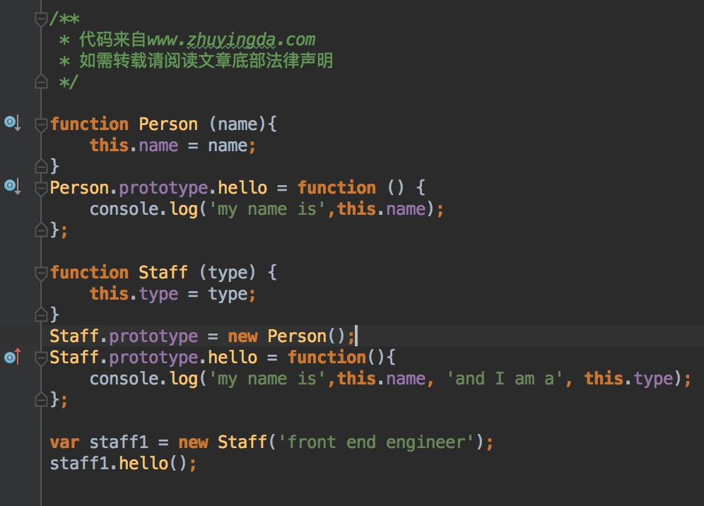

代码片段：

	expr && doSomething();
	
	// Instead of:
	if (expr) {
	   doSomething();
	}
	
代码片段：

	function doSomething () {
	   return { foo: "bar" };
	}
	var expr = true;
	var res = expr && doSomething();
	res && console.log(res);
	// → { foo: "bar" }	
	
类型转换 代码片段：

	// From anything to a number
	
	var foo = "42";
	var myNumber = +foo; // shortcut for Number(foo)
	// → 42
	
	// Tip: you can convert it directly into a negative number
	var negativeFoo = -foo; // or -Number(foo)
	// → -42
	
	// From object to array
	// Tip: `arguments` is an object and in general you want to use it as array
	var args = { 0: "foo", 1: "bar", length: 2 };
	Array.prototype.slice.call(args)
	// → [ 'foo', 'bar' ]
	
	// Anything to boolean
	/// Non non p is a boolean p
	var t = 1;
	var f = 0;
	!!t
	// → true
	!!f
	// → false
	
	/// And non-p is a boolean non-p
	!t
	// → false
	!f
	// → true
	
	// Anything to string
	var foo = 42;
	"" + foo // shortcut for String(foo)
	// → "42"
	
	foo = { hello: "world" };
	JSON.stringify(foo);
	// → '{ "hello":"world" }'
	
	JSON.stringify(foo, null, 4); // beautify the things
	// →
	// '{
	//    "hello": "world"
	// }'
	
	// Note you cannot JSON.stringify circular structures
	JSON.stringify(window);
	// ⚠ TypeError: JSON.stringify cannot serialize cyclic structures.
	
**Javascript的特点在于,所有function都可以与new关键字连接起来成为"声明一种类型对象"的"构造函数",这也是js这门语言中最常用的声明自定义数据结构的方式。**

在执行new的这句代码时,js引擎做的事情实际上是在内存中(更准确的说是内存的堆空间里保存着值,而只把指向这个值的一个指针存在栈中便于GC的管理) 声明了一个新的Object,然后对这个Object做的一系列赋值操作都是基于构造函数中 你对this指针所做的操作,假设你给this.a赋一个值是1,new出来的这个对象一定会有个a属性,值就是1;另外new的过程还会`连接原型对象`, 也就是我们刚刚说到的prototype,也就是把new出来的这个对象的`__proto__`(js里所有字面量直接声明的对象都有这个指针, 默认指向Object的构造函数)指针指向构造函数的`prototype`对象。来看看下面的代码:

上面这段代码基本上就是在Javascript语言中声明一个自定义类型(相当于Java中的类)的标准姿势,在声明了Person构造函数之后,我们把 hello方法没有写在构造函数内部,而是放在了他的prototype原型中。new出来的实例,调用hello方法时,首先会遍历person1内部的属性, 发现没有hello方法,于是js引擎就会沿着__proto__指针拿到它的原型对象,就是我们刚刚声明的那个prototype,随后遍历这个对象,找到 了hello方法,于是调用之;如果在person1的原型中依然没有找到hello方法,那么会再根据原型对象的__proto__指针向上查找,如此往复 直到查找到Object.prototype这一层。由于js中Object的原型对象的__proto__指针指向的是null,所以如果一直没找到hello方法的话, 向上查找的行为到了这一层将会停止,随后js引擎对person1.hello返回一个undefined,如果你试图进行person1.hello(),js会抛出一个 typeError,告诉你undefined不是一个可调用的函数。

子类继承父类时，该如何向父类的构造函数中传递参数呢？

由于Person类的构造函数需要传递一个参数name，而Staff类在实例化的时候，Staff.prototype必须在已经new了一个Person实例 之后，否则Staff就不是继承Person了。

解决这个问题的办法被称为"借用构造函数"。具体看下面代码：

其实就是在子类的构造函数体内，加一行代码：通过调用父类的构造函数并将其this指针定义为子类构造函数的this，说得再直白一点 就是父类构造函数里对this都做了什么，子类构造函数也得干一遍；能实现这件事就要依靠JS中较为难以理解的方法call。

同样的这一段代码，在ES6中是如何表达的：

#JavaScript SDK设计需要注意的点
参考：   
[http://www.zcfy.cc/article/javascript-sdk-design-guide-530.html](http://www.zcfy.cc/article/javascript-sdk-design-guide-530.html)

##使用异步语法来加载脚本
###异步语法

	
	
###针对现代浏览器，可以使用async。

	
	
###传统语法

	

###异步的问题

如果异步加载，不能像下列代码一样调用SDK。

	
	
这样做会导致未知的结果，因为SDKName()执行的时候尚未被加载完成。

	
	
或者 使用[].push

	
	
##命名空间
应该用(function () { ... })()把SDK代码包起来。

jQuery, Node.js等等类库经常使用的一个方法是把创造私有命名空间的整个文件用闭包包起来，这样可以避免和其他模块冲突。

避免 命名空间冲突

##Cookie
###检查Cookie可写性
给定一个域（假设是当前主机名），检查cookie是否可写。

	var checkCookieWritable = function(domain) {
	    try {
	        // Create cookie
	        document.cookie = 'cookietest=1' + (domain ? '; domain=' + domain : '');
	        var ret = document.cookie.indexOf('cookietest=') != -1;
	        // Delete cookie
	        document.cookie = 'cookietest=1; expires=Thu, 01-Jan-1970 00:00:01 GMT' + (domain ? '; domain=' + domain : '');
	        return ret;
	    } catch (e) {
	        return false;
	    }
	};
	
###读写删除Cookie
读/写/删除 cookie 代码片段。

	var cookie = {
	    write: function(name, value, days, domain, path) {
	        var date = new Date();
	        days = days || 730; // two years
	        path = path || '/';
	        date.setTime(date.getTime() + (days * 24 * 60 * 60 * 1000));
	        var expires = '; expires=' + date.toGMTString();
	        var cookieValue = name + '=' + value + expires + '; path=' + path;
	        if (domain) {
	            cookieValue += '; domain=' + domain;
	        }
	        document.cookie = cookieValue;
	    },
	    read: function(name) {
	        var allCookie = '' + document.cookie;
	        var index = allCookie.indexOf(name);
	        if (name === undefined || name === '' || index === -1) return '';
	        var ind1 = allCookie.indexOf(';', index);
	        if (ind1 == -1) ind1 = allCookie.length;
	        return unescape(allCookie.substring(index + name.length + 1, ind1));
	    },
	    remove: function(name) {
	        if (this.read(name)) {
	            this.write(name, '', -1, '/');
	        }
	    }
	};
	
##Document Ready
在开始执行SDK功能之前要先确保整个页面加载完成。

	// handle IE8+
	function ready (fn) {
	    if (document.readyState != 'loading') {
	        fn();
	    } else if (window.addEventListener) {
	        // window.addEventListener('load', fn);
	        window.addEventListener('DOMContentLoaded', fn);
	    } else {
	        window.attachEvent('onreadystatechange', function() {
	            if (document.readyState != 'loading')
	                fn();
	            });
	    }
	}
在document已经被完全加载和解析后执行，不用等stylesheets，images和子模块完成加载。

load事件可以用来探测页面是否完全加载。

##消息事件

关于iframe和窗口的跨源通信，请读[API文档](https://developer.mozilla.org/en-US/docs/Web/API/Window/postMessage)。

	// in the iframe
	parent.postMessage("Hello"); // string
	
	// ==========================================
	
	// in the iframe's parent
	// Create IE + others compatible event handler
	var eventMethod = window.addEventListener ? "addEventListener" : "attachEvent";
	var eventer = window[eventMethod];
	var messageEvent = eventMethod == "attachEvent" ? "onmessage" : "message";
	
	// Listen to message from child window
	eventer(messageEvent,function(e) {
	  // e.origin , check the message origin
	  console.log('parent received message!:  ',e.data);
	},false);
	
发送的消息格式应该是String，如果用json做一些高级用法，就用JSON String。虽然很多浏览器支持对参数的[结构化克隆算法](https://developer.mozilla.org/en-US/docs/Web/API/Web_Workers_API/Structured_clone_algorithm)，但并不是全部浏览器都支持。

##方向改变

###探测设备方向改变。

	window.addEventListener('orientationchange', fn);
	
###得到方向旋转角度。

	window.orientation; // => 90, -90, 0
	
###竖屏正方向，竖屏反方向，横屏正方向，横屏反方向。（实验性的）

	// https://developer.mozilla.org/en-US/docs/Web/API/Screen/orientation
	var orientation = screen.orientation || screen.mozOrientation || screen.msOrientation;
	
##禁止滚屏

电脑页面用CSS代码overflow: hidden，移动页面不支CSS这种写法，用javascript事件。

	document.addEventListener('touchstart', function(e){ 
		e.preventDefault(); 
	}); // prevent scroll
	// or 
	document.body.addEventListener('touchstart', function(e){ 
		e.preventDefault(); 
	}); // prevent scroll
	// use move if you need some touch event
	document.addEventListener('touchmove', function(e){ 
		e.preventDefault(); 
	}); // prevent scroll

##请求
我们的SDK用Ajax请求和服务器通信，虽然可以用jQuery ajax请求，但这里我们有更好的方案实现它。

###Image Beacon

使用Image Beacon让浏览器通过GET 请求获取图片。

记住加上时间戳防止浏览器缓存

	(new Image()).src = 'http://xxxxx.com/collect?id=1111';
	
需要注意，GET Query字符串有长度限制，一般是2048，取决于浏览器和服务器。你应该检查请求是否超长了。

	if (length > 2048) {
	    // do Multiple Post (form)
	} else {
	    // do Image Beacon
	}
	
你可能在encodeURI 和encodeURIComponent上遇到问题，最好能理解它们。

图片加载成功/失败回调函数。

	var img = new Image();
	img.src = 'http://xxxxx.com/collect?id=1111';
	img.onload = successCallback;
	img.onerror = errorCallback;
	
###单一Post
用表单元素的POST方法发送键值对。

	var form = document.createElement('form');
	var input = document.createElement('input');
	
	form.style.display = 'none';
	form.setAttribute('method', 'POST');
	form.setAttribute('action', 'http://xxxx.com/track');
	
	input.name = 'username';
	input.value = 'attacker';
	
	form.appendChild(input);
	document.getElementsByTagName('body')[0].appendChild(form);
	
	form.submit();
###多重Post
服务一般很复杂，我们需要发送POST发送很多数据。

	function requestWithoutAjax( url, params, method ){
	
	    params = params || {};
	    method = method || "post";
	
	    // function to remove the iframe
	    var removeIframe = function( iframe ){
	        iframe.parentElement.removeChild(iframe);
	    };
	
	    // make a iframe...
	    var iframe = document.createElement('iframe');
	    iframe.style.display = 'none';
	
	    iframe.onload = function(){
	        var iframeDoc = this.contentWindow.document;
	
	        // Make a invisible form
	        var form = iframeDoc.createElement('form');
	        form.method = method;
	        form.action = url;
	        iframeDoc.body.appendChild(form);
	
	        // pass the parameters
	        for( var name in params ){
	            var input = iframeDoc.createElement('input');
	            input.type = 'hidden';
	            input.name = name;
	            input.value = params[name];
	            form.appendChild(input);
	        }
	
	        form.submit();
	        // remove the iframe
	        setTimeout( function(){
	            removeIframe(iframe);
	        }, 500);
	    };
	
	    document.body.appendChild(iframe);
	}
	requestWithoutAjax('url/to', { id: 2, price: 2.5, lastname: 'Gamez'});
	
##URL

###解析URI

	var parser = new URL('http://github.com/huei90');
	parser.hostname; // => "github.com"
	
那些不支持URL()接口的浏览器，尝试DOM createElement('a')方法。

	var parser = document.createElement('a');
	parser.href = "http://github.com/huei90";
	parser.hostname; // => "github.com"
	
##EncodeURI or EncodeURIComponent
理解escape() encodeURI() encodeURIComponent()的区别。[这里](http://stackoverflow.com/questions/75980/when-are-you-supposed-to-use-escape-instead-of-encodeuri-encodeuricomponent/3608791#3608791)。

记住encodeURI() 和 encodeURIComponent()之间有11个字符不同。 这些字符是# $ & + , / : ; = ?

##用回调函数加载脚本
异步加载代码增加回调事件。

	function loadScript(url, callback) {
	  var script = document.createElement('script');
	  script.async = true;
	  script.src = url;
	
	  var entry = document.getElementsByTagName('script')[0];
	  entry.parentNode.insertBefore(script, entry);
	
	  script.onload = script.onreadystatechange = function () {
	    var rdyState = script.readyState;
	
	    if (!rdyState || /complete|loaded/.test(script.readyState)) {
	      callback();
	
	      // detach the event handler to avoid memory leaks in IE (http://mng.bz/W8fx)
	      script.onload = null;
	      script.onreadystatechange = null;
	    }
	  };
	}
	
###只能调用一次的函数

偶尔你希望一个函数只能被调用一次。经常这些函数在事件监听列表，很难管理。当然你可以简单的把它从监听列表删除，但是有时候希望完美，你只是希望函数只能被调用一次。下面的JavaScript函数让它变为可能！

	// Copy from DWB
	// http://davidwalsh.name/javascript-once
	function once(fn, context) { 
	    var result;
	
	    return function() { 
	        if(fn) {
	            result = fn.apply(context || this, arguments);
	            fn = null;
	        }
	
	        return result;
	    };
	}
	
	// Usage
	var canOnlyFireOnce = once(function() {
	    console.log('Fired!');
	});
	
	canOnlyFireOnce(); // "Fired!"
	canOnlyFireOnce(); // nada
	
##getComputedStyle

	
	
	 This is black color span 
	
	
	
ref: [https://developer.mozilla.org/en-US/docs/Web/API/Window/getComputedStyle](https://developer.mozilla.org/en-US/docs/Web/API/Window/getComputedStyle)

##检查元素是否在观察窗

	function isElementInViewport (el) {
	
	    //special bonus for those using jQuery
	    if (typeof jQuery === "function" && el instanceof jQuery) {
	        el = el[0];
	    }
	
	    var rect = el.getBoundingClientRect();
	
	    return (
	        rect.top >= 0 &&
	        rect.left >= 0 &&
	        rect.bottom <= (window.innerHeight || document.documentElement.clientHeight) && /*or $(window).height() */
	        rect.right <= (window.innerWidth || document.documentElement.clientWidth) /*or $(window).width() */
	    );
	}
	
##检查元素可视性

	var isVisible: function(b) {
	    var a = window.getComputedStyle(b);
	    return 0 === a.getPropertyValue("opacity") || "none" === a.getPropertyValue("display") || "hidden" === a.getPropertyValue("visibility") || 0 === parseInt(b.style.opacity, 10) || "none" === b.style.display || "hidden" === b.style.visibility ? false : true;
	}
	
	var element = document.getElementById('box');
	isVisible(element); // => false or true
	
##得到视窗大小

	var getViewportSize = function() {
	    try {
	        var doc = top.document.documentElement
	          , g = (e = top.document.body) && top.document.clientWidth && top.document.clientHeight;
	    } catch (e) {
	        var doc = document.documentElement
	          , g = (e = document.body) && document.clientWidth && document.clientHeight;
	    }
	    var vp = [];
	    doc && doc.clientWidth && doc.clientHeight && ("CSS1Compat" === document.compatMode || !g) ? vp = [doc.clientWidth, doc.clientHeight] : g && (vp = [doc.clientWidth, doc.clientHeight]);
	    return vp;
	}
	
	// return as rray [viewport_width, viewport_height]

