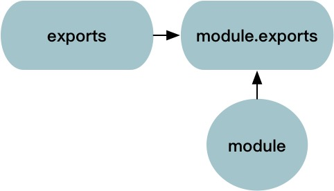
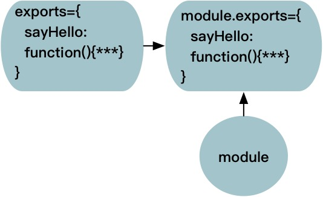
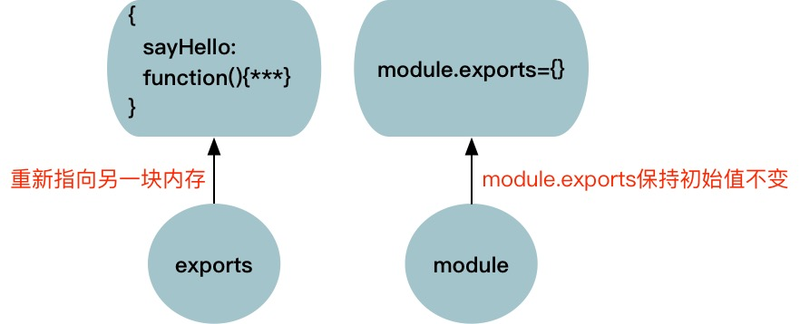

#nodejs之module.exports与exports
*注：代码根目录为lunachi_git/blog/code/nodejs*

##module.exports和exports的作用
　　node模块允许从被引入文件中选择要暴露给程序的函数和变量，这就需要用到module.exports与exports。

##module、module.exports、exports是什么？
下面我们通过代码来分析：

exports和module这两个对象是所有Node.js类型的文件中都默认隐式存在的，比如我们新建一个demo1/index.js文件：

	console.log(module);
	console.log(module.exports);
	console.log(exports);

在终端运行:

	node demo1/index.js

终端输出：

	Module {
	  id: '.',
	  exports: {},
	  parent: null,
	  filename: '/opt/lunachi_git/blog/code/nodejs/demo1/index.js',
	  loaded: false,
	  children: [],
	  paths:
	   [ '/opt/lunachi_git/blog/code/nodejs/demo1/node_modules',
	     '/opt/lunachi_git/blog/code/nodejs/node_modules',
	     '/opt/lunachi_git/blog/code/node_modules',
	     '/opt/lunachi_git/blog/node_modules',
	     '/opt/lunachi_git/node_modules',
	     '/opt/node_modules' ] }
	{}
	{}

**可以看到，demo1/index.js中并未声明exports和module对象，但是它们确实存在。并且可以看到，module.exports和exports的初始值是{}，而module的初始值有一大串属性，其中还包含一个exports属性，它的初始值也是{}。**

##如何导出模块中的变量或方法，怎样使用模块？
如何导出模块中的变量或方法，下面通过代码举例来说明：

1. 创建demo2/module1.js

		function sayHelloMethod() {
		    console.log("sayHelloMethod 方法!");
		}
		module.exports = sayHelloMethod;
	模块中只使用了module.exports把sayHelloMethod方法导出
	
2. 创建demo2/module2.js

		var nameVar = "nameVar 变量";
		function sayHelloMethod() {
		    console.log("sayHelloMethod 方法!");
		}
		module.exports.nameVar = nameVar;
		module.exports.sayHelloMethod = sayHelloMethod;
		
	模块中通过给**module.exports添加属性**的方式把nameVar变量和sayHelloMethod方法导出
	
3. 创建demo2/module3.js

		var nameVar = "nameVar 变量";
		function sayHelloMethod() {
		    console.log("sayHelloMethod 方法!");
		}
		exports.nameVar = nameVar;
		exports.sayHelloMethod = sayHelloMethod;
		
	模块中通过给**exports添加属性**的方式把nameVar变量和sayHelloMethod方法导出
	
4. 创建demo2/module4.js

		var nameVar = "nameVar 变量";
		function sayHelloMethod() {
		    console.log("sayHelloMethod 方法!");
		}
		module.exports.nameVar = nameVar;
		exports.sayHelloMethod = sayHelloMethod;
		
	模块中通过给**module.exports添加属性**的方式把nameVar变量导出，通过给**exports添加属性**的方式把sayHelloMethod方法导出
	
创建demo2/index.js，通过`require`引用要使用的模块:
 
	var module1 = require("./module1.js");
	console.log("require module1");
	module1();
	
	var module2 = require("./module2.js");
	console.log("require module2");
	console.log(module2.nameVar);
	module2.sayHelloMethod();
	
	var module3 = require("./module3.js");
	console.log("require module3");
	console.log(module3.nameVar);
	module3.sayHelloMethod();
	
	var module4 = require("./module4.js");
	console.log("require module4");
	console.log(module4.nameVar);
	module4.sayHelloMethod();
	
在终端运行:

	node demo2/index.js

终端输出：

	require module1
	sayHelloMethod 方法!
	
	require module2
	nameVar 变量
	sayHelloMethod 方法!
	
	require module3
	nameVar 变量
	sayHelloMethod 方法!
	
	require module4
	nameVar 变量
	sayHelloMethod 方法!

**通过以上代码可以看到，通过module.exports、给module.exports添加属性、给exports添加属性都可以将模板内的变量和方法暴露给require模块的程序使用**

##那什么时候使用module.exports？什么时候使用exports呢？

《Nodejs实战》中说：如果模块返回的`函数或变量不止一个`，通过设置`exports对象`的属性来指明它们（demo2/module3.js）。如果模块只返回`一个函数或变量`。则可以设定`module.exports属性`（demo2/module1.js）。
	
##module、module.exports、exports三者之间的关系
下面我们来具体分析module.exports与exports的关系是什么样的。

>首先明确两点(时刻谨记)：
	1. exports一开始是指向module.exports的；
	2. 通过require得到的是module.exports中的内容，而不是exports的内容；

《Nodejs实战》中说：exports只是对module.exports的一个全局引用，最初被定义为一个可以添加属性的空对象，如果把exports设定为别的，就打破了module.exports和exports之间的引用关系。
	     
exports、module.exports、module三者之间的引用关系图如下：

通过代码验证一下，创建demo3/index.js文件：

	console.log(exports);
	console.log(module.exports);
	console.log("exports===module.exports? " + (exports === module.exports));
	
在终端运行:

	node demo3/index.js

终端输出：

	{}
	{}
	exports===module.exports? true
	
由此可见：exports一开始是指向module.exports的，并都初始化为{}。

###下面通过示例继续分析
####例子1
创建如下的demo4/module1.js文件：

	exports.sayHello = function() {
	    console.log('sayHello method!');
	}
创建demo4/index.js文件：

	var module1 = require('./module1');
	module1.sayHello();
	
在终端运行demo4/index.js输出:

	sayHello method!
	
**分析**

在index.js文件中使用require语句从module1.js模块中得到了module.exports。

在module1.js文件中我们在exports的基础上为它添加了一个属性sayHello，这个属性的值是一个函数，并且因为初始时，exports指向的是module.exports，他俩共享同一块内存，所以这个操作后，module.exports变成了这样：

所以，index.js文件中的module1变量的值为：

	{
	    sayHello: function() {console.log('sayHello method!');}
	}

####例子2

创建demo5/module1.js文件：

	exports = {
	    sayHello: function () {
	        console.log("sayHello method!");
	    }
	};
	
创建demo5/index.js文件：

	var module1 = require('./module1');
	
	console.log('module.exports:');
	console.log(module.exports);
	
	module1.sayHello();
	
然后一样在终端运行：

	module.exports:
	{}
	/opt/lunachi_git/blog/code/nodejs/demo5/index.js:6
	module1.sayHello();
	        ^
	
	TypeError: module1.sayHello is not a function
	    at Object.<anonymous> (/opt/lunachi_git/blog/code/nodejs/demo5/index.js:6:9)
	    at Module._compile (module.js:541:32)
	    at Object.Module._extensions..js (module.js:550:10)
	    at Module.load (module.js:456:32)
	    at tryModuleLoad (module.js:415:12)
	    at Function.Module._load (module.js:407:3)
	    at Function.Module.runMain (module.js:575:10)
	    at startup (node.js:159:18)
	    at node.js:444:3	 
	       
**分析**

module1.js文件中将exports重新赋值为一个新的对象，这个时候exports将会自己分配一块新的内存，而不再指向module.exports了，所以这个时候exports和module.exports彻底断绝关系，无论你怎么操作exports对象，都与module.exports无关了。

####例子3
>如果创建了一个`既有exports又有module.exports`的模块，那它会返回module.exports，而export会被忽略。

创建demo6/module1.js文件：

	var nameVar = "nameVar 变量";
	function sayHelloFun() {
	    console.log("sayHelloFun 方法");
	}
	
	console.log("导出前:");
	console.log("1 exports:");
	console.log(exports);
	console.log("1 module.exports");
	console.log(module.exports);
	console.log("1 exports===module.exports? " + (exports === module.exports) + "\n");
	
	exports.nameVar = nameVar;
	console.log("使用exports导出变量nameVar: exports.nameVar = nameVar;");
	console.log("2 exports:");
	console.log(exports);
	console.log("2 module.exports");
	console.log(module.exports);
	console.log("2 exports===module.exports? " + (exports === module.exports) + "\n");
	
	module.exports = sayHelloFun;
	console.log("使用module.exports导出方法sayHelloFun: module.exports = sayHelloFun;");
	console.log("3 exports:");
	console.log(exports);
	console.log("3 module.exports");
	console.log(module.exports);
	console.log("3 exports===module.exports? " + (exports === module.exports) + "\n");
	
创建demo6/index.js文件：

	var module1 = require('./module1');
	console.log("最终导出结果:");
	console.log(module1);
	
在终端运行demo6/index.js输出:

	导出前:
	1 exports:
	{}
	1 module.exports
	{}
	1 exports===module.exports? true
	
	使用exports导出变量nameVar: exports.nameVar = nameVar;
	2 exports:
	{ nameVar: 'nameVar 变量' }
	2 module.exports
	{ nameVar: 'nameVar 变量' }
	2 exports===module.exports? true
	
	使用module.exports导出方法sayHelloFun: module.exports = sayHelloFun;
	3 exports:
	{ nameVar: 'nameVar 变量' }
	3 module.exports
	[Function: sayHelloFun]
	3 exports===module.exports? false
	
	最终导出结果:
	[Function: sayHelloFun]
	
**分析**

`exports只是module.exports的辅助方法。你的模块最终返回module.exports给调用者，而不是exports。exports所做的事情是收集属性，如果module.exports当前没有任何属性的话，exports会把这些属性赋予module.exports。如果module.exports已经存在一些属性的话，那么exports中所用的东西都会被忽略。`

特别注意区分：

	exports.nameVar = nameVar;
	module.exports = sayHelloFun;
	
	//导出结果：[Function: sayHelloFun]
与

	exports.nameVar = nameVar;
	module.exports.sayHelloFun = sayHelloFun;
	
	//导出结果：{ nameVar: 'nameVar 变量', sayHelloFun: [Function: sayHelloFun] }
	
的导出结果。

