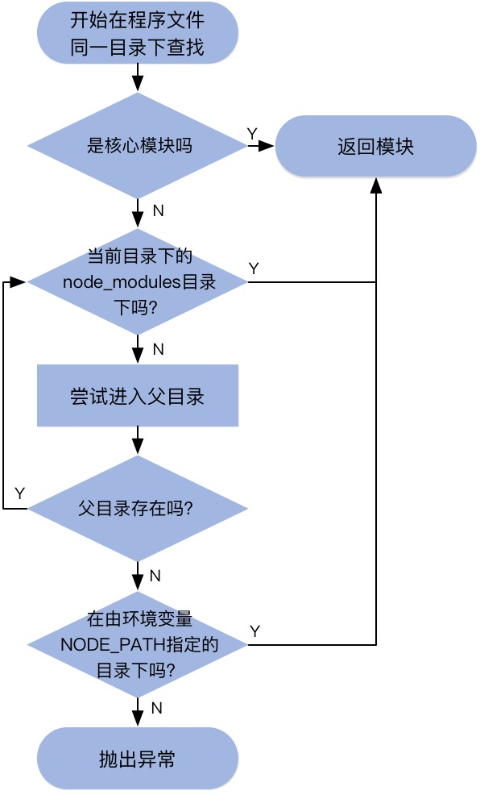
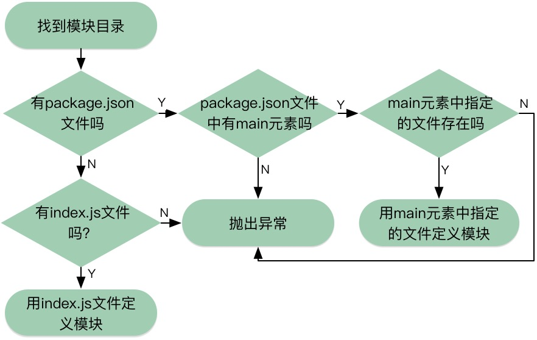

#nodejs之模块查找
##模块
nodejs模块既可以是一个`文件`，也可能是包含一个或多个文件的`目录`。

**如果模块是个目录，在模块目录中定义模块的文件必须被命名为`index.js`,node通常会在这个目录下找一个叫index.js的文件作为模块的入口，这个默认设置可以重写，通过在这个目录下`package.json`的文件特别指明，要指定一个取代index.js的文件，package.json文件里必须有一个用javascript对象表示法(JSON)数据定义的对象，其中有一个名为`main`的键，指明模块目录内主文件的路径。**

##nodejs模块的查找规则 
通过require(require是Node中少数几个同步I/O操作之一)来引入模块时，如果不指明模块的相对路径，Node中有一个独特的模块引用机制，可以不必知道模块在文件系统中的具体位置。这个机制就是使用node_modules目录。

查找模块的步骤如下：

如果查找到的模块是目录还要按照如下的步骤进行查找：

