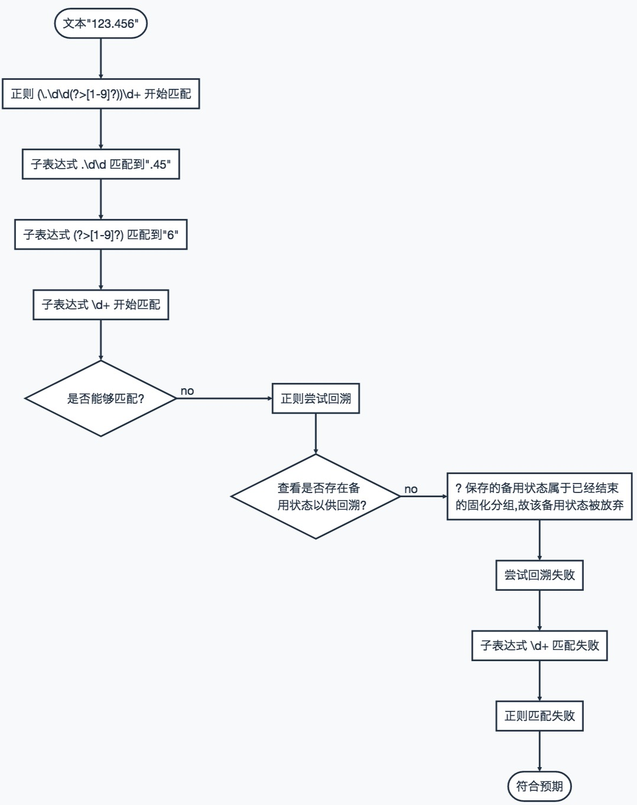
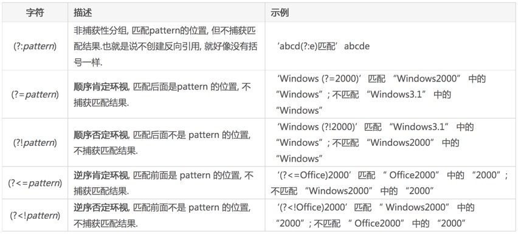
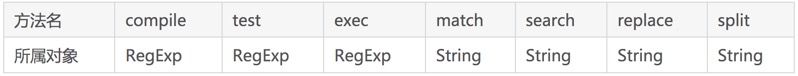
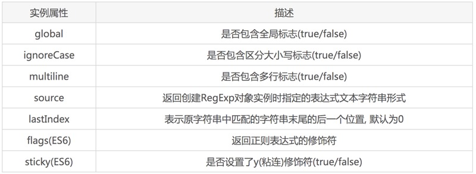
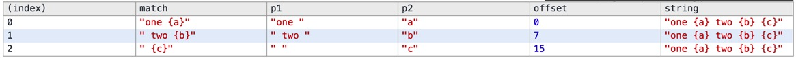

参考：[正则表达式前端使用手册: http://louiszhai.github.io/2016/06/13/regexp/](http://louiszhai.github.io/2016/06/13/regexp/)
##正则表达式中的特殊字符 
- `\` 做为转意，即通常在"`\`"后面的字符不按原来意义解释，如`/b/`匹配字符"b"，当b前面加了反斜杆后`/\b/`，转意为匹配一个单词的边界。

	对正则表达式功能字符的还原，如"`*`"匹配它前面元字符0次或多次，`/a*/`将匹配a,aa,aaa，加了"\"后，`/a\*/`将只匹配"a*"。
- `^` 匹配一个输入或一行的开头，/^a/匹配"an A"，而不匹配"An a"
- `$` 匹配一个输入或一行的结尾，/a$/匹配"An a"，而不匹配"an A"
- `*` 匹配前面元字符0次或多次，/ba*/将匹配b,ba,baa,baaa
- `+` 匹配前面元字符1次或多次，/ba+/将匹配ba,baa,baaa
- `?` 匹配前面元字符0次或1次，/ba?/将匹配b,ba
- `(x)` 匹配x，**保存x在名为$1...$9的变量中**
- `x|y` 匹配x或y
- `{n}` 精确匹配**n次**
- `{n,}` 匹配**n次以上**
- `{n,m}` 匹配**n-m次**
- `[xyz]` 字符集(character set)，匹配这个**集合中的任一一个字符**(或元字符)
- `[^xyz]` **不匹配**这个集合中的任何一个字符
- `\d` 匹配一个字数字符，/\d/ = /[0-9]/
- `\D` 匹配一个非字数字符，/\D/ = /[^0-9]/
- `\w` 匹配一个可以组成单词的字符(alphanumeric，这是我的意译，含数字)，包括下划线，如[\w]匹配"$5.98"中的5，等于[a-zA-Z0-9]
- `\W` 匹配一个不可以组成单词的字符，如[\W]匹配"$5.98"中的$，等于[^a-zA-Z0-9]。
- `\s` 匹配一个空白字符，包括\n,\r,\f,\t,\v等
- `\S` 匹配一个非空白字符，等于/[^\n\f\r\t\v]/
- `[\b]` 匹配一个退格符
- `\b` 匹配一个单词的边界
- `\B` 匹配一个单词的非边界
- `\cX` 这儿，X是一个控制符，/\cM/匹配Ctrl-M
- `\n` 匹配一个换行符
- `\r` 匹配一个回车符
- `\t` 匹配一个制表符
- `\v` 匹配一个重直制表符

##常用正则匹配
- 中文字符：^[\u4e00-\u9fa5]+$
- 电话号码：^1(3[0-9]|4[57]|5[0-35-9]|8[0-9]|7[0-36-8])\\d{8}$
- 0到100：^(\\d|[1-9]\\d|100)$"
- 三位数：^(\\d|[1-9]\\d\\d{0,1})$
- 汉字: ^[\u4e00-\u9fa5]{0,}$
- Email: ^\w+([-+.]\w+)*@\w+([-.]\w+)*\.\w+([-.]\w+)*$
- URL: ^https?://([\w-]+.)+[\w-]+(/[\w-./?%&=]*)?$
- 手机号码: ^1\d{10}$
- 身份证号: ^(\d{15}|\d{17}(\d|X))$
- 中国邮政编码: [1-9]\d{5}(?!\d) (邮政编码为6位数字)

##正则测试函数
###正则test函数
	/**
	* @param regExpStr 正则字符串
	* @param value 需要验证的值
	* @returns {boolean} 验证通过true, 失败false
	*/
	function regExpFun(regExpStr,value) {
	   var regExp = new RegExp(regExpStr);
	   return regExp.test(value);
	}
	
###电话号码中间4位变成*
知识点：捕获组

	function encryptionPhone(phone) {
	    //校验: 是否为空
	    if (typeof phone === 'undefined' || phone.trim() === "") {
	        console.log("电话号码不能为空");
	        return;
	    }
	    //校验: 是否是11位的电话号码
	    var phoneRex = new RegExp("^1\\d{10}$");
	    //或 var phoneRex = /^1\d{10}$/;
	    if (!phoneRex.test(phone)) {
	        console.log(phone + " 不是手机号码格式");
	        return;
	    }
	    //中间4位变成* 即4-7位
	    var encryPhoneRex=new RegExp("^(1\\d{2})(\\d{4})(\\d{4})$");
	    //或 var encryPhoneRex = /^(1\d{2})(\d{4})(\d{4})$/;
	    var encryPhone = phone.replace(encryPhoneRex, '$1****$3');
	    console.log(phone + " 中间4位变成*为 " + encryPhone);
	    return encryPhone;
	}
	encryptionPhone("15911180906");
	
##正则表达式前端使用手册 
###正则表达式的定义
正则表达式严格区分大小写
####1、元字符

####2、反义元字符

####3、重复限定符
限定符共有6个, 假设重复次数为x次, 那么将有如下规则:

####4、字符组
`[…]` 匹配中括号内字符之一. 如: [xyz] 匹配字符 x, y 或 z. 如果中括号中包含元字符, 则元字符降级为普通字符, 不再具有元字符的功能, 如 [+.?] 匹配 加号, 点号或问号.

####5、排除性字符组
`[^…]` 匹配任何未列出的字符,. 如: [^x] 匹配除x以外的任意字符.

####6、多选结构
`|` 就是或的意思, 表示两者中的一个. 如: a|b 匹配a或者b字符.

####7、括号
`括号` 常用来界定重复限定符的范围, 以及将字符分组. 如: (ab)+ 可以匹配abab..等, 其中 ab 便是一个分组.

####8、转义字符
`\` 即转义字符, 通常** \ * + ? | { [ ( ) ] }^ $ . # 和 空白 **这些字符都需要转义.

####9、操作符的运算优先级
1. \ 转义符
- (), (?:), (?=), [] 圆括号或方括号
- *, +, ?, {n}, {n,}, {n,m} 限定符
- ^, $ 位置
- | “或” 操作

####10、修饰符
javaScript中正则表达式默认有如下五种修饰符:
- g (全文查找)
- i (忽略大小写查找)
- m (多行查找)
- y (ES6新增的粘连修饰符)
- u (ES6新增)

###正则表达式初阶技能
####贪婪模式与非贪婪模式
默认情况下, 所有的`限定词`都是`贪婪模式`, 表示`尽可能多的去捕获字符`;    
而在**限定词后增加?**, 则是`非贪婪模式`, 表示`尽可能少的去捕获字符`.    
如下:

	var str = "aaab",
	    reg1 = /a+/, //贪婪模式
	    reg2 = /a+?/;//非贪婪模式
	console.log(str.match(reg1)); //["aaa"], 由于是贪婪模式, 捕获了所有的a
	console.log(str.match(reg2)); //["a"], 由于是非贪婪模式, 只捕获到第一个a
	
非贪婪模式: 使用”`*?`”, 或 “`+?`” 这种形式, 还有一种是 “`{n,m}`?”.

需要注意的是:

- 能达到同样匹配结果的贪婪与非贪婪模式, 通常是贪婪模式的匹配效率较高.
- 所有的非贪婪模式, 都可以通过修改量词修饰的子表达式, 转换为贪婪模式.
- 贪婪模式可以与固化分组结合，提升匹配效率，而非贪婪模式却不可以.

####分组
正则的分组主要通过小括号来实现, 括号包裹的子表达式作为一个分组, **括号后可以紧跟限定词表示重复次数**. 如下, 小括号内包裹的abc便是一个分组:

	/(abc)+/.test("abc123") == true

那么分组有什么用呢? 一般来说, 分组是为了`方便的表示重复次数`, 除此之外, 还有一个作用就是`用于捕获`.

#####捕获性分组
捕获性分组, 通常由一对小括号加上子表达式组成. `捕获性分组会创建反向引用`, 每个反向引用都由一个编号或名称来标识, **js中主要是通过 $+编号 或者 \+编号** 表示法进行引用. 

	var color = "#808080";
	var output = color.replace(/#(\d+)/,"$1"+"~~");//自然也可以写成 "$1~~"
	console.log(RegExp.$1);//808080
	console.log(output);//808080~~
	
- $+编号 这种引用通常在正则表达式`之外使用`. 
- \+编号 这种引用却可以在正则`表达式中使用`, **可用于匹配不同位置相同部分的子串**.

		var url = "www.google.google.com";
		var re = /([a-z]+)\.\1/;
		console.log(url.replace(re,"$1"));//"www.google.com"
		
#####非捕获性分组
非捕获性分组, 通常由`一对括号加上”?:”加上子表达式组成`, 非捕获性分组`不会创建反向引用`, 就好像没有括号一样. 如下:

	var color = "#808080";
	var output = color.replace(/#(?:\d+)/,"$1"+"~~");
	console.log(RegExp.$1);//""
	console.log(output);//$1~~

以上, **(?:\d+) 表示一个非捕获性分组, 由于分组不捕获任何内容, 所以, RegExp.$1 就指向了空字符串.同时, 由于$1 的反向引用不存在, 因此最终它被当成了普通字符串进行替换.**

#####命名分组（javascript不支持）
命名分组也是捕获性分组, 它将匹配的字符串捕获到一个组名称或编号名称中, 在获得匹配结果后, 可通过分组名进行获取. javaScript 中并不支持命名分组。

#####固化分组（javascript不支持）
固化分组, 又叫原子组.

语法: (?>…)

我们在使用非贪婪模式时, 匹配过程中可能会进行多次的回溯, 回溯越多, 正则表达式的运行效率就越低. 而固化分组就是用来减少回溯次数的.

实际上, 固化分组(?>…)的匹配与正常的匹配并无分别, 它并不会改变匹配结果. 唯一的不同就是: 固化分组匹配结束时, 它匹配到的文本已经固化为一个单元, 只能作为整体而保留或放弃, 括号内的子表达式中未尝试过的备用状态都会被放弃, 所以回溯永远也不能选择其中的状态(因此不能参与回溯). 

假如要处理一批数据, 原格式为 123.456, 因为浮点数显示问题, 部分数据格式会变为123.456000000789这种, 现要求只保留小数点后2~3位, 但是最后一位不能为0, 那么这个正则怎么写呢?

	var str = "123.456000000789";
	str = str.replace(/(\.\d\d[1-9]?)\d*/,"$1"); //123.456

以上的正则, 对于”123.456” 这种格式的数据, 将白白处理一遍. 为了提高效率, 我们将正则最后的一个”*”改为”+”. 如下:

	var str = "123.456";
	str = str.replace(/(\.\d\d[1-9]?)\d+/,"$1"); //123.45

此时, “\d\d[1-9]?” 子表达式, 匹配是 “45”, 而不是 “456”, 这是因为正则末尾使用了”+”, 表示末尾至少要匹配一个数字, 因此末尾的子表达式”\d+” 匹配到了 “6”. 显然 “123.45” 不是我们期望的匹配结果, 那我们应该怎么做呢? 能否让 “[1-9]?” 一旦匹配成功, 便不再进行回溯, 这里就要用到我们上面说的固化分组.

“(\.\d\d(?>[1-9]?))\d+” 便是上述正则的固化分组形式. 由于字符串 “123.456” 不满足该固化分组的正则, 所以, 匹配会失败, 符合我们期望.

下面我们来分析下固化分组的正则 (\.\d\d(?>[1-9]?))\d+ 为什么匹配不到字符串”123.456”.

很明显, 对于上述固化分组, 只存在两种匹配结果.

- 情况①: 若 [1-9] 匹配失败, 正则会返回 ? 留下的备用状态. 然后匹配脱离固化分组, 继续前进到[\d+]. 当控制权离开固化分组时, 没有备用状态需要放弃(因固化分组中根本没有创建任何备用状态).

- 情况②: 若 [1-9] 匹配成功, 匹配脱离固化分组之后, ? 保存的备用状态仍然存在, 但是, 由于它属于已经结束的固化分组, 所以会被抛弃.

对于字符串 “123.456”, 由于 [1-9] 能够匹配成功, 所以它符合情况②. 下面我们来还原情况②的执行现场.

1. 匹配所处的状态: 匹配已经走到了 “6” 的位置, 匹配将继续前进;==>
- 子表达式 \d+ 发现无法匹配, 正则引擎便尝试回溯;==>
- 查看是否存在备用状态以供回溯?==>
- “?” 保存的备用状态属于已经结束的固化分组, 所以该备用状态会被放弃;==>
- 此时固化分组匹配到的 “6”, 便不能用于正则引擎的回溯;==>
- 尝试回溯失败;==>
- 正则匹配失败.==>
- 文本 “123.456” 没有被正则表达式匹配上, 符合预期.

相应的流程图如下:

**javaScript不支持固化分组**

###正则表达式高阶技能-零宽断言(javascript只支持顺序肯定环视和顺序否定环视)
**零宽断言, 又叫环视. 环视只进行子表达式的匹配, 匹配到的内容不保存到最终的匹配结果, 由于匹配是零宽度的, 故最终匹配到的只是一个位置.**

环视按照方向划分, **有顺序和逆序两种(也叫前瞻和后瞻)**, 按照是否匹配有肯定和否定两种, 组合之, 便有4种环视. 4种环视并不复杂, 如下便是它们的描述.

非捕获性分组由于结构与环视相似, 故列在表中, 以做对比. 以上4种环视中, 目前 javaScript 中只支持前两种, 也就是只支持 `顺序肯定环视` 和 `顺序否定环视`.

	var str = "123abc789",s;
	//没有使用环视,abc直接被替换
	s = str.replace(/abc/,456);
	console.log(s); //123456789
	//使用了顺序肯定环视,捕获到了a前面的位置,所以abc没有被替换,只是将3替换成了3456
	s = str.replace(/3(?=abc)/,3456);
	console.log(s); //123456abc789
	//使用了顺序否定环视,由于3后面跟着abc,不满意条件,故捕获失败,所以原字符串没有被替换
	s = str.replace(/3(?!abc)/,3456);
	console.log(s); //123abc789
	
####千位分割符

	function thousand(str){
	  return str.replace(/(?!^)(?=([0-9]{3})+$)/g,',');
	}
	console.log(thousand(str));//"1,234,567,890"
	console.log(thousand("123456"));//"123,456"
	console.log(thousand("1234567879876543210"));//"1,234,567,879,876,543,210"

上述使用到的正则分为两块. (?!^) 和 (?=([0-9]{3})+$). 我们先来看后面的部分, 然后逐步分析之.

1. “[0-9]{3}” 表示连续3位数字.
- “([0-9]{3})+” 表示连续3位数字至少出现一次或更多次.
- “([0-9]{3})+$” 表示连续3的正整数倍的数字, 直到字符串末尾.
- 那么 (?=([0-9]{3})+$) 就表示匹配一个零宽度的位置, 并且从这个位置到字符串末尾, 中间拥有3的正整数倍的数字.
- 正则表达式使用全局匹配g, 表示匹配到一个位置后, 它会继续匹配, 直至匹配不到.
- 将这个位置替换为逗号, 实际上就是每3位数字添加一个逗号.
- 当然对于字符串”123456”这种刚好拥有3的正整数倍的数字的, 当然不能在1前面添加逗号. 那么使用 (?!^) 就指定了这个替换的位置不能为起始位置.

###正则表达式在JS中的应用
ES6对正则扩展了又两种修饰符(其他语言可能不支持):

- y (粘连sticky修饰符), 与g类似, 也是全局匹配, 并且下一次匹配都是从上一次匹配成功的下一个位置开始, 不同之处在于, g修饰符只要剩余位置中存在匹配即可, 而y修饰符确保匹配必须从剩余的第一个位置开始.

		var s = "abc_ab_a";
		var r1 = /[a-z]+/g;
		var r2 = /[a-z]+/y;
		console.log(r1.exec(s),r1.lastIndex); // ["abc", index: 0, input: "abc_ab_a"] 3
		console.log(r2.exec(s),r2.lastIndex); // ["abc", index: 0, input: "abc_ab_a"] 3
		console.log(r1.exec(s),r1.lastIndex); // ["ab", index: 4, input: "abc_ab_a"] 6
		console.log(r2.exec(s),r2.lastIndex); // null 0

	如上, 由于第二次匹配的开始位置是下标3, 对应的字符串是 “_”, 而使用y修饰符的正则对象r2, 需要从剩余的第一个位置开始, 所以匹配失败, 返回null.

	正则对象的 sticky 属性, 表示是否设置了y修饰符. 这点将会在后面讲到.

- u 修饰符, 提供了对正则表达式添加4字节码点的支持. 比如 “𝌆” 字符是一个4字节字符, 直接使用正则匹配将会失败, 而使用u修饰符后, 将会等到正确的结果.

		var s = "𝌆";
		console.log(/^.$/.test(s));//false
		console.log(/^.$/u.test(s));//true
		
####javaScript 中与正则表达式有关的方法有:

####RegExp
RegExp 对象表示正则表达式, 主要用于对字符串执行模式匹配.

语法:

	new RegExp(pattern[, flags])

参数:

- pattern 是一个字符串, 指定了正则表达式字符串或其他的正则表达式对象.
- flags 是一个可选的字符串, 包含属性 “g”、”i” 和 “m”, 分别用于指定全局匹配、区分大小写的匹配和多行匹配. `如果pattern 是正则表达式, 而不是字符串, 则必须省略该参数`.

例：

	var pattern = "[0-9]";
	var reg = new RegExp(pattern,"g");
	// 上述创建正则表达式对象,可以用对象字面量形式代替,也推荐下面这种
	var reg = /[0-9]/g;
	
#####RegExp 实例对象包含如下属性:

例：

	var regExp = new RegExp("[0-9a-z]", "g");
	console.log("global:"+regExp.global); //global:true
	console.log("ignoreCase:"+regExp.ignoreCase); //ignoreCase:false
	console.log("multiline:"+regExp.multiline); //multiline:false
	console.log("source:"+regExp.source); //source:[0-9a-z]
	console.log("source:"+regExp.lastIndex); //source:0
	
#####compile
compile 方法用于`在执行过程中改变和重新编译正则表达式`.

语法: 
	
	compile(pattern[, flags])
	
例：

	var reg = new RegExp("abc", "gi");
	var reg1 = reg.compile("new abc", "g");
	console.log(reg);// /new abc/g
	console.log(reg1);// /new abc/g

可见 compile 方法会改变原正则表达式对象, 并重新编译.

####test
test 方法用于检测一个字符串是否匹配某个正则规则, 只要是字符串中含有与正则规则匹配的文本, 该方法就返回true, 否则返回 false.

语法: 
	
	test(string)
例：

	console.log(/[0-9]+/.test("abc123"));//true
	console.log(/[0-9]+/.test("abc"));//false
	
实际上, `如果正则表达式带有全局标志(带有参数g)时, test 方法还受正则对象的lastIndex属性影响`,如下:

	var reg = /[a-z]+/;//正则不带全局标志
	console.log(reg.test("abc"));//true
	console.log(reg.test("de"));//true
	var reg = /[a-z]+/g;//正则带有全局标志g
	console.log(reg.test("abc"));//true
	console.log(reg.lastIndex);//3, 下次运行test时,将从索引为3的位置开始查找
	console.log(reg.test("de"));//false
	
####exec
exec 方法用于检测字符串对正则表达式的匹配, 如果找到了匹配的文本, 则`返回一个结果数组`, 否则返回null.

语法: 
	
	exec(string)

exec 方法返回的数组中包含两个额外的属性, index 和 input. 并且该数组具有如下特点:

- 第 0 个项表示正则表达式捕获的文本
- 第 1~n 项表示第 1~n 个反向引用, 依次指向第 1~n 个分组捕获的文本, 可以使用RegExp.$ + “编号1~n” 依次获取分组中的文本
- index 表示匹配字符串的初始位置
- input 表示正在检索的字符串

无论正则表达式有无全局标示”g”, exec 的表现都相同. 但正则表达式对象的表现却有些不同. 

- 假设正则表达式对象为 reg , 检测的字符为 string , reg.exec(string) 返回值为 array.

	若 reg 包含全局标示”g”, 那么 reg.lastIndex 属性表示原字符串中匹配的字符串末尾的后一个位置, 即下次匹配开始的位置, 此时 reg.lastIndex == array.index(匹配开始的位置) + array[0].length(匹配字符串的长度). 如下:

		var reg = /([a-z]+)/gi,
		   	string = "World Internet Conference";
		var array = reg.exec(string);
		console.log(array);//["World", "World", index: 0, input: "World Internet Conference"]
		console.log(RegExp.$1);//World
		console.log(reg.lastIndex);//5, 刚好等于 array.index + array[0].length
	随着检索继续, array.index 的值将往后递增, 也就是说, reg.lastIndex 的值也会同步往后递增. 因此, 我们也可以通过反复调用 exec 方法来遍历字符串中所有的匹配文本. 直到 exec 方法再也匹配不到文本时, 它将返回 null, 并把 reg.lastIndex 属性重置为 0. 
	
		array = reg.exec(string);
		console.log(array);//["Internet", "Internet", index: 6, input: "World Internet Conference"]
		console.log(reg.lastIndex);//14
		array = reg.exec(string);
		console.log(array);//["Conference", "Conference", index: 15, input: "World Internet Conference"]
		console.log(reg.lastIndex);//25
		array = reg.exec(string);
		console.log(array);//null
		console.log(reg.lastIndex);//0
		
如果正则表达式带有全局标志g, 以上 test 方法的执行结果将受 reg.lastIndex影响, 不仅如此, exec 方法也一样. 由于 reg.lastIndex 的值并不总是为零, 并且它决定了下次匹配开始的位置, 如果在一个字符串中完成了一次匹配之后要开始检索新的字符串, 那就必须要手动地把 lastIndex 属性重置为 0. 避免出现下面这种错误:

	var reg = /[0-9]+/g,
	    str1 = "123abc",
	    str2 = "123456";
	reg.exec(str1);
	console.log(reg.lastIndex);//3
	var array = reg.exec(str2);
	console.log(array);//["456", index: 3, input: "123456"]
	
####String
用捕获性分组处理文本模板, 最终生成完整字符串的过程:

	var tmp = "An ${a} a ${b} keeps the ${c} away";
	var obj = {
	  a:"apple",
	  b:"day",
	  c:"doctor"
	};
	function tmpl(t,o){
	  return t.replace(/\${(.)}/g,function(m,p){
	    console.log('m:'+m+' p:'+p);
	    return o[p];
	  });
	}
	tmpl(tmp,obj);

上述功能使用ES6可这么实现:

	var obj = {
	  a:"apple",
	  b:"day",
	  c:"doctor"
	};
	with(obj){
	  console.log(`An ${a} a ${b} keeps the ${c} away`);
	}
	
#####match
match() 方法用于测试字符串是否支持指定正则表达式的规则, 即使传入的是非正则表达式对象, 它也会隐式地使用 new RegExp(obj) 将其转换为正则表达式对象.

语法: 
	
	str.match(regexp)

该方法返回包含匹配结果的数组, 如果没有匹配项, 则返回 null.

描述：

- 若正则表达式没有 g 标志, 则返回同 RegExp.exec(str) 相同的结果. 而且返回的数组拥有一个额外的 input 属性, 该属性包含原始字符串, 另外该数组还拥有一个 index 属性, 该属性表示匹配字符串在原字符串中索引(从0开始).
- **若正则表达式包含 g 标志, 则该方法返回一个包含所有匹配结果的数组, 没有匹配到则返回 null**.

例：

	var str = "World Internet Conference";
	console.log(str.match(/[a-d]/i));//["d", index: 4, input: "World Internet Conference"]
	console.log(str.match(/[a-d]/gi));//["d", "C", "c"]
	//RegExp 方法如下
	console.log(/[a-d]/gi.test(str));//true
	console.log(/[a-d]/gi.exec(str));//["d", index: 4, input: "World Internet Conference"]

`RegExp.exec(str) 方法无论正则中有没有包含 g 标志, RegExp.exec将直接返回第一个匹配结果, 且该结果同 str.match(regexp) 方法不包含 g 标志时的返回一致.`

#####search
search() 方法用于测试字符串对象是否包含某个正则匹配. 相当于正则表达式的 test 方法. 且该方法比 match() 方法更快. 如果匹配成功, search() 返回正则表达式在字符串中首次匹配项的索引, 否则返回-1.

语法: 

	str.search(regexp)

例：

	var str = "abcdefg";
	console.log(str.search(/[d-g]/));//3, 匹配到子串"defg",而d在原字符串中的索引为3

**search() 方法不支持全局匹配**(正则中包含g参数), 如下:

	console.log(str.search(/[d-g]/g));//3, 与无g参数时,返回相同

#####split
split() 方法把原字符串分割成子字符串组成数组, 并返回该数组.

语法: 

	str.split(separator, limit)

两个参数均是可选的,

- 其中 separator 表示分隔符, 它可以是字符串也可以是正则表达式. 如果忽略 separator, 则返回的数组包含一个由原字符串组成的元素. 如果 separator 是一个空串, 则 str 将会被分割成一个由原字符串中字符组成的数组. 
- limit 表示从返回的数组中截取前 limit 个元素, 从而限定返回的数组长度，如果超出则返回数组长度.

例：

	var str = "today is a sunny day";
	console.log(str.split());//["today is a sunny day"]
	console.log(str.split(""));//["t", "o", "d", "a", "y", " ", "i", "s", " ", "a", " ", "s", "u", "n", "n", "y", " ", "d", "a", "y"]
	console.log(str.split(" "));//["today", "is", "a", "sunny", "day"]

**使用limit限定返回的数组大小. 如下:**

	console.log(str.split(" "), 1);//["today"]

**使用正则分隔符(RegExp separator). 如下:**

	console.log(str.split(/\s*is\s*/));//["today", "a sunny day"]

**若正则分隔符里包含捕获括号, 则括号匹配的结果将会包含在返回的数组中.**

	console.log(str.split(/(\s*is\s*)/));//["today", " is ", "a sunny day"]
	
####replace
描述：
	该方法并不改变调用它的字符串本身，而只是返回替换后的字符串.

语法：

	str.replace( regexp | substr, newSubStr | function[, flags] )
	
参数：

- regexp: 一个 RegExp 对象. 该正则所匹配的内容会被第二个参数的返回值替换掉。
- substr: 一个要被 newSubStr 替换的字符串.
- newSubStr: 替换掉第一个参数在原字符串中的匹配部分. 该字符串中可以内插一些特殊的变量名.
- function: 一个用来创建新子字符串的函数, 该函数的返回值将替换掉第一个参数匹配到的结果. 
- flags: 注意：flags 参数在 v8 内核（Chrome and NodeJs）中不起作用. 方法中使用 flags 参数不是符合标准的并且不赞成这样做.

**简单概括,replace拥有两个参数,第一个是需要替换的字符串或者正则表达式; 第二个是新的字符串或者一个function,这样参数便有四种组合.**

例1 String–>String：

	var a = "what is this? before";
	var b = a.replace("before","after");
	console.log(b);	// "what is this? after"

例2 Regexp–>String：  
如果第一个参数是正则表达式,新的字符串中可以用$符号取正则中匹配的子串(也就是正则中被括号包裹的部分):

	var a = "what is this? before";
	var b = a.replace(/(^\w+).*?(\w+)$/,"$2 $1");//括号分割的部分依次为子串1....n
	console.log(b); // "before what"	

例3  Regexp–>Function：

第二个参数其实可为一个function,最终字符串将以function的返回值作为replace的返回值。

以下是该function的形参:

	function(match,p1…,offset,string)
	
可见至少包含三个形参(即arguments.length>=3)

- match表示第一个参数(整个正则表达式)匹配的字符串
- p1至pn表示第1..n个括号匹配的字符串,如果没有括号则不存在该项
- offset表示匹配的起点在原字符串中的偏移
- string表示原字符串

demo:

	function replacer(match,p1,p2,offset,string){
	    //此时p1=" is",p2=" this"
	    return p1+" that";//如果返回为空串,则匹配内容替换为空,如果不返回,则匹配内容替换为undefined
	}
	var a = "what is this? before";
	var b = a.replace(/(\s\w+)(\s\w+)/,replacer);
	console.log(b); // "what is that? before"

例4 String–>Function：

	function replacer(match,offset,string){
	    //由于字符串中不会有括号进行分组,此时没有子串
	    return offset+" that";//偏移为4
	}
	var a = "what is this? before";
	var b = a.replace(" is this",replacer);
	console.log(b); // "what4 that? before"

####简易的字符串模板引擎
基于 replace 方法的第三个用法, 我们可以实现一个tmpl方法, 输入一个模板字符串, 输入一个key-value对象, 即可生成新的字符串.

	var template = "one {a} two {b} {c}",
		obj = {a:"apple",b:"orange",c:"..."},
		_array = [];
	function tmpl(template,obj){
		var retu = template.replace(/([^{}]*){(.)}/g,function(match,p1,p2,offset,string){
			_array.push({'match':match, 'p1':p1, 'p2':p2, 'offset':offset, 'string':string});
	      	return p1+obj[p2];
	    });
	    console.table && console.table(_array);
	  	!console.table && console.log(_array);
	  	console.log(retu);
	}
	tmpl(template,obj);

结果：

####正则表达式在H5中的应用
H5中新增了 `pattern` 属性, 规定了用于验证输入字段的模式, pattern的模式匹配支持正则表达式的书写方式. 默认 pattern 属性是全部匹配, 即无论正则表达式中有无 “^”, “$” 元字符, 它都是匹配所有文本.

**注: pattern 适用于以下 input 类型：text, search, url, telephone, email 以及 password. 如果需要取消表单验证, 在form标签上增加 novalidate 属性即可.**

