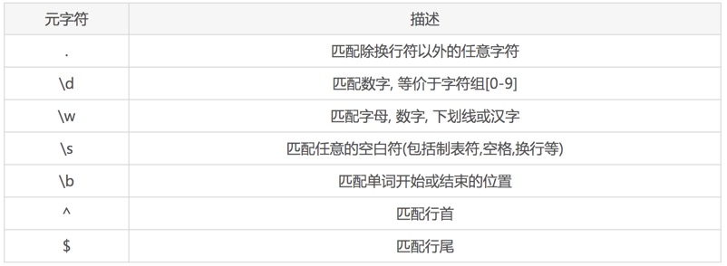
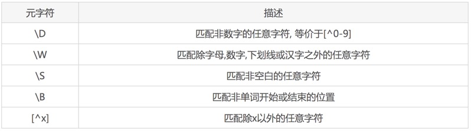
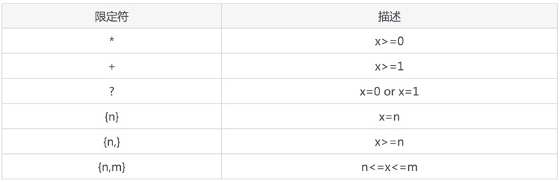

参考：[正则表达式前端使用手册: http://louiszhai.github.io/2016/06/13/regexp/](http://louiszhai.github.io/2016/06/13/regexp/)
##正则表达式中的特殊字符 
- `\` 做为转意，即通常在"`\`"后面的字符不按原来意义解释，如`/b/`匹配字符"b"，当b前面加了反斜杆后`/\b/`，转意为匹配一个单词的边界。

	对正则表达式功能字符的还原，如"`*`"匹配它前面元字符0次或多次，`/a*/`将匹配a,aa,aaa，加了"\"后，`/a\*/`将只匹配"a*"。
- `^` 匹配一个输入或一行的开头，/^a/匹配"an A"，而不匹配"An a"
- `$` 匹配一个输入或一行的结尾，/a$/匹配"An a"，而不匹配"an A"
- `*` 匹配前面元字符0次或多次，/ba*/将匹配b,ba,baa,baaa
- `+` 匹配前面元字符1次或多次，/ba+/将匹配ba,baa,baaa
- `?` 匹配前面元字符0次或1次，/ba?/将匹配b,ba
- `(x)` 匹配x，**保存x在名为$1...$9的变量中**
- `x|y` 匹配x或y
- `{n}` 精确匹配**n次**
- `{n,}` 匹配**n次以上**
- `{n,m}` 匹配**n-m次**
- `[xyz]` 字符集(character set)，匹配这个**集合中的任一一个字符**(或元字符)
- `[^xyz]` **不匹配**这个集合中的任何一个字符
- `\d` 匹配一个字数字符，/\d/ = /[0-9]/
- `\D` 匹配一个非字数字符，/\D/ = /[^0-9]/
- `\w` 匹配一个可以组成单词的字符(alphanumeric，这是我的意译，含数字)，包括下划线，如[\w]匹配"$5.98"中的5，等于[a-zA-Z0-9]
- `\W` 匹配一个不可以组成单词的字符，如[\W]匹配"$5.98"中的$，等于[^a-zA-Z0-9]。
- `\s` 匹配一个空白字符，包括\n,\r,\f,\t,\v等
- `\S` 匹配一个非空白字符，等于/[^\n\f\r\t\v]/
- `[\b]` 匹配一个退格符
- `\b` 匹配一个单词的边界
- `\B` 匹配一个单词的非边界
- `\cX` 这儿，X是一个控制符，/\cM/匹配Ctrl-M
- `\n` 匹配一个换行符
- `\r` 匹配一个回车符
- `\t` 匹配一个制表符
- `\v` 匹配一个重直制表符

##常用正则匹配
- 中文字符：^[\u4e00-\u9fa5]+$
- 电话号码：^1(3[0-9]|4[57]|5[0-35-9]|8[0-9]|7[0-36-8])\\d{8}$
- 0到100：^(\\d|[1-9]\\d|100)$"
- 三位数：^(\\d|[1-9]\\d\\d{0,1})$
- 汉字: ^[\u4e00-\u9fa5]{0,}$
- Email: ^\w+([-+.]\w+)*@\w+([-.]\w+)*\.\w+([-.]\w+)*$
- URL: ^https?://([\w-]+.)+[\w-]+(/[\w-./?%&=]*)?$
- 手机号码: ^1\d{10}$
- 身份证号: ^(\d{15}|\d{17}(\d|X))$
- 中国邮政编码: [1-9]\d{5}(?!\d) (邮政编码为6位数字)

##正则测试函数
###正则test函数
	/**
	* @param regExpStr 正则字符串
	* @param value 需要验证的值
	* @returns {boolean} 验证通过true, 失败false
	*/
	function regExpFun(regExpStr,value) {
	   var regExp = new RegExp(regExpStr);
	   return regExp.test(value);
	}
	
###电话号码中间4位变成*
知识点：捕获组

	function encryptionPhone(phone) {
	    //校验: 是否为空
	    if (typeof phone === 'undefined' || phone.trim() === "") {
	        console.log("电话号码不能为空");
	        return;
	    }
	    //校验: 是否是11位的电话号码
	    var phoneRex = new RegExp("^1\\d{10}$");
	    //或 var phoneRex = /^1\d{10}$/;
	    if (!phoneRex.test(phone)) {
	        console.log(phone + " 不是手机号码格式");
	        return;
	    }
	    //中间4位变成* 即4-7位
	    var encryPhoneRex=new RegExp("^(1\\d{2})(\\d{4})(\\d{4})$");
	    //或 var encryPhoneRex = /^(1\d{2})(\d{4})(\d{4})$/;
	    var encryPhone = phone.replace(encryPhoneRex, '$1****$3');
	    console.log(phone + " 中间4位变成*为 " + encryPhone);
	    return encryPhone;
	}
	encryptionPhone("15911180906");
	
##正则表达式前端使用手册 
###正则表达式的定义
正则表达式严格区分大小写
####1、元字符

####2、反义元字符

####3、重复限定符
限定符共有6个, 假设重复次数为x次, 那么将有如下规则:

####4、字符组
`[…]` 匹配中括号内字符之一. 如: [xyz] 匹配字符 x, y 或 z. 如果中括号中包含元字符, 则元字符降级为普通字符, 不再具有元字符的功能, 如 [+.?] 匹配 加号, 点号或问号.

####5、排除性字符组
`[^…]` 匹配任何未列出的字符,. 如: [^x] 匹配除x以外的任意字符.

####6、多选结构
`|` 就是或的意思, 表示两者中的一个. 如: a|b 匹配a或者b字符.

####7、括号
`括号` 常用来界定重复限定符的范围, 以及将字符分组. 如: (ab)+ 可以匹配abab..等, 其中 ab 便是一个分组.

####8、转义字符
`\` 即转义字符, 通常** \ * + ? | { [ ( ) ] }^ $ . # 和 空白 **这些字符都需要转义.

####9、操作符的运算优先级
1. \ 转义符
- (), (?:), (?=), [] 圆括号或方括号
- *, +, ?, {n}, {n,}, {n,m} 限定符
- ^, $ 位置
- | “或” 操作

####10、修饰符
javaScript中正则表达式默认有如下五种修饰符:
- g (全文查找)
- i (忽略大小写查找)
- m (多行查找)
- y (ES6新增的粘连修饰符)
- u (ES6新增)

###正则表达式初阶技能
####贪婪模式与非贪婪模式
默认情况下, 所有的限定词都是`贪婪模式`, 表示`尽可能多的去捕获字符`;    
而在**限定词后增加?**, 则是`非贪婪模式`, 表示`尽可能少的去捕获字符`.    
如下:

	var str = "aaab",
	    reg1 = /a+/, //贪婪模式
	    reg2 = /a+?/;//非贪婪模式
	console.log(str.match(reg1)); //["aaa"], 由于是贪婪模式, 捕获了所有的a
	console.log(str.match(reg2)); //["a"], 由于是非贪婪模式, 只捕获到第一个a
	
####分组
正则的分组主要通过小括号来实现, 括号包裹的子表达式作为一个分组, 括号后可以紧跟限定词表示重复次数. 如下, 小括号内包裹的abc便是一个分组:

	/(abc)+/.test("abc123") == true

那么分组有什么用呢? 一般来说, 分组是为了`方便的表示重复次数`, 除此之外, 还有一个作用就是`用于捕获`.

