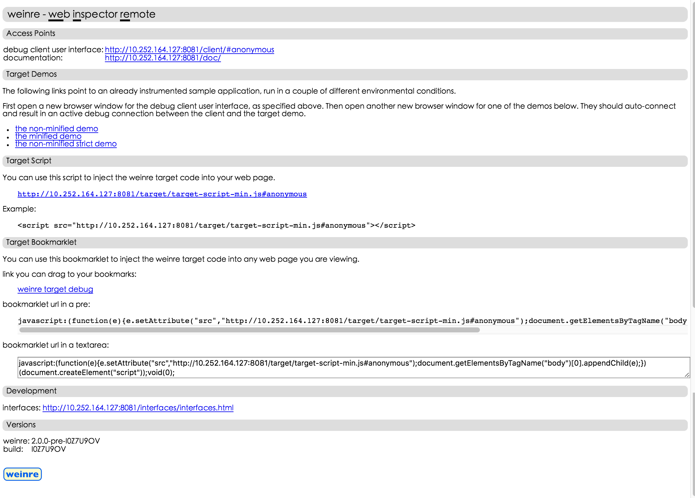
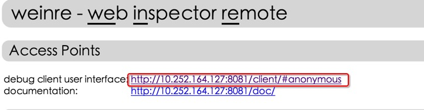
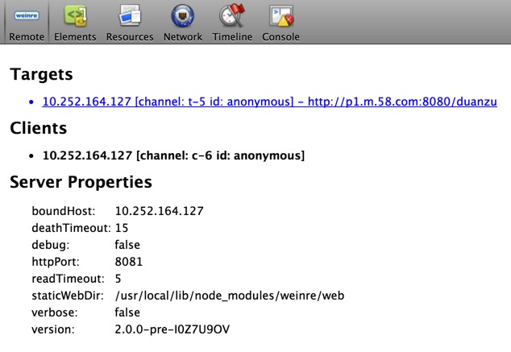
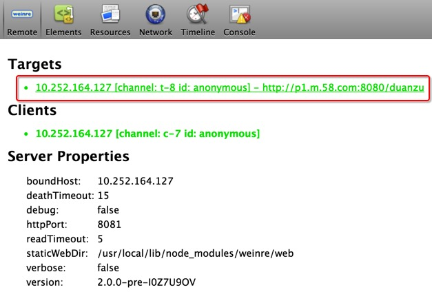

##关于weinre
weinre就是一款依赖于nodejs的远程调试工具

>weinre可以方便我们`调式HTML元素及css代码`，至于JS，我们可以使用Fiddler或Charles替换即可满足前端在移动端基本调式了.

##weinre的安装

	npm -g install weinre
	
##weinre的使用例子
打开命令行，输入：

	weinre --boundHost [IP_address] --httpPort [port] 
	
(IP_address 是pc的ip地址, 不能是127.0.0.1，port可以输入一个随便的端口)

假设我的pc的ip地址为10.252.164.127，然后我就可以输入这样的命令：

	weinre --boundHost 10.252.164.127 --httpPort 8081

在浏览器上打开网址[http://10.252.164.127:8081](http://10.252.164.127:8081)

然后可以看到以下界面： 

将该界面Target Script中的下面的代码

	
	
复制到我们所要调试的界面 

然后点击Access Points中的debug client user interface，

进入调试界面。调试界面是下面这个样子的： 

点击调试页面里对应的Targets，然后点击Elements工具，就可以进行调试了。 

