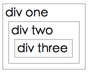
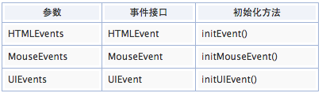

#javascript事件

##事件触发过程

> 1、捕获阶段(Capture Phase)-->2、目标阶段(Target Phase)-->3、冒泡阶段(Bubbling Phase)

###捕获阶段（Capture Phase）
当我们在 DOM 树的某个节点发生了一些操作（例如单击、鼠标移动上去），就会有一个事件发射过去。这个事件从 Window 发出，不断经过下级节点直到目标节点。在到达目标节点之前的过程，就是捕获阶段（Capture Phase）。

所有经过的节点，都会触发这个事件。捕获阶段的任务就是建立这个事件传递路线，以便后面冒泡阶段顺着这条路线返回 Window。

标准的事件监听函数如下：
	
	element.addEventListener(<event-name>, <callback>, <use-capture>);
	
表示在 element 这个对象上面添加一个事件监听器，当监听到有 <event-name> 事件发生的时候，调用 <callback> 这个回调函数。至于 <use-capture> 这个参数，表示该事件监听是在`“捕获”阶段中监听（设置为 true）`还是在`“冒泡”阶段中监听（设置为 false）`。
例：

	var btn = document.getElementsByTagName('button');
	btn[0].addEventListener('click', function() {
    	alert('你点击了这个按钮');
	}, false);
	
当我们为某个元素绑定了一个事件，每次触发这个事件的时候，都会执行事件绑定的回调函数。如果我们想解除绑定，需要使用 removeEventListener 方法：

	element.removeEventListener(<event-name>, <callback>, <use-capture>);

`需要注意的是，绑定事件时的回调函数不能是匿名函数，必须是一个声明的函数，因为解除事件绑定时需要传递这个回调函数的引用，才可以断开绑定。`例如：

	var fun = function() {
    	// function logic
	};
	element.addEventListener('click', fun, false);
	element.removeEventListener('click', fun, false);

监听某个在捕获阶段触发的事件，需要在事件监听函数传递第三个参数 true。

	element.addEventListener(<event-name>, <callback>, true);

但一般使用时我们往往传递 false，会在后面说明原因。

###目标阶段（Target Phase）
当事件跑啊跑，跑到了事件触发目标节点那里，最终在目标节点上触发这个事件，就是目标阶段。

`需要注意的是，事件触发的目标总是最底层的节点`。比如你点击一段文字，你以为你的事件目标节点在 div 上，但实际上触发在 \<p\>、\<span\> 等子节点上。

###冒泡阶段（Bubbling Phase）
当事件达到目标节点之后，就会沿着原路返回，由于这个过程类似水泡从底部浮到顶部，所以称作冒泡阶段。

在实际使用中，你并不需要把事件监听函数准确绑定到最底层的节点也可以正常工作。比如你想为这个 \<div\> 绑定单击时的回调函数，你无须为这个 \<div\> 下面的所有子节点全部绑定单击事件，只需要为 \<div\>这一个节点绑定即可。因为发生在它子节点的单击事件，都会冒泡上去，发生在 \<div\> 上面。

###为什么不用第三个参数 true
所有介绍事件的文章都会说，在使用 addEventListener 函数来监听事件时，第三个参数设置为 false，这样监听事件时只会监听冒泡阶段发生的事件。

这是因为 `IE 浏览器不支持在捕获阶段监听事件`，为了统一而设置的，毕竟 IE 浏览器的份额是不可忽略的。

###使用事件代理（Event Delegate）提升性能
因为事件有冒泡机制，所有子节点的事件都会顺着父级节点跑回去，所以我们可以通过监听父级节点来实现监听子节点的功能，这就是事件代理。

使用事件代理主要有两个优势：

1. `减少事件绑定，提升性能。`之前你需要绑定一堆子节点，而现在你只需要绑定一个父节点即可。减少了绑定事件监听函数的数量。
2. `动态变化的 DOM 结构，仍然可以监听。`当一个 DOM 动态创建之后，不会带有任何事件监听，除非你重新执行事件监听函数，而使用事件监听无须担忧这个问题。

例：

	//html代码
	<ul class="ul1">
    	<li><a href="#">监听我</a></li>
    	<li><a href="#">监听我</a></li>
	</ul>
	<ul class="ul2">
    	<li><a href="#">监听我</a></li>
    	<li><a href="#">监听我</a></li>
	</ul>
	<a href="#" class="add-more-items">添加更多节点</a>
	
	//script代码
	$('.ul1 a').on('click', function(){
		alert('正在监听');
	});
	$('.ul2').on('click', 'a', function(){
    	alert('正在监听');
	});
	$('.add-more-items').on('click', function(){
    	var item = $('<li><a href="#">我是动态新增节点</a></li>');
    	$('.ul1,.ul2').append(item);
	});

上面例子中，为了简便，我使用 jQuery 来实现普通事件绑定和事件代理。我的目标是监听所有 a 链接的单击事件，.ul1 是常规的事件绑定方法，jQuery 会循环每一个 .ul > a 结构并绑定事件监听函数。.ul2 则是事件监听的方法，jQuery 只为 .ul2 结构绑定事件监听函数，因为 .ul2 下面可能会有很多无关节点也会触发click 事件，所以我在 on 函数里传递了第二个参数，表示只监听 a 子节点的事件。

它们都可以正常工作，但是当我动态创建新 DOM 结构的时候，第一个 ul 问题就出现了，新创建结构虽然还是.ul1 > a，但是没有绑定事件，所以无法执行回调函数。而第二个 ul 工作的很好，因为点击新创建的 DOM ，它的事件会冒泡到父级节点进行处理。

如果使用原生的方式实现事件代理，需要注意过滤非目标节点，可以通过 id、class 或者 tagname 等等，例如：

	element.addEventListener('click', function(event) {
    	// 判断是否是 a 节点
    	if ( event.target.tagName == 'A' ) {
        	// a 的一些交互操作
    	}
	}, false);
	
###停止事件冒泡（stopPropagation）
停止事件冒泡需要使用事件对象的 stopPropagation 方法，具体代码如下：

	element.addEventListener('click', function(event) {
    	event.stopPropagation();
	}, false);
	
在事件监听的回调函数里，会传递一个参数，这就是 Event 对象，在这个对象上调用 stopPropagation 方法即可停止事件冒泡。举个停止事件冒泡的应用实例：
	
	<!DOCTYPE html>
	<html>
		<head>
			<meta charset=utf-8 />
			<title>JS Bin</title>
		</head>
		<body>
  			
Click outside to close.

  			
  			
		</body>
	</html>

实例：

	

	    div one
	    

	        div two
	        

	            div three
	        

	    

	
	
	

说明：   
eventPhase (number) 这个属性的数字表示当前事件触发在什么阶段。

- none：0
- 捕获：1
- 目标：2
- 冒泡：3

操作1：点击div three，控制台输出

	div three: eventPhase:2
	div two:  eventPhase:3
	div one:  eventPhase:3

操作2：`<use-capture> true`捕获阶段监听事件，div two
 
	d2_elem.addEventListener('click', d2_callback, true);
	
点击div three，控制台输出

	div two:  eventPhase:1
	div three: eventPhase:2
	div one:  eventPhase:3

操作3：`event.stopPropagation()`禁止事件冒泡

- div three禁止事件冒泡
	
	    function d3_callback(e) {
	        var t = e.target;
	        console.log("div three:" + " eventPhase:" + e.eventPhase);
	        e.stopPropagation();
	    }
		    
	点击div three，控制台输出
    
    	div three: eventPhase:2
    	
- div two禁止事件冒泡

	    function d2_callback(e) {
	        var t = e.target;
	        console.log("div two: " + " eventPhase:" + e.eventPhase);
	        e.stopPropagation();
	    }

	点击div three，控制台输出
	
	    div three: eventPhase:2
		div two:  eventPhase:3
    	
	点击div two，控制台输出
    
    	div two:  eventPhase:2

###事件的 Event 对象
当一个事件被触发的时候，会创建一个事件对象（Event Object），这个对象里面包含了一些有用的属性或者方法。事件对象会作为第一个参数，传递给我们的回调函数。

下面介绍一下比较常用的几个Event对象属性和方法：

* type (string) 事件的名称，比如 “click”。
* target (node) 事件要触发的目标节点。
* bubbles (boolean) 表明该事件是否是在冒泡阶段触发的。
* preventDefault (function) 这个方法可以禁止一切默认的行为，例如点击 a 标签时，会打开一个新页面，如果为 a 标签监听事件 click同时调用该方法，则不会打开新页面。
* stopPropagation (function) 停止冒泡。
* stopImmediatePropagation (function) 与 stopPropagation 类似，就是阻止触发其他监听函数。但是与 stopPropagation 不同的是，它更加 “强力”，阻止除了目标之外的事件触发，甚至阻止针对同一个目标节点的相同事件。
* cancelable (boolean) 这个属性表明该事件是否可以通过调用event.preventDefault 方法来禁用默认行为。
* eventPhase (number) 这个属性的数字表示当前事件触发在什么阶段。none：0；捕获：1；目标：2；冒泡：3。
* pageX 和 pageY (number) 这两个属性表示触发事件时，鼠标相对于页面的坐标。
* isTrusted (boolean) 表明该事件是浏览器触发（用户真实操作触发），还是 JavaScript 代码触发的。

###IE 下绑定事件
在 IE 下面绑定一个事件监听，在 IE9- 无法使用标准的 addEventListener 函数，而是使用自家的attachEvent，具体用法：

	element.attachEvent(<event-name>, <callback>);

其中 <event-name> 参数需要注意，它需要为事件名称添加 on 前缀，比如有个事件叫 click，标准事件监听函数监听 click，IE 这里需要监听 onclick。

另一个，它没有第三个参数，也就是说它只支持监听在冒泡阶段触发的事件，所以为了统一，在使用标准事件监听函数的时候，第三参数传递 false。

当然，这个方法在 IE9 已经被抛弃，在 IE11 已经被移除了，IE 也在慢慢变好。

IE 中往回调函数中传递的事件对象与标准也有一些差异，你需要使用 window.event 来获取事件对象。所以你通常会写出下面代码来获取事件对象：

	event = event || window.event

此外还有一些事件属性有差别，比如比较常用的 event.target 属性，IE 中没有，而是使用 event.srcElement来代替。如果你的回调函数需要处理触发事件的节点，那么需要写：

	node = event.srcElement || event.target;
	

	
###事件回调函数的作用域问题
与事件绑定在一起的回调函数作用域会有问题，我们来看个例子：
	
	<!DOCTYPE html>
	<html>
		<head>
			<meta charset=utf-8 />
  			<title>Events in JavaScript: Removing event listeners</title>
		</head>
		<body>
  			<button id="element">Click Me</button>
  			
  			
		</body>
	</html>

回调函数调用的 user.greeting 函数作用域应该是在 user 下的，本期望输出 My name is Bob 结果却输出了My name is undefined。这是因为`事件绑定函数时，该函数会以当前元素为作用域执行`。

###使用匿名函数
我们为回调函数包裹一层匿名函数。例：
	
	<!DOCTYPE html>
	<html>
		<head>
			<meta charset=utf-8 />
  			<title>Events in JavaScript: Removing event listeners</title>
		</head>
		<body>
  			<button id="element">Click Me</button>
  			
		</body>
	</html>
	
包裹之后，虽然匿名函数的作用域被指向事件触发元素，但执行的内容就像直接调用一样，不会影响其作用域。

###使用 bind 方法
使用匿名函数是有缺陷的，每次调用都包裹进匿名函数里面，增加了冗余代码等，此外如果想使用removeEventListener 解除绑定，还需要再创建一个函数引用。Function 类型提供了 bind 方法，可以为函数绑定作用域，无论函数在哪里调用，都不会改变它的作用域。通过如下语句绑定作用域：

	user.greeting = user.greeting.bind(user);

这样我们就可以直接使用：

	element.addEventListener('click', user.greeting);
	
###用 JavaScript 模拟触发内置事件
内置的事件也可以被 JavaScript 模拟触发，比如下面函数模拟触发单击事件：
	
	//HTML代码
	<input type="checkbox" id="checkbox"/><label for="checkbox">Checkbox</label>
	<input type="button" onclick="simulateClick();" value="Simulate click"/>
	<input type="button" onclick="addHandler();" value="Add a click handler that calls preventDefault"/>
	<input type="button" onclick="removeHandler();" value="Remove the click handler that calls preventDefault"/>
	
	//javascript代码
	function preventDef(event) {
  		event.preventDefault();
	}

	function addHandler() {
  		document.getElementById("checkbox").addEventListener("click", preventDef, false);
	}

	function removeHandler() {
  		document.getElementById("checkbox").removeEventListener("click", preventDef, false);
	}

	function simulateClick() {
  		var evt = document.createEvent("MouseEvents");
  		evt.initMouseEvent("click", true, true, window,0, 0, 0, 0, 0, false, false, false, false, 0, null);
  		var cb = document.getElementById("checkbox"); 
  		var canceled = !cb.dispatchEvent(evt);
  		if(canceled) {
    		// A handler called preventDefault
    		alert("canceled");
  		} else {
    		// None of the handlers called preventDefault
    		alert("not canceled");
  		}
	}
	
###自定义事件
与自定义事件的函数有 Event、CustomEvent 和 dispatchEvent。

直接自定义事件，使用 Event 构造函数：

	var event = new Event('build');
	// Listen for the event.
	elem.addEventListener('build', function (e) { ... }, false);
	// Dispatch the event.
	elem.dispatchEvent(event);

CustomEvent 可以创建一个更高度自定义事件，还可以附带一些数据，具体用法如下：

	var myEvent = new CustomEvent(eventname, options);

其中 options 可以是：

	{
    	detail: {
        	...
    	},
    	bubbles: true,
    	cancelable: false
	}

其中 detail 可以存放一些初始化的信息，可以在触发的时候调用。其他属性就是定义该事件是否具有冒泡等等功能。

内置的事件会由浏览器根据某些操作进行触发，自定义的事件就需要人工触发。dispatchEvent 函数就是用来触发某个事件：

	element.dispatchEvent(customEvent);

上面代码表示，在 element 上面触发 customEvent 这个事件。结合起来用就是：

	// add an appropriate event listener
	obj.addEventListener("cat", function(e) { process(e.detail) });

	// create and dispatch the event
	var event = new CustomEvent("cat", {"detail":{"hazcheeseburger":true}});
	obj.dispatchEvent(event);
	
使用自定义事件需要注意兼容性问题，而使用 jQuery 就简单多了：

	// 绑定自定义事件
	$(element).on('myCustomEvent', function(){});
	// 触发事件
	$(element).trigger('myCustomEvent');

此外，你还可以在触发自定义事件时传递更多参数信息：

	$( "p" ).on( "myCustomEvent", function( event, myName ) {
		$( this ).text( myName + ", hi there!" );
	});
	$( "button" ).click(function () {
  		$( "p" ).trigger( "myCustomEvent", [ "John" ] );
	});

##js自定义事件原型链继承实现

	var EventTarget = function() {
    	this._listener = {};
	};

	EventTarget.prototype = {
    	constructor: this,
    	addEvent: function(type, fn) {
        	if (typeof type === "string" && typeof fn === "function") {
				if (typeof this._listener[type] === "undefined") {
					this._listener[type] = [fn];
            	} else {
                	this._listener[type].push(fn);    
            	}
        	}
        	return this;
    	},
    	addEvents: function(obj) {
        	obj = typeof obj === "object"? obj : {};
        	var type;
        	for (type in obj) {
            	if ( type && typeof obj[type] === "function") {
                	this.addEvent(type, obj[type]);    
            	}
        	}
        	return this;
    	},
    	fireEvent: function(type) {
        	if (type && this._listener[type]) {
            	var events = {
                	type: type,
                	target: this    
            	};
            	for (var length = this._listener[type].length, start=0; start<length; start+=1) {
                	this._listener[type][start].call(this, events);
            	}
        	}
        	return this;
    	},
    	fireEvents: function(array) {
        	if (array instanceof Array) {
            	for (var i=0, length = array.length; i<length; i+=1) {
                	this.fireEvent(array[i]);
            	}
        	}
        	return this;
    	},
    	removeEvent: function(type, key) {
        	var listeners = this._listener[type];
        	if (listeners instanceof Array) {
          		if (typeof key === "function") {
                	for (var i=0, length=listeners.length; i<length; i+=1){
                    	if (listeners[i] === listener){
                        	listeners.splice(i, 1);
                        	break;
                    	}
                	}
            	} else if (key instanceof Array) {
                	for (var lis=0, lenkey = key.length; lis<lenkey; lis+=1) {
                    	this.removeEvent(type, key[lenkey]);
                	}
            	} else {
                	delete this._listener[type];
            	}
        	}
        	return this;
    	},
    	removeEvents: function(params) {
        	if (params instanceof Array) {
            	for (var i=0, length = params.length; i<length; i+=1) {
                	this.removeEvent(params[i]);
            	}    
        	} else if (typeof params === "object") {
            	for (var type in params) {
                	this.removeEvent(type, params[type]);    
            	}
        	}
        	return this;    
    	}
	};
	//------------- 以下为测试代码 -----------
	var myEvents = new EventTarget();
	myEvents.addEvents({
    	"once": function() {
        	alert("该弹框只会出现一次！");    
        	this.removeEvent("once");
    	},
    	"infinity": function() {
        	alert("每次点击页面，该弹框都会出现！");    
    	}
	});
	document.onclick = function(e) {
    	e = e || window.event;
    	var target = e.target || e.srcElement;
    	if (!target || !/input|pre/i.test(target.tagName)) {
        	myEvents.fireEvents(["once", "infinity"]);
    	}
	};	
	
##DOM自定义事件
我们平常所使用的事件基本都是与DOM元素相关的，例如点击按钮，文本输入等，这些为自带浏览器行为事件，而自定义事件与这些行为无关。例如：

	element.addEventListener("alert", function() {
    	alert("弹出！");
	});

这里的alert就属于自定义事件，后面的function就是自定义事件函数。而这个自定义事件是直接绑定在名为element的DOM元素上的，因此，这个称之为自定义DOM事件。

如何直接在DOM上扩展新的事件处理方法，以及执行自定义的事件呢？  
我们可以直接在DOM上进行方法扩展。例如添加个addEvent方法：  

	if (window.HTMLElement) {
    	// 使用原型扩展DOM自定义事件
    	HTMLElement.prototype.addEvent = function(type, fn, capture) {
        	var el = this;
        	if (window.addEventListener) {
            	el.addEventListener(type, function(e) {
                	fn.call(el, e);
            	}, capture);
        	} else if (window.attachEvent) {
            	el.attachEvent("on" + type, function(e) {
                	fn.call(el, e);
            	});
        	} 
    	};
	} else {
    	// 如果是不支持HTMLElement扩展的浏览器
    	// 通过遍历所有元素扩展DOM事件
    	// IE6/7浏览器
    	var elAll = document.all, lenAll = elAll.length;
    	for (var iAll=0; iAll<lenAll; iAll+=1) {
        	elAll[iAll].addEvent = function(type, fn) {
            	var el = this;
            	el.attachEvent("on" + type, function(e) {
                	fn.call(el, e);
            	});
        	};
    	}
    
	}
	//--------- 以下是测试代码 -------------
	document.getElementById("image").addEvent("click", function() {
    	alert("这是：" + this.alt);    
	});
	
`上面代码中的HTMLElement表示HTML元素。以一个
标签元素举例，其向上寻找原型对象的过程是这样：HTMLParagraphElement.prototype → HTMLElement.prototype → Element.prototype → Node.prototype → Object.prototype → null。这下您应该知道HTMLElement所处的位置了吧，上述代码HTMLElement直接换成Element也是可以的，但是会让其他元素（例如文本元素）也扩展addEvent方法，有些浪费了。`

*由于IE6, IE7浏览器的DOM水平较低，无法直接进行扩展，因此，原型扩展的方法在这两个浏览器下是行不通的。要想让这两个浏览器也支持addEvent方法，只能是页面载入时候遍历所有DOM，然后每个都直接添加addEvent方法了。*

*基于DOM扩展缺点有：缺少标准无规律、提高冲突可能性、性能以及浏览器支持。
扩展名字任意命，很有可能就会与未来DOM浏览器本身支持的方法相互冲突；扩展无规律，很有可能出现A和B同名不同功能的扩展而造成冲突；IE6-7浏览器下所有扩展都要通过遍历支持，其性能开销可想而知；另外IE8对DOM扩展的支持并不完整，例如其支持Element.prototype，却没有HTMLElement.prototype*
	
##伪DOM自定义事件
“伪DOM自定义事件”是自己定义的一个名词，用来区分DOM自定义事件的。例如jQuery库，其是基于包装器（一个包含DOM元素的中间层）扩展事件的，既与DOM相关，又不直接是DOM，因此，称之为“伪DOM自定义事件”。

自定义事件的触发,对于标准浏览器，其提供了可供元素触发的方法：element.dispatchEvent(). 不过，在使用该方法之前，我们还需要做其他两件事，及创建和初始化。因此，总结说来就是：

	document.createEvent()
	event.initEvent()
	element.dispatchEvent()
	
例：
	
	$(dom).addEvent("alert", function() {
    	alert("弹弹弹，弹走鱼尾纹~~");
	});
	// 创建
	var evt = document.createEvent("HTMLEvents");
	// 初始化
	evt.initEvent("alert", false, false);
	// 触发, 即弹出文字
	dom.dispatchEvent(evt);

createEvent()方法返回新创建的Event对象，支持一个参数，表示事件类型，具体见下表：

initEvent()方法用于初始化通过DocumentEvent接口创建的Event的值。支持三个参数：initEvent(eventName, canBubble, preventDefault). 分别表示事件名称，是否可以冒泡，是否阻止事件的默认操作。

dispatchEvent()就是触发执行了，dom.dispatchEvent(eventObject), 参数eventObject表示事件对象，是createEvent()方法返回的创建的Event对象。

`对于IE浏览器，由于向下很多版本的浏览器都不支持document.createEvent()方法，据说IE有document.createEventObject()和event.fireEvent()方法，但是不支持自定义事件。`

综合示例：

	var $ = function(el) {
    	return new _$(el);    
	};
	var _$ = function(el) {
    	this.el = (el && el.nodeType == 1)? el: document;
	};
	_$.prototype = {
    	constructor: this,
    	addEvent: function(type, fn, capture) {
        	var el = this.el;
        	if (window.addEventListener) {
            	el.addEventListener(type, fn, capture);
            	var ev = document.createEvent("HTMLEvents");
            	ev.initEvent(type, capture || false, false);
            	// 在元素上存储创建的事件，方便自定义触发
            	if (!el["ev" + type]) {
                	el["ev" + type] = ev;
            	}
        	} else if (window.attachEvent) {
            	el.attachEvent("on" + type, fn);    
            	if (isNaN(el["cu" + type])) {
                	// 自定义属性，触发事件用
                	el["cu" + type] = 0; 
            	}
            	var fnEv = function(event) {
                	if (event.propertyName == "cu" + type) {
                    	fn.call(el);
                	}
            	};
            	el.attachEvent("onpropertychange", fnEv);
            	// 在元素上存储绑定的propertychange事件，方便删除
            	if (!el["ev" + type]) {
                	el["ev" + type] = [fnEv];
            	} else {
                	el["ev" + type].push(fnEv);    
				}
        	} 
        	return this;
    	},
    	fireEvent: function(type) {
        	var el = this.el;
        	if (typeof type === "string") {
            	if (document.dispatchEvent) {
                	if (el["ev" + type]) {
                    	el.dispatchEvent(el["ev" + type]);
                	}
            	} else if (document.attachEvent) {
            		// 改变对应自定义属性，触发自定义事件
                	el["cu" + type]++;
            	}    
        	}    
        	return this;
    	},
    	removeEvent: function(type, fn, capture) {
        	var el = this.el;
        	if (window.removeEventListener) {
            	el.removeEventListener(type, fn, capture || false);
        	} else if (document.attachEvent) {
            	el.detachEvent("on" + type, fn);
            	var arrEv = el["ev" + type];
            	if (arrEv instanceof Array) {
                	for (var i=0; i<arrEv.length; i+=1) {
                    	// 删除该方法名下所有绑定的propertychange事件
                    	el.detachEvent("onpropertychange", arrEv[i]);
                	}
            	}
        	}
        	return this;    
    	}
	};
	// ------------- 以下为测试用脚本------------
	var fnClick = function(e) {
    	e = e || window.event;
    	var target = e.target || e.srcElement;
    	if (target.nodeType === 1) {
        	alert("点击类型：" +  e.type);
        	$(target).fireEvent("alert");
    	}
	}, funAlert1 = function() {
    	alert("自定义alert事件弹出！");    
	}, funAlert2 = function() {
    	alert("自定义alert事件再次弹出！");    
	};

	var elImage = document.getElementById("image");
	$(elImage)
    	.addEvent("click", fnClick)
    	.addEvent("alert", funAlert1)
    	.addEvent("alert", funAlert2);
	// 删除自定义事件按钮
	var elButton = document.getElementById("button");
	$(elButton).addEvent("click", function() {
    	$(elImage)
        	.removeEvent("alert", funAlert1)
        	.removeEvent("alert", funAlert2);        
    	alert("清除成功！");
	});

##javascript自定义事件监听一个变量的变化
标准浏览器（firefox,chrome,safari,opera等），简单的说来，自定义事件到激发这个事件，需要document.createEvent()，event.initEvent()，element.dispatchEvent()这三部，分别是创建事件对象，初始化事件对象，触发事件。

	function foo1(){
		console.log("foo1 is execute");
	}
	function foo2(){
		console.log("foo2 is execute");
	}
	var ev=document.createEvent('HTMLEvents');
	ev.initEvent('fakeEvent',false,false);
	document.addEventListener("fakeEvent",foo1,false);
	document.addEventListener("fakeEvent",foo2,false);

在标准浏览器里的console里执行 document.dispatchEvent(ev); 就可以看到console里显示出来了 foo1 is execute和 foo2 is execute

自定义事件监听一个变量的变化示例：

	function foo1(){
		addLog("foo1 is excute");
	}
	function foo2(){
		addLog("the id is "+idChange.getId()+" now!");
	}
	if(document.createEvent){ //This is for the stand browser.
		var ev=document.createEvent('HTMLEvents');
		ev.initEvent('fakeEvent',false,false);
		document.addEventListener("fakeEvent",foo1,false);
		document.addEventListener("fakeEvent",foo2,false);
	}else if(document.attachEvent){ //This is for the damn IE
		document.documentElement.fakeEvents = 0; // an expando property
		document.documentElement.attachEvent("onpropertychange", function(event) {
			if (event.propertyName == "fakeEvents") {
				foo1();
			}
		});
		document.documentElement.attachEvent("onpropertychange",function(event){
			if(event.propertyName == "fakeEvents"){
				foo2();
			}
		});
	}
	function addLog(log){
		var logDiv=document.getElementById('log');
		var p=document.createElement("p");
		p.appendChild(document.createTextNode(log));
		logDiv.appendChild(p);
	}
	var idChange=function(){
		var id=1;
		return {getId:function(){return id;},
				setId:function(a){
               id=a;
               if(document.dispatchEvent) document.dispatchEvent(ev);
	       else if(document.attachEvent)     document.documentElement.fakeEvents++; //This for IE
					}}
	}();

##jQuery.event自定义事件机制-jQuery.event.special范例
jQuery(elem).bind(type, callbakc)实际上是映射到 jQuery.event.add(elem, types, handler, data)这个方法，每一个类型的事件会初始化一次事件处理器，而传入的回调函数会以数组的方式缓存起来，当事件触发的时候处理器将依次执行这个数组。

jQuery.event.add方法在第一次初始化处理器的时候会检查是否为自定义事件，如果存在则将会把控制权限交给自定义事件的事件初始化函数，同样事件卸载的jQuery.event.remove方法在删除处理器前也会检查此。

如jQuery源码：

初始化处事件处理器

	// Check for a special event handler
	// Only use addEventListener/attachEvent if the special
	// events handler returns false
	if ( !special.setup || special.setup.call( elem, data, namespaces, eventHandle ) === false ) {
        // Bind the global event handler to the element
        if ( elem.addEventListener ) {
                elem.addEventListener( type, eventHandle, false );
        } else if ( elem.attachEvent ) {
                elem.attachEvent( "on" + type, eventHandle );
        }
	}

卸载处理器：

	if ( !special.teardown || special.teardown.call( elem, namespaces ) === false ) {
		jQuery.removeEvent( elem, type, elemData.handle );
	}

入口

	jQuery.event.special[youEvent] = {
        /**
         * 初始化事件处理器 - this指向元素
         * @param 附加的数据
         * @param 事件类型命名空间
         * @param 回调函数
         */
        setup: function (data, namespaces, eventHandle) {
        },
        /**
         * 卸载事件处理器 - this指向元素
         * @param 事件类型命名空间
         */
        teardown: function (namespaces) {
        }
	};

接下来我们做一个最简单的自定义插件，给jQuery提供input跨浏览器事件支持。input事件不同于keydown与keyup，它不依赖键盘响应，只要值改变都会触发input事件，比如粘贴文字、使用在线软键盘等。

范例

	(function ($) {
		// IE6\7\8不支持input事件，但支持propertychange事件
		if ('onpropertychange' in document) {
        	// 检查是否为可输入元素
        	var rinput = /^INPUT|TEXTAREA$/,
				isInput = function (elem) {
					return rinput.test(elem.nodeName);
            	};   
			$.event.special.input = {
				setup: function () {
					var elem = this;
					if (!isInput(elem)) return false;
					$.data(elem, '@oldValue', elem.value);
					$.event.add(elem, 'propertychange', function (event) {
						// 元素属性任何变化都会触发propertychange事件
						// 需要屏蔽掉非value的改变，以便接近标准的onput事件
						if ($.data(this, '@oldValue') !== this.value) {
							$.event.trigger('input', null, this);
						};
						$.data(this, '@oldValue', this.value);
					});
				},
				teardown: function () {
					var elem = this;
					if (!isInput(elem)) return false;
					$.event.remove(elem, 'propertychange');
					$.removeData(elem, '@oldValue');
				}
			};
		};

		// 声明快捷方式：
		$(elem).input(function () {});
		$.fn.input = function (callback) {
			return this.bind('input', callback);
		};
	})(jQuery);

调用：

	jQuery(elem).bind('input', function () {});
	
JQuery通过bind绑定一个自定义事件，然后再通过trigger来触发这个事件。例如给element绑定一个hello事件，再通过trigger来触发这个事件：

	//给element绑定hello事件
	element.bind("hello",function(){
    	alert("hello world!");
	});     
	//触发hello事件
	element.trigger("hello");

参考文章：   
JavaScript 和事件   
http://yujiangshui.com/javascript-event/   
http://www.zhangxinxu.com/study/201203/js-custom-events-prototypal.html   
http://www.zhangxinxu.com/wordpress/2012/04/js-dom%E8%87%AA%E5%AE%9A%E4%B9%89%E4%BA%8B%E4%BB%B6/   
http://blog.allenm.me/2010/02/javascript%E8%87%AA%E5%AE%9A%E4%B9%89%E4%BA%8B%E4%BB%B6event/   
http://dean.edwards.name/weblog/2009/03/callbacks-vs-events/   
http://www.cnblogs.com/binyong/articles/1750263.html
http://bbs.phpchina.com/thread-221206-1-1.html

