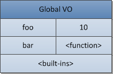

#深入理解JavaScript系列

##3、全面解析Module模式

Module模式的基本特征：

1. 模块化，可重用
- 封装了变量和function，和全局的namespace不接触，松耦合
- 只暴露可用public的方法，其它私有方法全部隐藏

**匿名闭包是让一切成为可能的基础，而这也是JavaScript最好的特性，我们来创建一个最简单的闭包函数，函数内部的代码一直存在于闭包内，在整个运行周期内，该闭包都保证了内部的代码处于私有状态。**

	(function () {
	    // ... 所有的变量和function都在这里声明，并且作用域也只能在这个匿名闭包里
	    // ...但是这里的代码依然可以访问外部全局的对象
	}());

**注意，匿名函数后面的括号，这是JavaScript语言所要求的，因为如果你不声明的话，JavaScript解释器默认是声明一个function函数，有括号，就是创建一个函数表达式，也就是自执行，用的时候不用再new了。**

一个基本的Module模式

	var blogModule = (function () {
	    var my = {}, privateName = "博客园";
	    function privateAddTopic(data) {
	        // 这里是内部处理代码
	    }
	    my.Name = privateName;
	    my.AddTopic = function (data) {
	        privateAddTopic(data);
	    };
	    return my;
	} ());
	
松耦合扩展

	var blogModule = (function (my) {
	    // 添加一些功能   
	    my.AddPhoto = function () {
	        //添加内部代码  
	    };
	    return my;
	} (blogModule || {}));  
	//确保blogModule对象，在存在的时候直接用，不存在的时候直接赋值为{}，实现blogModule模式的任意加载顺序
	
紧耦合扩展:限制了加载顺序，但是提供了我们重载的机会

	var blogModule = (function (my) {
	    var oldAddPhotoMethod = my.AddPhoto;
	    my.AddPhoto = function () {
	        // 重载方法，依然可通过oldAddPhotoMethod调用旧的方法
	    };
	    return my;
	} (blogModule));
	
克隆与继承

	var blogModule = (function (old) {
	    var my = {},
	        key;
	    for (key in old) {
	        if (old.hasOwnProperty(key)) {
	            my[key] = old[key];
	        }
	    }
	    var oldAddPhotoMethod = old.AddPhoto;
	    my.AddPhoto = function () {
	        // 克隆以后，进行了重写，当然也可以继续调用oldAddPhotoMethod
	    };
	    return my;
	} (blogModule));
	
子模块

	blogModule.CommentSubModule = (function () {
	    var my = {};
	    // ...
	    return my;
	} ());
	
##4、立即调用的函数表达式
**在JavaScript里，`任何function在执行的时候都会创建一个执行上下文`，因为为function声明的变量和function有可能只在该function内部，这个上下文，在调用function的时候，提供了一种简单的方式来创建自由变量或私有子function。**

当你声明类似function foo(){}或var foo = function(){}函数的时候，通过在后面加个括弧就可以实现自执行，例如foo()

	// 因为想下面第一个声明的function可以在后面加一个括弧()就可以自己执行了，比如foo()，
	// 因为foo仅仅是function() { /* code */ }这个表达式的一个引用 
	var foo = function(){ /* code */ }
	 
	// ...是不是意味着后面加个括弧都可以自动执行？
	function(){ /* code */ }(); // SyntaxError: Unexpected token (

上述代码，如果运行，第2个代码会出错，`因为在解析器解析全局的function或者function内部function关键字的时候，默认是认为function声明，而不是function表达式，如果你不显示告诉编译器，它默认会声明成一个缺少名字的function，并且抛出一个语法错误信息，因为function声明需要一个名字`。

即便你为上面那个错误的代码function(){ /\* code \*/ }();加上一个名字，他也会提示语法错误，只不过和上面的原因不一样。在一个表达式后面加上括号()，该表达式会立即执行，但是在一个语句后面加上括号()，是完全不一样的意思，他只是分组操作符。

	// 下面这个function在语法上是没问题的，但是依然只是一个语句
	// 加上括号()以后依然会报错，因为分组操作符需要包含表达式 
	function foo(){ /* code */ }(); // SyntaxError: Unexpected token )
	 
	// 但是如果你在括弧()里传入一个表达式，将不会有异常抛出
	// 但是foo函数依然不会执行
	function foo(){ /* code */ }( 1 );
	 
	// 因为它完全等价于下面这个代码，一个function声明后面，又声明了一个毫无关系的表达式： 
	function foo(){ /* code */ }
	( 1 );
	
要解决上述问题，我们只需要用大括弧将代码的代码全部括住就行了，`因为JavaScript里括弧()里面不能包含语句，解析器在解析function关键字的时候，会将相应的代码解析成function表达式，而不是function声明。`

	// 下面2个括弧()都会立即执行
	(function () { /* code */ } ()); // 推荐使用这个
	(function () { /* code */ })(); // 但是这个也是可以用的
	
	// 由于括弧()和JS的&&，异或，逗号等操作符是在函数表达式和函数声明上消除歧义的
	// 所以一旦解析器知道其中一个已经是表达式了，其它的也都默认为表达式了
	// 不过，请注意下一章节的内容解释
	var i = function () { return 10; } ();
	true && function () { /* code */ } ();
	0, function () { /* code */ } ();
	
	// 如果你不在意返回值，或者不怕难以阅读
	// 你甚至可以在function前面加一元操作符号
	!function () { /* code */ } ();
	~function () { /* code */ } ();
	-function () { /* code */ } ();
	+function () { /* code */ } ();
	
	// 还有一个情况，使用new关键字,也可以用，但我不确定它的效率
	new function () { /* code */ }
	new function () { /* code */ } () // 如果需要传递参数，只需要加上括弧()
	
###用闭包保存状态
	// 这个是可以用的，因为他在自执行函数表达式闭包内部
	// i的值作为locked的索引存在，在循环执行结束以后，尽管最后i的值变成了a元素总数（例如10）
	// 但闭包内部的lockedInIndex值是没有改变，因为他已经执行完毕了
	// 所以当点击连接的时候，结果是正确的
	var elems = document.getElementsByTagName('a');
	for (var i = 0; i < elems.length; i++) {
	    (function (lockedInIndex) {
	        elems[i].addEventListener('click', function (e) {
	            e.preventDefault();
	            alert('I am link #' + lockedInIndex);
	        }, 'false');
	
	    })(i);
	}
	
	// 你也可以像下面这样应用，在处理函数那里使用自执行函数表达式
	// 而不是在addEventListener外部
	// 但是相对来说，上面的代码更具可读性
	var elems = document.getElementsByTagName('a');
	for (var i = 0; i < elems.length; i++) {
	    elems[i].addEventListener('click', (function (lockedInIndex) {
	        return function (e) {
	            e.preventDefault();
	            alert('I am link #' + lockedInIndex);
	        };
	    })(i), 'false');
	}
	
**上面2个例子里的lockedInIndex变量，也可以换成i，因为和外面的i不在一个作用域，所以不会出现问题，这也是匿名函数+闭包的威力。**

###什么叫自执行，什么叫立即调用
	// 这是一个自执行的函数，函数内部执行自身，递归
	function foo() { foo(); }
	
	// 这是一个自执行的匿名函数，因为没有标示名称
	// 必须使用arguments.callee属性来执行自己
	var foo = function () { arguments.callee(); };
	
	// 这可能也是一个自执行的匿名函数，仅仅是foo标示名称引用它自身
	// 如果你将foo改变成其它的，你将得到一个used-to-self-execute匿名函数
	var foo = function () { foo(); };
	
	// 有些人叫这个是自执行的匿名函数（即便它不是），因为它没有调用自身，它只是立即执行而已。
	(function () { /* code */ } ());
	
	// 为函数表达式添加一个标示名称，可以方便Debug
	// 但一定命名了，这个函数就不再是匿名的了
	(function foo() { /* code */ } ());
	
	// 立即调用的函数表达式（IIFE）也可以自执行，不过可能不常用罢了
	(function () { arguments.callee(); } ());
	(function foo() { foo(); } ());
	
	// 另外，下面的代码在黑莓5里执行会出错，因为在一个命名的函数表达式里，他的名称是undefined
	// 呵呵，奇怪
	(function foo() { foo(); } ());

注：arguments.callee在ECMAScript 5 strict mode里被废弃了，所以在这个模式下，其实是不能用的。

##5、强大的原型和原型链
`JavaScript是基于原型继承的语言.`

###原型prototype赋值
* prototype赋值对象字面量
		
		var Calculator = function (decimalDigits, tax) {
			this.decimalDigits = decimalDigits;
			this.tax = tax;
		};
		
		Calculator.prototype = {
			add: function (x, y) {
				return x + y;
			},
			subtract: function (x, y) {
				return x - y;
			}
		};
	
* prototype使用`function立即执行的表达式`来赋值

		Calculator.prototype = function () { } ();

	`它的好处就是可以封装私有的function，通过return的形式暴露出简单的使用名称，以达到public/private的效果`，修改后的代码如下：

		var Calculator = function (decimalDigits, tax) {
			this.decimalDigits = decimalDigits;
			this.tax = tax;
		};
		
		Calculator.prototype = function () {
			var add = function (x, y) {
				return x + y;
			},
			subtract = function (x, y) {
	              return x - y;
			};
			
			return {
				add: add,
				subtract: subtract
			}
		} ();
	
		//alert((new Calculator()).add(11, 3));
		
* `我们可以赋值任何类型的对象到原型上，但是不能赋值原子类型的值`，比如如下代码是无效的：

		function Foo() {}
		Foo.prototype = 1; // 无效
		
例：

	var BaseCalculator = function () {
	    //为每个实例都声明一个小数位数
	    this.decimalDigits = 2;
	};        
	//使用原型给BaseCalculator扩展2个对象方法
	BaseCalculator.prototype.add = function (x, y) {
	    return x + y;
	};
	BaseCalculator.prototype.subtract = function (x, y) {
	    return x - y;
	};
	var Calculator = function () {
	    //为每个实例都声明一个税收数字
	    this.tax = 5;
	};       
	Calculator.prototype = new BaseCalculator();
	
	var calc = new Calculator();
	alert(calc.add(1, 1));
	//BaseCalculator 里声明的decimalDigits属性，在 Calculator里是可以访问到的
	alert(calc.decimalDigits); 

**我们可以看到因为Calculator的原型是指向BaseCalculator的实例上的，所以可以访问他的decimalDigits属性值，那如果我不想让Calculator访问BaseCalculator的构造函数里声明的属性值，那怎么办呢？**这么办：

	var Calculator = function () {
	    this.tax= 5;
	};
	
	Calculator.prototype = BaseCalculator.prototype;//⭐️

通过将BaseCalculator的原型赋给Calculator的原型，这样你在Calculator的实例上就访问不到那个decimalDigits值了，如果你访问如下代码，那将会提升出错。

	var calc = new Calculator();
	alert(calc.add(1, 1));
	alert(calc.decimalDigits);//浏览器报错

###属性查找
`属性在查找的时候是先查找自身的属性，如果没有再查找原型，再没有，再往上走，一直查到Object的原型上。`

###hasOwnProperty函数
hasOwnProperty是Object.prototype的一个方法，他能`判断一个对象是否包含自定义属性而不是原型链上的属性`，因为hasOwnProperty 是 JavaScript 中唯一一个处理属性但是不查找原型链的函数。

JavaScript 不会保护 hasOwnProperty 被非法占用，因此如果一个对象碰巧存在这个属性，就需要使用外部的 hasOwnProperty 函数来获取正确的结果。

	Object.prototype.goo = 1; 
	var foo = {
	    hasOwnProperty: function() {
	        return false;
	    },
	    bar: 'Here be dragons'
	};
	
	foo.hasOwnProperty('bar'); // 总是返回 false
	
	//⭐️ 使用{}对象的 hasOwnProperty，并将其上下为设置为foo
	{}.hasOwnProperty.call(foo, 'bar'); // true
	{}.hasOwnProperty.call(foo, 'goo'); // false
	
	for(var i in foo) {
        if ({}.hasOwnProperty.call(foo,i)) {
            console.log(i);
        }
    }
    // 输出两个属性：hasOwnProperty 和 bar

##10、javascript核心
this这个值在一个继承机制中，仍然是指向它原本属于的对象，而不是从原型链上找到它时，它所属于的对象。

如果一个对象的prototype没有显示的声明过或定义过，那么\_\_prototype\_\_的默认值就是object.prototype, 而object.prototype也会有一个\_\_prototype\_\_, 这个就是原型链的终点了，被设置为null。

除了创建对象，构造函数(constructor) 还做了另一件有用的事情—自动为创建的新对象设置了原型对象(prototype object) 。原型对象存放于 ConstructorFunction.prototype 属性中。

构造函数与对象之间的关系

    // 构造函数
    function Foo(y) {
        // 构造函数将会以特定模式创建对象：被创建的对象都会有"y"属性
        this.y = y;
    }

    // "Foo.prototype"存放了新建对象的原型引用
    // 所以我们可以将之用于定义继承和共享属性或方法
    // 继承属性"x"
    Foo.prototype.x = 10;

    // 继承方法"calculate"
    Foo.prototype.calculate = function (z) {
        return this.x + this.y + z;
    };

    // 使用foo模式创建 "b" and "c"
    var b = new Foo(20);
    var c = new Foo(30);

    // 调用继承的方法
    b.calculate(30); // 60
    c.calculate(40); // 80

    // 让我们看看是否使用了预期的属性
    console.log(
            b.__proto__ === Foo.prototype, // true
            c.__proto__ === Foo.prototype, // true
            // "Foo.prototype"自动创建了一个特殊的属性"constructor"
            // 指向a的构造函数本身
            // 实例"b"和"c"可以通过授权找到它并用以检测自己的构造函数
            b.constructor === Foo, // true
            c.constructor === Foo, // true
            Foo.prototype.constructor === Foo, // true
            b.calculate === b.__proto__.calculate, // true
            b.__proto__.calculate === Foo.prototype.calculate // true
    );

上述代码可表示为如下的关系：

在ECMASscript中的代码有三种类型：global, function和eval。每一种代码的执行都需要依赖自身的上下文。当然global的上下文可能涵盖了很多的function和eval的实例。函数的每一次调用，都会进入函数执行中的上下文,并且来计算函数中变量等的值。eval函数的每一次执行，也会进入eval执行中的上下文，判断应该从何处获取变量的值。

`注意，一个function可能产生无限的上下文环境，因为一个函数的调用（甚至递归）都产生了一个新的上下文环境。`

**激活其它上下文的某个上下文被称为 调用者(caller) 。被激活的上下文被称为被调用者(callee) 。被调用者同时也可能是调用者(比如一个在全局上下文中被调用的函数调用某些自身的内部方法)。**

**当一个caller激活了一个callee，那么这个caller就会暂停它自身的执行，然后将控制权交给这个callee. 于是这个callee被放入堆栈，称为进行中的上下文[running/active execution context]. 当这个callee的上下文结束之后，会把控制权再次交给它的caller，然后caller会在刚才暂停的地方继续执行。在这个caller结束之后，会继续触发其他的上下文。一个callee可以用返回（return）或者抛出异常（exception）来结束自身的上下文。**

所有的ECMAScript的程序执行都可以看做是一个执行上下文堆栈[execution context (EC) stack]。堆栈的顶部就是处于激活状态的上下文。

**当一段程序开始时，会先进入全局执行上下文环境[global execution context], 这个也是堆栈中最底部的元素。此全局程序会开始初始化，初始化生成必要的对象[objects]和函数[functions]. 在此全局上下文执行的过程中，它可能会激活一些方法（当然是已经初始化过的），然后进入他们的上下文环境，然后将新的元素压入堆栈。在这些初始化都结束之后，这个系统会等待一些事件（例如用户的鼠标点击等），会触发一些方法，然后进入一个新的上下文环境。**

有一个函数上下文“EC1″和一个全局上下文“Global EC”，下图展现了从“Global EC”进入和退出“EC1″时栈的变化:

###执行上下文(Execution Context)
一个执行的上下文可以抽象的理解为object。每一个执行的上下文都有一系列的属性（我们称为上下文状态），他们用来追踪关联代码的执行进度。这个图示就是一个context的结构。

除了这3个所需要的属性(`变量对象(variable object)`，`this指针(this value)`，`作用域链(scope chain)` )，执行上下文根据具体实现还可以具有任意额外属性。

####变量对象(Variable Object)
注意：函数表达式[function expression]（而不是函数声明[function declarations]）是不包含在VO[variable object]里面的。

全局执行上下文情况：

	var foo = 10;
	function bar() {} // // 函数声明
	(function baz() {}); // 函数表达式
	console.log(
	  this.foo == foo, // true
	  window.bar == bar // true
	);
	console.log(baz); // 引用错误，baz没有被定义

全局上下文中的变量对象(VO)会有如下属性：

函数“baz”如果作为函数表达式则不被不被包含于变量对象。这就是在函数外部尝试访问产生引用错误(ReferenceError) 的原因。`ECMAScript仅有函数能够创建新的作用域`。在函数内部定义的变量与内部函数，在外部非直接可见并且不污染全局对象。使用 eval 的时候，同样会使用一个新的(eval创建)执行上下文。eval会使用全局变量对象或调用者的变量对象(eval的调用来源)。

####活动对象(activation object)
在一个函数上下文中，变量对象被表示为活动对象(activation object)。

当函数被调用者激活，这个特殊的活动对象(activation object) 就被创建了。它包含普通参数(formal parameters) 与特殊参数(arguments)对象(具有索引属性的参数映射表)。活动对象在函数上下文中作为变量对象使用。

即：函数的变量对象保持不变，但除去存储变量与函数声明之外，还包含以及特殊对象arguments 。

	function foo(x, y) {
	  var z = 30;
	  function bar() {} // 函数声明
	  (function baz() {}); // 函数表达式
	}
	
	foo(10, 20);

“foo”函数上下文的下一个激活对象(AO)如下图所示：

###作用域链(Scope Chains)
一个作用域链包括`父级变量对象（variable object）`（作用域链的顶部）、`函数自身变量VO`和`活动对象（activation object）`。不过，有些情况下也会包含其它的对象，例如在执行期间，动态加入作用域链中的—例如with或者catch语句。[译注：with-objects指的是with语句，产生的临时作用域对象；catch-clauses指的是catch从句，如catch(e)，这会产生异常对象，导致作用域变更]。

	var x = 10;
	(function foo() {
	  var y = 20;
	  (function bar() {
	    var z = 30;
	    // "x"和"y"是自由变量
	    // 会在作用域链的下一个对象中找到（函数”bar”的互动对象之后）
	    console.log(x + y + z);
	  })();
	})();
	
假设作用域链的对象联动是通过一个叫做__parent__的属性，它是指向作用域链的下一个对象。

with增大的作用域链

	Object.prototype.x = 10;
	var w = 20;
	var y = 30; 
	// 在SpiderMonkey全局对象里
	// 例如，全局上下文的变量对象是从"Object.prototype"继承到的
	// 所以我们可以得到“没有声明的全局变量”
	// 因为可以从原型链中获取
	console.log(x); // 10
	(function foo() { 
	  // "foo" 是局部变量
	  var w = 40;
	  var x = 100;
	  // "x" 可以从"Object.prototype"得到，注意值是10哦
	  // 因为{z: 50}是从它那里继承的
	  with ({z: 50}) {
	    console.log(w, x, y , z); // 40, 10, 30, 50
	  }
	  // 在"with"对象从作用域链删除之后
	  // x又可以从foo的上下文中得到了，注意这次值又回到了100哦
	  // "w" 也是局部变量
	  console.log(x, w); // 100, 40
	  // 在浏览器里
	  // 我们可以通过如下语句来得到全局的w值
	  console.log(window.w); // 20
	 
	})();
	
结构图示如下。在我们去搜寻__parent__之前，首先会去__proto__的链接中。

###闭包(Closures)
当一个函数从其他函数返回到外部的时候，这个问题将会出现。要能够在外部上下文结束时，进入外部上下文的变量，内部函数 在创建的时候(at creation moment) 需要将之存储进[[Scope]]属性的父元素的作用域中。然后当函数被激活时，上下文的作用域链表现为激活对象与[[Scope]]属性的组合。

`函数在被创建时保存外部作用域，是因为这个 被保存的作用域链(saved scope chain) 将会在未来的函数调用中用于变量查找。`

###this
`this是执行上下文环境的一个属性，而不是某个变量对象的属性.`

因为和变量不同，this是没有一个类似搜寻变量的过程。当你在代码中使用了this,这个 this的值就直接从执行的上下文中获取了，而不会从作用域链中搜寻。this的值只取决中进入上下文时的情况。

在函数上下文[function context]中，this可能会根据每次的函数调用而成为不同的值.`this会由每一次caller提供`,caller是通过调用表达式[call expression]产生的（也就是这个函数如何被激活调用的）。

##11、执行上下文（Execution Contexts）
###全局代码
这种类型的代码是在"程序"级处理的：例如加载外部的js文件或者本地标签内的代码。全局代码不包括任何function体内的代码。
###函数代码
当进入funtion函数代码(所有类型的funtions)的时候，ECStack被压入新元素。需要注意的是，具体的函数代码不包括内部函数(inner functions)代码。
###Eval 代码
eval 代码有点儿意思。它有一个概念： 调用上下文(calling context),例如，eval函数调用的时候产生的上下文。eval(变量或函数声明)活动会影响调用上下文(calling context)。

	eval('var x = 10');
	 
	(function foo() {
	  eval('var y = 20');
	})();
	 
	alert(x); // 10
	alert(y); // "y" 提示没有声明

ECStack的变化过程：

	ECStack = [
	  globalContext
	];
	 
	// eval('var x = 10');
	ECStack.push(
	  evalContext,
	  callingContext: globalContext
	);
	 
	// eval exited context
	ECStack.pop();
	 
	// foo funciton call
	ECStack.push(<foo> functionContext);
	 
	// eval('var y = 20');
	ECStack.push(
	  evalContext,
	  callingContext: <foo> functionContext
	);
	 
	// return from eval
	ECStack.pop();
	 
	// return from foo
	ECStack.pop();

##变量对象（Variable Object）
`变量对象`(缩写为VO)是一个与执行上下文相关的特殊对象，它存储着在上下文中声明的以下内容：

* 变量 (var, 变量声明);
* 函数声明 (FunctionDeclaration, 缩写为FD);
* 函数的形参

VO就是执行上下文的属性(property)：

	activeExecutionContext = {
	  VO: {
	    // 上下文数据（var, FD, function arguments)
	  }
	};
	
`只有全局上下文的变量对象允许通过VO的属性名称来间接访问(因为在全局上下文里，全局对象自身就是变量对象，稍后会详细介绍)，在其它上下文中是不能直接访问VO对象的，因为它只是内部机制的一个实现。`

例如：

	var a = 10;
	 
	function test(x) {
	  var b = 20;
	};
	 
	test(30);

对应的变量对象是：

	// 全局上下文的变量对象
	VO(globalContext) = {
	  a: 10,
	  test: <reference to function>
	};
	 
	// test函数上下文的变量对象
	VO(test functionContext) = {
	  x: 30,
	  b: 20
	};

###全局上下文中的变量对象
`全局对象(Global object) 是在进入任何执行上下文之前就已经创建了的对象；这个对象只存在一份，它的属性在程序中任何地方都可以访问，全局对象的生命周期终止于程序退出那一刻。`

全局对象初始创建阶段将Math、String、Date、parseInt作为自身属性，等属性初始化，同样也可以有额外创建的其它对象作为属性（其可以指向到全局对象自身）。例如，在DOM中，全局对象的window属性就可以引用全局对象自身(当然，并不是所有的具体实现都是这样)：

	global = {
	  Math: <...>,
	  String: <...>
	  ...
	  ...
	  window: global //引用自身
	};

当访问全局对象的属性时通常会忽略掉前缀，这是因为全局对象是不能通过名称直接访问的。不过我们依然可以通过全局上下文的this来访问全局对象，同样也可以递归引用自身。

###函数上下文中的变量对象
在函数执行上下文中，VO是不能直接访问的，此时由活动对象(activation object,缩写为AO)扮演VO的角色。

	VO(functionContext) === AO;

活动对象是在进入函数上下文时刻被创建的，它通过函数的arguments属性初始化。arguments属性的值是Arguments对象：

	AO = {
	  arguments: <ArgO>
	};

Arguments对象是活动对象的一个属性，它包括如下属性：

   1. callee — 指向当前函数的引用
   - length — 真正传递的参数个数
   - properties-indexes (字符串类型的整数) 属性的值就是函数的参数值(按参数列表从左到右排列)。 properties-indexes内部元素的个数等于arguments.length. properties-indexes 的值和实际传递进来的参数之间是共享的。

> **执行上下文的代码被分成两个基本的阶段来处理：
		1. 进入执行上下文
		2. 执行代码 **

变量对象的修改变化与这两个阶段紧密相关。

####进入执行上下文
当进入执行上下文(`代码执行之前`)时，VO里已经包含了下列属性：

* 函数的所有形参(如果我们是在函数执行上下文中): 由名称和对应值组成的一个变量对象的属性被创建；没有传递对应参数的话，那么由名称和undefined值组成的一种变量对象的属性也将被创建。
* 所有函数声明(FunctionDeclaration, FD): 由名称和对应值（函数对象(function-object)）组成一个变量对象的属性被创建；**如果变量对象已经存在相同名称的属性，则完全替换这个属性**。
* 所有变量声明(var, VariableDeclaration): 由名称和对应值（undefined）组成一个变量对象的属性被创建；**如果变量名称跟已经声明的形式参数或函数相同，则`变量声明不会干扰已经存在的这类属性`**。

例：

	function test(a, b) {
	  var c = 10;
	  function d() {}
	  var e = function _e() {};
	  (function x() {});
	}
	 
	test(10); // call

当进入带有参数10的test函数上下文时，AO表现为如下：

	AO(test) = {
	  a: 10,
	  b: undefined,
	  c: undefined,
	  d: <reference to FunctionDeclaration "d">
	  e: undefined
	};

AO里并不包含函数“x”。这是因为“x” 是一个函数表达式(FunctionExpression, 缩写为 FE) 而不是函数声明，函数表达式不会影响VO。 函数“_e” 同样也是函数表达式，但是因为它分配给了变量 “e”，所以它可以通过名称“e”来访问。

####代码执行
这个周期内，`AO/VO已经拥有了属性`(不过，**并不是所有的属性都有值，大部分属性的值还是系统默认的初始值undefined**)。

还是前面那个例子, AO/VO在代码解释期间被修改如下：

	AO['c'] = 10;
	AO['e'] = <reference to FunctionExpression "_e">;

再次注意，*因为FunctionExpression“_e”保存到了已声明的变量“e”上，所以它仍然存在于内存中。而FunctionExpression “x”却不存在于AO/VO中，也就是说如果我们想尝试调用“x”函数，不管在函数定义之前还是之后，都会出现一个错误“x is not defined”，未保存的函数表达式只有在它自己的定义或递归中才能被调用。*

经典例子：

	alert(x); // function
	var x = 10;
	alert(x); // 10 
	x = 20;
	function x() {};
	alert(x); // 20
	
`为什么第一个alert “x” 的返回值是function，而且它还是在“x” 声明之前访问的“x” 的？为什么不是10或20呢？因为，根据规范函数声明是在当进入上下文时填入的； 同意周期，在进入上下文的时候还有一个变量声明“x”，那么正如我们在上一个阶段所说，变量声明在顺序上跟在函数声明和形式参数声明之后，而且在这个进入上下文阶段，变量声明不会干扰VO中已经存在的同名函数声明或形式参数声明`，因此，在进入上下文时，VO的结构如下：

	VO = {};
	VO['x'] = <reference to FunctionDeclaration "x">
 
	// 找到var x = 10;
	// 如果function "x"没有已经声明的话
	// 这时候"x"的值应该是undefined
	// 但是这个case里变量声明没有影响同名的function的值
	VO['x'] = <the value is not disturbed, still function>
	
紧接着，在执行代码阶段，VO做如下修改：
	
	VO['x'] = 10;
	VO['x'] = 20;

我们可以在第二、三个alert看到这个效果。

###关于变量
各类文章和JavaScript相关的书籍都声称：“不管是使用var关键字(在全局上下文)还是不使用var关键字(在任何地方)，都可以声明一个变量”。请记住，这是错误的概念：

任何时候，变量只能通过使用var关键字才能声明。

上面的赋值语句：

	a = 10;

`这仅仅是给全局对象创建了一个新属性(但它不是变量)`。“不是变量”并不是说它不能被改变，而是指它不符合ECMAScript规范中的变量概念，所以它“不是变量”(它之所以能成为全局对象的属性，完全是因为VO(globalContext) === global)。

让我们通过下面的实例看看具体的区别吧：

	alert(a); // undefined
	alert(b); // "b" 没有声明
	 
	b = 10;
	var a = 20;

所有根源仍然是VO和进入上下文阶段和代码执行阶段：

进入上下文阶段：

	VO = {
	  a: undefined
	};

我们可以看到，因为“b”不是一个变量，所以在这个阶段根本就没有“b”，“b”将只在代码执行阶段才会出现(但是在我们这个例子里，还没有到那就已经出错了)。

让我们改变一下例子代码：

	alert(a); // undefined, 这个大家都知道，
	 
	b = 10;
	alert(b); // 10, 代码执行阶段创建
	 
	var a = 20;
	alert(a); // 20, 代码执行阶段修改

关于变量，还有一个重要的知识点。`变量相对于简单属性来说，变量有一个特性(attribute)：{DontDelete},这个特性的含义就是不能用delete操作符直接删除变量属性`。

	a = 10;
	alert(window.a); // 10
	alert(delete a); // true 
	alert(window.a); // undefined
	 
	var b = 20;
	alert(window.b); // 20
	alert(delete b); // false
	alert(window.b); // still 20

但是这个规则在有个上下文里不起走样，那就是`eval上下文，变量没有{DontDelete}特性`。

	eval('var a = 10;');
	alert(window.a); // 10
	alert(delete a); // true 
	alert(window.a); // undefined

使用一些调试工具(例如：Firebug)的控制台测试该实例时，请注意，Firebug同样是使用eval来执行控制台里你的代码。因此，变量属性同样没有{DontDelete}特性，可以被删除。

##13、this
this是执行上下文中的一个属性：

	activeExecutionContext = {
	  VO: {...},
	  this: thisValue
	};

`this与上下文中可执行代码的类型有直接关系，this值在进入上下文时确定，并且在上下文运行期间永久不变。`
###全局代码中的this
在全局代码中，this始终是全局对象本身

###函数代码中的this
this是进入上下文时确定，在一个函数代码中，这个值在每一次完全不同。在代码运行时的this值是不变的，也就是说，因为它不是一个变量，就不可能为其分配一个新值。

影响了函数代码中this值的变化有几个因素：

首先，在通常的函数调用中，this是由激活上下文代码的调用者来提供的，即调用函数的父上下文(parent context )。this取决于调用函数的方式。

不同的调用方式导致了不同的this值。

	function foo() {
	  alert(this);
	}
	foo(); // global
	alert(foo === foo.prototype.constructor); // true
	// 但是同一个function的不同的调用表达式，this是不同的
	foo.prototype.constructor(); // foo.prototype

	var foo = {
	  bar: function () {
	    alert(this);
	    alert(this === foo);
	  }
	};
	foo.bar(); // foo, true
	var exampleFunc = foo.bar;
	alert(exampleFunc === foo.bar); // true
	// 再一次，同一个function的不同的调用表达式，this是不同的
	exampleFunc(); // global, false

`在一个函数上下文中，this由调用者提供，由调用函数的方式来决定。`如果调用括号()的左边是引用类型的值，this将设为引用类型值的base对象（base object），在其他情况下（与引用类型不同的任何其它属性），这个值为null。不过，实际不存在this的值为null的情况，因为当this的值为null的时候，其值会被隐式转换为全局对象。

`标识符是变量名，函数名，函数参数名和全局对象中未识别的属性名。`    
为什么用表达式的不同形式激活同一个函数会不同的this值，答案在于引用类型（type Reference）不同的中间值。

一个通过调用方式动态确定this值的经典例子：

	function foo() {
	  alert(this.bar);
	}
	 
	var x = {bar: 10};
	var y = {bar: 20};
	 
	x.test = foo;
	y.test = foo;
	 
	x.test(); // 10
	y.test(); // 20

`当调用括号的左边不是引用类型而是其它类型，这个值自动设置为null，结果为全局对象。`

	(function () {
	  alert(this); // null => global
	})();

在这个例子中，我们有一个函数对象但不是引用类型的对象（它不是标示符，也不是属性访问器），相应地，this值最终设为全局对象。

更多复杂的例子：

	var foo = {
	  bar: function () {
	    alert(this);
	  }
	};
	 
	foo.bar(); // Reference, OK => foo
	(foo.bar)(); // Reference, OK => foo
	 
	(foo.bar = foo.bar)(); // global?
	(false || foo.bar)(); // global?
	(foo.bar, foo.bar)(); // global?
	
`在应用一定的运算操作之后，在调用括号的左边的值不在是引用类型。`

1. 第一个例子很明显———明显是引用类型，结果是，this为base对象，即foo。
- 在第二个例子中，组运算符并不适用，想想上面提到的，从引用类型中获得一个对象真正的值的方法，如GetValue。相应的，在组运算的返回中———我们得到仍是一个引用类型。这就是this值为什么再次设为base对象，即foo。
- 第三个例子中，与组运算符不同，`赋值运算符调用了GetValue方法。返回的结果是函数对象（但不是引用类型）`，这意味着this设为null，结果是global对象。
- 第四个和第五个也是一样——逗号运算符和逻辑运算符（OR）调用了GetValue 方法，相应地，我们失去了引用而得到了函数。并再次设为global。

内部函数被父函数调用; 局部变量、内部函数、形式参数储存在给定函数的激活对象中。

	function foo() {
	  function bar() {
	    alert(this); // global
	  }
	  bar(); // the same as AO.bar()
	}

作为构造器调用的函数中的this

	function A() {
	  alert(this); // "a"对象下创建一个新属性
	  this.x = 10;
	}
	 
	var a = new A();
	alert(a.x); // 10

在这个例子中，`new运算符调用“A”函数的内部的[[Construct]] 方法`，接着，在对象创建后，调用内部的[[Call]] 方法。 所有相同的函数“A”都将this的值设置为新创建的对象。

##14、作用域链(Scope Chain)
变量对象在每次进入上下文时创建，并填入初始值，值的更新出现在代码执行阶段。

每个上下文拥有自己的变量对象：对于全局上下文，它是全局对象自身；对于函数，它是活动对象。

作用域链正是内部上下文所有变量对象（包括父变量对象）的列表。此链用来变量查询。

[[scope]]是所有父变量对象的层级链，处于当前函数上下文之上，在函数创建时存于其中。

注意这重要的一点－－**`[[scope]]在函数创建时被存储－－静态（不变的），永远永远，直至函数销毁。即：函数可以永不调用，但[[scope]]属性已经写入，并存储在函数对象中。`**

**`与作用域链对比，[[scope]]是函数的一个属性而不是上下文。`**

在函数调用时进入上下文，这时候活动对象被创建，this和作用域（作用域链）被确定。

活动对象是作用域数组的第一个对象，即添加到作用域的前端。

标示符解析是一个处理过程，用来确定一个变量（或函数声明）属于哪个变量对象。

标识符解析过程包含与变量名对应属性的查找，即作用域中变量对象的连续查找，从最深的上下文开始，绕过作用域链直到最上层。

	var x = 10;
	 
	function foo() {
	  var y = 20;
	 
	  function bar() {
	    var z = 30;
	    alert(x +  y + z);
	  }
	 
	  bar();
	}
	 
	foo(); // 60

对此，我们有如下的变量/活动对象，函数的的[[scope]]属性以及上下文的作用域链：

全局上下文的变量对象是：

	globalContext.VO === Global = {
	  x: 10
	  foo: <reference to function>
	};

在“foo”创建时，“foo”的[[scope]]属性是：

	foo.[[Scope]] = [
	  globalContext.VO
	];

在“foo”激活时（进入上下文），“foo”上下文的活动对象是：

	fooContext.AO = {
	  y: 20,
	  bar: <reference to function>
	};

“foo”上下文的作用域链为：

	fooContext.Scope = fooContext.AO + foo.[[Scope]]  
	fooContext.Scope = [
	  fooContext.AO,
	  globalContext.VO
	];

内部函数“bar”创建时，其[[scope]]为：

	bar.[[Scope]] = [
	  fooContext.AO,
	  globalContext.VO
	];

在“bar”激活时，“bar”上下文的活动对象为：

	barContext.AO = {
	  z: 30
	};

“bar”上下文的作用域链为：

	barContext.Scope = barContext.AO + bar.[[Scope]] 
	 
	barContext.Scope = [
	  barContext.AO,
	  fooContext.AO,
	  globalContext.VO
	];

对“x”、“y”、“z”的标识符解析如下：

	- "x"
	-- barContext.AO // not found
	-- fooContext.AO // not found
	-- globalContext.VO // found - 10
	
	- "y"
	-- barContext.AO // not found
	-- fooContext.AO // found - 20
	
	- "z"
	-- barContext.AO // found - 30
	
执行上下文：

- 变量对象
	- 参数
	- 函数声明
	- 变量
- this
- scope
	- 活动对象（AO）+ 函数的[[scope]]属性
	
函数的生命周期：

- 创建
- 激活阶段

`[[scope]]在函数创建时被存储，与函数共存亡。`

    var x = 10;

    function foo() {
        console.log("foo x is:"+x);
        console.log("foo this is:"+this);
    }

    (function goo() {
        console.log("goo this is:"+this);
        var x = 20;
        foo(); // 10, but not 20
    })();
    //输入结果
    //goo this is:[object Window]
	//foo x is:10
	//foo this is:[object Window]
	
在函数创建时获得函数的[[scope]]属性，通过该属性访问到所有父上下文的变量。但是，这个规则有一个重要的例外，它涉及到`通过函数构造函数创建的函数`。

	var x = 10;
	function foo() { 
	  var y = 20;
	  function barFD() { // 函数声明
	    alert(x);
	    alert(y);
	  }
	  var barFE = function () { // 函数表达式
	    alert(x);
	    alert(y);
	  };
	  var barFn = Function('alert(x); alert(y);');
	  barFD(); // 10, 20
	  barFE(); // 10, 20
	  barFn(); // 10, "y" is not defined
	 
	}
	foo();

我们看到，通过函数构造函数（Function constructor）创建的函数“bar”，是不能访问变量“y”的。但这并不意味着函数“barFn”没有[[scope]]属性（否则它不能访问到变量“x”）。问题在于通过函构造函数创建的函数的[[scope]]属性总是唯一的全局对象。考虑到这一点，如通过这种函数创建除全局之外的最上层的上下文闭包是不可能的。

###全局和eval上下文中的作用域链
全局上下文的作用域链仅包含全局对象。代码eval的上下文与当前的调用上下文（calling context）拥有同样的作用域链。

	globalContext.Scope = [
	  Global
	];
	 
	evalContext.Scope === callingContext.Scope;

代码执行时对作用域链的影响

在ECMAScript 中，在代码执行阶段有两个声明能修改作用域链。这就是with声明和catch语句。它们添加到作用域链的最前端，对象须在这些声明中出现的标识符中查找。如果发生其中的一个，作用域链简要的作如下修改：

	Scope = withObject|catchObject + AO|VO + [[Scope]]

在这个例子中添加对象，对象是它的参数（这样，没有前缀，这个对象的属性变得可以访问）。

	var foo = {x: 10, y: 20};
	 
	with (foo) {
	  alert(x); // 10
	  alert(y); // 20
	}

作用域链修改成这样：

	Scope = foo + AO|VO + [[Scope]]

我们再次看到，通过with语句，对象中标识符的解析添加到作用域链的最前端：

	var x = 10, y = 10; 
	with ({x: 20}) { 
	  var x = 30, y = 30;
	  alert(x); // 30
	  alert(y); // 30
	}
	alert(x); // 10
	alert(y); // 30

在进入上下文时发生了什么？标识符“x”和“y”已被添加到变量对象中。此外，在代码运行阶段作如下修改：

1. x = 10, y = 10;
- 对象{x:20}添加到作用域的前端;
- 在with内部，遇到了var声明，当然什么也没创建，因为在进入上下文时，所有变量已被解析添加;
- 在第二步中，仅修改变量“x”，实际上对象中的“x”现在被解析，并添加到作用域链的最前端，“x”为20，变为30;
- 同样也有变量对象“y”的修改，被解析后其值也相应的由10变为30;
- 此外，在with声明完成后，它的特定对象从作用域链中移除（已改变的变量“x”－－30也从那个对象中移除），即作用域链的结构恢复到with得到加强以前的状态。
- 在最后两个alert中，当前变量对象的“x”保持同一，“y”的值现在等于30，在with声明运行中已发生改变。

##函数（Functions）
在ECMAScript 中有三种函数类型：函数声明，函数表达式和函数构造器创建的函数。

###函数声明（缩写为FD）是这样一种函数：

    有一个特定的名称
    在源码中的位置：要么处于程序级（Program level），要么处于其它函数的主体（FunctionBody）中；不可能在表达式位置或一个代码块中定义它。
    在进入上下文阶段创建
    影响变量对象
    以下面的方式声明
	function exampleFunc() {
	  ...
	}

###函数表达式（缩写为FE）是这样一种函数：

    在源码中须出现在表达式的位置
    有可选的名称
    不会影响变量对象
    在代码执行阶段创建
	var foo = function () {
	  ...
	};

FE总是处在表达式的位置

	// 圆括号（分组操作符）内只能是表达式
	(function foo() {});
	// 在数组初始化器内只能是表达式
	[function bar() {}];
	// 逗号也只能操作表达式
	1, function baz() {};

表达式定义里说明：`FE只能在代码执行阶段创建而且不存在于变量对象中`.

> **我们为什么需要函数表达式？答案很明显——`在表达式中使用它们，”不会污染”变量对象`。**    
**为何在函数创建后的立即调用中必须用圆括号来包围它？答案就是：`表达式句子的限制就是这样的`。**按照标准，表达式语句不能以一个大括号{开始是因为他很难与代码块区分，同样，他也不能以函数关键字开始，因为很难与函数声明进行区分。

>”关于圆括号”问题完整的答案如下：`当函数不在表达式的位置的时候，分组操作符圆括号是必须的——也就是手工将函数转化成FE。如果解析器知道它处理的是FE，就没必要用圆括号。`

**示例：将一个函数作为参数传递给其它函数。**

	function foo(callback) {
	  callback();
	}
	 
	foo(function bar() {
	  alert('foo.bar');
	});
	
在上述例子里，FE赋值给了一个变量（也就是参数），函数将该表达式保存在内存中，并通过变量名来访问（因为变量影响变量对象)，如下：

	var foo = function () {
	  alert('foo');
	};
	 
	foo();

**示例：创建封装的闭包从外部上下文中隐藏辅助性数据**（在下面的例子中我们使用FE，它在创建后立即调用）：

	var foo = {};
	(function initialize() {
	  var x = 10;
	  foo.bar = function () {
	    alert(x);
	  };
	})();
	foo.bar(); // 10;
	alert(x); // "x" 未定义

我们看到函数foo.bar（通过[[Scope]]属性）访问到函数initialize的内部变量“x”。同时，“x”在外部不能直接访问。在许多库中，这种策略常用来创建”私有”数据和隐藏辅助实体。

**示例：在代码执行阶段通过条件语句进行创建FE，不会污染变量对象VO。**

	var foo = 10; 
	var bar = (foo % 2 == 0
	  ? function () { alert(0); }
	  : function () { alert(1); }
	);
	bar(); // 0

关于圆括号的问题

	//SyntaxError错误，是因为函数声明没有名字（函数声明必须有名字）
	function () {
	  ...
	}();
	 
	// 即便有名称,依然得到了一个语法错误——没有任何表达式的分组操作符错误。在函数声明后面他确实是一个分组操作符，而不是一个函数调用所使用的圆括号。
	function foo() {
	  ...
	}();
	
**注意**，下面一个立即执行的函数，周围的括号不是必须的，因为函数已经处在表达式的位置，解析器知道它处理的是在函数执行阶段应该被创建的FE，这样在函数创建后立即调用了函数。

	var foo = {
	  bar: function (x) {
	    return x % 2 != 0 ? 'yes' : 'no';
	  }(1)
	 
	};
	alert(foo.bar); // 'yes'

就像我们看到的，foo.bar是一个字符串而不是一个函数，这里的函数仅仅用来根据条件参数初始化这个属性——它创建后并立即调用。

`函数表达式存储位置`：当解释器在代码执行阶段遇到命名的FE时，在FE创建之前，它创建了辅助的特定对象，并添加到当前作用域链的最前端。然后它创建了FE，此时函数获取了[[Scope]] 属性——创建这个函数上下文的作用域链）。此后，FE的名称添加到特定对象上作为唯一的属性；这个属性的值是引用到FE上。最后一步是从父作用域链中移除那个特定的对象。因此，在函数外部这个名称不可用的（因为它不在父作用域链中），但是，特定对象已经存储在函数的[[scope]]中，在那里名称是可用的。

###通过函数构造器创建的函数
我们将它与FD和FE区分开来。其主要特点在于这种函数的[[Scope]]属性仅包含全局对象

###创建函数的算法
	F = new NativeObject();
	 
	// 属性[[Class]]是"Function"
	F.[[Class]] = "Function"
	 
	// 函数对象的原型是Function的原型
	F.[[Prototype]] = Function.prototype
	 
	// 医用到函数自身
	// 调用表达式F的时候激活[[Call]]
	// 并且创建新的执行上下文
	F.[[Call]] = <reference to function>
	 
	// 在对象的普通构造器里编译
	// [[Construct]] 通过new关键字激活
	// 并且给新对象分配内存
	// 然后调用F.[[Call]]初始化作为this传递的新创建的对象
	F.[[Construct]] = internalConstructor
	 
	// 当前执行上下文的作用域链
	// 例如，创建F的上下文
	F.[[Scope]] = activeContext.Scope
	// 如果函数通过new Function(...)来创建，
	// 那么
	F.[[Scope]] = globalContext.Scope
	 
	// 传入参数的个数
	F.length = countParameters
	 
	// F对象创建的原型
	__objectPrototype = new Object();
	__objectPrototype.constructor = F // {DontEnum}, 在循环里不可枚举x
	F.prototype = __objectPrototype
	 
	return F

注意，F.[[Prototype]]是函数（构造器）的一个原型，F.prototype是通过这个函数创建的对象的原型

##19、求值策略(Evaluation strategy)：函数传参
在ECMAScript向函数function传递参数的策略。
###按值传递
按值传递，参数的值是调用者传递的对象值的拷贝(copy of value），函数内部改变参数的值不会影响到外面的对象（该参数在外面的值），一般来说，是重新分配了新内存，该新内存块的值是外部对象的拷贝，并且它的值是用到函数内部的。

###按引用传递
按引用传递接收的不是值拷贝，而是对象的隐式引用，如该对象在外部的直接引用地址。函数内部对参数的任何改变都是影响该对象在函数外部的值，因为两者引用的是同一个对象，也就是说：这时候参数就相当于外部对象的一个别名。

**`ECMAScript中将对象作为参数传递的策略——按共享传递：修改参数的属性将会影响到外部，而重新赋值将不会影响到外部对象。`**

	var foo = {x: 10, y: 20};
	var bar = foo;
	 
	alert(bar === foo); // true
	 
	bar.x = 100;
	bar.y = 200;
	 
	alert([foo.x, foo.y]); // [100, 200]

即两个标识符（名称绑定）绑定到内存中的同一个对象， 共享这个对象：

	foo value: addr(0xFF) => {x: 100, y: 200} (address 0xFF) <= bar value: addr(0xFF)

而重新赋值分配，绑定是新的对象标识符（新地址），而不影响已经先前绑定的对象 ：

	bar = {z: 1, q: 2};
	 
	alert([foo.x, foo.y]); // [100, 200] – 没改变
	alert([bar.z, bar.q]); // [1, 2] – 但现在引用的是新对象

即现在foo和 bar，有不同的值和不同的地址:

	foo value: addr(0xFF) => {x: 100, y: 200} (address 0xFF)
	bar value: addr(0xFA) => {z: 1, q: 2} (address 0xFA)

这里所说对象的值是地址（address），而不是对象结构本身，将变量赋值给另外一个变量——是赋值值的引用。因此两个变量引用的是同一个内存地址。下一个赋值却是新地址，是解析与旧对象的地址绑定，然后绑定到新对象的地址上，这就是和按引用传递的最重要区别。

##16、闭包（Closures）
在ECMAScript中，同一个父上下文中创建的闭包是共用一个[[Scope]]属性的。也就是说，某个闭包对其中[[Scope]]的变量做修改会影响到其他闭包对其变量的读取：

这就是说：所有的内部函数都共享同一个父作用域

	var firstClosure;
	var secondClosure;
	
	function foo() {
	
	  var x = 1;
	
	  firstClosure = function () { return ++x; };
	  secondClosure = function () { return --x; };
	
	  x = 2; // 影响 AO["x"], 在2个闭包公有的[[Scope]]中
	
	  alert(firstClosure()); // 3, 通过第一个闭包的[[Scope]]
	}
	
	foo();
	
	alert(firstClosure()); // 4
	alert(secondClosure()); // 3
	
同一个上下文中创建的闭包是共用一个[[Scope]]属性的

###闭包用法实战
####函数作为参数
数组排序的例子，它接受一个排序条件**函数作为参数**：

	[1, 2, 3].sort(function (a, b) {
	  ... // 排序条件
	});
	
数组的map方法是根据函数中定义的条件将原数组映射到一个新的数组中：

	[1, 2, 3].map(function (element) {
	  return element * 2;
	}); // [2, 4, 6]
	
搜索方法，可以支持无限制的搜索条件：

	someCollection.find(function (element) {
	  return element.someProperty == 'searchCondition';
	});

将函数应用到每个数组元素：

	[1, 2, 3].forEach(function (element) {
	  if (element % 2 != 0) {
	    alert(element);
	  }
	}); // 1, 3
	
我们将apply 和 call方法看作是应用函数 —— 应用到参数中的函数（在apply中是参数列表，在call中是独立的参数）：

	(function () {
	  alert([].join.call(arguments, ';')); // 1;2;3
	}).apply(this, [1, 2, 3]);

#### 延迟调用：

	var a = 10;
	setTimeout(function () {
	  alert(a); // 10, after one second
	}, 1000);
	
####回调函数
	
	//...
	var x = 10;
	// only for example
	xmlHttpRequestObject.onreadystatechange = function () {
	  // 当数据就绪的时候，才会调用;
	  // 这里，不论是在哪个上下文中创建
	  // 此时变量“x”的值已经存在了
	  alert(x); // 10
	};
	//...
	
####创建封装的作用域来隐藏辅助对象：

	var foo = {};
	// 初始化
	(function (object) {
	  var x = 10;
	  object.getX = function _getX() {
	    return x;
	  };
	})(foo);
	alert(foo.getX()); // 获得闭包 "x" – 10

 
参考文档：   
http://www.cnblogs.com/TomXu/archive/2011/12/15/2288411.html   

