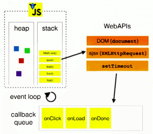

#setTimeout及Javascript运行机制Event Loop

##setTimeout
setTimeout() 方法用于在指定的毫秒数后调用函数或计算表达式。
语法：
	
	setTimeout(fn,millisec)
	
fn表示要执行的代码，可以是一个包含javascript代码的字符串，也可以是一个函数。   
millisec是以毫秒表示的时间，表示fn需推迟多长时间执行。   
调用setTimeout()方法之后，该方法返回一个数字，这个数字是计划执行代码的唯一标识符，可以通过它来取消超时调用。

	var start = new Date;
	setTimeout(function(){
		var end = new Date;
		console.log('Time elapsed:', end - start, 'ms');
	}, 500);
	while (new Date - start < 1000) {};
	
在我最初对setTimeout()的认识中，延时设置为500ms，所以输出应该为Time elapsed: 500 ms。可是实际上，上述代码运行多次后，输出至少是延迟了1000ms。    
通过阅读代码不难看出，setTimeout()方法执行在while()循环之前，它声明了“希望”在500ms之后执行一次匿名函数，这一声明，也即对匿名函数的注册，在setTimeout()方法执行后立即生效。代码最后一行的while循环会持续运行1000ms，通过setTimeout()方法注册的匿名函数输出的延迟时间总是大于1000ms，说明对这一匿名函数的实际调用被while()循环阻塞了，实际的调用在while()循环阻塞结束后才真正执行。    
`在现有浏览器环境中，Javascript执行引擎是单线程的，主线程的语句和方法，会阻塞定时任务的运行，执行引擎只有在执行完主线程的语句后，定时任务才会实际执行，这期间的时间，可能大于注册任务时设置的延时时间。`  
**执行引擎先将setTimeout()方法入栈被执行，执行时将延时方法交给内核相应模块处理。引擎继续处理后面代码，while语句将引擎阻塞了1秒，而在这过程中，内核timer模块在0.5秒时已将延时方法添加到任务队列，在引擎执行栈清空后，引擎将延时方法入栈并处理，最终输出的时间超过预期设置的时间。**

###事件循环模型
在单线程的Javascript引擎中，setTimeout()是如何运行的呢，这里就要提到浏览器内核中的事件循环模型了。简单的讲，在Javascript执行引擎之外，有一个任务队列，当在代码中调用setTimeout()方法时，注册的延时方法会交由浏览器内核其他模块（以webkit为例，是webcore模块）处理，当延时方法到达触发条件，即到达设置的延时时间时，这一延时方法被添加至任务队列里。这一过程由浏览器内核其他模块处理，与执行引擎主线程独立，执行引擎在主线程方法执行完毕，到达空闲状态时，会从任务队列中顺序获取任务来执行，这一过程是一个不断循环的过程，称为事件循环模型。

javascript执行引擎的主线程运行的时候，产生堆（heap）和栈（stack）。程序中代码依次进入栈中等待执行，当调用setTimeout()方法时，即图中右侧WebAPIs方法时，浏览器内核相应模块开始延时方法的处理，当延时方法到达触发条件时，方法被添加到用于回调的任务队列，只要执行引擎栈中的代码执行完毕，主线程就会去读取任务队列，依次执行那些满足触发条件的回调函数。

执行引擎开始执行上述代码时，相当于先讲一个main()方法加入执行栈。继续往下开始console.log(‘Hi’)时，log(‘Hi’)方法入栈，console.log方法是一个webkit内核支持的普通方法，而不是前面图中WebAPIs涉及的方法，所以这里log(‘Hi’)方法立即出栈被引擎执行.

console.log(‘Hi’)语句执行完成后，log()方法出栈执行，输出了Hi。引擎继续往下，将setTimeout(callback,5000)添加到执行栈。setTimeout()方法属于事件循环模型中WebAPIs中的方法，引擎在将setTimeout()方法出栈执行时，将延时执行的函数交给了相应模块，即图右方的timer模块来处理。

执行引擎将setTimeout出栈执行时，将延时处理方法交由了webkit timer模块处理，然后立即继续往下处理后面代码，于是将log(‘SJS’)加入执行栈，接下来log(‘SJS’)出栈执行，输出SJS。而执行引擎在执行万console.log(‘SJS’)后，程序处理完毕，main()方法也出栈。

这时在在setTimeout方法执行5秒后，timer模块检测到延时处理方法到达触发条件，于是将延时处理方法加入任务队列。而此时执行引擎的执行栈为空，所以引擎开始轮询检查任务队列是否有任务需要被执行，就检查到已经到达执行条件的延时方法，于是将延时方法加入执行栈。引擎发现延时方法调用了log()方法，于是又将log()方法入栈。然后对执行栈依次出栈执行，输出there，清空执行栈。   
清空执行栈后，执行引擎会继续去轮询任务队列，检查是否还有任务可执行。

###webkit中timer的实现
事件循环模型图中提到的WebAPIs部分，提到了DOM事件，AJAX调用和setTimeout方法，图中简单的把它们总结为WebAPIs，而且他们同样都把回调函数添加到任务队列等待引擎执行。这是一个简化的描述，实际上浏览器内核对DOM事件、AJAX调用和setTimeout方法都有相应的模块来处理，webkit内核在Javasctipt执行引擎之外，有一个重要的模块是webcore模块，html的解析，css样式的计算等都由webcore实现。对于图中WebAPIs提到的三种API，webcore分别提供了DOM Binding、network、timer模块来处理底层实现。
Timer类是webkit 内核的一个必需的基础组件，通过阅读源码可以全面理解其原理，本文对其简化，分析其执行流程。

通过setTimeout()方法注册的延时方法，被传递给webcore组件timer模块处理。timer中关键类为TheadTimers类，其包含两个重要成员，TimerHeap任务队列和SharedTimer方法调度类。延时方法被封装为timer对象，存储在TimerHeap中。和Java.util.Timer任务队列一样，TimerHeap同样采用最小堆的数据结构，以nextFireTime作为关键字排序。SharedTimer作为TimerHeap调度类，在timer对象到达触发条件时，通过浏览器平台相关的接口，将延时方法添加到事件循环模型中提到的任务队列中。   
TimerHeap采用最小堆的数据结构，预期延时时间最小的任务最先被执行，同时，预期延时时间相同的两个任务，其执行顺序是按照注册的先后顺序执行。

	var start = new Date;
	
	setTimeout(function(){
		console.log('fn1');
	}, 20);
	
	setTimeout(function(){
		console.log('fn2');
	}, 30);
	
	setTimeout(function(){
		console.log('another fn2');
	}, 30);
	
	setTimeout(function(){
		console.log('fn3');
	}, 10);
	
	console.log('start while');
	while (new Date - start < 1000) {};
	console.log('end while');
	
	/*
	执行结果
	start while
	end while
	fn3
	fn1
	fn2
	another fn2
	*/

##JavaScript运行机制

###任务队列
单线程就意味着，所有任务需要排队，前一个任务结束，才会执行后一个任务。如果前一个任务耗时很长，后一个任务就不得不一直等着。    

任务可以分成两种，一种是同步任务（synchronous），另一种是异步任务（asynchronous）。同步任务指的是，在主线程上排队执行的任务，只有前一个任务执行完毕，才能执行后一个任务；异步任务指的是，不进入主线程、而进入"任务队列"（task queue）的任务，只有"任务队列"通知主线程，某个异步任务可以执行了，该任务才会进入主线程执行。

异步执行的运行机制如下：

1. 所有同步任务都在主线程上执行，形成一个执行栈（execution context stack）。
2. 主线程之外，还存在一个"任务队列"（task queue）。只要异步任务有了运行结果，就在"任务队列"之中放置一个事件。
3. 一旦"执行栈"中的所有同步任务执行完毕，系统就会读取"任务队列"，看看里面有哪些事件。那些对应的异步任务，于是结束等待状态，进入执行栈，开始执行。
4. 主线程不断重复上面的第三步。

下图就是主线程和任务队列的示意图

只要主线程空了，就会去读取"任务队列"，这就是JavaScript的运行机制。这个过程会不断重复。

###事件和回调函数
"任务队列"是一个事件的队列（也可以理解成消息的队列），IO设备完成一项任务，就在"任务队列"中添加一个事件，表示相关的异步任务可以进入"执行栈"了。主线程读取"任务队列"，就是读取里面有哪些事件。
   
"任务队列"中的事件，除了IO设备的事件以外，还包括一些用户产生的事件（比如鼠标点击、页面滚动等等）。只要指定过回调函数，这些事件发生时就会进入"任务队列"，等待主线程读取。
   
所谓"回调函数"（callback），就是那些会被主线程挂起来的代码。异步任务必须指定回调函数，当主线程开始执行异步任务，就是执行对应的回调函数。   

"任务队列"是一个先进先出的数据结构，排在前面的事件，优先被主线程读取。主线程的读取过程基本上是自动的，只要执行栈一清空，"任务队列"上第一位的事件就自动进入主线程。但是，由于存在后文提到的"定时器"功能，主线程首先要检查一下执行时间，某些事件只有到了规定的时间，才能返回主线程。   

###Event Loop

上图中，主线程运行的时候，产生堆（heap）和栈（stack），栈中的代码调用各种外部API，它们在"任务队列"中加入各种事件（click，load，done）。只要栈中的代码执行完毕，主线程就会去读取"任务队列"，依次执行那些事件所对应的回调函数。
执行栈中的代码（同步任务），总是在读取"任务队列"（异步任务）之前执行。请看下面这个例子。
	
	var req = new XMLHttpRequest();
    req.open('GET', url);    
    req.onload = function (){};    
    req.onerror = function (){};    
    req.send();
上面代码中的req.send方法是Ajax操作向服务器发送数据，它是一个异步任务，意味着只有当前脚本的所有代码执行完，系统才会去读取"任务队列"。所以，它与下面的写法等价。
	
	var req = new XMLHttpRequest();
    req.open('GET', url);
    req.send();
    req.onload = function (){};    
    req.onerror = function (){};
也就是说，指定回调函数的部分（onload和onerror），在send()方法的前面或后面无关紧要，因为它们属于执行栈的一部分，系统总是执行完它们，才会去读取"任务队列"。

###定时器
除了放置异步任务的事件，"任务队列"还可以放置定时事件，即指定某些代码在多少时间之后执行。这叫做"定时器"（timer）功能，也就是定时执行的代码。   

定时器功能主要由setTimeout()和setInterval()这两个函数来完成，它们的内部运行机制完全一样，区别在于前者指定的代码是一次性执行，后者则为反复执行。以下主要讨论setTimeout()。   
setTimeout()接受两个参数，第一个是回调函数，第二个是推迟执行的毫秒数。   

	console.log(1);
	setTimeout(function(){console.log(2);},1000);
	console.log(3);
上面代码的执行结果是1，3，2，因为setTimeout()将第二行推迟到1000毫秒之后执行。
   
如果将setTimeout()的第二个参数设为0，就表示当前代码执行完（执行栈清空）以后，立即执行（0毫秒间隔）指定的回调函数。   

	setTimeout(function(){console.log(1);}, 0);
	console.log(2);

上面代码的执行结果总是2，1，因为只有在执行完第二行以后，系统才会去执行"任务队列"中的回调函数。   

总之，setTimeout(fn,0)的含义是，指定某个任务在主线程最早可得的空闲时间执行，也就是说，尽可能早得执行。它在"任务队列"的尾部添加一个事件，因此要等到同步任务和"任务队列"现有的事件都处理完，才会得到执行。 
  
HTML5标准规定了setTimeout()的第二个参数的最小值（最短间隔），不得低于4毫秒，如果低于这个值，就会自动增加。在此之前，老版本的浏览器都将最短间隔设为10毫秒。另外，对于那些DOM的变动（尤其是涉及页面重新渲染的部分），通常不会立即执行，而是每16毫秒执行一次。这时使用requestAnimationFrame()的效果要好于setTimeout()。  
 
需要注意的是，setTimeout()只是将事件插入了"任务队列"，必须等到当前代码（执行栈）执行完，主线程才会去执行它指定的回调函数。要是当前代码耗时很长，有可能要等很久，所以并没有办法保证，回调函数一定会在setTimeout()指定的时间执行。 

###Node.js的Event Loop
Node.js也是单线程的Event Loop，但是它的运行机制不同于浏览器环境。

  

根据上图，Node.js的运行机制如下:

1. V8引擎解析JavaScript脚本。
2. 解析后的代码，调用Node API。
3. libuv库负责Node API的执行。它将不同的任务分配给不同的线程，形成一个Event Loop（事件循环），以异步的方式将任务的执行结果返回给V8引擎。
4. V8引擎再将结果返回给用户。

除了setTimeout和setInterval这两个方法，Node.js还提供了另外两个与"任务队列"有关的方法：process.nextTick和setImmediate。它们可以帮助我们加深对"任务队列"的理解。

process.nextTick方法可以在当前"执行栈"的尾部----下一次Event Loop（主线程读取"任务队列"）之前----触发回调函数。也就是说，它指定的任务总是发生在所有异步任务之前。setImmediate方法则是在当前"任务队列"的尾部添加事件，也就是说，它指定的任务总是在下一次Event Loop时执行，这与setTimeout(fn, 0)很像。请看下面的例子。

	process.nextTick(function A() {
  		console.log(1);
  		process.nextTick(function B(){console.log(2);});
	});

	setTimeout(function timeout() {
  		console.log('TIMEOUT FIRED');
	}, 0)
	
	//运行结果
	// 1
	// 2
	// TIMEOUT FIRED
	
上面代码中，由于process.nextTick方法指定的回调函数，总是在当前"执行栈"的尾部触发，所以不仅函数A比setTimeout指定的回调函数timeout先执行，而且函数B也比timeout先执行。这说明，如果有多个process.nextTick语句（不管它们是否嵌套），将全部在当前"执行栈"执行。
现在，再看setImmediate。

	setImmediate(function A() {
  		console.log(1);
  		setImmediate(function B(){console.log(2);});
		});

	setTimeout(function timeout() {
  		console.log('TIMEOUT FIRED');
	}, 0);
	
上面代码中，setImmediate与setTimeout(fn,0)各自添加了一个回调函数A和timeout，都是在下一次Event Loop触发。那么，哪个回调函数先执行呢？答案是不确定。**运行结果可能是1--TIMEOUT FIRED--2，也可能是TIMEOUT FIRED--1--2**。

令人困惑的是，Node.js文档中称，setImmediate指定的回调函数，总是排在setTimeout前面。实际上，这种情况只发生在递归调用的时候。

	setImmediate(function (){
  		setImmediate(function A() {
    		console.log(1);
    		setImmediate(function B(){console.log(2);});
  		});

  		setTimeout(function timeout() {
    		console.log('TIMEOUT FIRED');
  		}, 0);
	});
	
	//运行结果
	// 1
	// TIMEOUT FIRED
	// 2
	
上面代码中，setImmediate和setTimeout被封装在一个setImmediate里面，它的运行结果总是1--TIMEOUT FIRED--2，这时函数A一定在timeout前面触发。至于2排在TIMEOUT FIRED的后面（即函数B在timeout后面触发），是因为setImmediate总是将事件注册到下一轮Event Loop，所以函数A和timeout是在同一轮Loop执行，而函数B在下一轮Loop执行。

我们由此得到了process.nextTick和setImmediate的一个重要区别：`多个process.nextTick语句总是在当前"执行栈"一次执行完，多个setImmediate可能则需要多次loop才能执行完。`事实上，这正是Node.js 10.0版添加setImmediate方法的原因，否则像下面这样的递归调用process.nextTick，将会没完没了，主线程根本不会去读取"事件队列"！

	process.nextTick(function foo() {
  		process.nextTick(foo);
	});
	
事实上，现在要是你写出递归的process.nextTick，Node.js会抛出一个警告，要求你改成setImmediate。

另外，由于process.nextTick指定的回调函数是在本次"事件循环"触发，而setImmediate指定的是在下次"事件循环"触发，所以很显然，前者总是比后者发生得早，而且执行效率也高（因为不用检查"任务队列"）。

###javascript中堆和栈
在ECMAScript中，变量可以存放两种类型的值，即原始值和引用值。

原始值指的就是代表原始数据类型（基本数据类型）的值，即Undefined,Null,Number,String,Boolean类型所表示的值。

引用值指的就是复合数据类型的值，即Object,Function,Array,以及自定义对象等

原始值是存储在栈中的简单数据段，也就是说，他们的值直接存储在变量访问的位置。   

堆是存放数据的基于散列算法的数据结构，在javascript中，引用值是存放在堆中的。

引用值是存储在堆中的对象，也就是说，存储在变量处的值(即指向对象的变量，存储在栈中）是一个指针，指向存储在堆中的实际对象.

例：var obj = new Object(); obj存储在栈中它指向于new Object()这个对象，而new Object()是存放在堆中的。

首先，我们来看一下代码：

	function Person(id,name,age){
	    this.id = id;
	    this.name = name;
	    this.age = age;
	}
	 
	var num = 10;
	var bol = true;
	var str = "abc";
	var obj = new Object();
	var person = new Person(100,"笨蛋的座右铭",25);
	var arr = ['a','b','c'];
	
然后我们来看一下内存分析图：

变量num,bol,str为基本数据类型，它们的值，直接存放在栈中，obj,person,arr为复合数据类型，他们的引用变量存储在栈中，指向于存储在堆中的实际对象。

为什么引用值要放在堆中，而原始值要放在栈中?

`堆比栈大，栈比堆的运算速度快,对象是一个复杂的结构，并且可以自由扩展，如：数组可以无限扩充，对象可以自由添加属性。将他们放在堆中是为了不影响栈的效率。而是通过引用的方式查找到堆中的实际对象再进行操作。相对于简单数据类型而言，简单数据类型就比较稳定，并且它只占据很小的内存。不将简单数据类型放在堆是因为通过引用到堆中查找实际对象是要花费时间的，而这个综合成本远大于直接从栈中取得实际值的成本。所以简单数据类型的值直接存放在栈中。`

 
参考文章：   
从setTimeout说事件循环模型   
http://web.jobbole.com/83883/#comment-95871   
JavaScript 运行机制详解：再谈Event Loop   
http://www.ruanyifeng.com/blog/2014/10/event-loop.html  

