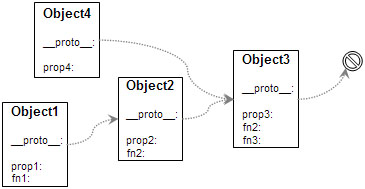
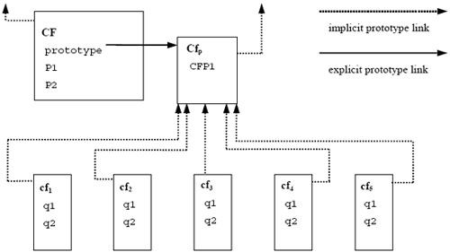

#this关键字、函数的执行环境、作用域和作用域链、闭包、数据类型、prototype原型和原型链、Javascript面向对象编程
##this关键字
`this是Javascript语言的一个关键字。它代表函数运行时，自动生成的一个内部对象，只能在函数内部使用。
随着函数使用场合的不同，this的值会发生变化。但是有一个总的原则，那就是this指的是，调用函数的那个对象。`

**JavaScript 语言中的 this,由于其运行期绑定的特性，JavaScript 中的 this 含义要丰富得多，它可以是全局对象、当前对象或者任意对象，这完全取决于函数的调用方式。JavaScript 中函数的调用有以下几种方式：作为函数调用，作为对象方法调用，作为构造函数调用，和使用 apply 或 call 调用。**

###一、纯粹的函数调用
这是函数的最通常用法，属于全局性调用，因此this就代表全局对象Global。在浏览器中，window 就是该全局对象。

请看下面这段代码，它的运行结果是1。

	function test(){
		this.x = 1;
		alert(this.x);
	}
	test(); // 1
　　
为了证明this就是全局对象，我对代码做一些改变：

	var x = 1;
	function test(){
		alert(this.x);
	}
	test(); // 1
	
运行结果还是1。再变一下：

	var x = 1;
	function test(){
		this.x = 0;
	}
	test();
	alert(x); //0
		
###二、作为对象方法的调用
函数还可以作为某个对象的方法调用，这时this就指这个上级对象。

	function test(){
		alert(this.x);
	}
	var o = {};
	o.x = 1;
	o.m = test;
	o.m(); // 1
	
在 JavaScript 中，函数也是对象，因此函数可以作为一个对象的属性，此时该函数被称为该对象的方法，在使用这种调用方式时，this 被自然绑定到该对象。

	var point = { 
		x : 0, 
		y : 0, 
		moveTo : function(x, y) { 
			this.x = this.x + x; 
			this.y = this.y + y; 
		} 
	}; 
	point.moveTo(1, 1)//this 绑定到当前对象，即 point 对象
	
对于内部函数，即声明在另外一个函数体内的函数，这种绑定到全局对象的方式会产生另外一个问题。我们仍然以前面提到的 point 对象为例，这次我们希望在 moveTo 方法内定义两个函数，分别将 x，y 坐标进行平移。结果可能出乎大家意料，不仅 point 对象没有移动，反而多出两个全局变量 x，y。

	var point = { 
		x : 0, 
		y : 0, 
		moveTo : function(x, y) { 
			// 内部函数
			var moveX = function(x) { 
				this.x = x;//this 绑定到了哪里？
			}; 
			// 内部函数
	    	var moveY = function(y) { 
	    		this.y = y;//this 绑定到了哪里？
	    	}; 
	    	moveX(x); 
			moveY(y); 
		} 
	}; 
	point.moveTo(1, 1); 
	point.x; //==>0 
	point.y; //==>0 
	x; //==>1 
	y; //==>1
	 
这属于 JavaScript 的设计缺陷，正确的设计方式是内部函数的 this 应该绑定到其外层函数对应的对象上，为了规避这一设计缺陷，聪明的 JavaScript 程序员想出了变量替代的方法，约定俗成，该变量一般被命名为 that。

	var point = { 
		x : 0, 
		y : 0, 
		moveTo : function(x, y) { 
			var that = this; 
	     	// 内部函数
			var moveX = function(x) { 
				that.x = x; 
			}; 
			// 内部函数
			var moveY = function(y) { 
				that.y = y; 
			} 
			moveX(x); 
			moveY(y); 
		} 
	}; 
	point.moveTo(1, 1); 
	point.x; //==>1 
	point.y; //==>1

###三、作为构造函数调用
所谓构造函数，就是通过这个函数生成一个新对象（object）。这时，this就指这个新对象。

JavaScript 支持面向对象式编程，与主流的面向对象式编程语言不同，`JavaScript 并没有类（class）的概念，而是使用基于原型（prototype）的继承方式。相应的，JavaScript 中的构造函数也很特殊，如果不使用 new 调用，则和普通函数一样。`作为又一项约定俗成的准则，构造函数以大写字母开头，提醒调用者使用正确的方式调用。如果调用正确，this 绑定到新创建的对象上。

	function Test(){
		this.x = 1;
	}
	var o = new Test();
	alert(o.x); // 1
	
运行结果为1。为了表明这时this不是全局对象，我对代码做一些改变：

	var x = 2;
	function test(){
		this.x = 1;
	}
	var o = new test();
	alert(x); //2
	
运行结果为2，表明全局变量x的值根本没变。

###四、apply调用
`apply()是函数对象的一个方法，它的作用是改变函数的调用对象，它的第一个参数就表示改变后的调用这个函数的对象。因此，this指的就是这第一个参数。`

	var x = 0;
	function test(){
		alert(this.x);
	}
	var o={};
	o.x = 1;
	o.m = test;
	o.m.apply(); //0
	
`apply()的参数为空时，默认调用全局对象。`因此，这时的运行结果为0，证明this指的是全局对象。

如果把最后一行代码修改为

	o.m.apply(o); //1
	
运行结果就变成了1，证明了这时this代表的是对象o。

`在 JavaScript 中函数也是对象，对象则有方法，apply 和 call 就是函数对象的方法。这两个方法异常强大，他们允许切换函数执行的上下文环境（context），即 this 绑定的对象。`

    function Point(x, y){
        this.x = x;
        this.y = y;
        this.moveTo = function(x, y){
            this.x = x;
            this.y = y;
            console.log("Point moveTo x:"+this.x+" y:"+ this.y);
        }
        console.log("Point x:"+this.x+" y:"+ this.y);
    }

    var p1 = new Point(0, 0);
    console.log("x:"+this.x+" y:"+ this.y);
    var p2 = {x: 2, y: 2};
    p1.moveTo(1, 1);
    p1.moveTo.apply(p2);
    p1.moveTo.apply(p2, [10, 10]);
    //输入结果
    //Point x:0 y:0
	//x:undefined y:undefined
	//Point moveTo x:1 y:1
	//Point moveTo x:undefined y:undefined
	//Point moveTo x:10 y:10
	 
在上面的例子中，我们使用构造函数生成了一个对象 p1，该对象同时具有 moveTo 方法；使用对象字面量创建了另一个对象 p2，我们看到使用 apply 可以将 p1 的方法应用到 p2 上，这时候 this 也被绑定到对象 p2 上。另一个方法 call 也具备同样功能，不同的是最后的参数不是作为一个数组统一传入，而是分开传入的。

###call

	function hello(thing) {  
	  console.log(this + " says hello " + thing);
	}
	hello.call("Yehuda", "world") //=> Yehuda says hello world
	
####Simple Function Invocation  
  
	function hello(thing) {  
	  console.log("Hello " + thing);
	}
	// this:
	hello("world")
	// desugars to:
	hello.call(window, "world"); 
	// ECMAScript 5 desugars to:
	hello.call(undefined, "world"); 
	
 **a function invocation like fn(...args) is the same as fn.call(window [ES5-strict: undefined], ...args).**

####Member Functions

	var person = {  
	  name: "Brendan Eich",
	  hello: function(thing) {
	    console.log(this + " says hello " + thing);
	  }
	}
	// this:
	person.hello("world")//[object Object] says hello world
	// desugars to this:
	person.hello.call(person, "world"); //[object Object] says hello world

defined hello as a standalone function
	
	function hello(thing) {  
	  console.log(this + " says hello " + thing);
	}
	person = { name: "Brendan Eich" }  
	person.hello = hello;
	// still desugars to person.hello.call(person, "world")
	person.hello("world");	//输出：[object Object] says hello world
	// "[object DOMWindow]world"  
	hello("world");//输出：[object Window] says hello world
	
####Using Function.prototype.bind

	var person = {  
	  name: "Brendan Eich",
	  hello: function(thing) {
	    console.log(this.name + " says hello " + thing);
	  }
	}
	var boundHello = function(thing) { return person.hello.call(person, thing); }
	boundHello("world"); 
	 
抽取	bind

	var person = {  
	  name: "Brendan Eich",
	  hello: function(thing) {
	    console.log(this.name + " says hello " + thing);
	  }
	}
	var bind = function(func, thisValue) {  
	  return function() {
	    return func.apply(thisValue, arguments);
	  }
	}
	var boundHello = bind(person.hello, person);  
	boundHello("world") // "Brendan Eich says hello world" 
	 
**ES5 introduced a new method bind on all Function objects that implements this behavior:**

	var boundHello = person.hello.bind(person);  
	boundHello("world") // "Brendan Eich says hello world"  
 
##函数的执行环境

>JavaScript 中的函数既可以被当作普通函数执行，也可以作为对象的方法执行，这是导致 this 含义如此丰富的主要原因。一个函数被执行时，会创建一个执行环境（ExecutionContext），函数的所有的行为均发生在此执行环境中，构建该执行环境时，JavaScript 首先会创建 arguments变量，其中包含调用函数时传入的参数。接下来创建作用域链。然后初始化变量，首先初始化函数的形参表，值为 arguments变量中对应的值，如果 arguments变量中没有对应值，则该形参初始化为 undefined。如果该函数中含有内部函数，则初始化这些内部函数。如果没有，继续初始化该函数内定义的局部变量，需要注意的是此时这些变量初始化为 undefined，其赋值操作在执行环境（ExecutionContext）创建成功后，函数执行时才会执行，这点对于我们理解 JavaScript 中的变量作用域非常重要。最后为 this变量赋值，会根据函数调用方式的不同，赋给 this全局对象，当前对象等。至此函数的执行环境（ExecutionContext）创建成功，函数开始逐行执行，所需变量均从之前构建好的执行环境（ExecutionContext）中读取。

##作用域
作用域就是变量与函数的可访问范围，即作用域控制着变量与函数的可见性和生命周期。在JavaScript中，变量的作用域有全局作用域和局部作用域两种。

###全局作用域（Global Scope）

1. 最外层函数和在最外层函数外面定义的变量拥有全局作用域，例如：

		var authorName="山边小溪";
		function doSomething(){
		    var blogName="梦想天空";
		    function innerSay(){
		        alert(blogName);
		    }
		    innerSay();
		}
		alert(authorName); //山边小溪
		alert(blogName); //脚本错误
		doSomething(); //梦想天空
		innerSay() //脚本错误
2. 所有末定义直接赋值的变量自动声明为拥有全局作用域，例如：

		function doSomething(){
		    var authorName="山边小溪";
		    blogName="梦想天空";
		    alert(authorName);
		}
		doSomething(); //山边小溪
		alert(blogName); //梦想天空
		alert(authorName); //脚本错误
3. 所有window对象的属性拥有全局作用域

　　一般情况下，window对象的内置属性都拥有全局作用域，例如window.name、window.location、window.top等等。
　　
###局部作用域（Local Scope）
和全局作用域相反，局部作用域一般只在固定的代码片段内可访问到。

##作用域链（Scope Chain）
当一个函数创建后，它的作用域链会被创建此函数的作用域中可访问的数据对象填充。

	function add(num1,num2) {
	    var sum = num1 + num2;
	    return sum;
	}
	
在函数add创建时，它的作用域链中会填入一个全局对象，该全局对象包含了所有全局变量。

函数add的作用域将会在执行时用到。例如执行如下代码：

	var total = add(5,10);

执行此函数时会创建一个称为“运行期上下文(execution context)”的内部对象，运行期上下文定义了函数执行时的环境。每个运行期上下文都有自己的作用域链，用于标识符解析，当运行期上下文被创建时，而它的作用域链初始化为当前运行函数的[[Scope]]所包含的对象。

这些值按照它们出现在函数中的顺序被复制到运行期上下文的作用域链中。它们共同组成了一个新的对象，叫“活动对象(activation object)”，该对象包含了函数的所有局部变量、命名参数、参数集合以及this，然后此对象会被推入作用域链的前端，当运行期上下文被销毁，活动对象也随之销毁。新的作用域链如下图所示：

在函数执行过程中，每遇到一个变量，都会经历一次标识符解析过程以决定从哪里获取和存储数据。该过程从作用域链头部，也就是从活动对象开始搜索，查找同名的标识符，如果找到了就使用这个标识符对应的变量，如果没找到继续搜索作用域链中的下一个对象，如果搜索完所有对象都未找到，则认为该标识符未定义。函数执行过程中，每个标识符都要经历这样的搜索过程。
###改变作用域链
函数每次执行时对应的运行期上下文都是独一无二的，所以多次调用同一个函数就会导致创建多个运行期上下文，当函数执行完毕，执行上下文会被销毁。每一个运行期上下文都和一个作用域链关联。一般情况下，在运行期上下文运行的过程中，其作用域链只会被 with 语句和 catch 语句影响。

with语句是对象的快捷应用方式，用来避免书写重复代码。例如：

	function initUI(){
	    with(document){
	        var bd=body,
	            links=getElementsByTagName("a"),
	            i=0,
	            len=links.length;
	        while(i < len){
	            update(links[i++]);
	        }
	        getElementById("btnInit").onclick=function(){
	            doSomething();
	        };
	    }
	}
这里使用width语句来避免多次书写document，看上去更高效，实际上产生了性能问题。

当代码运行到with语句时，运行期上下文的作用域链临时被改变了。一个新的可变对象被创建，它包含了参数指定的对象的所有属性。这个对象将被推入作用域链的头部，这意味着函数的所有局部变量现在处于第二个作用域链对象中，因此访问代价更高了。如下图所示：

因此在程序中应避免使用with语句，在这个例子中，只要简单的把document存储在一个局部变量中就可以提升性能。

另外一个会改变作用域链的是try-catch语句中的catch语句。当try代码块中发生错误时，执行过程会跳转到catch语句，然后把异常对象推入一个可变对象并置于作用域的头部。在catch代码块内部，函数的所有局部变量将会被放在第二个作用域链对象中。示例代码：

	try{
	    doSomething();
	}catch(ex){
	    alert(ex.message); //作用域链在此处改变
	}
	
请注意，一旦catch语句执行完毕，作用域链机会返回到之前的状态。try-catch语句在代码调试和异常处理中非常有用，因此不建议完全避免。你可以通过优化代码来减少catch语句对性能的影响。一个很好的模式是将错误委托给一个函数处理，例如：

	try{
	    doSomething();
	}catch(ex){
	    handleError(ex); //委托给处理器方法
	}
	
优化后的代码，handleError方法是catch子句中唯一执行的代码。该函数接收异常对象作为参数，这样你可以更加灵活和统一的处理错误。由于只执行一条语句，且没有局部变量的访问，作用域链的临时改变就不会影响代码性能了。

##Javascript闭包（Closure）
###如何从外部读取局部变量？
出于种种原因，我们有时候需要得到函数内的局部变量。但是，前面已经说过了，正常情况下，这是办不到的，只有通过变通方法才能实现。 
 
那就是在函数的内部，再定义一个函数。

	function f1(){
		var n=999;
		function f2(){
			alert(n); // 999
		}
	}
　　
在上面的代码中，函数f2就被包括在函数f1内部，这时f1内部的所有局部变量，对f2都是可见的。但是反过来就不行，f2内部的局部变量，对f1就是不可见的。这就是Javascript语言特有的"链式作用域"结构（chain scope），子对象会一级一级地向上寻找所有父对象的变量。所以，父对象的所有变量，对子对象都是可见的，反之则不成立。

既然f2可以读取f1中的局部变量，那么只要把f2作为返回值，我们不就可以在f1外部读取它的内部变量了吗！

	function f1(){
		var n=999;
		function f2(){
			alert(n); 
		}
		return f2;
	}
	var result=f1();
	result(); // 999
	
###闭包的概念
闭包就是能够读取其他函数内部变量的函数。

由于在Javascript语言中，只有函数内部的子函数才能读取局部变量，因此可以把闭包简单理解成"定义在一个函数内部的函数"。

所以，在本质上，闭包就是将函数内部和函数外部连接起来的一座桥梁。

###闭包的用途

* 一个是可以读取函数内部的变量，
* 另一个就是让这些变量的值始终保持在内存中。

例：

	function f1(){
		var n=999;
		nAdd=function(){n+=1}
		function f2(){
			alert(n);
		}
		return f2;
	}
	var result=f1();
	result(); // 999
	nAdd();
	result(); // 1000
	
在这段代码中，result实际上就是闭包f2函数。它一共运行了两次，第一次的值是999，第二次的值是1000。这证明了，函数f1中的局部变量n一直保存在内存中，并没有在f1调用后被自动清除。

为什么会这样呢？原因就在于f1是f2的父函数，而f2被赋给了一个全局变量，这导致f2始终在内存中，而f2的存在依赖于f1，因此f1也始终在内存中，不会在调用结束后，被垃圾回收机制（garbage collection）回收。

这段代码中另一个值得注意的地方，就是"nAdd=function(){n+=1}"这一行，首先在nAdd前面没有使用var关键字，因此nAdd是一个全局变量，而不是局部变量。其次，nAdd的值是一个匿名函数（anonymous function），而这个匿名函数本身也是一个闭包，所以nAdd相当于是一个setter，可以在函数外部对函数内部的局部变量进行操作。

###使用闭包的注意点

1. 由于闭包会使得函数中的变量都被保存在内存中，内存消耗很大，所以不能滥用闭包，否则会造成网页的性能问题，在IE中可能导致内存泄露。解决方法是，在退出函数之前，将不使用的局部变量全部删除。
2. 闭包会在父函数外部，改变父函数内部变量的值。所以，如果你把父函数当作对象（object）使用，把闭包当作它的公用方法（Public Method），把内部变量当作它的私有属性（private value），这时一定要小心，不要随便改变父函数内部变量的值。

代码片段一。

	var name = "The Window";
	var object = {
		name : "My Object",
		getNameFunc : function(){
			return function(){
				return this.name;
			};
		}
	};
	alert(object.getNameFunc()());//The Window

代码片段二。

	var name = "The Window";
	var object = {
		name : "My Object",
		getNameFunc : function(){
			var that = this;
			return function(){
				return that.name;
			};
		}
	};
	alert(object.getNameFunc()());//My Object

##Javascript 面向对象编程
在Javascript语言中，new命令后面跟的不是类，而是构造函数。

###new运算符的缺点
用构造函数生成实例对象，有一个缺点，那就是无法共享属性和方法。

比如，在DOG对象的构造函数中，设置一个实例对象的共有属性species。

	function DOG(name){
		this.name = name;
		this.species = '犬科';
	}

然后，生成两个实例对象：

	var dogA = new DOG('大毛');
	var dogB = new DOG('二毛');

这两个对象的species属性是独立的，修改其中一个，不会影响到另一个。

	dogA.species = '猫科';
	alert(dogB.species); // 显示"犬科"，不受dogA的影响

每一个实例对象，都有自己的属性和方法的副本。这不仅无法做到数据共享，也是极大的资源浪费。

###prototype属性的引入
prototype属性包含一个对象（以下简称"prototype对象"），所有实例对象需要共享的属性和方法，都放在这个对象里面；那些不需要共享的属性和方法，就放在构造函数里面。

`实例对象一旦创建，将自动引用prototype对象的属性和方法。`也就是说，实例对象的属性和方法，分成两种，一种是本地的，另一种是引用的。

还是以DOG构造函数为例，现在用prototype属性进行改写：

	function DOG(name){
		this.name = name;
	}
	DOG.prototype = { species : '犬科' };
	var dogA = new DOG('大毛');
	var dogB = new DOG('二毛');
	alert(dogA.species); // 犬科
	alert(dogB.species); // 犬科

现在，species属性放在prototype对象里，是两个实例对象共享的。只要修改了prototype对象，就会同时影响到两个实例对象。

	DOG.prototype.species = '猫科';
	alert(dogA.species); // 猫科
	alert(dogB.species); // 猫科
	
###封装（Encapsulation）
Javascript是一种基于对象（object-based）的语言，你遇到的所有东西几乎都是对象。但是，它又不是一种真正的面向对象编程（OOP）语言，因为它的语法中没有class（类）。

那么，如果我们要把"属性"（property）和"方法"（method），封装成一个对象，甚至要从原型对象生成一个实例对象，我们应该怎么做呢？

####一、生成对象的原始模式
假定我们把猫看成一个对象，它有"名字"和"颜色"两个属性。

	var Cat = {
		name : '',
		color : ''
	}

现在，我们需要根据这个原型对象的规格（schema），生成两个实例对象。

	var cat1 = {}; // 创建一个空对象
	cat1.name = "大毛"; // 按照原型对象的属性赋值
	cat1.color = "黄色";
	
	var cat2 = {};
	cat2.name = "二毛";
	cat2.color = "黑色";

好了，这就是最简单的封装了，把两个属性封装在一个对象里面。但是，这样的写法有两个缺点，一是如果多生成几个实例，写起来就非常麻烦；二是实例与原型之间，没有任何办法，可以看出有什么联系。

####二、原始模式的改进
我们可以写一个函数，解决代码重复的问题。

	function Cat(name,color){
		return {
			name:name,
			color:color
		}
	}

然后生成实例对象，就等于是在调用函数：

	var cat1 = Cat("大毛","黄色");
	var cat2 = Cat("二毛","黑色");

这种方法的问题依然是，cat1和cat2之间没有内在的联系，不能反映出它们是同一个原型对象的实例。

####三、构造函数模式
为了解决从原型对象生成实例的问题，Javascript提供了一个构造函数（Constructor）模式。

`所谓"构造函数"，其实就是一个普通函数，但是内部使用了this变量。对构造函数使用new运算符，就能生成实例，并且this变量会绑定在实例对象上。`

比如，猫的原型对象现在可以这样写，

	function Cat(name,color){
		this.name=name;
		this.color=color;
	}

我们现在就可以生成实例对象了。

	var cat1 = new Cat("大毛","黄色");
	var cat2 = new Cat("二毛","黑色");
	alert(cat1.name); // 大毛
	alert(cat1.color); // 黄色

这时cat1和cat2会自动含有一个constructor属性，指向它们的构造函数。

	alert(cat1.constructor == Cat); //true
	alert(cat2.constructor == Cat); //true

Javascript还提供了一个instanceof运算符，验证原型对象与实例对象之间的关系。

	alert(cat1 instanceof Cat); //true
	alert(cat2 instanceof Cat); //true

####四、构造函数模式的问题
构造函数方法很好用，但是存在一个浪费内存的问题。

请看，我们现在为Cat对象添加一个不变的属性"type"（种类），再添加一个方法eat（吃老鼠）。那么，原型对象Cat就变成了下面这样：

	function Cat(name,color){
		this.name = name;
		this.color = color;
		this.type = "猫科动物";
		this.eat = function(){alert("吃老鼠");};
	}

还是采用同样的方法，生成实例：

	var cat1 = new Cat("大毛","黄色");
	var cat2 = new Cat ("二毛","黑色");
	alert(cat1.type); // 猫科动物
	cat1.eat(); // 吃老鼠

表面上好像没什么问题，但是实际上这样做，有一个很大的弊端。那就是对于每一个实例对象，type属性和eat()方法都是一模一样的内容，每一次生成一个实例，都必须为重复的内容，多占用一些内存。这样既不环保，也缺乏效率。

	alert(cat1.eat == cat2.eat); //false

能不能让type属性和eat()方法在内存中只生成一次，然后所有实例都指向那个内存地址呢？回答是可以的。

####五、Prototype模式
Javascript规定，每一个构造函数都有一个prototype属性，指向另一个对象。这个对象的所有属性和方法，都会被构造函数的实例继承。

这意味着，我们可以把那些不变的属性和方法，直接定义在prototype对象上。

	function Cat(name,color){
		this.name = name;
		this.color = color;
	}
	Cat.prototype.type = "猫科动物";
	Cat.prototype.eat = function(){alert("吃老鼠")};

然后，生成实例。

	var cat1 = new Cat("大毛","黄色");
	var cat2 = new Cat("二毛","黑色");
	alert(cat1.type); // 猫科动物
	cat1.eat(); // 吃老鼠

这时所有实例的type属性和eat()方法，其实都是同一个内存地址，指向prototype对象，因此就提高了运行效率。

	alert(cat1.eat == cat2.eat); //true

####六、Prototype模式的验证方法
为了配合prototype属性，Javascript定义了一些辅助方法，帮助我们使用它。

1. isPrototypeOf()

	这个方法用来判断，某个proptotype对象和某个实例之间的关系。

		alert(Cat.prototype.isPrototypeOf(cat1)); //true
		alert(Cat.prototype.isPrototypeOf(cat2)); //true

2. hasOwnProperty()

	每个实例对象都有一个hasOwnProperty()方法，用来判断某一个属性到底是本地属性，还是继承自prototype对象的属性。

		alert(cat1.hasOwnProperty("name")); // true
		alert(cat1.hasOwnProperty("type")); // false

3. in运算符

	in运算符可以用来判断，某个实例是否含有某个属性，不管是不是本地属性。

		alert("name" in cat1); // true
		alert("type" in cat1); // true

	in运算符还可以用来遍历某个对象的所有属性。

		for(var prop in cat1) { alert("cat1["+prop+"]="+cat1[prop]); }
		
		
###构造函数的继承
对象之间的"继承"的五种方法。

比如，现在有一个"动物"对象的构造函数。

	function Animal(){
		this.species = "动物";
	}

还有一个"猫"对象的构造函数。

	function Cat(name,color){
		this.name = name;
		this.color = color;
	}

怎样才能使"猫"继承"动物"呢？

####一、构造函数绑定
第一种方法也是最简单的方法，使用call或apply方法，将父对象的构造函数绑定在子对象上，即在子对象构造函数中加一行：

	function Cat(name,color){
		Animal.apply(this, arguments);
		this.name = name;
		this.color = color;
	}
	var cat1 = new Cat("大毛","黄色");
	alert(cat1.species); // 动物

####二、prototype模式
第二种方法更常见，使用prototype属性。

如果"猫"的prototype对象，指向一个Animal的实例，那么所有"猫"的实例，就能继承Animal了。

	Cat.prototype = new Animal();
	Cat.prototype.constructor = Cat;
	var cat1 = new Cat("大毛","黄色");
	alert(cat1.species); // 动物

代码的第一行，我们将Cat的prototype对象指向一个Animal的实例。

	Cat.prototype = new Animal();

它相当于完全删除了prototype 对象原先的值，然后赋予一个新值。但是，第二行又是什么意思呢？

	Cat.prototype.constructor = Cat;

**原来，任何一个prototype对象都有一个constructor属性，指向它的构造函数。如果没有"Cat.prototype = new Animal();"这一行，Cat.prototype.constructor是指向Cat的；加了这一行以后，Cat.prototype.constructor指向Animal。**

	alert(Cat.prototype.constructor == Animal); //true

更重要的是，每一个实例也有一个constructor属性，默认调用prototype对象的constructor属性。

	alert(cat1.constructor == Cat.prototype.constructor); // true

因此，在运行"Cat.prototype = new Animal();"这一行之后，cat1.constructor也指向Animal！

	alert(cat1.constructor == Animal); // true

这显然会导致继承链的紊乱（cat1明明是用构造函数Cat生成的），因此我们必须手动纠正，将Cat.prototype对象的constructor值改为Cat。这就是第二行的意思。

这是很重要的一点，编程时务必要遵守。下文都遵循这一点，即如果替换了prototype对象，

	o.prototype = {};

那么，下一步必然是为新的prototype对象加上constructor属性，并将这个属性指回原来的构造函数。

	o.prototype.constructor = o;

####三、直接继承prototype
第三种方法是对第二种方法的改进。由于Animal对象中，不变的属性都可以直接写入Animal.prototype。所以，我们也可以让Cat()跳过 Animal()，直接继承Animal.prototype。

现在，我们先将Animal对象改写：

	function Animal(){ }
	Animal.prototype.species = "动物";

然后，将Cat的prototype对象指向Animal的prototype对象，这样就完成了继承。

	Cat.prototype = Animal.prototype;
	Cat.prototype.constructor = Cat;
	var cat1 = new Cat("大毛","黄色");
	alert(cat1.species); // 动物

与前一种方法相比，这样做的优点是效率比较高（不用执行和建立Animal的实例了），比较省内存。缺点是 Cat.prototype和Animal.prototype现在指向了同一个对象，那么任何对Cat.prototype的修改，都会反映到Animal.prototype。

所以，上面这一段代码其实是有问题的。请看第二行

	Cat.prototype.constructor = Cat;

这一句实际上把Animal.prototype对象的constructor属性也改掉了！

	alert(Animal.prototype.constructor); // Cat

####四、利用空对象作为中介

由于"直接继承prototype"存在上述的缺点，所以就有第四种方法，利用一个空对象作为中介。

	var F = function(){};
	F.prototype = Animal.prototype;
	Cat.prototype = new F();
	Cat.prototype.constructor = Cat;

F是空对象，所以几乎不占内存。这时，修改Cat的prototype对象，就不会影响到Animal的prototype对象。

	alert(Animal.prototype.constructor); // Animal

我们将上面的方法，封装成一个函数，便于使用。

	function extend(Child, Parent) {
		var F = function(){};
		F.prototype = Parent.prototype;
		Child.prototype = new F();
		Child.prototype.constructor = Child;
		Child.uber = Parent.prototype;
	}

使用的时候，方法如下

	extend(Cat,Animal);
	var cat1 = new Cat("大毛","黄色");
	alert(cat1.species); // 动物

这个extend函数，就是YUI库如何实现继承的方法。

另外，说明一点，函数体最后一行
	
	Child.uber = Parent.prototype;

意思是为子对象设一个uber属性，这个属性直接指向父对象的prototype属性。（uber是一个德语词，意思是"向上"、"上一层"。）这等于在子对象上打开一条通道，可以直接调用父对象的方法。这一行放在这里，只是为了实现继承的完备性，纯属备用性质。

####五、拷贝继承
上面是采用prototype对象，实现继承。我们也可以换一种思路，纯粹采用"拷贝"方法实现继承。简单说，如果把父对象的所有属性和方法，拷贝进子对象，不也能够实现继承吗？这样我们就有了第五种方法。

首先，还是把Animal的所有不变属性，都放到它的prototype对象上。

	function Animal(){}
	Animal.prototype.species = "动物";

然后，再写一个函数，实现属性拷贝的目的。
	
	function extend2(Child, Parent) {
		var p = Parent.prototype;
		var c = Child.prototype;
		for (var i in p) {
			c[i] = p[i];
		}
		c.uber = p;
	}

这个函数的作用，就是将父对象的prototype对象中的属性，一一拷贝给Child对象的prototype对象。

使用的时候，这样写：

	extend2(Cat, Animal);
	var cat1 = new Cat("大毛","黄色");
	alert(cat1.species); // 动物
	
	
###非构造函数的继承

####一、什么是"非构造函数"的继承？
比如，现在有一个对象，叫做"中国人"。

	var Chinese = {
		nation:'中国'
	};

还有一个对象，叫做"医生"。

	var Doctor ={
		career:'医生'
	}

请问怎样才能让"医生"去继承"中国人"，也就是说，我怎样才能生成一个"中国医生"的对象？

这里要注意，这两个对象都是普通对象，不是构造函数，无法使用构造函数方法实现"继承"。

####二、object()方法

json格式的发明人Douglas Crockford，提出了一个object()函数，可以做到这一点。

	function object(o) {
		function F() {}
		F.prototype = o;
		return new F();
	}

这个object()函数，其实只做一件事，就是把子对象的prototype属性，指向父对象，从而使得子对象与父对象连在一起。

使用的时候，第一步先在父对象的基础上，生成子对象：

	var Doctor = object(Chinese);

然后，再加上子对象本身的属性：

	Doctor.career = '医生';

这时，子对象已经继承了父对象的属性了。

	alert(Doctor.nation); //中国

####三、浅拷贝
除了使用"prototype链"以外，还有另一种思路：把父对象的属性，全部拷贝给子对象，也能实现继承。

下面这个函数，就是在做拷贝：

	function extendCopy(p) {
		var c = {};
		for (var i in p) {
			c[i] = p[i];
		}
		c.uber = p;
		return c;
	}

使用的时候，这样写：

	var Doctor = extendCopy(Chinese);
	Doctor.career = '医生';
	alert(Doctor.nation); // 中国

但是，这样的拷贝有一个问题。那就是，如果父对象的属性等于数组或另一个对象，那么实际上，子对象获得的只是一个内存地址，而不是真正拷贝，因此存在父对象被篡改的可能。

请看，现在给Chinese添加一个"出生地"属性，它的值是一个数组。

	Chinese.birthPlaces = ['北京','上海','香港'];

通过extendCopy()函数，Doctor继承了Chinese。

	var Doctor = extendCopy(Chinese);

然后，我们为Doctor的"出生地"添加一个城市：

	Doctor.birthPlaces.push('厦门');

发生了什么事？Chinese的"出生地"也被改掉了！

	alert(Doctor.birthPlaces); //北京, 上海, 香港, 厦门
	alert(Chinese.birthPlaces); //北京, 上海, 香港, 厦门

所以，extendCopy()只是拷贝基本类型的数据，我们把这种拷贝叫做"浅拷贝"。这是早期jQuery实现继承的方式。

####四、深拷贝
所谓"深拷贝"，就是能够实现真正意义上的数组和对象的拷贝。它的实现并不难，只要递归调用"浅拷贝"就行了。

	function deepCopy(p, c) {
		var c = c || {};
		for (var i in p) {
			if (typeof p[i] === 'object') {
				c[i] = (p[i].constructor === Array) ? [] : {};
				deepCopy(p[i], c[i]);
			} else {
				c[i] = p[i];
			}
		}
		return c;
	}

使用的时候这样写：

	var Doctor = deepCopy(Chinese);

现在，给父对象加一个属性，值为数组。然后，在子对象上修改这个属性：

	Chinese.birthPlaces = ['北京','上海','香港'];
	Doctor.birthPlaces.push('厦门');

这时，父对象就不会受到影响了。

	alert(Doctor.birthPlaces); //北京, 上海, 香港, 厦门
	alert(Chinese.birthPlaces); //北京, 上海, 香港

目前，jQuery库使用的就是这种继承方法。

##Javascript定义类（class）的三种方法
在面向对象编程中，类（class）是对象（object）的模板，定义了同一组对象（又称"实例"）共有的属性和方法。Javascript语言不支持"类"，但是可以用一些变通的方法，模拟出"类"。

###一、构造函数法
这是经典方法，也是教科书必教的方法。它用构造函数模拟"类"，在其内部用this关键字指代实例对象。

	function Cat() {
		this.name = "大毛";
	}

生成实例的时候，使用new关键字。
	
	var cat1 = new Cat();
	alert(cat1.name); // 大毛

类的属性和方法，还可以定义在构造函数的prototype对象之上。

	Cat.prototype.makeSound = function(){
		alert("喵喵喵");
	}

它的主要缺点是，比较复杂，用到了this和prototype，编写和阅读都很费力。

###二、Object.create()法
为了解决"构造函数法"的缺点，更方便地生成对象，Javascript的国际标准ECMAScript第五版（目前通行的是第三版），提出了一个新的方法Object.create()。

用这个方法，"类"就是一个对象，不是函数。

	var Cat = {
		name: "大毛",
		makeSound: function(){ alert("喵喵喵"); }
	};

然后，直接用Object.create()生成实例，不需要用到new。

	var cat1 = Object.create(Cat);
	alert(cat1.name); // 大毛
	cat1.makeSound(); // 喵喵喵

目前，各大浏览器的最新版本（包括IE9）都部署了这个方法。如果遇到老式浏览器，可以用下面的代码自行部署。

	if (!Object.create) {
		Object.create = function (o) {
			function F() {}
			F.prototype = o;
			return new F();
		};
	}

这种方法比"构造函数法"简单，但是不能实现私有属性和私有方法，实例对象之间也不能共享数据，对"类"的模拟不够全面。

###三、极简主义法
荷兰程序员Gabor de Mooij提出了一种比Object.create()更好的新方法，他称这种方法为"极简主义法"（minimalist approach）。这也是我推荐的方法。

####3.1 封装
这种方法不使用this和prototype，代码部署起来非常简单，这大概也是它被叫做"极简主义法"的原因。

首先，它也是用一个对象模拟"类"。在这个类里面，定义一个构造函数createNew()，用来生成实例。

	var Cat = {
		createNew: function(){
			// some code here
		}
	};

然后，在createNew()里面，定义一个实例对象，把这个实例对象作为返回值。

	var Cat = {
		createNew: function(){
			var cat = {};
			cat.name = "大毛";
			cat.makeSound = function(){ alert("喵喵喵"); };
			return cat;
		}
	};

使用的时候，调用createNew()方法，就可以得到实例对象。

	var cat1 = Cat.createNew();
	cat1.makeSound(); // 喵喵喵

这种方法的好处是，容易理解，结构清晰优雅，符合传统的"面向对象编程"的构造，因此可以方便地部署下面的特性。

####3.2 继承
让一个类继承另一个类，实现起来很方便。只要在前者的createNew()方法中，调用后者的createNew()方法即可。

先定义一个Animal类。

	var Animal = {
		createNew: function(){
			var animal = {};
			animal.sleep = function(){ alert("睡懒觉"); };
			return animal;
		}
	};

然后，在Cat的createNew()方法中，调用Animal的createNew()方法。

	var Cat = {
		createNew: function(){
			var cat = Animal.createNew();
			cat.name = "大毛";
			cat.makeSound = function(){ alert("喵喵喵"); };
			return cat;
		}
	};

这样得到的Cat实例，就会同时继承Cat类和Animal类。

	var cat1 = Cat.createNew();
	cat1.sleep(); // 睡懒觉

####3.3 私有属性和私有方法
在createNew()方法中，只要不是定义在cat对象上的方法和属性，都是私有的。

	var Cat = {
		createNew: function(){
			var cat = {};
			var sound = "喵喵喵";
			cat.makeSound = function(){ alert(sound); };
			return cat;
		}
	};

上例的内部变量sound，外部无法读取，只有通过cat的公有方法makeSound()来读取。

	var cat1 = Cat.createNew();
	alert(cat1.sound); // undefined

####3.4 数据共享
有时候，我们需要所有实例对象，能够读写同一项内部数据。这个时候，只要把这个内部数据，封装在类对象的里面、createNew()方法的外面即可。

	var Cat = {
		sound : "喵喵喵",
		createNew: function(){
			var cat = {};
			cat.makeSound = function(){ alert(Cat.sound); };
			cat.changeSound = function(x){ Cat.sound = x; };
			return cat;
		}
	};

然后，生成两个实例对象：

	var cat1 = Cat.createNew();
	var cat2 = Cat.createNew();
	cat1.makeSound(); // 喵喵喵

这时，如果有一个实例对象，修改了共享的数据，另一个实例对象也会受到影响。

	cat2.changeSound("啦啦啦");
	cat1.makeSound(); // 啦啦啦
	

##数据类型
###基本数据类型
基本数据类型是JS语言最底层的实现。    
简单数值类型: 有Undefined, Null, Boolean, Number和String。注意，描述中的英文单词在这里仅指数据类型的名称，并不特指JS的全局对象NaN, Boolean, Number, String等，它们在概念上的区别是比较大的。   
对象: 一个无序属性的集合，这些属性的值为简单数值类型、对象或者函数。同上，这里的对象并不特指全局对象Object。    
函数: 函数是对象的一种，实现上内部属性[[Class]]值为"Function"，表明它是函数类型，除了对象的内部属性方法外，还有[[Construct]]、[[Call]]、[[Scope]]等内部属性。函数作为函数调用与构造器(使用new关键字创建实例对象)的处理机制不一样(Function对象除外)，内部方法[[Construct]]用于实现作为构造器的逻辑，方法[[Call]]实现作为函数调用的逻辑。同上，这里的函数并不特指全局对象Function。    
函数在JS这个Prototype语言中可以看作是面向对象语言的类，可以用它来构造对象实例。既然函数可以看作是类，所以每一个函数可以看作是一种扩展数据类型。    

###内置数据类型(内置对象)    
Function: 函数类型的用户接口。    
Object: 对象类型的用户接口。    
Boolean, Number, String: 分别为这三种简单数值类型的对象包装器。    
Date, Array, RegExp: 可以把它们看作是几种内置的扩展数据类型。    

首先，Function, Object, Boolean, Number, String, Date, Array, RegExp等都是JavaScript语言的内置对象，它们都可以看作是函数的派生类型，例如Number instanceof Function为true，Number instanceof Object为true。在这个意义上，可以将它们跟用户定义的函数等同看待。
其次，它们各自可以代表一种数据类型，由JS引擎用native code或内置的JS代码实现，是暴露给开发者对这些内置数据类型进行操作的接口。在这个意义上，它们都是一种抽象的概念，后面隐藏了具体的实现机制。
在每一个提到Number, Function等单词的地方，应该迅速的在思维中将它们实例化为上面的两种情况之一。    
数据类型实现模型描述    

Build-in *** data structure: 指JS内部用于实现***类型的数据结构，这些结构我们基本上无法直接操作。    
Build-in *** object: 指JS内置的Number, String, Boolean等这些对象，这是JS将内部实现的数据类型暴露给开发者使用的接口。    
Build-in *** constructor: 指JS内置的一些构造器，用来构造相应类型的对象实例。它们被包装成函数对象暴露出来，例如我们可以使用下面的方法访问到这些函数对象: 
   
	//Passed in FF2.0, IE7, Opera9.25, Safari3.0.4
	//access the build-in number constructor
	var number = new Number(123);
	var numConstructor1 = number.constructor; //or
	var numConstructor2 = new Object(123).constructor;
	//both numConstructor1 and numConstructor2 are the build-in Number constructor
	numConstructor1 == numConstructor2 //result: true
	//access the build-in object constructor
	var objConstructor1 = {}.constructor; //or
	var objConstructor2 = new Object().constructor;
	//both objConstructor1 and objConstructor2 are the build-in Object constructor
	objConstructor1==objConstructor2 //result: true

具体实现上，上图中横向之间可能也存在关联，例如对于build-in data structure和constructor，Function、 Date、 Array、 RegExp等都可以继承Object的结构而实现，但这是具体实现相关的事情了。

###关于简单数值类型的对象化
这是一个细微的地方，下面描述对于Boolean, String和Number这三种简单数值类型都适用，以Number为例说明。    
JS规范要求: 使用var num1=123;这样的代码，直接返回基本数据类型，就是说返回的对象不是派生自Number和Object类型，用num1 instanceof Object测试为false；使用new关键字创建则返回Number类型，例如var num2=new Number(123); num2 instanceof Number为true。    
将Number当作函数调用，返回结果会转换成简单数值类型。下面是测试代码:

	//Passed in FF2.0, IE7, Opera9.25, Safari3.0.4
	var num1 = new Number(123); //num1 derived from Number & Object
	num1 instanceof Number //result: true
	num1 instanceof Object //result: true
	//convert the num1 from Number type to primitive type, so it's no longer an instance of Number or Object
	num1 = Number(num1);
	num1 instanceof Number //result: false
	num1 instanceof Object //result: false
	var num2 = 123; //num2 is a primitive type
	num2 instanceof Number //result: false
	num2 instanceof Object //result: false
	
虽然我们得到了一个简单数值类型，但它看起来仍然是一个JS Object对象，具有Object以及相应类型的所有属性和方法，使用上基本没有差别，唯一不同之处是instanceof的测试结果。

##Prototype
每个对象都有一个[[Prototype]]的内部属性，它的值为null或者另外一个对象。函数对象都有一个显示的prototype属性，它并不是内部[[Prototype]]属性。不同的JS引擎实现者可以将内部[[Prototype]]属性命名为任何名字，并且设置它的可见性，只在JS引擎内部使用。虽然无法在JS代码中访问到内部\[[Prototype]](FireFox中可以，名字为\__proto\__因为Mozilla将它公开了)，但可以使用对象的isPrototypeOf()方法进行测试，注意这个方法会在整个Prototype链上进行判断。

使用obj.propName访问一个对象的属性时，按照下面的步骤进行处理(假设obj的内部[[Prototype]]属性名为\__proto\__):

1. 如果obj存在propName属性，返回属性的值，否则
2. 如果obj.\__proto\__为null，返回undefined，否则
3. 返回obj.\__proto\__.propName

调用对象的方法跟访问属性搜索过程一样，因为方法的函数对象就是对象的一个属性值。   
提示: 上面步骤中隐含了一个递归过程，步骤3中obj.\__proto\__是另外一个对象，同样将采用1, 2, 3这样的步骤来搜索propName属性。

例如下图所示，object1将具备属性prop1, prop2, prop3以及方法fn1, fn2, fn3。图中虚线箭头表示prototype链。

这就是基于Prototype的继承和共享。其中object1的方法fn2来自object2，概念上即object2重写了object3的方法fn2。   
JavaScript对象应当都通过prototype链关联起来，最顶层是Object，即对象都派生自Object类型。

##对象创建过程
JS中只有函数对象具备类的概念，因此要创建一个对象，必须使用函数对象。函数对象内部有[[Construct]]方法和[[Call]]方法，[[Construct]]用于构造对象，[[Call]]用于函数调用，`只有使用new操作符时才触发[[Construct]]逻辑`。

**var obj=new Object(); 是使用内置的Object这个函数对象创建实例化对象obj。var obj={};和var obj=[];这种代码将由JS引擎触发Object和Array的构造过程。function fn(){}; var myObj=new fn();是使用用户定义的类型创建实例化对象。**

new Fn(args)的创建过程如下(即函数对象的[[Construct]]方法处理逻辑，对象的创建过程)。另外函数对象本身的创建过程(指定义函数或者用Function创建一个函数对象等方式)虽然也使用了下面的处理逻辑，但有特殊的地方，后面再描述。

1. 创建一个build-in object对象obj并初始化
2. 如果Fn.prototype是Object类型，则将obj的内部[[Prototype]]设置为Fn.prototype，否则obj的[[Prototype]]将为其初始化值(即Object.prototype)
3. 将obj作为this，使用args参数调用Fn的内部[[Call]]方法
    1. 内部[[Call]]方法创建当前执行上下文
    2. 调用F的函数体
    3. 销毁当前的执行上下文
    4. 返回F函数体的返回值，如果F的函数体没有返回值则返回undefined
4. 如果[[Call]]的返回值是Object类型，则返回这个值，否则返回obj

注意步骤2中， prototype指对象显示的prototype属性，而[[Prototype]]则代表对象内部Prototype属性(隐式的)。

构成对象Prototype链的是内部隐式的[[Prototype]]，而并非对象显示的prototype属性。显示的prototype只有在函数对象上才有意义，从上面的创建过程可以看到，函数的prototype被赋给派生对象隐式[[Prototype]]属性，这样根据Prototype规则，派生对象和函数的prototype对象之间才存在属性、方法的继承/共享关系。

用代码来做一些验证:

	//Passed in FF2.0, IE7, Opera9.25, Safari3.0.4
	function fn(){}
	//the value of implicit [[Prototype]] property of those objects derived from fn will be assigned to fn.prototype
	fn.prototype={ attr1:"aaa", attr2:"bbb"};
	var obj=new fn();
	document.write(obj.attr1 + " "); //result: aaa
	document.write(obj.attr2 + " "); //result: bbb
	document.write(obj instanceof fn); //result: true
	document.write(" ");
	//I change the prototype of fn here, so by the algorithm of Prototype the obj is no longer the instance of fn,
	//but this won't affect the obj and its [[Prototype]] property, and the obj still has attr1 and attr2 properties
	fn.prototype={};
	document.write(obj.attr1 + " "); //result: aaa
	document.write(obj.attr2 + " "); //result: bbb
	document.write(obj instanceof fn); //result: false
	
关于创建过程返回值的验证:

	//Passed in FF2.0, IE7, Opera9.25, Safari3.0.4
	function fn(){
	    //according to step 4 described above,
	    //the new fn() operation will return the object { attr1: 111, attr2: 222 }, it's not an instance of fn!
	    return { attr1: 111, attr2: 222 };
	}
	fn.prototype={ attr1:"aaa", attr2:"bbb"};
	var obj=new fn();
	document.write(obj.attr1 + " "); //result: 111
	document.write(obj.attr2 + " "); //result: 222
	document.write(obj instanceof fn); //result: false
	
经过上面的理解应，请写出下面这幅图的实现代码。图中CF是一个函数，Cfp是CF的prototype对象，cf1, cf2, cf3, cf4, cf5都是CF的实例对象。虚线箭头表示隐式Prototype关系，实线箭头表示显示prototype关系.

供参考的实现方案:

	//Passed in FF2.0, IE7, Opera9.25, Safari3.0.4
	function CF(q1, q2){
	    this.q1=q1;
	    this.q2=q2;
	}
	CF.P1="P1 in CF"; 
	CF.P2="P2 in CF";
	function Cfp(){
	    this.CFP1="CFP1 in Cfp";
	}
	CF.prototype=new Cfp();
	var cf1=new CF("aaa", "bbb");
	document.write(cf1.CFP1 + " "); //result: CFP1 in Cfp
	document.write(cf1.q1 + " "); //result: aaa
	document.write(cf1.q2 + " "); //result: bbb

##本地属性与继承属性
对象通过隐式Prototype链能够实现属性和方法的继承，但prototype也是一个普通对象，就是说它是一个普通的实例化的对象，而不是纯粹抽象的数据结构描述。所以就有了这个本地属性与继承属性的问题。

首先看一下设置对象属性时的处理过程。JS定义了一组attribute，用来描述对象的属性property，以表明属性property是否可以在JavaScript代码中设值、被for in枚举等。

obj.propName=value的赋值语句处理步骤如下:

1. 如果propName的attribute设置为不能设值，则返回
2. 如果obj.propName不存在，则为obj创建一个属性，名称为propName
3. 将obj.propName的值设为value

可以看到，设值过程并不会考虑Prototype链，道理很明显，`obj的内部[[Prototype]]是一个实例化的对象，它不仅仅向obj共享属性，还可能向其它对象共享属性，修改它可能影响其它对象`。

用上面CF, Cfp的示例来说明，实例对象cf1具有本地属性q1, q2以及继承属性CFP1，如果执行cf1.CFP1=""，那么cf1就具有本地属性CFP1了，测试结果如下:

	//Passed in FF2.0, IE7, Opera9.25, Safari3.0.4
	var cf1=new CF("aaa", "bbb");
	var cf2=new CF(111, 222);
	document.write(cf1.CFP1 + " "); //result: CFP1 in Cfp
	document.write(cf2.CFP1 + " "); //result: CFP1 in Cfp
	//it will result in a local property in cf1
	cf1.CFP1="new value for cf1";
	//changes on CF.prototype.CFP1 will affect cf2 but not cf1, because there's already a local property with
	//the name CFP1 in cf1, but no such one in cf2
	CF.prototype.CFP1="new value for Cfp";
	document.write(cf1.CFP1 + " "); //result: new value for cf1
	document.write(cf2.CFP1 + " "); //result: new value for Cfp

语义上的混乱?     
还是使用上面CF, Cfp示例的场景。    
根据Prototype的机制，我们可以说对象cf1, cf2等都继承了对象Cfp的属性和方法，所以应该说他们之间存在继承关系。属性的继承/共享是沿着隐式Prototype链作用的，所以继承关系也应当理解为沿着这个链。      
我们再看instanceOf操作，只有cf1 instanceOf CF才成立，我们说cf1是CF的实例对象，CF充当了类的角色，而不会说cf1是Cfp的实例对象，这样我们应当说cf1继承自CF? 但CF充当的只是一个第三方工厂的角色，它跟cf1之间并没有属性继承这个关系。     
把CF, Cfp看作一个整体来理解也同样牵强。

Prototype就是Prototype，没有必要强把JavaScript与面向对象概念结合起来， JavaScript只具备有限的面向对象能力，从另外的角度我们可以把它看成函数语言、动态语言，所以它是吸收了多种语言特性的精简版。

##对象模型
Where are we?

1. 了解了JavaScript的数据类型，清楚了象Number这样的系统内置对象具有多重身份: 
	a. 它们本身是一个函数对象，只是由引擎内部实现而已，
	b. 它们代表一种数据类型，我们可以用它们定义、操作相应类型的数据，
	c. 在它们背后隐藏了引擎的内部实现机制，例如内部的数据结构、各种被包装成了JavaScript对象的构造器等。
2. 了解了Prototype机制，知道对象是如何通过它们继承属性和方法，知道了在创建对象过程中JS引擎内部是如何设置Prototype关系的。

接下来对用户自定义函数对象本身的创建过程进行了解之后，我们就可以对JavaScript的对象模型来一个整体性的overview了。

函数对象创建过程   
JavaScript代码中定义函数，或者调用Function创建函数时，最终都会以类似这样的形式调用Function函数:var newFun=Function(funArgs, funBody); 。创建函数对象的主要步骤如下: 

1. 创建一个build-in object对象fn
2. 将fn的内部[[Prototype]]设为Function.prototype
3. 设置内部的[[Call]]属性，它是内部实现的一个方法，处理逻辑参考对象创建过程的步骤3
4. 设置内部的[[Construct]]属性，它是内部实现的一个方法，处理逻辑参考对象创建过程的步骤1,2,3,4
5. 设置fn.length为funArgs.length，如果函数没有参数，则将fn.length设置为0
6. 使用new Object()同样的逻辑创建一个Object对象fnProto
7. 将fnProto.constructor设为fn
8. 将fn.prototype设为fnProto
9. 返回fn

步骤1跟步骤6的区别为，步骤1只是创建内部用来实现Object对象的数据结构(build-in object structure)，并完成内部必要的初始化工作，但它的[[Prototype]]、[[Call]]、[[Construct]]等属性应当为null或者内部初始化值，即我们可以理解为不指向任何对象(对[[Prototype]]这样的属性而言)，或者不包含任何处理(对[[Call]]、[[Construct]]这样的方法而言)。步骤6则将按照前面描述的对象创建过程创建一个新的对象，它的[[Prototype]]等被设置了。

从上面的处理步骤可以了解，`任何时候我们定义一个函数，它的prototype是一个Object实例，这样默认情况下我们创建自定义函数的实例对象时，它们的Prototype链将指向Object.prototype`。   
另外，Function一个特殊的地方，是它的[[Call]]和[[Construct]]处理逻辑一样。    
JavaScript对象模型

红色虚线表示隐式Prototype链。

这张对象模型图中包含了太多东西，不少地方需要仔细体会，可以写些测试代码进行验证。彻底理解了这张图，对JavaScript语言的了解也就差不多了。下面是一些补充说明:

1. 图中有好几个地方提到build-in Function constructor，这是同一个对象，可以测试验证:

		//Passed in FF2.0, IE7, Opera9.25, Safari3.0.4
		Function==Function.constructor //result: true
		Function==Function.prototype.constructor //result: true
		Function==Object.constructor //result: true
		//Function also equals to Number.constructor, String.constructor, Array.constructor, RegExp.constructor, etc.
		function fn(){}
		Function==fn.constructor //result: true
		
	这说明了几个问题: Function指向系统内置的函数构造器(build-in Function constructor)；Function具有自举性；系统中所有函数都是由Function构造。

2. 左下角的obj1, obj2...objn范指用类似这样的代码创建的对象: function fn1(){}; var obj1=new fn1();    

	这些对象没有本地constructor方法，但它们将从Prototype链上得到一个继承的constructor方法，即fn.prototype.constructor，从函数对象的构造过程可以知道，它就是fn本身了。
	    
	右下角的obj1, obj2...objn范指用类似这样的代码创建的对象: var obj1=new Object();或var obj1={};或var obj1=new Number(123);或obj1=/\w+/;等等。所以这些对象Prototype链的指向、从Prototype链继承而来的constructor的值(指它们的constructor是build-in Number constructor还是build-in Object constructor等)等依赖于具体的对象类型。另外注意的是，var obj=new Object(123);这样创建的对象，它的类型仍然是Number，即同样需要根据参数值的类型来确定。    
	
	同样它们也没有本地constructor，而是从Prototype链上获得继承的constructor方法，即build-in *** constructor，具体是哪一个由数据类型确定。

3. 关于图中Prototype链的补充说明:

	* Object.prototype是整个链的终结点，它的内部[[Prototype]]为null。
	* 所有函数的Prototype链都指向Function.prototype。
	* `Function的Prototype链指向Function.prototype，这是规范要求的，因为设计者将Function设计为具有自举性。Function的Prototype链这样设计之后，Function.constructor==Function, Function instanceOf Function都为true。另外Function已经是最顶层的构造器，但Function本身也是一个函数对象，它必然是由某个东西创建出来的，这样自举在语义上合情合理。`
	* `Function.prototype的Prototype链指向Object.prototype，这也是规范强制要求的`。首先Function.prototype是Function的一个实例对象(typeof Function.prototype可以知道它是一个Function，instanceOf无法通过测试，因为Prototype链在内部被额外设置了），所以按照Prototype的规则，Function.prototype的内部[[Prototype]]值应当为Function.prototype这个对象，即它的Prototype链指向自己本身。这样一方面在Prototype链上造成一个死循环，另一方面它本身成为了一个终结点，结果就是所有函数对象将不是派生自Object了。加上这个强制要求之后，Prototype链只有唯一的一个终结点。

4. 因为Function.prototype是一个函数对象，所以它应当具有显示的prototype属性，即Function.prototype.prototype，但只有FireFox中可以访问到，IE、Opera、Safari都无法访问。所以图中用了个表示不存在的符号。

5. 用户自定义函数(user defined functions)默认情况下[[Prototype]]值是Object.prototype，即它的隐式Prototype链指向Object.prototype，所以图中就这样表示了，但并不代表总是这样，当用户设置了自定义函数的prototype属性之后，情况就不同了。

##执行模型
执行上下文(Execution Context)简介

JavaScript代码运行的地方都存在执行上下文，它是一个概念，一种机制，用来完成JavaScript运行时作用域、生存期等方面的处理。执行上下文包括Variable Object、Variable Instatiation、Scope/Scope Chain等概念，在不同的场景/执行环境下，处理上存在一些差异，下面先对这些场景进行说明。

函数对象分为用户自定义函数对象和系统内置函数对象，对于用户自定义函数对象将按照下面描述的机制进行处理，但内置函数对象与具体实现相关，ECMA规范对它们执行上下文的处理没有要求，即它们基本不适合本节描述的内容。

执行的JavaScript代码分三种类型，后面会对这三种类型处理上不同的地方进行说明:

1. Global Code，即全局的、不在任何函数里面的代码，例如一个js文件、嵌入在HTML页面中的js代码等。
2. Eval Code，即使用eval()函数动态执行的JS代码。
3. Function Code，即用户自定义函数中的函数体JS代码。

基本原理

在用户自定义函数中，可以传入参数、在函数中定义局部变量，函数体代码可以使用这些入参、局部变量。背后的机制是什么样呢？

`当JS执行流进入函数时，JavaScript引擎在内部创建一个对象，叫做Variable Object。对应函数的每一个参数，在Variable Object上添加一个属性，属性的名字、值与参数的名字、值相同。函数中每声明一个变量，也会在Variable Object上添加一个属性，名字就是变量名，因此为变量赋值就是给Variable Object对应的属性赋值。在函数中访问参数或者局部变量时，就是在variable Object上搜索相应的属性，返回其值。`

一般情况下Variable Object是一个内部对象，JS代码中无法直接访问。规范中对其实现方式也不做要求，因此它可能只是引擎内部的一种数据结构。

大致处理方式就这样，但作用域的概念不只这么简单，例如函数体中可以使用全局变量、函数嵌套定义时情况更复杂点。这些情况下怎样处理？JavaScript引擎将不同执行位置上的Variable Object按照规则构建一个链表，在访问一个变量时，先在链表的第一个Variable Object上查找，如果没有找到则继续在第二个Variable Object上查找，直到搜索结束。这就是Scope/Scope Chain的大致概念。

下面是各个方面详细的处理。

* Global Object

	JavaScript的运行环境都必须存在一个唯一的全局对象-Global Object，例如HTML中的window对象。Global Object是一个宿主对象，除了作为JavaScript运行时的全局容器应具备的职责外，ECMA规范对它没有额外要求。它包Math、String、Date、parseInt等JavaScript中内置的全局对象、函数(都作为Global Object的属性)，还可以包含其它宿主环境需要的一些属性。

* Variable Object
	
	上面简述了Variable Object的基本概念。创建Variable Object，将参数、局部变量设置为Variable Object属性的处理过程叫做Variable Instatiation-变量实例化，后面结合Scope Chain再进行详细说明。

* Global Code
	
	Variable Object就是Global Object，这是Variable Object唯一特殊的地方(指它是内部的无法访问的对象而言)。
	
		var globalVariable = "WWW";
		document.write(window.globalVariable); //result: WWW

	上面代码在Global Code方式下运行，根据对Variable Object的处理，定义变量globalVariable时就会在Global Object(即window)对象上添加这个属性，所以输出是WWW这个值。

* Function Code
	
	Variable Object也叫做Activation Object(因为有一些差异存在，所以规范中重新取一个名字以示区别，Global Code/Eval Code中叫Variable Object，Function Code中就叫做Activation Object)。
`每次进入函数执行都会创建一个新的Activation Object对象，然后创建一个arguments对象并设置为Activation Object的属性，再进行Variable Instantiation处理。
在退出函数时，Activation Object会被丢弃`(并不是内存释放，只是可以被垃圾回收了)。

	附arguments对象的属性:
	
	* length: 为实际传入参数的个数。注意，参考函数对象创建过程，函数对象上的length为函数定义时要求的参数个数；
	* callee: 为执行的函数对象本身。目的是使函数对象能够引用自己，例如需要递归调用的地方。   
	function fnName(...) { ... }这样定义函数，它的递归调用可以在函数体内使用fnName完成。var fn=function(...) { ... }这样定义匿名函数，在函数体内无法使用名字引用自己，通过arguments.callee就可以引用自己而实现递归调用。
	* 参数列表: 调用者实际传入的参数列表。这个参数列表提供一个使用索引访问实际参数的方法。Variable Instantiation处理时会在Activation Object对象上添加属性，前提是函数声明时有指定参数列表。如果函数声明中不给出参数列表，或者实际调用参数个数与声明时的不一样，可以通过arguments访问各个参数。

		arguments中的参数列表与Activation Object上的参数属性引用的是相同的参数对象(如果修改，在两处都会反映出来)。规范并不要求arguments是一个数组对象，下面是一个测试:

			//Passed in FF2.0, IE7, Opera9.25, Safari3.0.4
			var argumentsLike = { 0: "aaa", 1: 222, 2: "WWW", length: 3, callee: function() { } };
			document.write(argumentsLike[2] + " "); //result: WWW
			document.write(argumentsLike[1] + " "); //result: 222
			//convert the argumentsLike to an Array object, just as we can do this for the arguments property
			var array = [].slice.apply(argumentsLike);
			document.write(array instanceof Array); //result: true
			document.write(" ");
			document.write(array.reverse().join("|")); //result: WWW|222|aaa

* Eval Code
	
	Variable Object就是调用eval时当前执行上下文中的Variable Object。在Global Code中调用eval函数，它的Variable Object就是Global Object；在函数中调用eval，它的Variable Object就是函数的Activation Object。

		//Passed in FF2.0, IE7, Opera9.25, Safari3.0.4
		function fn(arg){
		    var innerVar = "variable in function";
		    eval(' \
		        var evalVar = "variable in eval"; \
		        document.write(arg + " "); \
		        document.write(innerVar + " "); \
		    ');
		    document.write(evalVar);
		}
		fn("arguments for function");
		输出结果是:
		arguments for function
		variable in function
		variable in eval
	
	说明: eval调用中可以访问函数fn的参数、局部变量；在eval中定义的局部变量在函数fn中也可以访问，因为它们的Varible Object是同一个对象。

* Scope/Scope Chain
	
	首先Scope Chain是一个类似链表/堆栈的结构，里面每个元素基本都是Variable Object/Activation Object。   
	其次存在执行上下文的地方都有当前Scope Chain，可以理解为Scope Chain就是执行上下文的具体表现形式。

* Global Code
	
	Scope Chain只包含一个对象，即Global Object。在开始JavaScript代码的执行之前，引擎会创建好这个Scope Chain结构。

* Function Code
	
	函数对象在内部都有一个[[Scope]]属性，用来记录该函数所处位置的Scope Chain。   
	
	创建函数对象时，引擎会将当前执行环境的Scope Chain传给Function的[[Construct]]方法。[[Construct]]会创建一个新的Scope Chain，内容与传入的Scope Chain完全一样，并赋给被创建函数的内部[[Scope]]属性。在前面函数对象创建过程一节中，这个处理位于步骤4和5之间。   
	
	进入函数调用时，也会创建一个新的Scope Chain，包括同一个函数的递归调用，退出函数时这个Scope Chain被丢弃。新建的Scope Chain第一个对象是Activation Object，接下来的内容与内部[[Scope]]上存储的Scope Chain内容完全一样。

* Eval Code

	进入Eval Code执行时会创建一个新的Scope Chain，内容与当前执行上下文的Scope Chain完全一样。

	实例说明   
	Scope Chain的原理就上面这些，必须结合JS代码的执行、Variable Instantiation的细节处理，才能理解上面这些如何产生作用，下面用一个简单的场景来综合说明。假设下面是一段JavaScript的Global Code:

		var outerVar1="variable in global code";
		function fn1(arg1, arg2){
		    var innerVar1="variable in function code";
		    function fn2() { return outerVar1+" - "+innerVar1+" - "+" - "+(arg1 + arg2); }
		    return fn2();
		}
		var outerVar2=fn1(10, 20);
	
	执行处理过程大致如下:

	1. 初始化Global Object即window对象，Variable Object为window对象本身。创建Scope Chain对象，假设为scope_1，其中只包含window对象。
	2. 扫描JS源代码(读入源代码、可能有词法语法分析过程)，从结果中可以得到定义的变量名、函数对象。按照扫描顺序:
		a. 发现变量outerVar1，在window对象上添加outerVar1属性，值为undefined；
		b. 发现函数fn1的定义，使用这个定义创建函数对象，传给创建过程的Scope Chain为scope_1。将结果添加到window的属性中，名字为fn1，值为返回的函数对象。注意fn1的内部[[Scope]]就是scope_1。另外注意，创建过程并不会对函数体中的JS代码做特殊处理，可以理解为只是将函数体JS代码的扫描结果保存在函数对象的内部属性上，在函数执行时再做进一步处理。这对理解Function Code，尤其是嵌套函数定义中的Variable Instantiation很关键；
   		c. 发现变量outerVar2，在window对象上添加outerVar2属性，值为undefined；
	3. 执行outerVar1赋值语句，赋值为"variable in global code"。
	4. 执行函数fn1，得到返回值:
		a. 创建Activation Object，假设为activation_1；创建一个新的Scope Chain，假设为scope_2，scope_2中第一个对象为activation_1，第二个对象为window对象(取自fn1的[[Scope]]，即scope_1中的内容)；
   		b. 处理参数列表。在activation_1上设置属性arg1、arg2，值分别为10、20。创建arguments对象并进行设置，将arguments设置为activation_1的属性；
   		c. 对fn1的函数体执行类似步骤2的处理过程:
			* 发现变量innerVar1，在activation_1对象上添加innerVar1属性，值为undefine；
       		* 发现函数fn2的定义，使用这个定义创建函数对象，传给创建过程的Scope Chain为scope_2(函数fn1的Scope Chain为当前执行上下文的内容)。将结果添加到activation_1的属性中，名字为fn2，值为返回的函数对象。注意fn2的内部[[Scope]]就是scope_2；
   		d. 执行innerVar1赋值语句，赋值为"variable in function code"。
   		e. 执行fn2:
	       * 创建Activation Object，假设为activation_2；创建一个新的Scope Chain，假设为scope_3，scope_3中第一个对象为activation_2，接下来的对象依次为activation_1、window对象(取自fn2的[[Scope]]，即scope_2)；
	       * 处理参数列表。因为fn2没有参数，所以只用创建arguments对象并设置为activation_2的属性。
	       * 对fn2的函数体执行类似步骤2的处理过程，没有发现变量定义和函数声明。
	       * 执行函数体。对任何一个变量引用，从scope_3上进行搜索，这个示例中，outerVar1将在window上找到；innerVar1、arg1、arg2将在activation_1上找到。
	       * 丢弃scope_3、activation_2(指它们可以被垃圾回收了)。
	       * 返回fn2的返回值。
		f. 丢弃activation_1、scope_2。
		g. 返回结果。
	5. 将结果赋值给outerVar2。

	其它情况下Scope Chain、Variable Instantiation处理类似上面的过程进行分析就行了。

	根据上面的实例说明，就可以解释下面这个测试代码的结果:

		//Passed in FF2.0, IE7, Opera9.25, Safari3.0.4
		function fn(obj){
		    return {
		        //test whether exists a local variable "outerVar" on obj
		        exists: Object.prototype.hasOwnProperty.call(obj, "outerVar"),
		        //test the value of the variable "outerVar"
		        value: obj.outerVar
		    };
		}
		var result1 = fn(window);
		var outerVar = "WWW";
		var result2 = fn(window);
		
		document.write(result1.exists + " " + result1.value); //result: true undefined
		document.write(" ");
		document.write(result2.exists + " " + result2.value); //result: true WWW
	
	result1调用的地方，outerVar声明和赋值的语句还没有被执行，但是测试结果window对象已经拥有一个本地属性outerVar，其值为undefined。result2的地方outerVar已经赋值，所以window.outerVar的值已经有了。实际使用中不要出现这种先使用，后定义的情况，否则某些情况下会有问题，因为会涉及到一些规范中没有提及，不同厂商实现方式上不一致的地方。

一些特殊处理

1. with(obj) { ... }这个语法的实现方式，是在当前的Scope Chain最前面位置插入obj这个对象，这样就会先在obj上搜索是否有相应名字的属性存在。其它类似的还有catch语句。
2. 前面对arguments对象的详细说明中，提到了对函数递归调用的支持问题，了解到了匿名函数使用arguments.callee来实现引用自己，而命名函数可以在函数体内引用自己，根据上面Scope Chain的工作原理我们还无法解释这个现象，因为这里有个特殊处理。
任何时候创建一个命名函数对象时，JavaScript引擎会在当前执行上下文Scope Chain的最前面插入一个对象，这个对象使用new Object()方式创建，并将这个Scope Chain传给Function的构造函数[[Construct]]，最终创建出来的函数对象内部[[Scope]]上将包含这个object对象。创建过程返回之后，JavaScript引擎在object上添加一个属性，名字为函数名，值为返回的函数对象，然后从当前执行上下文的Scope Chain中移除它。这样函数对象的Scope Chain中第一个对象就是对自己的引用，而移除操作则确保了对函数对象创建处Scope Chain的恢复。

this关键字处理

执行上下文包含的另一个概念是this关键字。

Global Code中this关键字为Global Object；函数调用时this关键字为调用者，例如obj1.fn1()，在fn1中this对象为obj1；Eval Code中this关键字为当前执行上下文的Variable Object。

在函数调用时，JavaScript提供一个让用户自己指定this关键字值的机会，即每个函数都有的call、apply方法。例如:fn1.call(obj1, arg1, arg2, ...)或者fn1.apply(obj1, argArray)，都是将obj1作为this关键字，调用执行fn1函数，后面的参数都作为函数fn1的参数。如果obj1为null或undefined，则Global Object将作为this关键字的值；如果obj1不是Object类型，则转化为Object类型。它们之间的唯一区别在于，apply允许以数组的方式提供各个参数，而call方法必须一个一个参数的给。

前面的测试示例代码中有多处运用到了这个方法。例如window对象并没有hasOwnProperty方法，使用Object.prototype.hasOwnProperty.call(window, "propertyName")也可以测试它是否拥有某个本地属性。

##JavaScript中的闭包Closures
示例：

	//Passed in FF2.0, IE7, Opera9.25, Safari3.0.4
	function outer(){
	    var a="aaa";
	    var b="bbb";
	    return function(){ return a + " " + b; };
	}
	var inner=outer();
	document.write(inner());
	
outer返回的是一个内嵌函数，内嵌函数使用了outer的局部变量a和b。照理outer的局部变量在返回时就超出了作用域因此inner()调用无法使用才对。这就是闭包Closure，即函数调用返回了一个内嵌函数，而内嵌函数引用了外部函数的局部变量、参数等这些应当被关闭(Close)了的资源。

根据前面Scope Chain的理解可以解释，返回的内嵌函数已经持有了构造它时的Scope Chain，虽然outer返回导致这些对象超出了作用域、生存期范围，但JavaScript使用自动垃圾回收来释放对象内存: 按照规则定期检查，对象没有任何引用才被释放。因此上面的代码能够正确运行。

关于使用Closure时的内存泄漏、效率等问题，参考http://www.jibbering.com/faq/faq_notes/closures.html

 
参考文档：  
深入浅出 JavaScript 中的 this    
http://www.ibm.com/developerworks/cn/web/1207_wangqf_jsthis/  
http://yehudakatz.com/2011/08/11/understanding-javascript-function-invocation-and-this/   
http://www.cnblogs.com/lhb25/archive/2011/09/06/javascript-scope-chain.html  
http://www.ruanyifeng.com/blog/2009/08/learning_javascript_closures.html 
http://www.cnblogs.com/RicCC/archive/2008/02/15/JavaScript-Object-Model-Execution-Model.html     
Javascript面向对象编程  
http://www.ruanyifeng.com/blog/2011/06/designing_ideas_of_inheritance_mechanism_in_javascript.html   
http://www.ruanyifeng.com/blog/2010/05/object-oriented_javascript_encapsulation.html   
http://www.ruanyifeng.com/blog/2010/05/object-oriented_javascript_inheritance.html   
http://www.ruanyifeng.com/blog/2010/05/object-oriented_javascript_inheritance_continued.html  
Javascript定义类（class）的三种方法   
http://www.ruanyifeng.com/blog/2012/07/three_ways_to_define_a_javascript_class.html

  