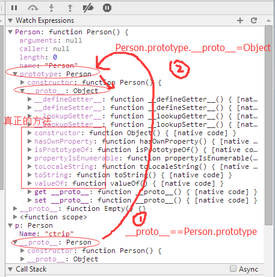
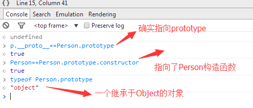

#javascript之旅
##闭包
`闭包：就是有权访问另一个函数(包含函数)作用域的变量的函数。`

闭包经典示例：

    //比较函数
    function createComparison(propertyName) {
        
        return function (obj1, obj2) {
            var item1 = obj1[propertyName];
            var item2 = obj2[propertyName];
            
            if (item1 < item2)
                return -1;
            if (item1 > item2)
                return 1;
            if (item1 == item2)
                return 0;
        }
    }
    var compare = createComparison("name");
    var result = compare({ name: "d", age: 20 }, { name: "c", age: 27 });
    

其实在每个function里面都有一个scope属性，当然这个属性被引擎屏蔽了，你是看不见也摸不着的，它里面就保存着当前函数的 local variables，如果应用到上面demo的话，就是全局函数中有一个scope，createComparison有一个scope，匿名的compare有一个scope，而且这三个scope还是通过链表链接的。

##原型
###默认继承Object

    function Person() {
        this.Name="ctrip";
    }
    var p=new Person();
    
用chorme的watch expressions看一看  

从上面的图中不难看到,其实有这么个原型链的关系：

p.\_\_proto\_\_ =Person.prototype

Person.prototype.\_\_proto\_\_ -> new Object()

###自定义继承

    function Person() {
        this.Name = "ctrip";
    }
    function Student() {
        this.StudentNo = "2816";
    }
    Student.prototype = new Person();
    var student = new Student();

###详解prototype
其实prototype只不过是一个包含constructor属性的Object对象，其中constructor属性是指向当前function的一个指针.

    function Person() {
        this.Name="ctrip";
    }
    Person.prototype={
        constructor:Person //指向Person的constructor
    }
    var p=new Person();

 
  
prototype属性共享

  

prototype属性冲突
  

##instanceof
主页面给其中的iframe页面传参（以数组为例），进行参数检测，此时不能用instanceof进行判断，因为传递的参数是两个引用，并且Array是挂在window下的一个属性，window属性也就是一个窗口的实例，那就说明主页面是一个window实例，iframe页面也是一个window实例。

解决办法：   
每一个function中都会有call方法和prototype属性，而js在Object.prototype中的tostring函数上做了一个封装，就是调用tostring.call后，会返回[object constructorName]的字符串格式，这里的constructorName就是call参数的函数名，比如我们把arr传进去，就会返回“[object Array]”字符串格式，这个方法也可以让我们巧妙的判断是否是Array。

	var arr=["a","b","c"];
	var result=Object.prototype.toString.call(arr);
	console.log(result==="[object Array]");//true

##[Writable]特性
属性的只读操作。在js中你只要使用defineProperty方法就可以了。

使用了defineProperty方法将person.name变成了只读字段.    
configurable告诉js引擎是否可以delete,update属性，当把configurable设为false的时候，你就不可以delete p.Name了，因为这会是一个无效操作。     

##包装类型
###String

	var s="hello";
	console.log(typeof s);//string
	var r=s.substring(3);
	console.log(r);//lo

string的值是直接保存在栈上面的，那它怎么会有substring呢？按照官网的解释是这样的：这时候会使用String类型把s包装成引用类型。然后使用String类型的内部实现，正好String内部定义了substring方法，所以其实上面的代码在js的内部应该是这样实现的。

	var s=new String("hello")
	var r=s.substring(3)
	s="hello"
	
可以看到，`其实包装类型只是在执行代码的一瞬间，将s包装成了String引用类型`，然后再调用String引用类型下面的substring方法，继而重新将“hello”值赋给s，最后的效果就是s="hello", r="lo"

###Boolean
一个引用类型，除非它是null或者undefined，否则它永远都是true，而这个Boolean类型正是做了这个box操作.

 
参考文档：   
http://www.cnblogs.com/huangxincheng/category/633317.html

