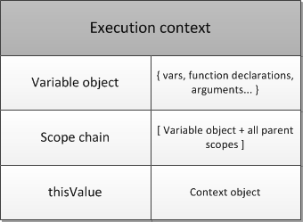
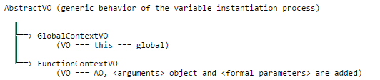
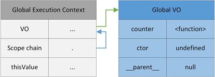
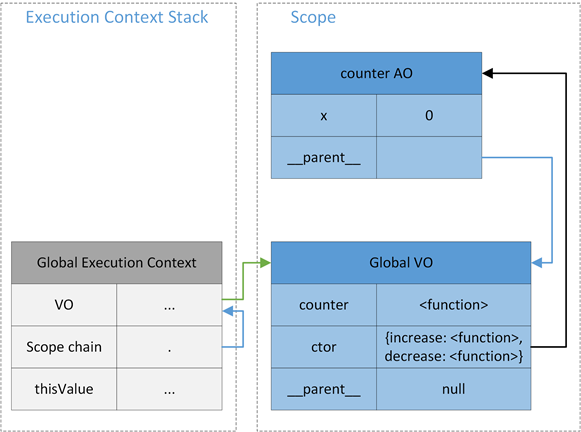
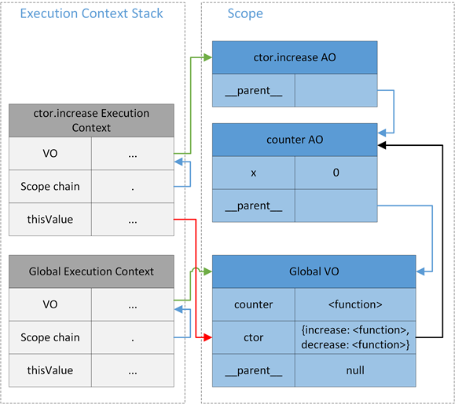
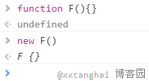
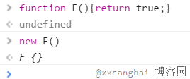
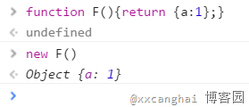
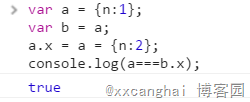

执行上下文（Execution context，EC）   
执行上下文栈（Execution context stack，ECS）   
变量对象（Variable object，VO）、活动对象（Activation object，AO）
作用域（scope）   
作用域链（Scope chain）   
this   
JavaScript原型

#执行上下文
当JavaScript代码执行的时候，会进入不同的执行上下文，这些执行上下文就构成了一个`执行上下文栈（Execution context stack，ECS）`。

在js解释器运行阶段还会维护一个环境栈，当执行流进入一个函数时，函数的环境就会被压入环境栈，当函数执行完后会将其环境弹出，并将控制权返回前一个执行环境。环境栈的顶端始终是当前正在执行的环境。  

在JavaScript中有三种代码运行环境：

- Global Code
	- JavaScript代码开始运行的默认环境
- Function Code
	- 代码进入一个JavaScript函数
- Eval Code
	- 使用eval()执行代码
	
**执行上下文（Execution context，EC）三个重要的属性：**

- 变量对象（Variable object，VO），
	- 变量 (var, Variable Declaration);
	- 函数声明 (Function Declaration, FD);
	- 函数的形参
- 作用域链（Scope chain）
- this

	
	

##1、变量对象（Variable object，VO）
变量对象是与执行上下文相关的数据作用域。它是一个与上下文相关的特殊对象，其中存储了在上下文中定义的变量和函数声明。

当JavaScript代码运行中，如果试图寻找一个变量的时候，就会首先查找VO.

对于变量对象VO，有下面两种特殊情况的：

- 函数表达式（与函数声明相对）不包含在VO之中。

	 	(function bar(){}) // function expression, FE
	  
- 没有使用var声明的变量（这种变量是，"全局"的声明方式，只是给Global添加了一个属性，并不在VO中）

		baz = "property of global object"
		
###活动对象（Activation object，AO）
只有**全局上下文**的变量对象允许通过VO的属性名称间接访问；在函数执行上下文中，VO是不能直接访问的，此时由激活对象(Activation Object,AO)扮演VO的角色。激活对象是在`进入函数上下文时刻被创建的`，它通过**函数的arguments属性**初始化。

Arguments Objects 是函数上下文里的激活对象AO中的内部对象，它包括下列属性：

- callee：指向当前函数的引用
- length： 真正传递的参数的个数
- properties-indexes：就是函数的参数值(按参数列表从左到右排列)

对于变量对象(VO)和活动对象(AO)的关系可以理解为，变量对象(VO)在不同的执行上下文(Execution Context)中会有不同的表现：当在全局执行上下文(Global Execution Context)中，可以直接使用变量对象(VO)；但是，在函数执行上下文(Function Execution Context)中，活动对象(AO)就会被创建。

例：

	function a(name, age){
	    var gender = "male";
	    function b(){}
	}
	a(“k”,10);
	
a被调用时，在a的执行上下文会创建一个活动对象AO，并且被初始化为 AO = [arguments]。随后AO又被当做变量对象(variable object)VO进行变量初始化,此时 VO = [arguments].contact([name,age,gender,b])。

简言之：**当函数被激活，那么一个活动对象(activation object)就会被创建并且分配给执行上下文。活动对象由特殊对象 arguments 初始化而成。随后，他被当做变量对象(variable object)用于变量初始化。** 

###JavaScript解释器是怎么执行一段代码
当一段JavaScript代码执行的时候，JavaScript解释器会创建Execution Context，其实这里会有两个阶段：

- 创建阶段（当函数被调用，但是开始执行函数内部代码之前）
	- 创建作用域链（Scope chain）
	- 创建变量对象或活动对象（VO/AO）（variables, functions and arguments）
	- 设置this的值
- 激活/代码执行阶段
	- 设置变量的值、函数的引用，然后解释/执行代码

####创建VO/AO，将直接影响代码运行的行为
创建VO/AO，JavaScript解释器主要做了下面的事情：

- 根据函数的参数，创建并初始化arguments object
- 扫描函数内部代码，查找`函数声明`（Function declaration）
	- 对于所有找到的函数声明，将函数名和函数引用存入VO/AO中
 	- 如果VO/AO中已经有同名的函数，那么就进行覆盖
- 扫描函数内部代码，查找`变量声明`（Variable declaration）
	- 对于所有找到的变量声明，将变量名存入VO/AO中，并初始化为"undefined"
	- **如果变量名称跟已经声明的形式参数或函数相同，则变量声明不会干扰已经存在的这类属性**
	
####示例：
	function foo(i) {
	    var a = 'hello';
	    var b = function privateB() {
			//需要执行的代码
	    };
	    function c() {
			//需要执行的代码
	    }
	}
	foo(22);
	
对于上面的代码，在**"创建阶段"**，可以得到下面的Execution Context object：

	fooExecutionContext = {
	    scopeChain: { ... },
	    variableObject: {
	        arguments: {
	            0: 22,
	            length: 1
	        },
	        i: 22,
	        c: pointer to function c()
	        a: undefined,
	        b: undefined
	    },
	    this: { ... }
	}

在**"激活/代码执行阶段"**，Execution Context object就被更新为：

	fooExecutionContext = {
	    scopeChain: { ... },
	    variableObject: {
	        arguments: {
	            0: 22,
	            length: 1
	        },
	        i: 22,
	        c: pointer to function c()
	        a: 'hello',
	        b: pointer to function privateB()
	    },
	    this: { ... }
	}
	
####例子分析
#####Example 1

	(function(){
	    console.log(bar);
	    console.log(baz);
	    
	    var bar = 20;
	    
	    function baz(){
	        console.log("baz");
	    }
	    
	})()

在Chrome中运行代码运行后将输出：

	undefined
	function baz(){
        console.log("baz");
    }

代码解释：匿名函数会首先进入"创建结果"，JavaScript解释器会创建一个"Function Execution Context"，然后创建Scope chain，VO/AO和this。根据前面的介绍，解释器会扫描函数和变量声明，如下的AO会被创建：

所以，对于bar，我们会得到"undefined"这个输出，表现的行为就是，我们在声明一个变量之前就访问了这个变量。这个就是JavaScript中`变量提升（Hoisting）`。

#####Example 2

	(function(){
	    console.log(bar);
	    console.log(baz);
	    
	    bar = 20;
	    console.log(window.bar);
	    console.log(bar);
	    
	    function baz(){
	        console.log("baz");
	    }
	    
	})()
	
运行这段代码会得到"bar is not defined(…)"错误。当代码执行到"console.log(bar);"的时候，会去AO中查找"bar"。但是，根据前面的解释，函数中的"bar"并没有通过var关键字声明，所有不会被存放在AO中，也就有了这个错误。

注释掉"console.log(bar);"，再次运行代码，可以得到下面结果。"bar"在"激活/代码执行阶段"被创建。

	function baz(){
        console.log("baz");
    }
    20
    20

#####Example 3

	(function(){
	    console.log(foo);
	    console.log(bar);
	    console.log(baz);
	    
	    var foo = function(){};
	    
	    function bar(){
	        console.log("bar");
	    }
	    
	    var bar = 20;
	    console.log(bar);
	    
	    function baz(){
	        console.log("baz");
	    }
	    
	})()

代码的运行结果为：
	
	undefined
	function bar(){
        console.log("bar");
    }
    function baz(){
        console.log("baz");
    }
	20
	
代码中，最"奇怪"的地方应该就是"bar"的输出了，第一次是一个函数，第二次是"20"。

其实也很好解释，回到前面对"创建VO/AO"的介绍，在创建VO/AO过程中，解释器会先扫描函数声明，然后"bar: <function>"就被保存在了AO中；但解释器扫描变量声明的时候，虽然发现"var bar = 20;"，但是因为"bar"在AO中已经存在，所以就没有任何操作了。

但是，当代码执行到第二句"console.log(bar);"的时候，"激活/代码执行阶段"已经把AO中的"bar"重新设置了。

#####Example 4

    function ftn(num){
        console.log(num);
        var num=4;
        console.log(num);
    }
    ftn(5);
    
代码的运行结果为：

	5
	4
	
说明：**同名`变量` `不会覆盖`函数的参数。**

#####Example 5

    function ftn(f){
        console.log(f);
        function f(){
        }
        console.log(f);
    }
    ftn(5);
代码的运行结果为：

    function f(){
    }
	function f(){
	}
说明：**同名`方法` `会覆盖`函数的参数。**

##2、作用域链（Scope chain）
###作用域（Scope）
在JavaScript作用域是跟函数相关的，也可以说成是function-based。

作用域（Scope），可以分为：

- 全局作用域（Global scope）    
	全局作用域中的对象可以在代码的任何地方访问，一般来说，下面情况的对象会在全局作用域中：
    - 最外层函数和在最外层函数外面定义的变量
    - 没有通过关键字"var"声明的变量
    - 浏览器中，window对象的属性
- 局部作用域（Local scpoe）    
	局部作用域又被称为函数作用域（Function scope），所有的变量和函数只能在作用域内部使用。
		
		var foo = 1;
		window.bar = 2;
		
		function baz(){
		    a = 3;
		    var b = 4;
		}
		// Global scope: foo, bar, baz, a 
		// Local scope: b

###作用域链（Scope chain）
每一个Execution Context中都有一个VO，用来存放变量，函数和参数等信息。

在JavaScript代码运行中，所有用到的变量都需要去当前AO/VO中查找，当找不到的时候，就会继续查找上层Execution Context中的AO/VO。这样一级级向上查找的过程，就是所有Execution Context中的AO/VO组成了一个作用域链。

所以说，作用域链与一个执行上下文相关，是内部上下文所有变量对象（包括父变量对象）的列表，用于变量查询。

`Scope = VO/AO + All Parent VO/AOs`

作用域链，它在解释器进入到一个执行环境时初始化完成并将其分配给当前执行环境。
####示例

	var x = 10;
	function foo() {
	    var y = 20; 
	    function bar() {
	        var z = 30;
	       
	        console.log(x + y + z);
	    };
	    bar()
	};
	foo();

上面代码的输出结果为"60"，函数bar可以直接访问"z"，然后通过作用域链访问上层的"x"和"y"。

橘色箭头指向VO/AO    
蓝色箭头指向scope chain（VO/AO + All Parent VO/AOs）

###结合作用域链看闭包
在JavaScript中，闭包跟作用域链有紧密的关系。
####示例：通过闭包实现了一个简单的计数器。
	function counter() {
	    var x = 0;
	    return {
	        increase: function increase() { return ++x; },
	        decrease: function decrease() { return --x; }
	    };
	}
	var ctor = counter();
	console.log(ctor.increase());
	console.log(ctor.decrease());
	
1. 当代码进入Global Context后，会创建Global VO
	
- 当代码执行到"var cter = counter();"语句的时候，进入counter Execution Context；创建counter AO，并设置counter Execution Context的scope chain
	
- 当counter函数执行的最后，并退出的时候，Global VO中的ctor就会被设置；这里需要注意的是，虽然counter Execution Context退出了执行上下文栈，但是因为ctor中的成员仍然引用counter AO（因为counter AO是increase和decrease函数的parent scope），所以counter AO依然在Scope中。
	
- 当执行"ctor.increase()"代码的时候，代码将进入ctor.increase Execution Context，并为该执行上下文创建VO/AO，scope chain和设置this；这时，ctor.increase AO将指向counter AO。
	
    绿色箭头指向VO/AO    
    蓝色箭头指向scope chain（VO/AO + All Parent VO/AOs）    
    红色箭头指向this    
    黑色箭头指向parent VO/AO    
    
###二维作用域链查找
作用域链（scope chain）的主要作用就是用来进行变量查找。但是，在JavaScript中还有原型链（prototype chain）的概念。

由于作用域链和原型链的相互作用，这样就形成了一个二维的查找。

对于这个二维查找可以总结为：**当代码需要查找一个属性（property）或者描述符（identifier）的时候，首先会通过作用域链（scope chain）来查找相关的对象；一旦对象被找到，就会根据对象的原型链（prototype chain）来查找属性（property）。**

####示例
	var foo = {}
	function baz() {
	    Object.prototype.a = 'Set foo.a from prototype';
	    return function inner() {
	        console.log(foo.a);
	    }
	}
	baz()(); 
	
对于这个例子，可以通过下图进行解释，代码首先通过作用域链（scope chain）查找"foo"，最终在Global context中找到；然后因为"foo"中没有找到属性"a"，将继续沿着原型链（prototype chain）查找属性"a"。

蓝色箭头表示作用域链查找    
橘色箭头表示原型链查找

##3、this
首先看看下面两个对this的概括：

- this是执行上下文（Execution Context）的一个重要属性，是一个与执行上下文相关的特殊对象。因此，它可以叫作上下文对象（也就是用来指明执行上下文是在哪个上下文中被触发的对象）。
- this不是变量对象（Variable Object）的一个属性，所以跟变量不同，this从不会参与到标识符解析过程。也就是说，在代码中当访问this的时候，它的值是直接从执行上下文中获取的，并不需要任何作用域链查找。this的值只在进入上下文的时候进行一次确定。

关于this最困惑的应该是，同一个函数，当在不同的上下文进行调用的时候，this的值就可能会不同。也就是说，this的值是通过函数调用表达式（也就是函数被调用的方式）的caller所提供的。

###全局上下文
在全局上下文（Global Context）中，this总是global object，在浏览器中就是window对象。

	console.log(this === window);
	this.name = "Will";
	this.age = 28;
	this.getInfo = function(){
	    console.log(this.name + " is " + this.age + " years old");
	};
	window.getInfo();
	// true
	// Will is 28 years old
	
###函数上下文
在一个函数中，this的情况就比较多了，this的值直接受函数调用方式的影响。
####Invoke function as Function
当通过正常的方式调用一个函数的时候，this的值就会被设置为global object（浏览器中的window对象）。

但是，当使用"strict mode"执行下面代码的时候，this就会被设置为"undefined"。

	function gFunc(){
	    return this;
	}
	console.log(gFunc());
	console.log(this === window.gFunc());
	// window
	// true
	
####Invoke function as Method
当函数作为一个对象方法来执行的时候，this的值就是该方法所属的对象。

在下面的例子中，创建了一个obj对象，并设置name属性的值为"obj"。所以当调用该对象的func方法的时候，方法中的this就表示obj这个对象。

	var obj = {
	    name: "obj",
	    func: function () {
	        console.log(this + ":" + this.name);
	    }
	};
	obj.func();
	// [object Object]:obj
	
为了验证"方法中的this代表方法所属的对象"这句话，再看下面一个例子。

在对象obj中，创建了一个内嵌对象nestedObj，当调用内嵌对象的方法的时候，方法中的this就代表nestedObj。

	var obj = {
	    name: "obj",
	    nestedObj: {
	        name:"nestedObj",
	        func: function () {
	            console.log(this + ":" + this.name);
	        }
	    }            
	}
	obj.nestedObj.func();
	// [object Object]:nestedObj

对于上面例子中的方法，通常称为绑定方法，也就是说这些方法都是个特定的对象关联的。

但是，当我们进行下面操作的时候，temp将是一个全局作用里面的函数，并没有绑定到obj对象上。所以，temp中的this表示的是window对象。

	var name = "Will";
	var obj = {
	    name: "obj",
	    func: function () {
	        console.log(this + ":" + this.name);
	    }
	};
	temp = obj.func;
	temp();
	//  [object Window]:Will
	
####Invoke function as Constructor
在JavaScript中，函数可以作为构造器来直接创建对象，在这种情况下，this就代表了新建的对象。

	function Staff(name, age){
	    this.name = name;
	    this.age = age;
	    this.getInfo = function(){
	        console.log(this.name + " is " + this.age + " years old");
	    };
	}
	var will = new Staff("Will", 28);
	will.getInfo();
	// Will is 28 years old

####Invoke context-less function
对于有些没有上下文的函数，也就是说这些函数没有绑定到特定的对象上，那么这些上下文无关的函数将会被默认的绑定到global object上。

在这个例子中，函数f和匿名函数表达式在被调用的过程中并没有被关联到任何对象，所以他们的this都代表global object。

	var context = "global";
	var obj = {  
	    context: "object",
	    method: function () {  
	        console.log(this + ":" +this.context);
	        
	        function f() {
	            var context = "function";
	            console.log(this + ":" +this.context); 
	        };
	        f(); 
	        
	        (function(){
	            var context = "function";
	            console.log(this + ":" +this.context); 
	        })();
	    }
	};
	obj.method();
	// [object Object]:object
	// [object Window]:global
	// [object Window]:global

###call/apply/bind改变this
this本身是不可变的，但是 JavaScript中提供了call/apply/bind三个函数来在函数调用时设置this的值。

这三个函数的原型如下：

- fun.apply(obj1 [, argsArray])
	- Sets obj1 as the value of this inside fun() and calls fun() passing elements of argsArray as its arguments.
- fun.call(obj1 [, arg1 [, arg2 [,arg3 [, ...]]]])
	- Sets obj1 as the value of this inside fun() and calls fun() passing arg1, arg2, arg3, ... as its arguments.
- fun.bind(obj1 [, arg1 [, arg2 [,arg3 [, ...]]]])
	- Returns the reference to the function fun with this inside fun() bound to obj1 and parameters of fun bound to the parameters specified arg1, arg2, arg3, ....

####示例

	function add(numA, numB){
	    console.log( this.original + numA + numB);
	}
	add(1, 2);

	var obj = {original: 10};
	add.apply(obj, [1, 2]);
	add.call(obj, 1, 2);
	
	var f1 = add.bind(obj);
	f1(2, 3);
	
	var f2 = add.bind(obj, 2);
	f2(3);
	// NaN
	// 13
	// 13
	// 15
	// 15

当直接调用add函数的时候，this将代表window，当执行"this.original"的时候，由于window对象并没有"original"属性，所以会得到"undefined"。

通过call/apply/bind，达到的效果就是把add函数绑定到了obj对象上，当调用add的时候，this就代表了obj这个对象。

###DOM event handler
当一个函数被当作event handler的时候，this会被设置为触发事件的页面元素（element）。

	var body = document.getElementsByTagName("body")[0];
	body.addEventListener("click", function(){
	    console.log(this);
	});
	// <body>…</body>

####In-line event handler
看下面的代码：

	document.write('<button onclick="console.log(this)">Show this</button>');
	// <button onclick="console.log(this)">Show this</button>
	document.write('<button onclick="(function(){console.log(this);})()">Show this</button>');
	// window

在第一行代码中，正如上面in-line handler所描述的，this将指向"button"这个element。但是，对于第二行代码中的匿名函数，是一个上下文无关（context-less）的函数，所以this会被默认的设置为window。

前面我们已经介绍过了bind函数，所以，通过下面的修改就能改变上面例子中第二行代码的行为：

	document.write('<button onclick="((function(){console.log(this);}).bind(this))()">Show this</button>');
	// <button onclick="((function(){console.log(this);}).bind(this))()">Show this</button>

###保存this
在JavaScript代码中，同一个上下文中可能会出现多个this，为了使用外层的this，就需要对this进行暂存了。

看下面的例子，在body元素的click handler中，this肯定是指向body这个元素，所以为了使用greeting这个方法，就是要对指向bar对象的this进行暂存，这里用了一个self变量。有了self，我们就可以在click handler中使用bar对象的"greeting"方法了。

	var bar = {
	    name: "bar",
	    body: document.getElementsByTagName("body")[0],
	    
	    greeting: function(){
	        console.log("Hi there, I'm " + this + ":" + this.name);
	    },
	    
	    anotherMethod: function () {
	        var self = this;
	        this.body.addEventListener("click", function(){
	            self.greeting();
	        });
	    }
	};
	  
	bar.anotherMethod();
	// Hi there, I'm [object Object]:bar

同样，对于上面的例子，也可以使用bind来设置this达到相同的效果。

	var bar = {
	    name: "bar",
	    body: document.getElementsByTagName("body")[0],
	    
	    greeting: function(){
	        console.log("Hi there, I'm " + this + ":" + this.name);
	    },
	    
	    anotherMethod: function () {
	        this.body.addEventListener("click", (function(){
	            this.greeting();
	        }).bind(this));
	    }
	};
	  
	bar.anotherMethod();
	// Hi there, I'm [object Object]:bar

###总结
`在函数调用中，this是由激活上下文代码的调用者（caller）来提供的，即调用函数的父上下文(parent context)，也就是说this取决于调用函数的方式，指向调用时所在函数所绑定的对象。`

#JavaScript原型
原型是JavaScript中一个比较难理解的概念，原型相关的属性也比较多，对象有"[[prototype]]"属性，函数对象有"prototype"属性，原型对象有"constructor"属性。
##认识原型
在JavaScript中，`原型也是一个对象，通过原型可以实现对象的属性继承`，JavaScript的对象中都包含了一个" [[Prototype]]"内部属性，这个属性所对应的就是该对象的原型。

"[[Prototype]]"作为对象的内部属性，是不能被直接访问的。所以为了方便查看一个对象的原型，Firefox和Chrome中提供了"\_\_proto\_\_"这个`非标准`（不是所有浏览器都支持）的访问器（ECMA引入了标准对象原型访问器"Object.getPrototype(object)"）。

###实例分析
	function Person(name, age){
	    this.name = name;
	    this.age = age;
	    
	    this.getInfo = function(){
	        console.log(this.name + " is " + this.age + " years old");
	    };
	}
	
	var will = new Person("Will", 28);
	
在上面的代码中，通过了Person这个构造函数创建了一个will对象。下面就通过will这个对象一步步展开了解原型。
####Step 1： 查看对象will的原型 
	console.log(will.__proto__);
	console.log(will.constructor);
	
chrome中运行结果：

	

结果分析:

- "Person {}"对象就是对象will的原型，通过Chrome展开可以看到，"Person {}"作为一个原型对象，也有"\_\_proto\_\_"属性（对应原型的原型）。
- 在这段代码中，还用到了"constructor"属性。**在JavaScript的原型对象中，还包含一个"constructor"属性，这个属性对应创建所有指向该原型的实例的构造函数。**
	- 通过"constructor"这个属性，我们可以来判断一个对象是不是数组类型

			function isArray(myArray) {
				return myArray.constructor.toString().indexOf("Array") > -1;
			}

	- 在这里，**will对象本身并没有"constructor"这个属性**，但是通过原型链查找，找到了will原型（will.\_\_proto\_\_）的"constructor"属性，并得到了Person函数。

####Step 2： 查看对象will的原型（will.\_\_proto\_\_）的原型
既然will的原型"Person {}"也是一个对象，那么我们就同样可以来查看"will的原型（will.\_\_proto\_\_）的原型"。

运行下面的代码：

	console.log(will.__proto__ === Person.prototype);
	console.log(Person.prototype.__proto__);
	console.log(Person.prototype.constructor);
	console.log(Person.prototype.constructor === Person);

chrome中运行结果：

结果分析：

- 首先看 "will.\_\_proto\_\_ === Person.prototype"，在JavaScript中，每个函数都有一个prototype属性，当一个函数被用作构造函数来创建实例时，该函数的prototype属性值将被作为原型赋值给所有对象实例（也就是设置实例的\_\_proto\_\_属性），也就是说，所有实例的原型引用的是函数的prototype属性。了解了构造函数的prototype属性之后，一定就明白为什么第一句结果为true了。
	- prototype属性是函数对象特有的，如果不是函数对象，将不会有这样一个属性。
- 当通过"Person.prototype.\_\_proto\_\_"语句获取will对象原型的原型时候，将得到"Object {}"对象，后面将会看到所有对象的原型都将追溯到"Object {}"对象。
- 对于原型对象"Person.prototype"的"constructor"，根据前面的介绍，将对应Person函数本身。

通过上面可以看到，"Person.prototype"对象和Person函数对象通过"constructor"和"prototype"属性实现了相互引用。

####Step 3: 查看对象Object的原型 
通过前一部分可以看到，will的原型的原型是"Object {}"对象。实际上在JavaScript中，所有对象的原型都将追溯到"Object {}"对象。

下面通过一段代码看看"Object {}"对象：

	console.log(Person.prototype.__proto__ === Object.prototype);
	console.log(typeof Object);
	console.log(Object);
	console.log(Object.prototype);
	console.log(Object.prototype.__proto__);
	console.log(Object.prototype.constructor);

chrome中运行结果：

结果分析：

- Object对象本身是一个函数对象。
- 既然是Object函数，就肯定会有prototype属性，所以可以看到"Object.prototype"的值就是"Object {}"这个原型对象。
- 反过来，当访问"Object.prototype"对象的"constructor"这个属性的时候，就得到了Obejct函数。
- 另外，当通过"Object.prototype.\_\_proto\_\_"获取Object原型的原型的时候，将会得到"null"，也就是说"Object {}"原型对象就是原型链的终点了。

####Step 4: 查看对象Function的原型 
在上面的例子中，Person是一个构造函数，在JavaScript中函数也是对象，所以，我们也可以通过"\_\_proto\_\_"属性来查找Person函数对象的原型。

	console.log(Person.__proto__ === Function.prototype);
	console.log(Person.constructor === Function)
	console.log(typeof Function);
	console.log(Function);
	console.log(Function.prototype);
	console.log(Function.prototype.__proto__);
	console.log(Function.prototype.constructor);

chrome中运行结果：

结果分析 ：

- 在JavaScript中有个Function对象（类似Object），这个对象本身是个函数；所有的函数（包括Function，Object）的原型（\_\_proto\_\_）都是"Function.prototype"。
- Function对象作为一个函数，就会有prototype属性，该属性将对应"function () {}"对象。
- Function对象作为一个对象，就有"\_\_proto\_\_"属性，该属性对应"Function.prototype"，也就是说，"Function.\_\_proto\_\_ === Function.prototype"
- 对于Function的原型对象"Function.prototype"，该原型对象的"\_\_proto\_\_"属性将对应"Object {}"

####对比prototype和\_\_proto\_\_
对于"prototype"和"\_\_proto\_\_"这两个属性有的时候可能会弄混，"Person.prototype"和"Person.\_\_proto\_\_"是完全不同的。

在这里对"prototype"和"\_\_proto\_\_"进行简单的介绍：

- 对于所有的对象，都有\_\_proto\_\_属性，这个属性对应该对象的原型
- 对于函数对象，除了\_\_proto\_\_属性之外，还有prototype属性，当一个函数被用作构造函数来创建实例时，该函数的prototype属性值将被作为原型赋值给所有对象实例（也就是设置实例的\_\_proto\_\_属性）

####图解实例
对上面的例子中分析得到的结果/关系进行图解

对于上图的总结如下：

- 所有的对象都有"\_\_proto\_\_"属性，该属性对应该对象的原型
- 所有的函数对象都有"prototype"属性，该属性的值会被赋值给该函数创建的对象的"\_\_proto\_\_"属性
- 所有的原型对象都有"constructor"属性，该属性对应创建所有指向该原型的实例的构造函数
- 函数对象和原型对象通过"prototype"和"constructor"属性进行相互关联

###通过原型改进例子
在上面例子中，"getInfo"方法是构造函数Person的一个成员，当通过Person构造两个实例的时候，每个实例都会包含一个"getInfo"方法。

	var will = new Person("Will", 28);
	var wilber = new Person("Wilber", 27);

前面了解到，原型就是为了方便实现属性的继承，所以可以将"getInfo"方法当作Person原型（Person.\_\_proto\_\_）的一个属性，这样所有的实例都可以通过原型继承的方式来使用"getInfo"这个方法了。

所以对例子进行如下修改：

	function Person(name, age){
	    this.name = name;
	    this.age = age;
	}
	
	Person.prototype.getInfo = function(){
	    console.log(this.name + " is " + this.age + " years old");
	};

修改后的结果为：

##原型链
因为每个对象和原型都有原型，对象的原型指向对象的父，而父的原型又指向父的父，这种原型层层连接起来的就构成了原型链。

标识符和属性通过作用域链和原型链的查找。

###属性查找
当查找一个对象的属性时，JavaScript 会向上遍历原型链，直到找到给定名称的属性为止，到查找到达原型链的顶部（也就是 "Object.prototype"）， 如果仍然没有找到指定的属性，就会返回 undefined。

####示例：
	function Person(name, age){
	    this.name = name;
	    this.age = age;
	}
	
	Person.prototype.MaxNumber = 9999;
	Person.__proto__.MinNumber = -9999;
	
	var will = new Person("Will", 28);
	
	console.log(will.MaxNumber);
	// 9999
	console.log(will.MinNumber);
	// undefined

在这个例子中分别给"Person.prototype "和" Person.\_\_proto\_\_"这两个原型对象添加了"MaxNumber "和"MinNumber"属性，这里就需要弄清"prototype"和"\_\_proto\_\_"的区别了。

"Person.prototype "对应的就是Person构造出来所有实例的原型，也就是说"Person.prototype "属于这些实例原型链的一部分，所以当这些实例进行属性查找时候，就会引用到"Person.prototype "中的属性。

###属性隐藏
当通过原型链查找一个属性的时候，首先查找的是对象本身的属性，如果找不到才会继续按照原型链进行查找。

这样一来，如果想要覆盖原型链上的一些属性，我们就可以直接在对象中引入这些属性，达到属性隐藏的效果。

####示例：
	function Person(name, age){
	    this.name = name;
	    this.age = age;
	}
	
	Person.prototype.getInfo = function(){
	    console.log(this.name + " is " + this.age + " years old");
	};
	
	var will = new Person("Will", 28);
	will.getInfo = function(){
	    console.log("getInfo method from will instead of prototype");
	};
	
	will.getInfo();
	// getInfo method from will instead of prototype
	
###对象创建方式影响原型链
回到本文开始的例子，will对象通过Person构造函数创建，所以will的原型（will.\_\_proto\_\_）就是"Person.prototype"。

同样，我们可以通过下面的方式创建一个对象：

	var July = {
	    name: "July",
	    age: 28,
	    getInfo: function(){
	        console.log(this.name + " is " + this.age + " years old");
	    },
	}
	
	console.log(July.getInfo());
	
当使用这种方式创建一个对象的时候，原型链就变成下图了，July对象的原型是"Object.prototype"也就是说对象的构建方式会影响原型链的形式。

###hasOwnProperty
"hasOwnProperty"是"Object.prototype"的一个方法，该方法能判断一个对象是否包含自定义属性而不是原型链上的属性，因为"hasOwnProperty" 是 JavaScript 中唯一一个处理属性但是不查找原型链的函数。

相信你还记得文章最开始的例子中，通过will我们可以访问"constructor"这个属性，并得到will的构造函数Person。这里结合"hasOwnProperty"这个函数就可以看到，will对象并没有"constructor"这个属性。

从下面的输出可以看到，"constructor"是will的原型（will.\_\_proto\_\_）的属性，但是通过原型链的查找，will对象可以发现并使用"constructor"属性。

	"hasOwnProperty"还有一个重要的使用场景，就是用来遍历对象的属性。
	
	function Person(name, age){
	    this.name = name;
	    this.age = age;
	}
	
	Person.prototype.getInfo = function(){
	    console.log(this.name + " is " + this.age + " years old");
	};
	
	
	var will = new Person("Will", 28);
	
	for(var attr in will){
	    console.log(attr);
	}
	// name
	// age
	// getInfo
	
	for(var attr in will){
	    if(will.hasOwnProperty(attr)){
	        console.log(attr);
	    }
	}
	// name
	// age
		
##总结
- 所有的对象都有"[[prototype]]"属性（通过\_\_proto\_\_访问），该属性对应对象的原型
- 所有的函数对象都有"prototype"属性，该属性的值会被赋值给该函数创建的对象的"\_\_proto\_\_"属性
- 所有的原型对象都有"constructor"属性，该属性对应创建所有指向该原型的实例的构造函数
- 函数对象和原型对象通过"prototype"和"constructor"属性进行相互关联

 
参考链接：     
[JavaScript的执行上下文](http://www.cnblogs.com/wilber2013/p/4909430.html)    
[理解JavaScript的作用域链](http://www.cnblogs.com/wilber2013/p/4909459.html)    
[JavaScript中的this](http://www.cnblogs.com/wilber2013/p/4909505.html)    
[彻底理解JavaScript原型](http://www.cnblogs.com/wilber2013/p/4924309.html)    
[
ECMA-262-3 in detail. Chapter 4. Scope chain](http://dmitrysoshnikov.com/ecmascript/chapter-4-scope-chain/)
 
 
 
 
 
 
 
 
 
 
	
#JavaScript继承
##原型链继承
例：

	function Person(name, age){
	    this.name = name;
	    this.age = age;
	}    
	
	Person.prototype.getInfo = function(){
	    console.log(this.name + " is " + this.age + " years old!");
	}
	
	function Teacher(staffId){
	    this.staffId = staffId;
	}
	
	Teacher.prototype = new Person();
	
	var will = new Teacher(1000);
	will.name = "Will";
	will.age = 28;
	will.getInfo();
	// Will is 28 years old!
	
	console.log(will instanceof Object);
	// true
	console.log(will instanceof Person);
	// true
	console.log(will instanceof Teacher);
	// true
	
	console.log(Object.prototype.isPrototypeOf(will));   
	// true
	console.log(Person.prototype.isPrototypeOf(will))
	// true
	console.log(Teacher.prototype.isPrototypeOf(will));
	// true

在这个例子中，有两个构造函数"Person"和"Teacher"，通过"Teacher.prototype = new Person()"语句创建了一个"Person"对象，并且设置为"Teacher"的原型。

通过这种方式，就实现了"Teacher"继承"Person"，"will"这个对象可以成功的调用"getInfo"这个属于"Person"的方法

###constructor属性
对于所有的JavaScript原型对象，都有一个"constructor"属性，该属性对应用来创建对象的构造函数。

对于"constructor"这个属性，**最大的作用就是可以帮我们标明一个对象的"类型"。**

chrome结果：

关系图：

图中给出了各种对象之间的关系，有几点需要注意的是：

- "Teacher.prototype"这个原型对象是通过"Person"构造函数创建出来的一个对象"Person {name: undefined, age: undefined}"
- 对象"will"创建了自己的"name"和"age"属性，并没有使用父类对象的，而是覆盖了父类的"name"和"age"属性
- 通过"will"访问"constructor"这个属性的时候，先找到了"Teacher.prototype"这个对象，然后找到"Person.prototype"，通过原型链查找访问到了"constructor"属性对应的"function Person"

###重设constructor
为了解决上面的问题，让子类对象的"constructor"属性对应正确的构造函数，我们可以重设子类原型对象的"constructor"属性。

一般来说，可以简单的使用下面代码来重设"constructor"属性：

	Teacher.prototype.constructor = Teacher;

但是通过这种方式重设"constructor"属性会导致它的[[Enumerable]]特性被设置为 true。默认情况下，原生的"constructor"属性是不可枚举的。

因此如果使用兼容 ECMAScript 5 的 JavaScript 引擎，就可以使用"Object.defineProperty()"：

	Object.defineProperty(Teacher.prototype, "constructor", {
	    enumerable: false,
	    value: Teacher
	});

例：

    function Person(name, age){
        this.name = name;
        this.age = age;
    }

    Person.prototype.getInfo = function(){
        console.log(this.name + " is " + this.age + " years old!");
    };
    
    function Teacher(staffId){
        this.staffId = staffId;
    }

    //Teacher.prototype = new Person();
    Teacher.prototype.constructor = Teacher;
    Object.defineProperty(Teacher.prototype, "constructor", {
        enumerable: false,
        value: Teacher
    })

    var will = new Teacher(1000);
    
chrome结果：

通过这个设置，对象"will" 的"constructor"属性就指向了正确的"function Teacher"。

跟前面的关系图比较，唯一的区别就是"Teacher.prototype"对象多了一个"constructor"属性，并且这个属性指向"function Teacher"。

关系图：

###原型的动态性
原型对象是可以修改的，所以，当创建了继承关系之后，我们可以通过更新子类的原型对象给子类添加特有的方法。

例如通过下面的方式就给子类添加了一个特有的"getId"方法。

	Teacher.prototype.getId = function(){
	    console.log(this.name + "'s staff Id is " + this.staffId);
	}
	
	will.getId();
	// Will's staff Id is 1000

但是，一定要区分原型的修改和原型的重写。如果对原型进行了重写，就会产生完全不同的效果。

例：

	function Person(name, age){
	    this.name = name;
	    this.age = age;
	}    
	
	Person.prototype.getInfo = function(){
	    console.log(this.name + " is " + this.age + " years old!");
	}
	
	function Teacher(staffId){
	    this.staffId = staffId;
	}
	
	Teacher.prototype = new Person();
	Object.defineProperty(Teacher.prototype, "constructor", {
	    enumerable: false,
	    value: Teacher
	});
	
	var will = new Teacher(1000);
	will.name = "Will";
	will.age = 28;
	
	// 更新原型
	Teacher.prototype.getId = function(){
	    console.log(this.name + "'s staff Id is " + this.staffId);
	}
	
	will.getId();
	// Will's staff Id is 1000
	
	// 重写原型
	Teacher.prototype = {  
	    getStaffId: function(){
	        console.log(this.name + "'s staff Id is " + this.staffId);
	    }
	}
	
	will.getInfo();
	// Will is 28 years old!
	will.getId();
	// Will's staff Id is 1000
	console.log(will.__proto__);
	// Person {name: undefined, age: undefined}
	console.log(will.__proto__.constructor);
	// function Teacher
	
	var wilber = new Teacher(1001);
	wilber.name = "Wilber";
	wilber.age = 28;
	// wilber.getInfo();
	// Uncaught TypeError: wilber.getInfo is not a function(…)
	wilber.getStaffId();   
	// Wilber's staff Id is 1001
	console.log(wilber.__proto__);
	// Object {}
	console.log(wilber.__proto__.constructor);
	// function Object() { [native code] }
	
关系图：

从关系图可以看到：

- 原型对象可以被更新，通过"Teacher.prototype.getId"给"will"对象的原型添加了"getId"方法.
- 重写原型之后，`在重写原型之前创建的对象的"[[prototype]]"属性依然指向原来的原型对象；在重写原型之后创建的对象的"[[prototype]]"属性将指向新的原型对象`.
- 对于重写原型前后创建的两种对象，对象的属性查找将搜索不同的原型链.

##组合继承
利用JavaScript中的call方法，通过这个方法可以动态的设置this的指向，这样就可以在子类的构造函数中调用父类的构造函数了。

例：

	function Person(name, age){
	    this.name = name;
	    this.age = age;
	}    
	
	Person.prototype.getInfo = function(){
	    console.log(this.name + " is " + this.age + " years old!");
	}
	
	function Teacher(name, age, staffId){
	    Person.call(this, name, age);        // 通过call方法来调用父类的构造函数进行初始化
	    this.staffId = staffId;
	}
	
	Teacher.prototype = new Person();
	Object.defineProperty(Teacher.prototype, "constructor", {
	    enumerable: false,
	    value: Teacher
	});
	
	var will = new Teacher("Will", 28, 1000);
	will.getInfo();
	
	console.log(will.__proto__);
	// Person {name: undefined, age: undefined}
	console.log(will.__proto__.constructor);
	// function Teacher

组合式继承是比较常用的一种继承方法，**其背后的思路是使用原型链实现对原型属性和方法的继承，而通过借用构造函数来实现对实例属性的继承。**这样，既通过在原型上定义方法实现了函数复用，又保证每个实例都有它自己的属性。

###组合式继承的小问题
虽然组合继承是 JavaScript 比较常用的继承模式，不过通过前面组合继承的代码可以看到，它也有一些小问题。

首先，子类会调用两次父类的构造函数：

- 一次是在创建子类型原型的时候
- 另一次是在子类型构造函数内部

子类型最终会包含超类型对象的全部实例属性，但我们不得不在调用子类型构造函数时重写这些属性，从下图可以看到"will"对象中有两份"name"和"age"属性。

##原型式继承
在前面两种方式中，都需要用到对象以及创建对象的构造函数（类型）来实现继承。

但是在JavaScript中，创建对象完全不需要定义一个构造函数（类型），通过字面量的方式就可以创建一个自定义的对象。

为了实现对象之间的直接继承，就有了原型式继承。

这种继承方式方法并没有使用严格意义上的构造函数，而是直接借助原型基于已有的对象创建新对象，同时还不必创建自定义类型（构造函数）。为了达到这个目的，我们可以借助下面这个函数：

	function object(o){
	    function F(){}
	    F.prototype = o;
	    return new F();
	}

在 "object()"函数内部，先创建了一个临时性的构造函数，然后将传入的对象作为这个构造函数的原型，最后返回了这个临时类型的一个新实例。

下面看看使用"object()"函数实现的对象之间的继承：

	var utilsLibA = {
	    add: function(){
	        console.log("add method from utilsLibA");
	    },
	    sub: function(){
	        console.log("sub method from utilsLibA");
	    }
	}
	
	var utilsLibB = object(utilsLibA);
	
	utilsLibB.add = function(){
	    console.log("add method from utilsLibB");
	}
	utilsLibB.div = function(){
	    console.log("div method from utilsLibB");
	}
	
	utilsLibB.add();
	// add method from utilsLibB
	utilsLibB.sub();
	// sub method from utilsLibA
	utilsLibB.div();
	// div method from utilsLibB

通过原型式继承，基于"utilsLibA"创建了一个"utilsLibB"对象，并且可以正常工作，下面看看对象之间的关系：

通过"object()"函数的帮助，将"utilsLibB"的原型赋值为"utilsLibA"，对于这个原型式继承的例子，对象关系图如下，"utilsLibB"的"add"方法覆盖了"utilsLibA"的"add"方法：

###Object.create()
ECMAScript 5 通过新增 "Object.create()"方法规范化了原型式继承。这个方法接收两个参数：

- 一个用作新对象原型的对象
- 一个为新对象定义额外属性的对象（可选的）

在传入一个参数的情况下，"Object.create()"与 上面的"object"函数行为相同。关于更多"Object.create()"的内容，请参考[MDN](https://developer.mozilla.org/en-US/docs/Web/JavaScript/Reference/Global_Objects/Object/create?redirectlocale=en-US&redirectslug=JavaScript%2FReference%2FGlobal_Objects%2FObject%2Fcreate)。

继续上面的例子，这次使用"Object.create()"来创建对象"utilsLibC"：

	utilsLibC = Object.create(utilsLibA, {
	    sub: {
	        value: function(){
	            console.log("sub method from utilsLibC");
	        }
	    },
	    mult: {
	        value: function(){
	            console.log("mult method from utilsLibC");
	        }
	    },
	})
	
	utilsLibC.add();
	// add method from utilsLibA
	utilsLibC.sub();
	// sub method from utilsLibC
	utilsLibC.mult();
	// mult method from utilsLibC
	console.log(utilsLibC.__proto__);
	// Object {add: (), sub: (), __proto__: Object}
	console.log(utilsLibC.__proto__.constructor);
	// function Object() { [native code] }

##寄生式继承
寄生式继承是与原型式继承紧密相关的一种思路，寄生式继承的思路与寄生构造函数和工厂模式类似，即创建一个仅用于封装继承过程的函数，该函数在内部以某种方式来增强对象，最后再像真地是它做了所有工作一样返回对象。

以下代码示范了寄生式继承模式，其实就是封装"object()"函数的调用，以及对新的对象进行自定义的一些操作：

	function create(o){
	    var f= object(o);         // 通过原型式继承创建一个新对象
	    f.run = function () {     // 以某种方式来增强这个对象
	        return this.arr;
	    };
	    return f;                 // 返回对象
	}
	
##寄生组合式继承
所谓寄生组合式继承，即通过借用构造函数来继承属性，通过原型链的混成形式来继承方法。

其背后的基本思路是：`不必为了指定子类型的原型而调用超类型的构造函数，我们所需要的无非就是父类型原型的一个副本而已。`本质上，就是使用寄生式继承来继承父类型的原型，然后再将结果指定给子类型的原型。

注意在寄生组合式继承中使用的“inheritPrototype()”函数。

	function object(o) {
	    function F() {}
	    F.prototype = o;
	    return new F();
	}
	
	function inheritPrototype(subType, superType) {
	    var prototype = object(superType.prototype);    // 创建对象
	    prototype.constructor = subType;                // 增强对象，设置constructor属性
	    subType.prototype = prototype;                  // 指定对象
	}
	
	function Person(name, age){
	    this.name = name;
	    this.age = age;
	}    
	Person.prototype.getInfo = function(){
	    console.log(this.name + " is " + this.age + " years old!");
	}
	
	
	function Teacher(name, age, staffId){
	    Person.call(this, name, age)
	    this.staffId = staffId;
	}
	
	inheritPrototype(Teacher, Person);
	
	Teacher.prototype.getId = function(){
	    console.log(this.name + "'s staff Id is " + this.staffId);
	}
	
	
	var will = new Teacher("Will", 28, 1000);
	will.getInfo();
	// Will is 28 years old!
	will.getId();
	// Will's staff Id is 1000
	
	var wilber = new Teacher("Wilber", 29, 1001);
	wilber.getInfo();
	// Wilber is 29 years old!
	wilber.getId();
	// Wilber's staff Id is 1001
	
代码中有一处地方需要注意，给子类添加"getId"方法的代码（"Teacher.prototype.getId"）一定要放在"inheritPrototype()"函数调用之后，因为在“inheritPrototype()”函数中会重写“Teacher”的原型。

下面继续查看一下对象"will"的原型和"constructor"属性。

这个示例中的" inheritPrototype()"函数实现了寄生组合式继承的最简单形式。这个函数接收两个参数：子类型构造函数和父类型构造函数。

在函数内部，第一步是创建超类型原型的一个副本。第二步是为创建的副本添加 "constructor" 属性，从而弥补因重写原型而失去的默认的 "constructor" 属性。最后一步，将新创建的对象（即副本）赋值给子类型的原型。这样，我们就可以用调用 "inheritPrototype()"函数的语句，去替换前面例子中为子类型原型赋值的语句了（"Teacher.prototype = new Person();"）。

对于这个寄生组合式继承的例子，对象关系图如下：

#一道常被人轻视的前端JS面试题
[转:http://www.cnblogs.com/xxcanghai/p/5189353.html](http://www.cnblogs.com/xxcanghai/p/5189353.html)

此题涉及的知识点众多，包括变量定义提升、this指针指向、运算符优先级、原型、继承、全局变量污染、对象属性及原型属性优先级等等。

	function Foo() {
	    getName = function () { alert (1); };
	    return this;
	}
	Foo.getName = function () { alert (2);};
	Foo.prototype.getName = function () { alert (3);};
	var getName = function () { alert (4);};
	function getName() { alert (5);}
	
	//答案：
	Foo.getName();//2
	getName();//4
	Foo().getName();//1
	getName();//1
	new Foo.getName();//2
	new Foo().getName();//3
	new new Foo().getName();//3
	
##第一问
先看此题的上半部分做了什么，首先定义了一个叫Foo的函数，之后为Foo创建了一个叫getName的`静态属性`存储了一个匿名函数，之后为Foo的`原型对象`新创建了一个叫getName的匿名函数。之后又通过`函数变量表达式`创建了一个getName的函数，最后再声明一个叫getName函数。

第一问的 **Foo.getName** 自然是访问Foo函数上存储的静态属性，自然是2，没什么可说的。

##第二问

第二问，直接调用 **getName** 函数。既然是直接调用那么就是访问当前上文作用域内的叫getName的函数，所以跟1 2 3都没什么关系。此题有无数面试者回答为5。此处有两个坑，一是变量声明提升，二是函数表达式。

###变量声明提升

即所有声明变量或声明函数都会被提升到当前函数的顶部。

例如下代码:

	console.log('x' in window);//true
	var x;
	x = 0;

代码执行时js引擎会将声明语句提升至代码最上方，变为：

	var x;
	console.log('x' in window);//true
	x = 0;
###函数表达式
**var getName** 与 **function getName** 都是声明语句，区别在于 var getName 是函数表达式，而 function getName 是函数声明。

函数表达式最大的问题，在于js会将此代码拆分为两行代码分别执行。

例如下代码：

	console.log(x);//输出：function x(){}
	var x=1;
	function x(){}

实际执行的代码为，先将 	`var x=1` 拆分为 `var x;` 和 `x = 1;` 两行，再将 `var x;` 和 `function x(){}` 两行提升至最上方变成：

	var x;
	function x(){}
	console.log(x);
	x=1;

所以最终函数声明的x覆盖了变量声明的x，log输出为x函数。

同理，原题中代码最终执行时的是：

	function Foo() {
	    getName = function () { alert (1); };
	    return this;
	}
	var getName;//只提升变量声明
	function getName() { alert (5);}//提升函数声明，覆盖var的声明
	
	Foo.getName = function () { alert (2);};
	Foo.prototype.getName = function () { alert (3);};
	getName = function () { alert (4);};//最终的赋值再次覆盖function getName声明
	
	getName();//最终输出4

##第三问
第三问的 `Foo().getName();` 先执行了Foo函数，然后调用Foo函数的返回值对象的getName属性函数。

Foo函数的第一句  `getName = function () { alert (1); };`  是一句函数赋值语句，注意它没有var声明，所以先向当前Foo函数作用域内寻找getName变量，没有。再向当前函数作用域上层，即外层作用域内寻找是否含有getName变量，找到了，也就是第二问中的alert(4)函数，将此变量的值赋值为 `function(){alert(1)}`。 

此处实际上是将外层作用域内的getName函数修改了。

**注意：此处若依然没有找到会一直向上查找到window对象，若window对象中也没有getName属性，就在window对象中创建一个getName变量。**

之后Foo函数的返回值是this。简单的讲，this的指向是由所在函数的调用方式决定的。而此处的直接调用方式，this指向window对象。

遂Foo函数返回的是window对象，相当于执行 `window.getName()` ，而window中的getName已经被修改为alert(1)，所以最终会输出1

此处考察了两个知识点，一个是变量作用域问题，一个是this指向问题。

##第四问
直接调用getName函数，相当于 window.getName() ，因为这个变量已经被Foo函数执行时修改了，遂结果与第三问相同，为1。

##第五问
第五问 `new Foo.getName();` ,此处考察的是js的运算符优先级问题。

通过查上表可以得知点（.）的优先级高于new操作，遂相当于是:

	new (Foo.getName)();

所以实际上将getName函数作为了构造函数来执行，遂弹出2。

##第六问
`new Foo().getName()` ，首先看运算符优先级括号高于new，实际执行为

	(new Foo()).getName()

遂先执行Foo函数，而Foo此时作为构造函数却有返回值，所以这里需要说明下js中的构造函数返回值问题。

###构造函数的返回值

在传统语言中，构造函数不应该有返回值，实际执行的返回值就是此构造函数的实例化对象。

而在js中构造函数可以有返回值也可以没有。

1. 没有返回值则按照其他语言一样返回实例化对象。

	

- 若有返回值则检查其返回值是否为引用类型。如果是非引用类型，如基本类型（string,number,boolean,null,undefined）则与无返回值相同，实际返回其实例化对象。

	

- 若返回值是引用类型，则实际返回值为这个引用类型。

	

原题中，返回的是this，**而this在构造函数中本来就代表当前实例化对象，遂最终Foo函数返回实例化对象。**

之后调用实例化对象的getName函数，因为在Foo构造函数中没有为实例化对象添加任何属性，遂到当前对象的原型对象（prototype）中寻找getName，找到了。

遂最终输出3。
##第七问
第七问, `new new Foo().getName();` 同样是运算符优先级问题。

最终实际执行为：

	new ((new Foo()).getName)();

先初始化Foo的实例化对象，然后将其原型上的getName函数作为构造函数再次new。

遂最终结果为3

#经典JS闭包面试题
题目：

	function fun(n,o) {
	  console.log(o)
	  return {
	    fun:function(m){
	      return fun(m,n);
	    }
	  };
	}
	var a = fun(0);  a.fun(1);  a.fun(2);  a.fun(3);//undefined,?,?,?
	var b = fun(0).fun(1).fun(2).fun(3);//undefined,?,?,?
	var c = fun(0).fun(1);  c.fun(2);  c.fun(3);//undefined,?,?,?
	//问:三行a,b,c的输出分别是什么？
	//答案：
	//a: undefined,0,0,0
	//b: undefined,0,1,2
	//c: undefined,0,1,1
	
这是一道非常典型的JS闭包问题。其中嵌套了三层fun函数，搞清楚每层fun的函数是那个fun函数尤为重要。

**JS中函数可以分为两种:**

- 具名函数（命名函数）
- 匿名函数。

区分这两种函数的方法非常简单，可以通过输出 fn.name 来判断，有name的就是具名函数，没有name的就是匿名函数.

注意：在低版本IE上无法获取具名函数的name，会返回undefined，建议在火狐或是谷歌浏览器上测试.

**创建函数的几种方式:**

1. 声明函数

	最普通最标准的声明函数方法，包括函数名及函数体。
	
		function fn1(){}
- 创建匿名函数表达式    

	创建一个变量，这个变量的内容为一个函数
	
		var fn1=function (){}
- 创建具名函数表达式

	创建一个变量，内容为一个带有名称的函数

		var fn1=function xxcanghai(){};

    注意：具名函数表达式的函数名只能在创建函数内部使用

	即采用此种方法创建的函数在函数外层只能使用fn1不能使用xxcanghai的函数名。xxcanghai的命名只能在创建的函数内部使用
	
	注意：在对象内定义函数如var o={ fn : function (){…} }，也属于函数表达式
- Function构造函数

	可以给 `Function` 构造函数传一个函数字符串，返回包含这个字符串命令的函数，此种方法创建的是**匿名函数**
	
	
- 自执行函数

		(function(){alert(1);})();
		(function fn1(){alert(1);})();
	
	自执行函数属于上述的“函数表达式”，规则相同
- 其他创建函数的方法

	当然还有其他创建函数或执行函数的方法，这里不再多说，比如采用 eval ， setTimeout ， setInterval 等非常用方法，这里不做过多介绍，属于非标准方法，这里不做过多展开

**三个函数之间的关系**

	function fun(n,o) {
	  console.log(o)
	  return {
	    fun:function(m){
	      //...
	    }
	  };
	}

先看第一个fun函数，属于标准具名函数声明，是新创建的函数，他的返回值是一个对象字面量表达式，属于一个新的object。

这个新的对象内部包含一个也叫fun的属性，通过上述介绍可得知，属于匿名函数表达式，即fun这个属性中存放的是一个新创建匿名函数表达式。

`注意：所有声明的匿名函数都是一个新函数。`

所以第一个fun函数与第二个fun函数不相同，均为新创建的函数。

第三个fun函数，最内层的return出去的fun函数不是第二层fun函数，是最外层的fun函数。

分行解析：

1. 第一行a
	
		var a = fun(0);  a.fun(1);  a.fun(2);  a.fun(3);
	
	可以得知，第一个fun(0)是在调用第一层fun函数。第二个fun(1)是在调用前一个fun的返回值的fun函数，所以：   
	第后面几个fun(1),fun(2),fun(3),函数都是在调用第二层fun函数。   
	遂：   
	在第一次调用fun(0)时，o为undefined；   
	第二次调用fun(1)时m为1，此时fun闭包了外层函数的n，也就是第一次调用的n=0，即m=1，n=0，并在内部调用第一层fun函数fun(1,0);所以o为0；    
	第三次调用fun(2)时m为2，但依然是调用a.fun，所以还是闭包了第一次调用时的n，所以内部调用第一层的fun(2,0);所以o为0    
	第四次同理；   
	**即：最终答案为undefined,0,0,0**
- 第二行b
	
		var b = fun(0).fun(1).fun(2).fun(3);//undefined,?,?,?
		
	先从fun(0)开始看，肯定是调用的第一层fun函数；而他的返回值是一个对象，所以第二个fun(1)调用的是第二层fun函数，后面几个也是调用的第二层fun函数。    
	遂：    
	在第一次调用第一层fun(0)时，o为undefined；    
	第二次调用 .fun(1)时m为1，此时fun闭包了外层函数的n，也就是第一次调用的n=0，即m=1，n=0，并在内部调用第一层fun函数fun(1,0);所以o为0；    
	第三次调用 .fun(2)时m为2，此时当前的fun函数不是第一次执行的返回对象，而是第二次执行的返回对象。而在第二次执行第一层fun函数时时(1,0)所以n=1,o=0,返回时闭包了第二次的n，遂在第三次调用第三层fun函数时m=2,n=1，即调用第一层fun函数fun(2,1)，所以o为1；    
	第四次调用 .fun(3)时m为3，闭包了第三次调用的n，同理，最终调用第一层fun函数为fun(3,2)；所以o为2；    
	**即最终答案：undefined,0,1,2**
- 第三行c
	
		var c = fun(0).fun(1);  c.fun(2);  c.fun(3);//undefined,?,?,?
	
	根据前面两个例子，可以得知：   
	fun(0)为执行第一层fun函数，.fun(1)执行的是fun(0)返回的第二层fun函数，这里语句结束，遂c存放的是fun(1)的返回值，而不是fun(0)的返回值，所以c中闭包的也是fun(1)第二次执行的n的值。c.fun(2)执行的是fun(1)返回的第二层fun函数，c.fun(3)执行的也是fun(1)返回的第二层fun函数。   
	遂：   
	在第一次调用第一层fun(0)时，o为undefined；   
	第二次调用 .fun(1)时m为1，此时fun闭包了外层函数的n，也就是第一次调用的n=0，即m=1，n=0，并在内部调用第一层fun函数fun(1,0);所以o为0；   
	第三次调用 .fun(2)时m为2，此时fun闭包的是第二次调用的n=1，即m=2，n=1，并在内部调用第一层fun函数fun(2,1);所以o为1；   
	第四次.fun(3)时同理，但依然是调用的第二次的返回值，遂最终调用第一层fun函数fun(3,1)，所以o还为1   
	**即最终答案：undefined,0,1,1**

#JS中使用连等赋值操作遇到的坑

	var a = {n:1};
	a.x = a = {n:2};
	console.log(a.x); // undefined
	
假设有一句代码： A=B=C; 连等赋值真正的运算规则是  B = C; A = B;  `即连续赋值是从右至左永远只取等号右边的表达式结果赋值到等号左侧。`

`连续赋值语句虽然是遵从从右至左依次赋值的规则但依然不能将语句拆开来写`

所以我认为这段代码  a.x=a={n:2};  的逻辑是：

1. 在执行前，会先将a和a.x中的a的引用地址都取出来，此值他们都指向{n:1}
- 在内存中创建一个新对象{n:2}
- 执行a={n:2}，将a的引用从指向{n:1}改为指向新的{n:2}
- 执行a.x=a，此时a已经指向了新对象，而a.x因为在执行前保留了原引用，所以a.x的a依然指向原先的{n:1}对象，所以给原对象新增一个属性x，内容为{n:2}也就是现在a
- 语句执行结束，原对象由{n:1}变成{n:1,x:{n:2}}，而原对象因为无人再引用他，所以被GC回收，当前a指向新对象{n:2}
- 所以就有了文章开头的运行结果，再执行a.x，自然就是undefined了

按照上述过程可以看出旧的a.x和新的a都指向新创建的对象{n:2}，所以他们应该是全等的。

测试：

	var a = {n:1};
	var b = a;
	a.x = a = {n:2};
	console.log(a===b.x); //true

因为我们增加了var b=a，即将原对象增加了一条引用，所以在上述第5步时不会被释放，证实了上面的结论。

#JavaScript中的函数表达式
函数的三种表现形式：

- 函数声明
- 函数表达式
- 函数构造器创建的函数

##函数表达式
函数表达式（Function Expression, FE）四个特点：

- 在代码中须出现在表达式的位置
- 有可选的函数名称
- 不会影响变量对象(VO)
- 在代码执行阶段创建

####FE的函数名
其实对于命名函数表达式，JavaScript解释器额外的做了一些事情：

1. 当解释器在代码执行阶段遇到命名函数表达式时，在函数表达式创建之前，解释器创建一个特定的辅助对象，并添加到当前作用域链的最前端
- 然后当解释器创建了函数表达式，在创建阶段，函数获取了[[Scope]] 属性（当前函数上下文的作用域链）
- 此后，函数表达式的函数名添加到特定对象上作为唯一的属性；这个属性的值是引用到函数表达式上
- 最后一步是从父作用域链中移除那个特定的对象

下面是表示这一过程的伪代码：

	specialObject = {};
	 
	Scope = specialObject + Scope;
	 
	_sub = new FunctionExpression;
	_sub.[[Scope]] = Scope;
	specialObject. _sub = _sub; // {DontDelete}, {ReadOnly} 
	 
	delete Scope[0]; // 从作用域链中删除特殊对象specialObject
	
####立即调用的函数表达式
立即调用的函数表达式通常表现为下面的形式：

	(function () { 
	    /* code */ 
	})();
	
	(function () { 
	    /* code */ 
	} ()); 
	
	//在underscore这个JavaScript库中，使用的是下面的方式：
	(function () { 
	    // Establish the root object, `window` in the browser, or `exports` on the server.
		var root = this;
		/* code */ 
	} .call(this));