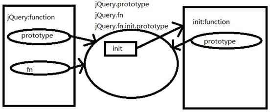
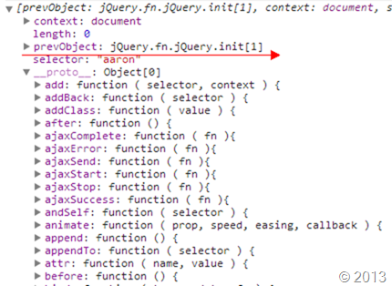

#jQuery源码解析（架构与依赖模块）

##第一章 理解框架

###1-4 jQuery整体架构
####最新jQuery2.1.1版本的结构
	;(function(global, factory) {
	    factory(global);
	}(typeof window !== "undefined" ? window : this, function(window, noGlobal) {
	    var jQuery = function( selector, context ) {
			return new jQuery.fn.init( selector, context );
		};
		jQuery.fn = jQuery.prototype = {};
		// 核心方法
		// 回调系统
		// 异步队列
		// 数据缓存
		// 队列操作
		// 选择器引
		// 属性操作
		// 节点遍历
		// 文档处理
		// 样式操作
		// 事件体系
		// AJAX交互
		// 动画引擎
		return jQuery;
	}));
	
####jQuery的模块依赖网

jQuery一共13个模块，从2.1版开始jQuery支持通过AMD模块划分，jQuery在最开始发布的1.0版本是很简单的，只有CSS选择符、事件处理和AJAX交互3大块。其发展过程中，有几次重要的变革：

    ☑  1.2.3 版发布，引入数据缓存，解决循环引用与大数据保存的问题
    ☑  1.3 版发布，它使用了全新的选择符引擎Sizzle，在各个浏览器下全面超越其他同类型JavaScript框架的查询速度，程序库的性能也因此有了极大提升
    ☑  1.5 版发布，新增延缓对像(Deferred Objects)，并用deferred重写了Ajax模块
    ☑  1.7 版发布，抽象出回调对象，提供了强大的的方式来管理回调函数列表。

每一次大的改进都引入了一些新的机制、新的特性，通过这些新的机制就造就了如今jQuery库，一共13个模块，模块不是单一的，比如jQuery动画，都会依赖异步队列、动画队列、回调队列与数据缓存模块等。

jQuery抽出了所有可复用的特性，分离出单一模块，通过组合的用法，不管在设计思路与实现手法上jQuery都是非常高明的。

**五大块：**
jQuery按我的理解分为五大块，`选择器`、`DOM操作`、`事件`、`AJAX与动画`，那么为什么有13个模块？因为jQuery的设计中最喜欢的做的一件事，就是抽出共同的特性使之“模块化”，当然也是更贴近`S.O.L.I.D`五大原则的“`单一职责SRP`”了，遵守单一职责的好处是可以让我们很容易地来维护这个对象，比如，当一个对象封装了很多职责的时候，一旦一个职责需要修改，势必会影响该对象的其它职责代码。通过`解耦`可以让每个职责更加有弹性地变化。    
我们来看看jQuery文档针对`业务层`的Ajax的处理提供了一系列的门面接口：

	.ajaxComplete()
	.ajaxError()
	.ajaxSend()
	.ajaxStart()
	.ajaxStop()
	.ajaxSuccess()

底层接口：

	jQuery.ajax()
	jQuery.ajaxSetup()

快捷方法：

	jQuery.get()
	jQuery.getJSON()
	jQuery.getScript()
	jQuery.post()

 
####jQuery接口的设计原理
业务逻辑是复杂多变的，jQuery的高层API数量非常多，而且也非常的细致，这样做可以更友好的便于开发者的操作，不需要必须在一个接口上重载太多的动作。我们在深入内部看看Ajax的高层方法其实都是统一调用了一个静态的jQuery.ajax方法。

	jQuery.each( [ "get", "post" ], function( i, method ) {
	    jQuery[ method ] = function( url, data, callback, type ) {
			// Shift arguments if data argument was omitted
			if ( jQuery.isFunction( data ) ) {
				type     = type || callback;
				callback = data;
				data     = undefined;
			}
			return jQuery.ajax({
				url: url,
				type: method,
				dataType: type,
				data: data,
				success: callback
			});
		};
	});
在`jQuery.ajax`的内部实现是非常复杂的，首先ajax要考虑异步的处理与回调的统一性，所以就引入了`异步队列模块（Deferred）`与`回调模块（Callbacks）`, 所以要把这些模块方法在ajax方法内部再次封装成、构建出一个新的`jQXHR对象`，针对参数的默认处理，数据传输的格式化等等。

###1-5 立即调用表达式
任何库与框架设计的第一个要点就是`解决命名空间与变量污染的问题`。jQuery就是利用了JavaScript函数作用域的特性，采用`立即调用表达式`包裹了自身的方法来解决这个问题。

jQuery的立即调用函数表达式的写法有三种：

**写法1：**

	(function(window, factory) {
	    factory(window)
	}(this, function() {
	    return function() {
	       //jQuery的调用
	    }
	}))

可以看出上面的代码中嵌套了2个函数，而且把一个函数作为参数传递到另一个函数中并且执行，这种方法有点复杂，我们简化一下写法：

**写法2：**

	var factory = function(){
	    return function(){
	        //执行方法
	    }
	}
	var jQuery = factory();

上面的代码效果和方法1是等同的，但是这个factory有点变成了简单的工厂方法模式，需要自己调用，不像是一个`单例`的jQuery类，所以我们需要改成“`自执行`”，而不是另外调用。

**写法3：**

	(function(window, undefined) {
	    var jQuery = function() {}
	    // ...
	    window.jQuery = window.$ = jQuery;
	})(window);

从上面的代码可看出，自动初始化这个函数，让其只构建一次。详细说一下这种写法的优势：

1. window和undefined都是为了减少变量查找所经过的scope作用域。当window通过传递给闭包内部之后，在闭包内部使用它的时候，可以把它当成一个局部变量，显然比原先在window scope下查找的时候要快一些。
- undefined也是同样的道理，其实这个undefined并不是JavaScript数据类型的undefined，而是一个普普通通的变量名。只是因为没给它传递值，它的值就是undefined，undefined并不是JavaScript的保留字。

 

有童鞋留言到，为什么要传递undefined？

`Javascript 中的 undefined 并不是作为关键字，因此可以允许用户对其赋值。`

我们看一个

	var undefined = '慕课网'
	;(function(window) {
	  alert(undefined);//IE8 '慕课网'
	})(window)

IE8存在这个问题，当然，大部分浏览器都是不能被修改的

如果函数调用不传递，参数默认就是undefined

	;(function(window,undefined) {
	    //undefined
	})(window)

**jQuery为什么要创建这样的一个外层包裹，其原理又是如何？**

这里要区分2个概念一个是匿名函数，一个是自执行。顾名思义，匿名函数，就是没有函数名的函数，也就是不存在外部引用。但是是否像下面代码实现呢：

	function(){
	//代码逻辑
	}

上面这种写法是错了，声明了它但是又不给名字又没有使用，所以在语法上错误的，那么怎么去执行一个匿名的函数呢？

要调用一个函数，我们必须要有方法定位它、引用它。所以，我们要取一个名字：

	var jQuery = function(){
	//代码逻辑
	}

jQuery使用`()`将匿名函数括起来，然后后面再加一对小括号（包含参数列表），那么这小括号能把我们的表达式组合分块，并且每一块（也就是每一对小括号），都有一个返回值。这个返回值实际上也就是小括号中表达式的返回值。所以，当我们用一对小括号把匿名函数括起来的时候，实际上小括号返回的，就是一个匿名函数的Function对象。因此，小括号对加上匿名函数就如同有名字的函数般被我们取得它的引用位置了。所以如果在这个引用变量后面再加上参数列表，就会实现普通函数的调用形式。

最后，我们回到`写法1`看看jQuery利用`写法3`的写法，然后把整个函数作为参数传递给另外一个函数，主要是为了判断jQuery在不同平台的下的加载逻辑，主流的库一般都有对 AMD 和 CommonJS 的支持代码，看看jQuery的代码：

	if (typeof module === "object" && typeof module.exports === "object") {
	    module.exports = global.document ?
	        factory(global, true) :
	        function(w) {
	            if (!w.document) {
	                throw new Error("jQuery requires a window with a document");
	            }
	            return factory(w);
	    };
	} else {
	    factory(global);
	}

`总结：全局变量是魔鬼, 匿名函数可以有效的保证在页面上写入JavaScript，而不会造成全局变量的污染，通过小括号，让其加载的时候立即初始化，这样就形成了一个单例模式的效果从而只会执行一次。`

###1-6 jQuery的类数组对象结构
**为什么是类数组对象呢？**

很多人迷惑的jQuery为什么能像数组一样操作，通过对象get方法或者直接通过下标0索引就能转成DOM对象。

首先我们看jQuery的入口都是统一的`$`, 通过传递参数的不同，实现了9种方法的重载：

	1. jQuery([selector,[context]])
	2. jQuery(element)
	3. jQuery(elementArray)
	4. jQuery(object)
	5. jQuery(jQuery object)
	6. jQuery(html,[ownerDocument])
	7. jQuery(html,[attributes])
	8. jQuery()
	9. jQuery(callback)

9种用法整体来说可以分三大块：`选择器`、`dom的处理`、`dom加载`。
换句话说jQuery就是为了获取DOM、操作DOM而存在的！所以为了更方便这些操作，让节点与实例对象通过一个桥梁给关联起来，jQuery内部就采用了一种叫“类数组对象”的方式作为存储结构，所以我们即可以像对象一样处理jQuery操作，也能像数组一样可以使用push、pop、shift、unshift、sort、each、map等类数组的方法操作jQuery对象了。

**jQuery对象可用数组下标索引是什么原理？**

通过$(".Class")构建的对象结构如下所示：

         
整个结构很明了，通过对象键值对的关系保存着属性，原型保存着方法。我们来简单的模拟一个这样的数据结构：

	
	
	<button id="test1">jQuey[0]</button>
	<button id="test2">jQuey.get</button>
	<button id="test3">aQuery[0]</button>
	<button id="test4">aQuery.get</button>
	
	
book

	
	

	

	

	

	
	

以上是模拟jQuery的对象结构，通过aQuery方法抽象出了对象创建的具体过程，这也是软件工程领域中的广为人知的设计模式-`工厂方法`。

####jQuery的无new构建原理
函数`aQuery()`内部首先保证了必须是通过new操作符构建。这样就能保证当前构建的是一个带有`this`的实例对象，既然是对象我们可以把所有的属性与方法作为对象的`key`与`value`的方式给映射到`this`上，所以如上结构就可以模拟出jQuery的这样的操作了，即可通过索引取值，也可以链式方法取值，但是这样的结构是有很大的缺陷的，每次调用ajQuery方法等于是创建了一个新的实例，那么类似get方法就要在每一个实例上重新创建一遍，性能就大打折扣，所以jQuery在结构上的优化不仅仅只是我们看到的，除了实现`类数组结构、方法的原型共享`，而且还实现方法的`静态与实例的共存`，这是我们之后将会重点分析的。

###1-7 jQuery中ready与load事件
jQuery有`3`种针对文档加载的方法

	$(document).ready(function() {
	    // ...代码...
	})
	//document ready 简写
	$(function() {
	    // ...代码...
	})
	$(document).load(function() {
	    // ...代码...
	})

**一个是ready一个是load，这两个到底有什么区别呢？**

ready与load谁先执行：   
大家在面试的过程中，经常会被问到一个问题：ready与load那一个先执行，那一个后执行？答案是ready先执行，load后执行。

**DOM文档加载的步骤：**

要想理解为什么ready先执行，load后执行就要先了解下DOM文档加载的步骤：

1. 解析HTML结构。
- 加载外部脚本和样式表文件。
- 解析并执行脚本代码。
- 构造HTML DOM模型。//ready
- 加载图片等外部文件。
- 页面加载完毕。//load

从上面的描述中大家应该已经理解了吧，ready在第（4）步完成之后就执行了，但是load要在第（6）步完成之后才执行。

**结论：**

ready与load的区别就在于资源文件的加载，ready构建了基本的DOM结构，所以对于代码来说应该越快加载越好。在一个高速浏览的时代，没人愿意等待答案。假如一个网站页面加载超过4秒，不好意思，你1/4的用户将面临着流失，所以对于框架来说用户体验是至关重要的，我们应该越早处理DOM越好，我们不需要等到图片资源都加载后才去处理框架的加载，图片资源过多load事件就会迟迟不会触发。

我们看看jQuery是如何处理文档加载时机的问题：

	jQuery.ready.promise = function( obj ) {
	    if ( !readyList ) {
	        readyList = jQuery.Deferred();
	        if ( document.readyState === "complete" ) {
	            // Handle it asynchronously to allow scripts the opportunity to delay ready
	            setTimeout( jQuery.ready );
	        } else {
	            document.addEventListener( "DOMContentLoaded", completed, false );
	            window.addEventListener( "load", completed, false );
	        }
	    }
	    return readyList.promise( obj );
	};

jQuery的ready是通过promise给包装过的，这也是jQuery擅长的手法，统一了回调体系，以后我们会重点谈到。

可见jQuery兼容的具体策略：`针对高级的浏览器，我们当前很乐意用DOMContentLoaded事件了，省时省力。`

**那么旧的IE如何处理呢？**

继续看jQuery的方案：

	// Ensure firing before onload, maybe late but safe also for iframes
	document.attachEvent( "onreadystatechange", completed );
	// A fallback to window.onload, that will always work
	window.attachEvent( "onload", completed );
	// If IE and not a frame
	// continually check to see if the document is ready
	var top = false;
	try {
	    top = window.frameElement == null && document.documentElement;
	} catch(e) {}
	if ( top && top.doScroll ) {
	    (function doScrollCheck() {
	        if ( !jQuery.isReady ) {
	            try {
	                // Use the trick by Diego Perini
	                // http://javascript.nwbox.com/IEContentLoaded/
	                top.doScroll("left");
	            } catch(e) {
	                return setTimeout( doScrollCheck, 50 );
	            }
	            // detach all dom ready events
	            detach();
	
	            // and execute any waiting functions
	            jQuery.ready();
	        }
	    })();
	}

如果浏览器存在 document.onreadystatechange 事件，当该事件触发时，如果 document.readyState=complete 的时候，可视为 DOM 树已经载入。不过，这个事件不太可靠，比如当页面中存在图片的时候，可能反而在 onload 事件之后才能触发，换言之，它只能正确地执行于页面不包含二进制资源或非常少或者被缓存时作为一个备选吧。

**针对IE的加载检测**

Diego Perini 在 2007 年的时候，报告了一种检测 IE 是否加载完成的方式，使用 doScroll 方法调用，详情可见http://javascript.nwbox.com/IEContentLoaded/。
原理就是对于 IE 在非 iframe 内时，只有不断地通过能否执行 doScroll 判断 DOM 是否加载完毕。在上述中间隔 50 毫秒尝试去执行 doScroll，注意，由于页面没有加载完成的时候，调用 doScroll 会导致异常，所以使用了 try -catch 来捕获异常。

`结论：`所以总的来说当页面 DOM 未加载完成时，调用 doScroll 方法时，会产生异常。那么我们反过来用，如果不异常，那么就是页面DOM加载完毕了。

这都是我们在第一时间内处理ready加载的问题，如果ready在页面加载完毕后呢？

jQuery就必须针对这样的情况跳过绑定了：

	if ( document.readyState === "complete" ) {
	     // Handle it asynchronously to allow scripts the opportunity to delay ready
	     setTimeout( jQuery.ready );
	 }

直接通过查看readyState的状态来确定页面的加载是否完成了。这里会给一个定时器的最小时间后去执行，主要保证执行的正确。

###1-8 jQuery多库共存处理
多库共存换句话说可以叫`无冲突处理`。

总的来说会有2种情况会遇到：

1. $太火热，jQuery采用$作为命名空间，不免会与别的库框架或者插件相冲突。
- jQuery版本更新太快，插件跟不上，导致不同版本对插件的支持度不一样。

出于以上的原因，jQuery给出了解决方案–– `noConflict函数`。

引入jQuery运行这个noConflict函数将变量$的控制权让给第一个实现它的那个库，确保jQuery不会与其他库的$对象发生冲突。

在运行这个函数后，就只能使用jQuery变量访问jQuery对象。例如，在要用到$("aaron")的地方，就必须换成jQuery("aaron")，因为$的控制权已经让出去了。

使用DEMO：

	jQuery.noConflict();
	// 使用 jQuery
	jQuery("aaron").show();
	// 使用其他库的 $()
	$("aaron").style.display = ‘block’;

`这个函数必须在你导入jQuery文件之后，并且在导入另一个导致冲突的库之前使用。`当然也应当在其他冲突的库被使用之前，除非jQuery是最后一个导入的。

由于比较简单，我们直接上代码解说：

	var _jQuery = window.jQuery,
	    _$ = window.$;
	
	jQuery.noConflict = function( deep ) {
	    if ( window.$ === jQuery ) {
	        window.$ = _$;
	    }
	if ( deep && window.jQuery === jQuery ) {
	        window.jQuery = _jQuery;
	    }
	    return jQuery;
	};

如果我们需要同时使用jQuery和其他JavaScript库，我们可以使用 $.noConflict()把$的控制权交给其他库。旧引用的$ 被保存在jQuery的初始化; noConflict() 简单的恢复它们。

通过类似swap交换的概念，先把之前的存在的命名空间给缓存起来，通过对比当前的命名空间达到交换的目的，首先，我们先判断下当前的的$空间是不是被jQuery接管了，如果是则让出控制权给之前的_$引用的库，如果传入deep为true的话等于是把jQuery的控制权也让出去了。

如果不通过noConflict处理的话其后果可想而知，香喷喷的$大家都“觊觎已久”。

##第2章 核心模块
###2-1 对象的构建
面向对象(OOP)的语言都有一个特点，它们都会有类的这一概念，通过类可以抽象出创建具体相同方法与属性的对象。但是`ECMAScript`中是没有类的概念的，因此它的对象与基于类的语言如java的定义是有所不同的。

在JavaScript世界中函数作为“一等公民”，它不仅拥有一切传统函数的使用方式（声明和调用），而且可以做到像简单值一样赋值、传参、返回，这样的函数也称之为第一级函数。不仅如此，而且还可以通过操作符new来充当类的构造器。

函数在充当类的构造器时，原型prototype是一个重要的概念。prototype是构造函数的一个属性, 该属性指向一个对象。而这个对象将作为该构造函数所创建的所有实例的`基引用(base reference)`, 可以把对象的基引用想像成一个自动创建的隐藏属性。 当访问对象的一个属性时, 首先查找对象本身, 找到则返回；若不, 则查找基引用指向的对象的属性(如果还找不到实际上还会沿着原型链向上查找,  直至到根)。 只要没有被覆盖的话, 对象原型的属性就能在所有的实例中找到。

类一：

	function ajQuery() {
	    this.name = 'jQuery';
	    this.sayName = function(){
	    return this.name
	}
	var a = new ajQuery()
	var b = new ajQuery()
	var c = new ajQuery()

类二:

	function ajQuery() {
	    this.name = 'jQuery'
	}
	ajQuery.prototype = {
	    sayName: function() {
	    return this.name
	    }
	}
	var a = new ajQuery()
	var b = new ajQuery()
	var c = new ajQuery()

类一与类二产生的结构几乎是一样的，而本质区别就是：类二new产生的a、b、c三个实例对象共享了原型的`sayName`方法，这样的好处节省了内存空间，类一则是要为每一个实例复制sayName方法，每个方法属性都占用一定的内存的空间，所以如果把所有属性方法都声明在构造函数中，就会无形的增大很多开销，这些实例化的对象的属性一模一样，都是对this的引用来处理。除此之外类一的所有方法都是拷贝到当前实例对象上。类二则是要通过scope连接到原型链上查找，这样就无形之中要多一层作用域链的查找了。

jQuery对象的构建如果在性能上考虑，所以就必须采用原型式的结构：

	jQuery = function( selector, context ) {
	    return new jQuery.fn.init( selector, context );
	}
	jQuery.fn = jQuery.prototype = {
	    init：function(){
	    return this
	},
	    jquery: version,
	    constructor: jQuery,
	    ………………
	}
	var a = $() ;

使用原型结构，性能上是得到了优化，但是ajQuery类这个结构与目标jQuery的结构的还是有很大不一致：

   ☑   没有采用new操作符；
      
   ☑   return返回的是一个通过new出来的的对象 。
   
###2-2 分离构造器
通过new操作符构建一个对象，一般经过四步：

A. 创建一个新对象
- 将构造函数的作用域赋给新对象（所以this就指向了这个新对象）
- 执行构造函数中的代码
- 返回这个新对象

最后一点就说明了，我们只要返回一个新对象即可。其实new操作符主要是把原型链跟实例的this关联起来，这才是最关键的一点，所以我们如果需要原型链就必须要new操作符来进行处理。否则this则变成window对象了。

我们来剖析下jQuery的这个结构,以下是我们常见的类式写法:

	var $$ = ajQuery = function(selector) {
	    this.selector = selector;
	    return this
	}
	ajQuery.fn = ajQuery.prototype = {
	    selectorName:function(){
	        return this.selector;
	    },
	    constructor: ajQuery
	}
	var a = new $$('aaa');  //实例化
	a.selectorName() //aaa //得到选择器名字

首先改造jQuery`无new`的格式，我们可以通过instanceof判断this是否为当前实例：

	var $$ = ajQuery = function(selector) {
	    if(!(this instanceof ajQuery)){
	        return new ajQuery(selector);
	    }
	    this.selector = selector;
	    return this
	}

但是注意千万不要像下面这样写：

	var $$ = ajQuery = function(selector) {
	    this.selector = selector;
	    return new ajQuery(selector);
	}
	Uncaught RangeError: Maximum call stack size exceeded

这样会`无限递归自己`，从而造成死循环并且溢出。

jQuery为了避免出现这种死循环的问题，采取的手段是把原型上的一个init方法作为构造器

	var $$ = ajQuery = function(selector) {
	    //把原型上的init作为构造器
	    return new ajQuery.fn.init( selector );
	}
	
	ajQuery.fn = ajQuery.prototype = {
	    name: 'aaron',
	    init: function() {
	        console.log(this)
	    },
	    constructor: ajQuery
	}

这样确实解决了循环递归的问题，但是又问题来了，init是ajQuery原型上作为构造器的一个方法，那么其this就不是ajQuery了，所以this就完全引用不到ajQuery的原型了，所以这里通过new把init方法与ajQuery给分离成2个独立的构造器。

###2-3 静态与实例方法共享设计
保留上一节分割出2个构造器的疑问，我们先看看jQuery在接口的设计：

**遍历方法：**

	$(".aaron").each()   //作为实例方法存在
	$.each()             //作为静态方法存在

这是最常见的遍历方法，第一条语句是给有指定的上下文调用的，就是(".aaron")获取的DOM合集，第二条语句$.each()函数可用于迭代任何集合，无论是“`名/值`”对象（JavaScript对象）或`数组`。在迭代数组的情况下，回调函数每次都会传递一个数组索引和相应的数组值作为参数。本质上来说2个都是遍历，那么我们是不是要写2个方法呢？

我们来看看jQuery的源码：

	jQuery.prototype = {
	    each: function( callback, args ) {
	        return jQuery.each( this, callback, args );
	    }
	}

实例方法取于静态方法，换句话来说这是静态与实例方法共享设计，静态方法挂在jQuery构造器上，原型方法挂在哪里呢？

我们上节不是讲了内部会划分一个新的构造器init吗？jQuery通过new原型prototype上的init方法当作构造器，那么init的原型链方法就是实例的方法了，所以jQuery通过2个构造器划分2种不同的调用方式一种是静态，一种是原型。

方法是共享的，并且实例方法取于静态方法，2个构造器是完全隔离的 ,这个要如何处理？

**看看jQuery给的方案：**

画龙点睛的一处`init.prototype = jQuery.fn`，把jQuery.prototype原型的引用赋给jQuery.fn.init.prototype的原型，这样就把2个构造器的原型给关联起来了。

	ajQuery.fn = ajQuery.prototype = {
	        name: 'aaron',
	        init: function(selector) {
	               this.selector = selector;
	               return this;
	        },
	        constructor: ajQuery
	}
	ajQuery.fn.init.prototype = ajQuery.fn

这段代码就是整个结构设计的最核心的东西了，有这样的一个处理，整个结构就活了！不得不佩服作者的设计思路，别具匠心。

看看init的的构造图：

通过原型传递解决问题，把jQuery的原型传递给jQuery.prototype.init.prototype。换句话说jQuery的原型对象覆盖了init构造器的原型对象，因为是引用传递所以不需要担心这个循环引用的性能问题。

###2-4 方法链式调用的实现
jQuery的核心理念是Write less,Do more(写的更少,做的更多)，那么链式方法的设计与这个核心理念不谋而合。那么从深层次考虑这种设计其实就是一种Internal DSL。

`DS`L是指`Domain Specific Language`，也就是用于描述和解决特定领域问题的语言。

我们看一段链式代码：

	$('input[type="button"]')
	    .eq(0).click(function() {
	        alert('点击我!');
	}).end().eq(1)
	.click(function() {
	    $('input[type="button"]:eq(0)').trigger('click');
	}).end().eq(2)
	.toggle(function() {
	    $('.aa').hide('slow');
	}, function() {
	    $('.aa').show('slow');
	});

看这个代码的结构，我们或多或少都能猜到其含义：

  ☑  找出type类型为button的input元素

  ☑  找到第一个按钮，并绑定click事件处理函数

  ☑  返回所有按钮，再找到第二个

  ☑  为第二个按钮绑定click事件处理函数

  ☑  为第三个按钮绑定toggle事件处理函数

那么可见jQuery的Internal DSL形式带来的好处——编写代码时，让代码更贴近作者的思维模式；阅读代码时，让读者更容易理解代码的含义；应用DSL可以有效的提高系统的可维护性（缩小了实现模型和领域模型的距离，提高了实现的可读性）和灵活性，并且提供开发的效率。

jQuery的这种管道风格的DSL链式代码，总的来说：

  ☑  节约JS代码；

  ☑  所返回的都是同一个对象，可以提高代码的效率。

通过简单扩展原型方法并通过`return this`的形式来实现跨浏览器的链式调用。利用JS下的简单工厂方法模式，来将所有对于同一个DOM对象的操作指定同一个实例。

这个原理就超简单了,如下代码：

	aQuery().init().name()

分解：

	a = aQuery();
	a.init()
	a.name()

把代码分解一下，很明显实现链式的基本条件就是要实例对象先创建好，调用自己的方法。

	aQuery.prototype = {
	    init: function() {
	        return this;
	    },
	    name: function() {
	        return this
	    }
	}

所以我们如果需要链式的处理，只需要在方法内部方法当前的这个实例对象this就可以了，因为返回当前实例的this，从而又可以访问自己的原型了，这样的就节省代码量，提高代码的效率，代码看起来更优雅。但是这种方法有一个问题是：所有对象的方法返回的都是对象本身，也就是说没有返回值，所以这种方法不一定在任何环境下都适合。

虽然Javascript是无阻塞语言，但是他并不是没阻塞，而是不能阻塞，所以他需要通过事件来驱动，异步来完成一些本需要阻塞进程的操作，这样处理只是`同步链式`，除了同步链式还有`异步链式`，异步链式jQuery从1.5开始就引入了Promise，jQuery.Deferred后期再讨论。

##2-5插件接口的设计
如果jQuery没有插件接口的设计，那么他就像个光杆司令没有兵，就是没有手下，只有自己一个封闭的城堡。因此jQuery城堡需要设计一个大门 - `插件接口`，从而打开大门开始招兵买马。当然jQuery除了获得“开发者社区”的大力支持外，也有很多大公司纷纷对它投出了橄榄枝，这也是它成功的关键。

基于插件接口设计的好处也是颇多的，其中一个最重要的好处是把扩展的功能从主体框架中剥离出去，降低了框架的复杂度。接口的设计好比电脑上的配件如：CPU、内存、硬盘都是作为独立的模块分离出去了，但是主板提供模块的接口，例如支持串口的硬盘，我只要这个硬盘的接口能插上，甭管是500G还是1000G的容量的硬盘，都能使用。所以在软件设计中插件接口的提供把独立的功能与框架以一种很宽松的方式松耦合。

从之前的分析中我们可以知道jQuery对象的原理，所以一般来说，**jQuery插件的开发分为两种：**

  ☑  一种是挂在jQuery命名空间下的全局函数，也可称为静态方法；

  ☑  另一种是jQuery对象级别的方法，即挂在jQuery原型下的方法，这样通过选择器获取的jQuery对象实例也能共享该方法。

提供的接口：

	$.extend(target, [object1], [objectN])

接口的使用：

	jQuery.extend({
	    data:function(){},
	    removeData:function(){}
	})
	
	jQuery.fn.extend({
	    data:function(){},
	    removeData:function(){}
	})

jQuery的主体框架就是之前提到的那样，通过工厂模式返回一个内部的init构造器生成的对象。但是根据一般设计者的习惯，如果要为jQuery添加静态方法或者实例方法从封装的角度讲是应该提供一个统一的接口才符合设计的。

jQuery支持自己扩展属性，这个对外提供了一个接口，jQuery.fn.extend()来对对象增加方法，从jQuery的源码中可以看到，jQuery.extend和jQuery.fn.extend其实是同指向同一方法的不同引用。

这里有一个设计的重点，通过调用的上下文，我们来确定这个方法是作为静态还是实例处理，在javascript的世界中一共有四种上下文调用方式：`方法调用模式、函数调用模式、构造器调用模式、apply调用模式`：

☑  jQuery.extend调用的时候上下文指向的是jQuery构造器

☑  jQuery.fn.extend调用的时候上下文指向的是jQuery构造器的实例对象了

通过extend()函数可以方便快速的扩展功能，不会破坏jQuery的原型结构，jQuery.extend = jQuery.fn.extend = function(){...}; 这个是连等，也就是2个指向同一个函数，怎么会实现不同的功能呢？这就是this力量了！

fn与jQuery其实是2个不同的对象，在之前有讲解：jQuery.extend 调用的时候，this是指向jQuery对象的(jQuery是函数，也是对象！)，所以这里扩展在jQuery上。而jQuery.fn.extend 调用的时候，this指向fn对象，jQuery.fn 和jQuery.prototype指向同一对象，扩展fn就是扩展jQuery.prototype原型对象。这里增加的是原型方法，也就是对象方法了。所以jQuery的API中提供了以上2个扩展函数。

jQuery的extend代码实现比较长，我们简单说一下重点：

	aAron.extend = aAron.fn.extend = function() {
	    var options, src, copy,
	        target = arguments[0] || {},
	        i = 1,
	        length = arguments.length;
	
	    //只有一个参数，就是对jQuery自身的扩展处理
	    //extend,fn.extend
	    if (i === length) {
	        target = this; //调用的上下文对象jQuery/或者实例
	        i--;
	    }
	    for (; i < length; i++) {
	        //从i开始取参数,不为空开始遍历
	        if ((options = arguments[i]) != null) {
	            for (name in options) {
	                copy = options[name];
	                //覆盖拷贝
	                target[name] = copy;
	            }
	        }
	    }
	    return target;
	}

我来讲解一下上面的代码：因为extend的核心功能就是通过扩展收集功能（类似于mix混入），所以就会存在收集对象（target）与被收集的数据，因为jQuery.extend并没有明确实参，而且是通过arguments来判断的，所以这样处理起来很灵活。arguments通过判断传递参数的数量可以实现函数重载。其中最重要的一段`target = this`，通过调用的方式我们就能确实当前的this的指向，所以这时候就能确定target了。最后就很简单了，通过for循环遍历把数据附加到这个target上了。当然在这个附加的过程中我们还可以做数据过滤、深拷贝等一系列的操作了。

###2-6回溯处理的设计
在这一小节我将会带领你们了解jQuery对DOM进行遍历背后的工作机制，这样可以在编写代码时有意识地避免一些不必要的重复操作，从而提升代码的性能。

**关于jQuery对象的包装**

	var $aaron = $("aaron");

通过对sizzle的分析，我们可以得知Query选择器最终都是通过DOM接口实现取值的, 但是通过jQuery处理后返回的不仅仅只有DOM对象，而是一个包装容器，返回jQuery对象：`$aaron`。

我们来看一下代码：

**在jQuery对象中有个prevObject对象，这个是干嘛用的呢？**

如果你想知道prevObject是做什么的，咱们首先得先来了解一下jQuery对象栈，jQuery内部维护着一个jQuery对象栈。每个遍历方法都会找到一组新元素（一个jQuery对象），然后jQuery会把这组元素推入到栈中。

而每个jQuery对象都有三个属性：context、selector和prevObject，其中的prevObject属性就指向这个对象栈中的前一个对象，而通过这个属性可以回溯到最初的DOM元素集中。

为了方便理解，我们做几个简单的测试：

下面有一个父元素ul,嵌套了一个li节点：

	<ul id="aaron">
	    parent
	    <li>child</li>
	</ul>

我们现给li绑定一个事件，这个很简单，找到ul下面的li，绑定即可：

	var aaron = $("#aaron");
    aaron.find('li').click(function(){
        alert(1);     //1
    })

此时我又想给父元素绑定一个事件，我们是不是又要在aaron上绑定一次事件呢？是的，上面代码通过find处理后，此时的上下文是指向每一个`li`了,所以必须要重新引用aaron元素（li的父元素），然后再绑定click事件：

	aaron.click(function(){
		alert(2);     //1
	})

这样会不会很麻烦，所以jQuery引入一个简单的内部寻址的机制，可以回溯到之前的Dom元素集合，通过end()方法可以实现：

	aaron.find('li').click(function() {
		alert(1);
	}).end().click(function() {
		alert(2);
	})

jQuery为我们操作这个内部对象栈提供个非常有用的2个方法

	.end()
	.addBack()

这里需要指出来可能有些API上是andSelf，因为就Query的api是这样写的，andSelf现在是.addBack()的一个别名。在jQuery1.8和更高版本中应使用.addBack()

源码其实也是这样的

	jQuery.fn.andSelf = jQuery.fn.addBack;

调用第一个方法只是简单地弹出一个对象（结果就是回到前一个jQuery对象）。第二个方法更有意思，调用它会在栈中回溯一个位置，然后把两个位置上的元素集组合起来，并把这个新的、组合之后的元素集推入栈的上方。

利用这个DOM元素栈可以减少重复的查询和遍历的操作，而减少重复操作也正是优化jQuery代码性能的关键所在。

###2-7 end与addBack
大多数jQueryDOM遍历方法来操作jQuery对象实例，并创建一个新的对象，匹配一个不同的DOM元素集合。当发生这种情况时，实际上是新的元素集合被压入到对象内部维护的栈中。每次过滤方法都会被压入栈中。当我们需要返回到前一个状态时，我们可以使用end()进行出栈操作，来返回栈中的前一个状态。

假设页面上有几个列表项：

	<button id="end">点击end处理</button>
	<button id="addBack">点击addBack处理</button>
	
	<ul class="first">
	   <li class="foo">list item 1</li>
	   <li>list item 2</li>
	   <li class="bar">list item 3</li>
	</ul>
	<ul class="second">
	   <li class="foo">list item 1</li>
	   <li>list item 2</li>
	   <li class="bar">list item 3</li>
	</ul>
	
	

end()方法主要用于jQuery的链式属性中。当没有使用链式用法时，我们通常只是调用变量名上的前一个对象，所以我们不需要操作栈。

使用end()时，我们可以一次性调用所有需要的方法：

	$('ul.first').find('.foo').css('background-color', 'red').end().find('.bar').css('background-color', 'green');

链式的原理就是要返回当前操作的上下文。

下面的代码是错误的：

	$('ul.first').find('.foo').css('background-color', 'red').find('.bar').css('background-color', 'green');

上面的代码因为上下文被切换了，所以执行find(‘bar’)时就出错了。

下面的代码是正确的写法：

	$('ul.first').find('.foo').css('background-color', 'red').end().find('.bar').css('background-color', 'green');

首先在链式用法中只在第一个列表中查找样式为 foo 的项目，并将其背景色变成红色。然后end()返回调用find()之前的状态。因此，第二次 find() 将只会查找 \<ul class="first"\> 中的 '.bar'，而不是继续在\<li class="foo"\>中进行查找，结果是将匹配到的元素的背景色变成绿色。上述代码的最终结果是：第一个列表中的第 1 和第 3 个列表项的背景色有颜色，而第二个列表中的任何项目都没有背景色。

`总的来说：end方法就是回溯到上一个Dom合集,因此对于链式操作与优化，这个方法还是很有意义的。`

**源码实现**

既然是回溯到上一个DOM合集，那么肯定end方法中返回的就是一个jQuery对象了，所以我们看源码其实就是返回prevObject对象了，如下代码：

	end: function() {
	     return this.prevObject || this.constructor(null);
	}

**prevObject在什么情况下会产生？**

在构建jQuery对象的时候，通过pushStack方法构建，如下代码：

	jQuery.fn.extend({
	    find: function(selector) {
	        //...........................省略................................
	        //通过sizzle选择器，返回结果集
	        jQuery.find(selector, self[i], ret);
	
	        // Needed because $( selector, context ) becomes $( context ).find( selector )
	        ret = this.pushStack(len > 1 ? jQuery.unique(ret) : ret);
	        ret.selector = this.selector ? this.selector + " " + selector : selector;
	        return ret;
	    }
	}

可以看到通过jQuery.find后得到了结果ret这个就是通过纯的DOM节点，那么如果变成一个jQuery对象呢？

接着我们看pushStack对象，作用就通过新的DOM元素去创建一个新的jQuery对象

	pushStack: function( elems ) {
	    // Build a new jQuery matched element set
	    var ret = jQuery.merge( this.constructor(), elems );
	
	    // Add the old object onto the stack (as a reference)
	    ret.prevObject = this;
	    ret.context = this.context;
	
	    // Return the newly-formed element set
	    return ret;
	}

**流程解析：**

1. 首先构建一个新的jQuery对象，因为constructor是指向构造器的，所以这里就等同于调用jQuery()方法了，返回了一个新的jQuery对象；
- 然后用jQuery.merge语句把elems节点合并到新的jQuery对象上；
- 最后给返回的新jQuery对象添加prevObject属性，我们看到prevObject其实还是当前jQuery的一个引用罢了，所以也就是为什么通过prevObject能取到上一个合集的原因了。

###2-8 仿栈与队列的操作
jQuery既然是模仿的数组结构，那么肯定会实现一套类数组的处理方法，比如常见的栈与队列操作push、pop、shift、unshift、求和、遍历循环each、排序及筛选等一系的扩展方法。

jQuery对象栈是一个便于Dom的查找，提供的一系列方法，jQuery可以是集合元素，那么我们怎么快速的找到集合中对应的目标元素呢？

jQuery提供了.get()、:index()、 :lt()、:gt()、:even()及 :odd()这类索引值相关的选择器，他们的作用可以过滤他们前面的匹配表达式的集合元素，筛选的依据就是这个元素在原先匹配集合中的顺序。

我们来分别看一下这几个选择器的实现原理:

get方法--是通过检索匹配jQuery对象得到对应的DOM元素，如下代码实现：

	get: function(num) {
	    return num != null ?
	    // Return just the one element from the set
	    (num < 0 ? this[num + this.length] : this[num]) :
	    // Return all the elements in a clean array
	    slice.call(this);
	}

原理很简单，因为jQuery查询出来的是一个数组的DOM集合，所以就可以按照数组的方法通过下标的索引取值，当然如果num的值超出范围，比如小于元素数量的负数或等于或大于元素的数量的数，那么它将返回undefined。 假设我们页面上有一个简单的无序列表，如下代码：

	<ul>
	  <li id="foo">foo</li>
	  <li id="bar">bar</li>
	</ul>

如果指定了index参数，.get()则会获取单个元素，如下代码：

	console.log( $( "li" ).get( 0 ) );

由于索引 index 是以 0 开始计数的，所以上面代码返回了第一个列表项\<li id="foo"\>foo\</li\>。

然而，这种语法缺少某些 .get() 所具有的附加功能，比如可以指定索引值为负值：

	console.log( $( "li" ).get(-1) );

负的索引值表示从匹配的集合中从末尾开始倒数，所以上面这个例子将会返回列表中最后一项：\<li id="bar"\>bar\</li\>。

由于是数组的关系，所以我们有几个快速方法，比如头跟尾的取值：

	first: function() {
	    return this.eq( 0 );
	},
	
	last: function() {
	    return this.eq(-1);
	},

###2-9 get与eq的区别
	.eq()  减少匹配元素的集合，根据index索引值，精确指定索引对象。
	.get() 通过检索匹配jQuery对象得到对应的DOM元素。

**同样是返回元素，那么eq与get有什么区别呢？**

eq返回的是一个jQuery对象，get返回的是一个DOM对象。举个例子：

	$( "li" ).get( 0 ).css("color", "red"); //错误
	$( "li" ).eq( 0 ).css("color", "red"); //正确

get方法本质上是把jQuery对象转换成DOM对象，但是css属于jQuery构造器的，DOM是不存在这个方法的，如果需要用jQuery的方法，我们必须这样写：

	var li = $( "li" ).get( 0 );
	$( li ).css("color", "red"); //用$包装

取出DOM对象li，然后用$再次包装，使之转变成jQuery对象，才能调用css方法，这样要分2步写太麻烦了，所以jQuery给我们提供了一个便捷方法eq()。

eq()的实现原理就是在上面代码中的把eq方法内部转成jQuery对象：

	eq: function( i ) {
	    var len = this.length,
	        j = +i + ( i < 0 ? len : 0 );
	    return this.pushStack( j >= 0 && j < len ? [ this[j] ] : [] );

上面实现代码的逻辑就是跟get是一样的，区别就是通过了pushStack产生了一个新的jQuery对象。

jQuery的考虑很周到，通过eq方法只能产生一个新的对象，但是如果需要的是一个合集对象要怎么处理？因此jQuery便提供了一个slice方法：

**语法：**

	.slice( start [, end ] )

**作用：**

根据指定的下标范围，过滤匹配的元素集合，并生成一个新的 jQuery 对象。

因为是数组对象，意味着我们可以用silce来直接取值了，所以针对合集对象我们可以这样写代码：

	var arr = []
	arr.push( this.slice(start[,end]) )     
	this.pushStack（arr）

这个this指的是jQuery对象，因为jQuery对象是数组集合，所以我们可以通过原生的silce方法直接取到集合数，然后通过包装处理即可了。

	slice: function() {
	    return this.pushStack( slice.apply( this, arguments ) );
	},

###2-10 迭代器
迭代器是一个框架的重要设计。我们经常需要提供一种方法顺序用来处理聚合对象中各个元素，而又不暴露该对象的内部，这也是设计模式中的迭代器模式(Iterator)。

jQuery中的$.each方法就是一个典型的迭代器，通过each我们可以传入额外的function，然后来对所有的item项进行迭代操作，如下代码：

	$.each([52, 97], function(index, value) {
	  alert(index + ': ' + value);
	});
	$( "li" ).each(function( index ) {
	  console.log( index + ": "" + $(this).text() );
	});

针对迭代器，这里有几个特点：

☑ 访问一个聚合对象的内容而无需暴露它的内部。

☑ 为遍历不同的集合结构提供一个统一的接口，从而支持同样的算法在不同的集合结构上进行操作。

☑ 遍历的同时更改迭代器所在的集合结构可能会导致问题。

`简单的说：封装实现，然后迭代器的聚合对象不用关心迭代的过程，从而符合SRP原则。`

抛开jQuery的each方法，我们自己实现一个有简单的迭代器功能的代码：

1、简单回调

	function each(obj, callback) {
	    var i = 0;
	    var value;
	    var length = obj.length;
	    for (; i < length; i++) {
	        callback(obj[i]);
	    }
	}
	var arr = ['a', 'b', 'c'];
	each(arr, function(name) {
	    console.log(name); 
	})

这样就满足了迭代模式的设计原则，对于集合内部结果常常变化各异，我们不想暴露其内部结构，但又想让客户代码透明地访问其中的元素，通过回调把逻辑给解耦出来。但是这样的处理其实太简单了，我们还要考虑至少四种情况：

☑ 聚合对象，可能是对象，字符串或者数组等类型

☑ 支持参数传递

☑ 支持上下文的传递

☑ 支持循环中退出

我们简单的修改一下上面的代码：

	function each(obj, callback, context, arg) {
	    var i = 0;
	    var value;
	    var length = obj.length;
	    for (; i < length; i++) {
	        callback.call(context || null, obj[i], arg);
	    }
	}
	var arr = ['a', 'b', 'c'];
	each(arr, function(name, arg) {
	    console.log(name, arg ,this);
	}, this, 'aaa')

当然根据回调的处理，从而判断是否要立刻中断这个循环，从而节约性能，也是很简单的，我们可以通过获取处理的返回值来处理，如下代码：

	function each(obj, callback, context, arg) {
	    var i = 0;
	    var value;
	    var length = obj.length;
	    for (; i < length; i++) {
	        value = callback.call(context || null, obj[i], arg);
	        if (value === false) {
	            break;
	        }
	    }

可见只要通过回调函数callback返回的ture/false的布尔值结果就可以来判断当前是否要强制退出循环。

###2-11 jQuery的each迭代器

jQuery的each方法从使用上就要分2种情况：

☑ $.each()函数

☑ $(selector).each()

$.each()函数和$(selector).each()是不一样的，后者是专门用来遍历一个jQuery对象的，是为jQuery内部服务的。

$.each()函数可用于迭代任何集合，无论是“名/值”对象（JavaScript对象）或数组。在迭代数组的情况下，回调函数每次传递一个数组索引和相应的数组值作为参数。（该值也可以通过访问this关键字得到，但是JavaScript始终将this值作为一个Object，即使它是一个简单的字符串或数字值。）该方法返回其第一个参数，这是迭代的对象。

jQuery的实例方法最终也是调用的静态方法，我们在之前就解释过jQuery的实例与原型方法共享的设计。

其中each的实例方法如下：

可见内部是直接调用的静态方法：

	each: function(callback, args) {
	    return jQuery.each(this, callback, args);
	},

jQuery.each静态方法：

	each: function(obj, callback, args) {
	    var value,
	        i = 0,
	        length = obj.length,
	        isArray = isArraylike(obj);
	
	    if (args) {
	        if (isArray) {
	            for (; i < length; i++) {
	                value = callback.apply(obj[i], args);
	
	                if (value === false) {
	                    break;
	                }
	            }
	        } else {
	            for (i in obj) {
	                value = callback.apply(obj[i], args);
	
	                if (value === false) {
	                    break;
	                }
	            }
	        }

实现原理几乎一致，只是增加了对于参数的判断。对象用for in遍历，数组用for遍历。

jQuery可以是多个合集数组DOM，所以在处理的时候经常就针对每一个DOM都要单独处理，所以一般都需要调用this.each 方法，如下代码：

	dequeue: function( type ) {
	        return this.each(function() {
	            jQuery.dequeue( this, type );
	        });
	    },

迭代器除了单纯的遍历，在jQuery内部的运用最多的就是`接口的抽象合并`，相同功能的代码功能合并处理：

例如一：

	jQuery.each("Boolean Number String Function Array Date RegExp Object Error".split(" "), function(i, name) {
	    class2type[ "[object " + name + "]" ] = name.toLowerCase();
	});

例如二：

	jQuery.each({
	    mouseenter: "mouseover",
	    mouseleave: "mouseout",
	    pointerenter: "pointerover",
	    pointerleave: "pointerout"
	}, function( orig, fix ) {
	    //处理的代码
	});

可以看出上面代码方法，针对相同的功能，节约了大量的代码空间。

##第3章 回调函数

