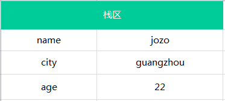
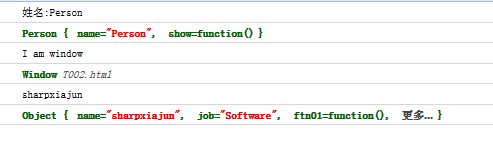

##关于分号;的问题
如果下一行的开始是“(”、“[”上一行的结尾不会被加上“;”。 

	a = b  
	(function(){  
	  ...  
	})()
	
会被解释为

    a = b(function(){...})()  
   
再如：

	a = b  
    [1,2,3].forEach(function(e){  
     console.log(e)  
    }) 

实际效果等价于

	a = b[3].forEach(function(e){  
	  console.log(e)  
	})   
	
不过这些问题的解决方案其实也很简单。只要在“[”、“(”、“+”、“-”、“/”等之前加分号就可以了：

	function a() {  
	 ...  
	}  
	[1,2,3].forEach(...) 
	
这代码是没问题的，但是你改成

    var a = function () {  
      ...  
    }  
    [1,2,3].forEach(...) 
     
就有问题了！

关于return

    return  
    {  
     a:1  
    }  

在return后会自动插入分号，导致完全违背期望的结果。

##javascript的静态属性和原型属性
静态方法不能被实例对象调用
###例1：

    //对象构造函数
    function Person(name) {
        //私有属性，只能在对象构造函数内部使用
        var className = "Person";
        //公有属性,在对象实例化后调用
        this.name = name;
        //对象方法
        this.hello = function () {
            alert(this.name);
            alert(this.msg());//使用原型方法扩充的方法可以在类内部使用
            alert(this.sex);//使用原型方法扩充的属性可以在类内部使用
            alert(Person.age);//静态属性调用时格式为[对象.静态属性]
        }
    }
    //类方法 (实际是静态方法直接调用) 
    //位置：Person类的外部 
    //语法格式：类名称.方法名称 = function([参数...]){ 语句行; }
    Person.Run = function () {
        alert("我是类方法 Run");
    }

    //原型方法
    Person.prototype.msg = function () {
    	//如果原型方法当作静态方法直接调用时，this.name无法被调用
        alert("我的名字是：" + this.name);
    }

    //公有静态属性 在类的外部
    Person.age = 20;//公有静态属性不能使用 【this.属性】，只能使用 【对象.属性】 调用

    //原型属性，当作是类内部的属性使用【this.原型属性】，
    //也可以当成公有静态属性使用【对象.prototype.原型属性】
    Person.prototype.sex = "男";

    Person.Run(); //类方法也是静态方法，可以直接使用 【对象.静态方法()】
    Person.prototype.msg();//原型方法当成静态方法使用时【对象.prototype.方法()】
    alert(Person.prototype.sex);//原型属性当作静态属性使用时【对象.prototype.方法()】
    var a = new Person("zhangsan");//对象方法和原型方法需要实例化对象后才可以使用
    a.hello();//对象方法必须实例化对象
    a.msg();//原型方法必须实例化对象
    alert(a.age);//错误，公有静态属性只能使用 【对象.属性】调用
    
尽量将方法定义为原型方法，原型方法避免了每次调用构造函数时对属性或方法的构造，节省空间,创建对象快. 

###例2：
代码中列举了两种静态方法/属性的实现方式，一种是静态类的静态方法和属性，另一种是非静态类的静态方法和属性。

    /****************************************
     * 方法一
     * 类、方法、属性都为静态类型
     * 不能创建实例
     *****************************************/
    var DayTime = {
        today: '2009-3-8',
        weather: 'rain',
        show: function () {
            console.log('Today is ' + this.today);
        }
    };

    // 静态对象可直接使用，无需创建实例
    console.log('It is ' + DayTime.weather + ' today.');
    DayTime.show();

    //下面的代码会出错TypeError: DayTime is not a constructor，
    //因为静态类不能创建实例
    //var dt = new DayTime();
    //dt.show();

    /****************************************
     * 方法二
     * 普通对象，同时拥有静态和非静态属性、方法
     * 可以用实例化
     * 注意：
     *   1.静态方法/属性使用类名访问
     *   2.非静态方法/属性使用实例名访问
     *****************************************/
    function Person(name) {
        //非静态属性
        this.name = name;
        //非静态方法
        this.show = function () {
            console.log('My name is ' + this.name + '.');
        }
    }
    //添加静态属性，人都是一张嘴
    Person.mouth = 1;
    //添加静态方法，哇哇大哭
    Person.cry = function () {
        console.log('Wa wa wa …');
    };
    //使用prototype关键字添加非静态属性，每个人的牙可能不一样多
    Person.prototype.teeth = 32;

    //非静态方法必须通过类的实例来访问
    var me = new Person('Zhangsan');
    //使用非静态方法、属性
    me.show();
    console.log('I have ' + me.teeth + ' teeth.');

    //使用静态方法、属性
    Person.cry();//me.cry();报错,TypeError: me.cry is not a function
    console.log('I have ' + Person.mouth + ' mouth.');
    
###例3
    var Class1 = new Function;
    var Class2 = Class1;
    Class1.f1 = function(){
        alert("Class1 ' s static method");
    }
    Class2.f2 = function(){
        alert("Class2 ' s static method");
    }
    Class1.f1();//Class1 ' s static method  
    Class1.f2();//Class2 ' s static method
    Class2.f1();//Class1 ' s static method
    Class2.f2();//Class2 ' s static method

从运行结果来看，BaseClass和Class都有f1和f2静态方法，实际上这两个函数是一样的，可以执行以下代码来验证

	alert(BaseClass == Class2);//true  
	
如果删除其中一个函数中的静态方法，则对应的另一个函数的静态方法也被删除，比如执行

	delete Class2.f2;  
	
同时也会删除Class1中的f2

##基本类型 引用类型 简单赋值 对象引用
ECMAScirpt 变量有两种不同的数据类型：`基本类型`，`引用类型`。 

###1.基本类型
基本的数据类型有：`undefined，boolean，number，string，null.基本类型的访问是按值访问的，就是说你可以操作保存在变量中的实际的值。

基本类型有以下几个特点：

####1.基本类型的值是不可变得：
任何方法都无法改变一个基本类型的值，比如一个字符串：

	var name = 'jozo';
	name.toUpperCase(); // 输出 'JOZO'
	console.log(name); // 输出  'jozo'

会发现原始的name并未发生改变，而是调用了toUpperCase()方法后返回的是一个新的字符串。
再来看个：

	var person = 'jozo';
	person.age = 22;
	person.method = function(){//...};
	
	console.log(person.age); // undefined
	console.log(person.method); // undefined

通过上面代码可知，我们不能给基本类型添加属性和方法，再次说明基本类型时不可变得；

####2.基本类型的比较是值的比较：
只有在它们的值相等的时候它们才相等。
但你可能会这样：

	var a = 1;
	var b = true;
	console.log(a == b);//true

它们不是相等吗？其实这是类型转换和 == 运算符的知识了，也就是说在用==比较两个不同类型的变量时会进行一些类型转换。像上面的比较先会把true转换为数字1再和数字1进行比较，结果就是true了。 这是当比较的两个值的类型不同的时候==运算符会进行类型转换，但是当两个值的类型相同的时候，即使是==也相当于是===。

	var a = 'jozo';
	var b = 'jozo';
	console.log(a === b);//true

####3.基本类型的变量是存放在栈区的（栈区指内存里的栈内存）
假如有以下几个基本类型的变量：

	var name = 'jozo';
	var city = 'guangzhou';
	var age = 22;

那么它的存储结构如下图：

栈区包括了 变量的标识符和变量的值。

在javascript里变量的存储包含三个部分：

- **部分一：栈区的变量标示符；**
- **部分二：栈区变量的值；**
- **部分三：堆区存储的对象。**

###2.引用类型
javascript中除了上面的基本类型(number,string,boolean,null,undefined)之外就是引用类型了，也可以说是就是对象了。对象是属性和方法的集合。也就是说引用类型可以拥有属性和方法，属性又可以包含基本类型和引用类型。来看看引用类型的一些特性：

####1.引用类型的值是可变的
我们可为为引用类型添加属性和方法，也可以删除其属性和方法，如：

	var person = {};//创建个控对象 --引用类型
	person.name = 'jozo';
	person.age = 22;
	person.sayName = function(){console.log(person.name);} 
	person.sayName();// 'jozo'
	
	delete person.name; //删除person对象的name属性
	person.sayName(); // undefined

上面代码说明引用类型可以拥有属性和方法，并且是可以动态改变的。

####2.引用类型的值是同时保存在栈内存和堆内存中的对象
javascript和其他语言不同，其不允许直接访问内存中的位置，也就是说不能直接操作对象的内存空间，那我们操作啥呢？ 实际上，是操作对象的引用，所以`引用类型的值是按引用访问的`。
准确地说，引用类型的存储需要内存的栈区和堆区（堆区是指内存里的堆内存）共同完成，`栈区内存保存变量标识符和指向堆内存中该对象的指针，也可以说是该对象在堆内存的地址。`
假如有以下几个对象：

	var person1 = {name:'jozo'};
	var person2 = {name:'xiaom'};
	var person3 = {name:'xiaoq'};

则这三个对象的在内存中保存的情况如下图：

####3.引用类型的比较是引用的比较

	var person1 = '{}';
	var person2 = '{}';
	console.log(person1 == person2); // true

上面讲基本类型的比较的时候提到了当两个比较值的类型相同的时候，相当于是用 === ，所以输出是true了。再看看：

	var person1 = {};
	var person2 = {};
	console.log(person1 == person2); // false

可能你已经看出破绽了，上面比较的是两个字符串，而下面比较的是两个对象，为什么长的一模一样的对象就不相等了呢？

别忘了，引用类型时按引用访问的，换句话说就是比较两个对象的堆内存中的地址是否相同，那很明显，person1和person2在堆内存中地址是不同的：

所以这两个是完全不同的对象，所以返回false;

###3.简单赋值
在从一个变量向另一个变量赋值基本类型时，会在该变量上创建一个新值，然后再把该值复制到为新变量分配的位置上：

	var a = 10;
	var b = a;
	
	a ++ ;
	console.log(a); // 11
	console.log(b); // 10

此时，a中保存的值为 10 ，当使用 a 来初始化 b 时，b 中保存的值也为10，但b中的10与a中的是完全独立的，该值只是a中的值的一个副本，此后，这两个变量可以参加任何操作而相互不受影响。

也就是说基本类型在赋值操作后，两个变量是相互不受影响的。

###4.对象引用
当从一个变量向另一个变量赋值引用类型的值时，同样也会将存储在变量中的对象的值复制一份放到为新变量分配的空间中。前面讲引用类型的时候提到，保存在变量中的是对象在堆内存中的地址，所以，与简单赋值不同，这个值的副本实际上是一个指针，而这个指针指向存储在堆内存的一个对象。那么赋值操作后，两个变量都保存了同一个对象地址，则这两个变量指向了同一个对象。因此，改变其中任何一个变量，都会相互影响：

	var a = {}; // a保存了一个空对象的实例
	var b = a;  // a和b都指向了这个空对象
	
	a.name = 'jozo';
	console.log(a.name); // 'jozo'
	console.log(b.name); // 'jozo'
	
	b.age = 22;
	console.log(b.age);// 22
	console.log(a.age);// 22
	
	console.log(a == b);// true

它们的关系如下图：

因此，引用类型的赋值其实是对象保存在栈区地址指针的赋值，因此两个变量指向同一个对象，任何的操作都会相互影响。

##JavaScript 中对变量和函数声明的“提前（hoist）”

- 变量的声明被提前到作用域顶部，赋值保留在原地
- 函数声明整个“被提前”
- 函数作为值赋给变量时只有变量“被提前”了，函数没有“被提前”

##this
>this都是指向实例化对象

在javascript语言里全局作用域可以理解为window对象，记住window是对象而不是类，也就是说window是被实例化的对象，这个实例化的过程是在页面加载时候由javascript引擎完成的，整个页面里的要素都被浓缩到这个window对象，因为程序员无法通过编程语言来控制和操作这个实例化过程，所以开发时候我们就没有构建这个this指针的感觉，常常会忽视它，这就是干扰我们在代码里理解this指针指向window的情形。

`声明函数都是window对象的属性，这就说明为什么我们不管在哪里声明函数，声明函数最终都是属于window对象的原因了。`

`因为声明函数里的this指向window这已经不是秘密，但是函数表达式的this指针指向window却是常常被我们所忽视，特别是当它被写在另一个函数内部时候更加如此。`

例：

    function ftn03(){
        var ftn04 = function(){
            console.log(this);// window
        };
        ftn04();
    }
    ftn03();
    
`其实在javascript语言里任何匿名函数都是属于window对象，它们也都是在全局作用域构造时候完成定义和赋值，但是匿名函数是没有名字的函数变量，但是在定义匿名函数时候它会返回自己的内存地址，如果此时有个变量接收了这个内存地址，那么匿名函数就能在程序里被使用了，因为匿名函数也是在全局执行环境构造时候定义和赋值，所以匿名函数的this指向也是window对象`，所以上面代码执行时候ftn04的this也是指向window，因为javascript变量名称不管在那个作用域有效，堆区的存储的函数都是在全局执行环境时候就被固定下来了，变量的名字只是一个指代而已。

**this都是指向实例化对象**，`this指向window的情况，是因为这些时候只做了一次实例化操作，而这个实例化都是在实例化window对象，所以this都是指向window。我们要把this从window变成别的对象，就得要让function被实例化，那如何让javascript的function实例化呢？答案就是使用new操作符。`

例：

    var obj = {
        name:"sharpxiajun",
        job:"Software",
        show:function(){
            console.log("Name:" + this.name + ";Job:" + this.job);
            console.log(this);// Object { name="sharpxiajun", job="Software", show=function()}
        }
    };
    var otherObj = new Object();
    otherObj.name = "xtq";
    otherObj.job = "good";
    otherObj.show = function(){
        console.log("Name:" + this.name + ";Job:" + this.job);
        console.log(this);// Object { name="xtq", job="good", show=function()}
    };
    obj.show();//Name:sharpxiajun;Job:Software
    otherObj.show();//Name:xtq;Job:good
    
**Javascript里通过字面量方式定义对象的方式是new Object的简写，二者是等价的**，目的是为了减少代码的书写量，可见即使不用new操作字面量定义法本质也是new操作符，所以通过new改变this指针的确是不过攻破的真理。

**new操作符会让构造函数产生如下变化：**

1. 创建一个新对象；
- 将构造函数的作用域赋给新对象（因此this就指向了这个新对象）；
- 执行构造函数中的代码（为这个新对象添加属性）；
- 返回新对象

`字面表示法在简单的表示里我们很容易知道this指向对象本身，但是这个对象会有方法，方法的参数可能会是函数，而这个函数的定义里也可能会使用this指针，如果传入的函数没有被实例化过和被实例化过，this的指向是不同，有时我们还想在传入函数里通过this指向外部函数或者指向被定义对象本身，这些乱七八糟的情况使用交织在一起导致this变得很复杂，结果就变得糊里糊涂。`

其实理清上面情况也是有迹可循的，就以定义对象里的方法里传入函数为例：

- 情形一：传入的参数是函数的别名，那么函数的this就是指向window；
- 情形二：传入的参数是被new过的构造函数，那么this就是指向实例化的对象本身；
- 情形三：如果我们想把被传入的函数对象里this的指针指向外部字面量定义的对象，那么我们就是用apply和call

例：

	var name = "I am window";
	var obj = {
	    name:"sharpxiajun",
	    job:"Software",
	    ftn01:function(obj){
	        obj.show();
	    },
	    ftn02:function(ftn){
	        ftn();
	    },
	    ftn03:function(ftn){
	        ftn.call(this);
	    }
	};
	function Person(name){
	    this.name = name;
	    this.show = function(){
	        console.log("姓名:" + this.name);
	        console.log(this);
	    }
	}
	var p = new Person("Person");
	obj.ftn01(p);
	obj.ftn02(function(){
	   console.log(this.name);
	   console.log(this);
	});
	obj.ftn03(function(){
	    console.log(this.name);
	    console.log(this);
	});
	
chrome结果：	

***总结：***

　　`如果在javascript语言里没有通过new（包括对象字面量定义）、call和apply改变函数的this指针，函数的this指针都是指向window的。`
　　
##知识点-变量
在javascript定义变量需要使用var关键字，但是javascript可以不使用var预先定义好变量，在javascript我们可以直接赋值给没有被var定义的变量，不过此时你这么操作变量，不管这个操作是在全局作用域里还是在局部作用域里，变量最终都是属于window对象。
例：

 	var qqq;
    console.log(qqq);// 运行结果：undefined
    console.log(xxx);// 报错：xxx is not defined
    
上例可以知道在javascript里的变量不能正常使用即报出“xxx is not defined”错误（这个错误下，后续的javascript代码将不能正常运行）`只有当这个变量既没有被var定义同时也没有进行赋值操作才会发生`，**而只有赋值操作的变量不管这个变量在那个作用域里进行的赋值，这个变量最终都是属于全局变量即window对象**。

javascript两个特别的类型：undefined和null，从javascript变量存储的三部分角度思考，当变量的值为undefined时候，那么该变量只有栈区的标示符，如果我们对undefined的变量进行赋值操作，如果值是基本类型，那么栈区的值就有值了，如果栈区是对象那么堆区会有一个对象，而栈区的值则是堆区对象的地址，如果变量值是null的话，我们很自然认为这个变量是对象，而且是个空对象，按照我前面讲到的变量存储的三部分考虑：当变量为null时候，栈区的标示符和值都会有值，堆区应该也有，只不过堆区是个空对象，这么说来null其实比undefined更耗内存了.

例：

    var ooo = null;
    console.log(ooo);// 运行结果：null
    console.log(ooo == undefined);// 运行结果：true
    console.log(ooo == null);// 运行结果：true
    console.log(ooo === undefined);// 运行结果：false
    console.log(ooo === null);// 运行结果：true

运行之，结果很震惊啊，null居然可以和undefined相等，但是使用更加精确的三等号“===”，发现二者还是有点不同，其实javascript里undefined类型源自于null即null是undefined的父类，本质上null和undefined除了名字这个马甲不同，其他都是一样的，不过要让一个变量是null时候必须使用等号“=”进行赋值了。

##作用域、this
函数的执行环境被压入到执行环境栈里后，函数就要执行了，函数执行的第一步不是执行函数里的第一行代码而是在上下文变量里构造一个作用域链，作用域链的英文名字叫做scope chain，作用域链的作用是保证执行环境里有权访问的变量和函数是有序的，这个概念里有两个关键意思：有权访问和有序。

this对象也是属于上下文变量，而this变量的值就是当前执行环境外部的上下文变量的一份拷贝，这个拷贝里是没有作用域链变量的。

例：

    var b1 = "b1";
    function ftn1() {
        console.log(this);//window
        var b2 = "b2";
        var b1 = "bbb";
        function ftn2() {
            console.log(this);//window
            var b3 = "b3";
            b2 = b1;
            b1 = b3;
            console.log("b1:" + b1 + ";b2:" + b2 + ";b3:" + b3);// 运行结果：b1:b3;b2:bbb;b3:b3
        }
        ftn2();

    }
    ftn1();
    
我们看到函数ftn1和ftn2里的this指针都是指向window，这是为什么了？`因为在javascript我们定义函数方式是通过function xxx(){}形式，那么这个函数不管定义在哪里，它都属于全局对象window`，所以他们的执行环境的外部的执行上下文都是指向window。

##判断是否是数组
通常判断类型我们会想到typeof,但对于js数组来说，用这种方式无法判断
###typeof

    var arr=[];
    console.log(typeof arr);
    
控制台输出：

	object
	
###instanceof

    var arr=[];
    console.log(arr instanceof Array);
    
控制台输出：

	true

###constructor

    var arr=[];
    console.log(arr.constructor === Array);
    
控制台输出：

	true
	
**用 instanceof 和 constructor 是最直接的、简单的方式。只是，[由于在不同 iframe 中创建的 Array 并不共享 prototype](http://perfectionkills.com/instanceof-considered-harmful-or-how-to-write-a-robust-isarray/)。那么，如果要应用在框架中，这种方式肯定是行不通的。**

###Object.prototype.toString
    var arr=[];
    console.log(Object.prototype.toString.call(arr)==='[object Array]');
    
控制台输出：

	true
	
上面这种写法，是 jQuery 正在使用的。

###判断是否是数组类型

	function isArray(o) {
	  return Object.prototype.toString.call(o) === '[object Array]';
	}
	
###获取js对象类型方法

	function __getClass(object) {
        return Object.prototype.toString.call(object).match(/^\[object\s(.*)\]$/)[1];
    }
    
测试代码：
 
 	console.log('1 type is '+__getClass(1));
    console.log('"a" type is '+__getClass("a"));
    console.log('{name:"张三"} type is '+__getClass({name:"张三"}));
    console.log('[] type is '+__getClass([]));
    
控制台输出：

	1 type is Number
	"a" type is String
	{name:"张三"} type is Object
	[] type is Array

