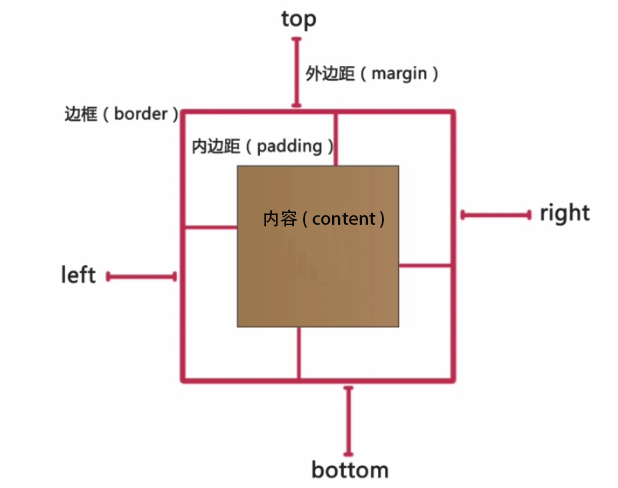
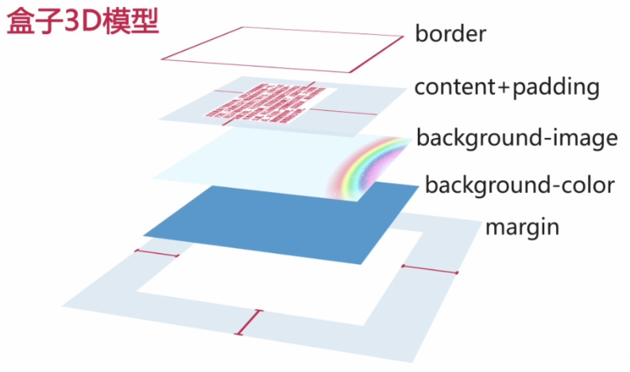

##W3C标准
1. 结构化标准语言(HTML和XML)
- 表现标准语言（CSS）
- 行为标准语言（DOM和ECMAScript）
>倡导结构、样式、行为分离

##CSS中的定位机制
- 标准文档流（normal flow）
- 浮动（float）
- 绝对定位（absolute positioning）

###1、标准文档流
特点：

* 从上到下，从左到右，输出文档内容
* 由块级元素和行级元素组成
* 块级元素：从左到右撑满页面，独立一行，触碰到页面边缘时，会自动换行。常见块级元素如：div、ul、li、dl、dt、p等。
* 行级元素：能在同一样内显示，不会改变html文档结构。常见行级元素如：span strong img input等，大部分表单元素都是行级标签。
* <b>块级元素和行级元素都是盒子模型。</b>
		
		 
####盒子模型 
* 盒子模型=页布局的基石,不能可以盛放网页元素例如文本、图像、音频、视频，还可以控制盒子与内容、盒子与盒子之间的距离。
* 盒子模型由4部分组成：边框border、外边距margin、内边距padding、盒子中的内容content。
*  盒⼦模型尺⼨=边框+外边距+内边距+盒⼦中的内容尺⼨。

	
	
	属性值设置：分量设置、简写设置。
	* 四个值：上 右 下 左
	* 三个值：上 左右 下
	* 二个值：上下 左右
	* 一个值：上下左右
		
	样式的就近原则：行内样式 > 内部样式 > 外部样式
	
	
	
	盒子模型各个部分所处的位置：边框border、内容content+内边距padding、背景图片background-image、背景颜色background-color、外边距margin。
	
####自动居中一列布局
三个技能点：标准文档流、块级元素、margin属性 (注：盒子内容的高度会随着内容自动来适应。)

<strong style="color:red;">margin: 0 auto;</strong>
	
	margin的上下值可随便设置，左右值设置为auto，auto会根据浏览器的宽度自动的设置两边的外边距。
	原理：(浏览器的宽度-外包含层的宽度)/2 = 外边距
	提示：如果想让页面自动居中，当设置margin属性为auto的时候，不能再设置浮动float或绝对定位absolute、fixed属性。
	
	
###2、浮动布局
* css中规定的第二种定位机制、
* 能够实现<em style="color:red;">横向多列布局</em>(横向两列、横向三列...横向N列)、
* 通过设置<em style="color:red;">float属性</em>实现。

	float属性：
	- 3个属性值：left-左浮动、right-右浮动、none-不浮动
	- 特点：元素会左移，或右移，直到触碰到容器为止。
	- <em style="color:red;">当元素没有设置宽度，而设置了浮动属性，元素的宽度随内容的变化而变化。</em>
>设置了浮动的元素，仍然处于标准文档流中。会占据标准文档流的空间，对周围的元素产生影响，浮动元素对相邻元素的影响,会导致页面布局混乱。

	对<em style="color:red;">紧邻其后</em>元素的影响:
	* 相邻元素上移,占据其后位置
	* 紧挨着它,并排显⽰。
	
	浮动导致问题：
	* ⽗元素高度无法自动扩展
	* 元素上移,填满浮动元素右侧(或中间)的间隙

	清除浮动的常⽤方法(受到浮动影响的元素设置)
	* clear属性—常⽤clear:both;(clear:left;或者clear:right;)
	* 同时设置width:100%(或固定宽度)+overflow:hidden;

####横向两列布局
网页布局最常见的方法之一

主要应用技能：

* float属性--使纵向排列的块级元素横向排列
* margin属性--设置两列之间的间距
> 当父包含块缩成一条时，用clear:both方法清除浮动无效，它一般用于紧邻后面的元素的清除浮动。

###3、绝对定位布局
* 通过设置position属性实现，
* css中规定的第三种定位机制，
* 能够实现横向多列布局及较为复杂的定位。   
	例：带有遮罩层效果的提示框、固定层效果、全屏广告等
	
	***`position`***    
	position属性拥有3种定位形式：
	1. 静态定位（默认） 
	- 相对定位 
	- 绝对定位。
	
	position 4个属性值：
	- static(静态定位)
	- relative(相对定位)
	- absolute(绝对定位)
	- fixed(固定定位)  
	 
	影响因素
	1. 属性的取值
	- 元素偏移量
	- 元素偏移参照基准
	
	相对定位特点：
	* 相对于自身原有位置进行偏移，
	* 仍处于标准文档流中、
	* 随即拥有偏移属性和z-index属性。
	
	绝对定位特点：
	* 建立了以包含块为基准的定位
	* 完全脱离了标准文档流
	* 兄弟元素不再受其影响
	* 随即拥有偏移属性和z-index属性
	* <em style="color:red;">当元素没有设置宽度，而设置了绝对定位，元素的宽度随内容的变化而变化。</em>
		未设置偏移量特点：
		* 无论是否存在已定位祖先元素，都保持在元素初始位置
		* 脱离了标准文档流	
		
		设置偏移量：
		* 无已定位祖先元素,以html标签为偏移参照基准
		* 有已定位祖先元素，以距其最近的已定位祖先元素为偏移参照基准
		
	absolute与fixed比较   
	相同点：
	1. 完全脱离标准文档流
	2. 未设置偏移量时，都定位在其父元素的左上角
		偏移量--元素设置定位(绝对或相对)后就具有偏移量和堆叠属性（z-index）
		
	不同点：
	1. 设置偏移量时，便宜参照基准   
		absolute 
		  
		- 无已定位祖先元素，以\<html>为基准偏移   
		- 有已定位祖先元素，以距离其最近的、已定位的祖先元素为基准偏移 
		  
		fixed      
		- 有、无已定位祖先元素，都以浏览器可视窗口为基准偏移
	- 表现形式（产生滚动条时）   
		absolute		
		- 位置会随滚动条变化
		
		fixed 
		- 位置固定，不会随滚动条变化
		- 被他遮盖的元素，可以从其下面穿过
		>在对元素设置固定定位时，如果希望本元素包含其父包含块中，不需要设置偏移量。
		

####使用绝对定位实现横向两列布局
常用语一列固定宽度，另一列宽度自适应的情况

应该技能：

* relative-父元素相对定位
* absolute-自适应宽度元素绝对定位
> 固定宽度列的宽度>自适应宽度的列

###4、固定层效果
定位形式--绝对定位   
特点--位置固定不变，兄弟元素会从其下穿过   
未设置偏移量       
	1. 有已定位祖先元素 **以祖先元素为基准定位**  
	2. 无已定位祖先元素 **以浏览器窗口为基准定位**  
设置偏移量，有、无已定位祖先元素，**均以浏览器窗口为基准偏移**

		

		

	
		